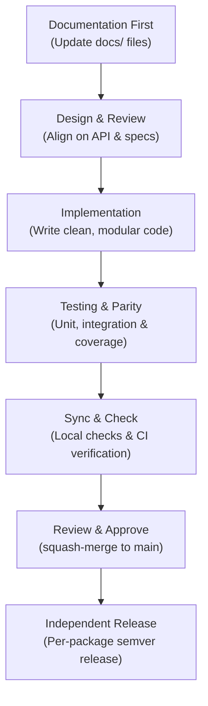

# Contributing to Featuresmith

Thank you for your interest in contributing to Featuresmith! 

We want to make contributing as straightforward and rewarding as possible. Featuresmith is built with a highly modular, pluggable architecture. You can easily add new **rules**, **connectors**, or **exporters** without having to read or modify the core package logic.

---

## 1. Development Setup

### Prerequisites
- **Python 3.11+**
- **uv** (an extremely fast Python package manager). Install it via:
  ```bash
  # macOS/Linux
  curl -LsSf https://astral.sh/uv/install.sh | sh
  # Windows (PowerShell)
  powershell -c "irm https://astral.sh/uv/install.ps1 | iex"
  ```

### Local Setup
Clone the repository and sync the workspace environment:

```bash
# Clone the repository
git clone https://github.com/adityagangwani30/FeatureSmith.git
cd FeatureSmith

# Sync dependencies and build workspace packages
uv sync

# Install git hooks (enforces code checking before commits)
pre-commit install
```

---

## 2. Developer Workflow & Core Lifecycle

Featuresmith follows a structured, documentation-centric engineering lifecycle. Work progresses systematically from definitions to validated changes:



### Documentation-First Policy (Mandatory)
The documentation in `docs/` is the **single source of truth** for Featuresmith. We believe documentation should guide development, not summarize it after the fact.

- **The Rule**: No code change that alters user-facing behavior (e.g., API boundaries, CLI subcommands, rules, connector scopes, or configurations) will be merged unless the documentation files in `docs/` are updated **in the same pull request**.
- If a new idea arises during development, stop, update the markdown design documents, review them, and only then proceed with the implementation.

---

## 3. Project Structure

```
featuresmith/
├── packages/
│   ├── featuresmith-core/       # All business logic (profiling, rules, loaders)
│   ├── featuresmith-cli/        # Thin command-line Typer wrapper
│   └── featuresmith-dashboard/  # Streamlit browser dashboard interface (Phase 3)
├── tests/                       # Test suite mirroring package structure 1:1
├── docs/                        # Architecture specs, PRD, rules, design, phases
└── pyproject.toml               # uv monorepo workspace configuration
```

> [!IMPORTANT]
> **No business logic is allowed in surface packages.** The CLI and Dashboard packages may *only* import `featuresmith.api`. This boundary is checked in CI via `import-linter`.

---

## 4. Coding Standards

- **Strict Type Hints**: All function signatures, variables, and classes must be fully type-hinted. We enforce `--strict` type checking.
- **Style & Linting**: We use **Ruff** for linting and formatting. Run checks locally before pushing.
- **Docstrings**: Google-style docstrings are mandatory for all public functions, classes, and modules.
- **File Length Limit**: Keep code modules focused. No file should exceed ~400 lines; split by responsibility if needed.

---

## 5. Local Verification Commands

Before pushing your changes, run the full verification suite locally:

```bash
# Format check
uv run ruff format --check .

# Lint check
uv run ruff check .

# Strict type checks
uv run mypy .

# Package import boundary verification
uv run lint-imports

# Unit & integration tests
uv run pytest
```

---

## 6. Testing Expectations

Featuresmith is built to be a deterministic, trust-critical tool. Testing is highly prioritized:

- **Minimum Coverage**: We require a minimum of **85% code coverage** on all core layers (`core/`, `rules/`, `profiling/`).
- **Rule Fixtures**: Every custom rule must include at least one positive fixture test (triggers finding) and one negative fixture test (dataset passes rule check).
- **Surface Parity Tests**: All outputs from the SDK, CLI, and future dashboard must match identically. We enforce this through integration tests.
- **Provider Conformance**: Custom extensions (like AI providers or connectors) must pass conformance validation mocks in the test suite to ensure runtime stability.

---

## 7. Extending Featuresmith

Featuresmith is built to be easily extended. Walkthrough guides for each extension point are located in the codebase:
* **Custom Rules**: See the [Rule Engine guide](./packages/featuresmith-core/src/featuresmith/rules/README.md) to add a `BaseRule`.
* **Custom Connectors**: See the [Connectors guide](./packages/featuresmith-core/src/featuresmith/connectors/README.md) to add a `BaseConnector`.
* **Custom Exporters**: Available from Phase 4.
* **Custom AI Providers**: Available from Phase 6.

---

## 8. Pull Request & Branch Guidelines

- **Branch Naming**: Scope your work using standard prefixes:
  - `feat/<short-desc>` for new capabilities
  - `fix/<short-desc>` for bugs
  - `docs/<short-desc>` for pure documentation changes
- **PR Scope**: Keep PRs focused. Submit **one logical change per PR** (e.g. do not mix a code refactor with a new rule).
- **Reviews**: All PRs require at least one approval. Interface updates (like core rules or base classes) require two approvals.
- **Conventional Commits**: Commit messages must follow the [Conventional Commits spec](https://www.conventionalcommits.org/):
  ```
  feat(rules): add target leakage detection rule
  fix(cli): correct exit status on empty data files
  ```

---

## 9. Release Workflow

- **Semantic Versioning**: Releases strictly adhere to Semantic Versioning (`MAJOR.MINOR.PATCH`).
- **Independent Packaging**: Release packages (`featuresmith-core` and `featuresmith-cli`) are versioned and published **independently**. Bumping a version on CLI does not require a core bump.
- **Deprecation Cycle**: Public changes (such as renaming CLI flags or rule IDs) must be deprecated and trigger warning logs for at least one minor release cycle before removal.
