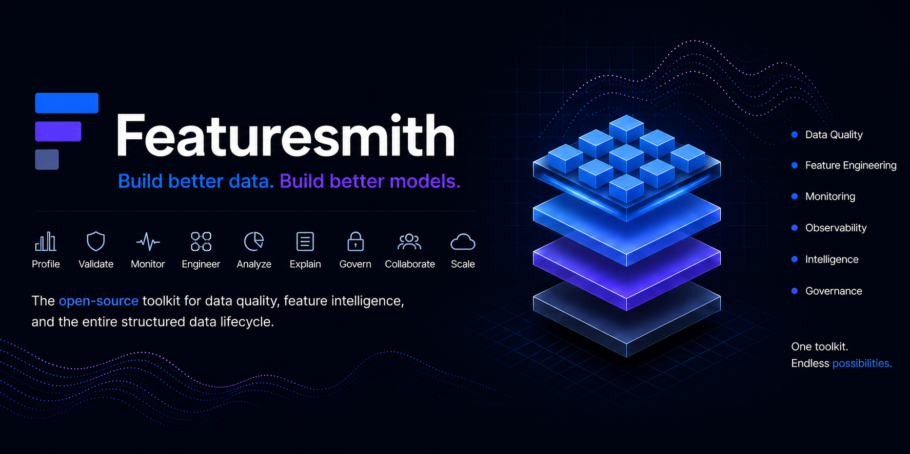

<div align="center">



# Featuresmith

**Make data quality as routine as code quality.**

An open-source, developer-first toolkit for understanding, validating, and improving structured data.

[](https://github.com/adityagangwani30/FeatureSmith/releases)
[](https://www.python.org/)
[](./LICENSE)
[](https://github.com/adityagangwani30/FeatureSmith/actions)
[](https://github.com/astral-sh/ruff)
[](https://mypy-lang.org/)
[](https://docs.pytest.org/)

<br />

[📖 Documentation Website](https://featuresmith.adityagangwani.me) · [🚀 Quick Start](#quick-start) · [💬 Discussions](https://github.com/adityagangwani30/FeatureSmith/discussions)

</div>

---

## Hero Message

> **Every dataset deserves a code review.**
>
> Make data quality as routine as code quality.

---

## Why Featuresmith Exists

### The problem: engineering discipline stops at the dataset's edge
Every serious codebase today has Git, pull requests, tests, CI/CD, linters, formatters, and static analysis. Datasets, which are just as load-bearing for a machine learning system as the code around them, get almost none of it. A column can go missing, a categorical can silently leak the target, a distribution can drift — and nothing stops it because no tests are running.

Tooling that does exist is fragmented: one tool profiles, another validates, another detects drift, another monitors. None of them talk to each other.

### Our answer: one toolkit, one loop
Understanding, validating, and improving a dataset is one continuous engineering workflow, served by one extensible toolkit:
- **Understand** — profile a dataset's shape, distributions, and relationships.
- **Validate** — catch data-quality and leakage issues with deterministic, testable rules.
- **Improve** — turn accepted findings into real, reviewable code.

### Why this is a developer tool, not a dashboard
Tools that developers adopt look like `ruff`, `pytest`, or `pre-commit` — something you run automatically in CI. Featuresmith is built to be run from your CLI or imported in python. The dashboard and chat exist only to serve the moments a plain CLI check isn't enough, not to replace the check itself.

### Why AI is an assistant here, not the identity
An LLM is used solely to turn structured findings into plain-language explanations or rationales. It never computes the findings themselves. The deterministic engine runs completely with the AI layer switched off, and raw dataset data is never sent to the network.

---

## Current Capabilities (v0.4.0)

- **Dataset Profiling**: Polars-driven deterministic profiling engine computing 23 numeric metrics, categorical frequencies, text lengths, datetime ranges, and Pearson correlation matrices.
- **Rule-Based Validation**: Deterministic rule engine running 8 built-in seed quality and leakage rules (missing value thresholds, constant columns, duplicate rows, target leakage).
- **Intelligent Leakage Detection**: 6 named pattern detectors (target correlation, identifier shape, timestamp, future info, duplicate target, suspicious correlation) with merged per-column findings.
- **Dataset Diff**: Standalone diff engine comparing two dataset snapshots — schema, structure, quality, distribution, and leakage deltas with overall health verdict.
- **Review Engine**: Orchestration layer with 10 built-in reviewers (schema health, types, missingness, duplicates, constants, cardinality, basic statistics, leakage, diff, feature quality), category filtering, and console rendering.
- **Diff-Aware Review**: `fs.review(source, previous=...)` and `featuresmith review <source> --previous <snapshot>` combine a full review with a dataset diff in one call, attaching the `DatasetDiffResult` to `ReviewResult.diff`.
- **Centralized Recommendation Engine**: Merges findings from all review sections into a single ranked, explainable list of recommendations with consistent confidence semantics and traceability back to originating findings and reviewers.
- **Feature Quality Review**: Detects near-constant columns, redundant column pairs, and low-signal high-cardinality columns.
- **Plan Primitive**: `fs.plan()` and `featuresmith plan` compile deterministic, inspectable plans from accepted recommendations with full traceability (PlanItem → Recommendation → Finding → Reviewer).
- **ML Readiness Score**: 7-dimension deterministic, explainable score (0-100) computed from review findings with per-dimension breakdown (Class Balance dimension omitted pending minority-class detector implementation).
- **Python SDK**: Clean, fully type-annotated public API (`fs.load()`, `fs.profile()`, `fs.analyze()`, `fs.diff()`, `fs.review()`, `fs.score()`, `fs.plan()`).
- **Command Line Interface (CLI)**: Thin wrapper client enabling terminal reports (styled Rich tables), JSON output, and exit-code gating for CI/CD integration (`featuresmith analyze`, `featuresmith diff`, `featuresmith review`, `featuresmith plan`).
- **Documentation**: Complete set of engineering guides, ADRs, API references, and implementation status tracker.

---

## Installation

Featuresmith is split into two packages depending on your surface requirements:
*   **Python SDK** only: Install `featuresmith-core`
*   **CLI** and **Python SDK**: Install `featuresmith-cli` (which automatically pulls in `featuresmith-core` as a dependency)

**Using pip**
```bash
# Python SDK only
pip install featuresmith-core

# CLI & SDK
pip install featuresmith-cli
```

**Using uv**
```bash
# Python SDK only
uv add featuresmith-core

# CLI & SDK
uv add featuresmith-cli
```

**From Source (Development)**
```bash
git clone https://github.com/adityagangwani30/FeatureSmith.git
cd FeatureSmith
uv sync
```

---

## Quick Start

Run your first dataset review using the pre-packaged `titanic.csv` dataset:

```python
import featuresmith as fs

# 1. Load the dataset (CSV, Parquet, Excel, pandas/Polars DataFrame)
dataset = fs.load("examples/data/processed/titanic.csv")
print(f"Loaded {dataset.row_count} rows across columns: {dataset.schema.names}")

# 2. Extract profile statistics
profile = fs.profile(dataset)
for col_name, col in profile.column_profiles.items():
    if col.missing_count > 0:
        print(f"Column '{col_name}' has {col.missing_count} missing values")

# 3. Perform a comprehensive review with ML Readiness Scorecard
result = fs.review(dataset, target_column="survived")
print(result.overall_summary)

if result.score:
    print(f"ML Readiness Score: {result.score.overall}/100")

# 4. Inspect recommendations and create a Plan
for rec in result.recommendations:
    print(f"[{rec.severity.upper()}] {rec.title} — {rec.suggested_action}")

# Accept specific recommendations into a deterministic Plan
plan = fs.plan(result, accept=[result.recommendations[0].id])
print(f"Plan created with {len(plan.items)} item(s)")
```

---

## Example Usage (CLI)

```bash
# Basic terminal analysis table
featuresmith analyze customers.csv

# Leakage detection targeting churn with exit-code gating for CI
featuresmith analyze customers.csv --target churn --severity warning

# Output as machine-readable JSON to a file
featuresmith analyze customers.csv --format json --output report.json

# Compare two dataset snapshots (schema, quality, distribution, leakage)
featuresmith diff train_v1.csv train_v2.csv --target churn

# Comprehensive dataset review with ML Readiness Score
featuresmith review train.csv --target churn

# Diff-aware review: full review + dataset diff in one call
featuresmith review train_v2.csv --previous train_v1.csv --target churn

# Review with category filter and CI gating
featuresmith review train.csv --only leakage,schema --fail-on warning --no-score

# Generate a deterministic Plan from accepted recommendations
featuresmith review train.csv --target churn --format json --output review.json
featuresmith plan train.csv --target churn --accept rec.quality.missingness.age,rec.leakage.target_correlation.feat --format json --output plan.json
```

### Exit Codes

All commands share a consistent exit-code convention:

| Code | Meaning |
|:---:|---|
| `0` | Clean — no findings detected at or above the severity threshold |
| `1` | Findings detected at or above the severity threshold (trips CI/CD gate) |
| `2` | Invalid input (bad flag, missing column, unsupported format) |
| `3` | File load / parse failure |
| `4` | Unexpected internal error |

---

## Flagship Capabilities

The following flagship capabilities are currently delivered in FeatureSmith:

- **Dataset Review (`featuresmith review <dataset>`)**: ✅ Implemented with 10/11 review sections (schema health, types, missingness, duplicates, constants, cardinality, basic statistics, leakage, diff, feature quality), ML Readiness Score, category filtering, CLI/SDK. Deferred: duplicate columns, outliers, distribution sections.
- **Centralized Recommendation Engine**: ✅ Implemented — merges findings from all review sections into a single ranked, explainable list of recommendations with consistent confidence semantics and full traceability back to originating findings and reviewers.
- **Feature Quality Review**: ✅ Implemented — detects near-constant columns, redundant column pairs, and low-signal high-cardinality columns.
- **Plan Primitive**: ✅ Implemented — `fs.plan()` and `featuresmith plan` compile deterministic, inspectable plans from accepted recommendations with full traceability (PlanItem → Recommendation → Finding → Reviewer).
- **ML Readiness Score**: ✅ Implemented with 7 effective dimensions (Schema Health, Missing Values, Feature Quality, Distribution Health, Leakage Risk, Data Quality, Consistency), per-dimension breakdown, CLI/SDK access. Class Balance dimension omitted pending minority-class detector implementation; CI score gating (`--fail-below`) deferred.
- **Dataset Diff (`featuresmith diff <v1> <v2>`)**: ✅ Fully implemented as standalone engine AND integrated into the Review Engine as `DiffReviewer` — `featuresmith review <v2> --previous <v1>` produces a diff section in the same review.
- **Intelligent Leakage Detection**: ✅ Fully implemented with 6 pattern detectors, merged findings, and scoring integration.

---

## Documentation

Visit [featuresmith.adityagangwani.me](https://featuresmith.adityagangwani.me) for comprehensive guides.

### Local Documentation Files
- [`docs/Architecture.md`](./docs/Architecture.md) — System design, JIT scaling constraints, AI providers
- [`docs/PRD.md`](./docs/PRD.md) — Product requirements, metrics, scope
- [`docs/Rules.md`](./docs/Rules.md) — Testing requirements, coding standards, and PR guidelines
- [`docs/Phases.md`](./docs/Phases.md) — Acceptance criteria per phase
- [`docs/Design.md`](./docs/Design.md) — Design system, typography, accessibility tokens
- [`docs/Why-Featuresmith-Exists.md`](./docs/Why-Featuresmith-Exists.md) — Detailed philosophy rationale
- [`docs/Flagship-Capabilities.md`](./docs/Flagship-Capabilities.md) — Deeper future capability specs
- [`GOVERNANCE.md`](./GOVERNANCE.md) — Project governance, decision-making, and release responsibility

---

## Roadmap

| Phase | Version | Focus | Status |
|:---:|:---:|---|:---:|
| **Phase 0** | pre-release | Foundations: Core Library First | ✅ Shipped |
| **Phase 1** | v0.1 | Foundation: SDK + CLI MVP, Profiling + Rule Engine | ✅ Shipped |
| **Phase 2** | v0.2 | Dataset Review Platform: Review Engine, ML Readiness Score, Leakage Detection, Dataset Diff | ✅ Shipped |
| **Phase 3** | v0.3 | Developer Experience: DiffReviewer, Governance | ✅ Shipped |
| **Phase 4** | v0.4 | Recommendation & Planning: Recommendation Engine, FeatureQualityReviewer, Plan primitive | ✅ Shipped |
| **Phase 5** | v0.5 | Dataset Contracts: Apply, Validation, `featuresmith.lock` | 🔜 Planned |
| **Phase 6** | v0.6–v1.0 | Certification & Observability: badge, scheduled re-review, Quality History | 🔜 Planned |
| **Phase 7** | v1.1+ | AI-Assisted Planning: Provider layer, narration, natural-language Plan authoring | 🔜 Planned |
| **Phase 8** | v2.0+ | Ecosystem Integrations & Scale: dbt/Feast/MLflow/W&B exporters, VS Code, distributed compute, hosted tier | 🔜 Planned |

See [`docs/Phases.md`](./docs/Phases.md) for the authoritative roadmap.

---

## Contributing

We welcome community contributions. The best entry points are custom rules and connectors, which are completely pluggable.

1. Fork the repo and clone locally.
2. Run `uv sync` to configure the workspace environment.
3. Install git hooks: `pre-commit install`.
4. Ensure tests and formatting pass: `uv run pytest` & `uv run ruff check .`
5. Refer to [`CONTRIBUTING.md`](./CONTRIBUTING.md) and [`docs/Rules.md`](./docs/Rules.md) before opening a PR.

---

## License

Featuresmith is licensed under the Apache 2.0 License. See [`LICENSE`](./LICENSE) for details.
