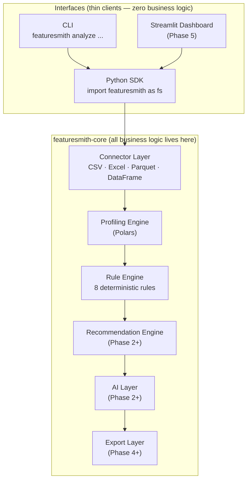

<div align="center">

# Featuresmith

**A deterministic feature engineering & data quality platform for Python.**

Load tabular datasets, profile them, detect quality issues, and build reliable preprocessing workflows through one unified SDK and CLI.

[](https://github.com/adityagangwani30/FeatureSmith/releases)
[](https://www.python.org/)
[](./LICENSE)
[](https://github.com/adityagangwani30/FeatureSmith/actions)
[](https://github.com/astral-sh/ruff)
[](https://mypy-lang.org/)
[](https://docs.pytest.org/)

<br />

[📖 Documentation Website](https://featuresmith.adityagangwani.me) · [🚀 Quick Start](#quick-start--python-sdk) · [💬 Discussions](https://github.com/adityagangwani30/FeatureSmith/discussions)

</div>

---

## Why Featuresmith?

Most EDA tools stop at **description** — a report with charts, a wall of statistics. You still have to interpret them, spot leakage, decide what to do, and write the code yourself. Featuresmith is designed differently: it is a **reusable engine**, not a one-shot report generator.

| | ydata-profiling | sweetviz | Great Expectations | **Featuresmith** |
|---|:---:|:---:|:---:|:---:|
| SDK-first (Python import) | ✓ | ✓ | ✓ | ✅ |
| CLI | — | — | ✓ | ✅ |
| Deterministic, reproducible results | ✓ | ✓ | ✓ | ✅ |
| Rule engine (quality + leakage) | — | — | ✓ | ✅ |
| Strong typing (`frozen` dataclasses) | — | — | — | ✅ |
| Surface parity (SDK = CLI = Dashboard) | — | — | — | ✅ |
| Extensible (rules, connectors, exporters) | — | — | ✓ | ✅ |
| JSON schemas for LLMs (AI-ready) | — | — | — | ✅ |
| No business logic in CLI/Dashboard | — | — | — | ✅ |

---

## Features

**Implemented (Phase 1 — v0.1)**

- ✅ Unified `Dataset` abstraction — normalized schema across all sources
- ✅ CSV connector (Polars)
- ✅ Excel connector (pandas)
- ✅ Parquet connector (Polars)
- ✅ pandas DataFrame connector
- ✅ Polars DataFrame connector
- ✅ Profiling Engine — 23-metric numeric profiler, categorical, datetime, text, correlation, missing, duplicates
- ✅ Rule Engine — 8 deterministic quality + leakage rules
- ✅ Python SDK — `import featuresmith as fs`
- ✅ CLI — `featuresmith analyze <source>`
- ✅ Typed results — `frozen` dataclasses, fully serializable via `.to_dict()`
- ✅ Exit-code gating for CI pipelines

**Planned**

- 🚧 AI Narration (Phase 2) — plain-language dataset summaries via Ollama/OpenAI/Anthropic
- 🚧 Interactive AI Chat (Phase 3) — ask questions about findings in natural language
- 🚧 Export Layer (Phase 4) — sklearn `Pipeline`, Jupyter notebooks, HTML reports
- 🚧 Streamlit Dashboard (Phase 5)
- 🚧 Plugin Ecosystem (Phase 6) — community rules, connectors, AI providers

---

## Architecture



All business logic lives in **`featuresmith-core`**. The CLI and Dashboard are thin wrappers over `featuresmith.api` — enforced by `import-linter` in CI. The same call produces identical results from any surface.

---

## Installation

Featuresmith v0.1.0 packages are currently undergoing final release staging. During this pre-release validation phase, you can install the verified packages from TestPyPI or directly from source.

**From TestPyPI**

```bash
pip install --index-url https://test.pypi.org/simple/ featuresmith-core featuresmith-cli
```

**From Source (for development and local testing)**

```bash
git clone https://github.com/adityagangwani30/FeatureSmith.git
cd FeatureSmith
uv sync
```

**Production PyPI (Upon Release)**

Once v0.1.0 is published, standard installation commands will be available:

```bash
pip install featuresmith-core featuresmith-cli
```

---

For full documentation, tutorials, SDK examples, and configuration guides, visit [featuresmith.adityagangwani.me](https://featuresmith.adityagangwani.me).

---

## Quick Start — Python SDK

```python
import featuresmith as fs

# ── Load ──────────────────────────────────────────────────────────────────────
dataset = fs.load("customers.csv")  # CSV, Excel, Parquet, or in-memory DataFrame
print(dataset.row_count)  # 50000
print(dataset.schema.names)  # ['id', 'age', 'churn', ...]

# ── Profile ───────────────────────────────────────────────────────────────────
profile = fs.profile("customers.csv")
for name, col in profile.column_profiles.items():
    print(f"{name}: {col.missing_count} missing")

# ── Analyze (load → profile → rule engine) ────────────────────────────────────
result = fs.analyze("customers.csv", target_column="churn")

for finding in result.findings:
    print(f"[{finding.severity.upper()}] {finding.title}")
    print(f"  Column : {finding.column_name}")
    print(f"  Rule   : {finding.rule_id}")
    print(f"  Detail : {finding.description}")

# Exit-code-friendly summary
print(f"Findings : {len(result.findings)}")
print(f"Executed : {result.executed_rules}")
print(f"Time     : {result.execution_time_ms:.1f} ms")

# Full serialization
import json

print(json.dumps(result.to_dict(), indent=2, default=str))
```

---

## CLI Usage

```bash
# Basic analysis — styled Rich table output
featuresmith analyze customers.csv

# With target column for leakage detection
featuresmith analyze customers.csv --target churn

# Machine-readable JSON output
featuresmith analyze customers.csv --format json

# Filter by severity + CI exit-code gating
featuresmith analyze customers.csv --severity warning

# Save report to a file
featuresmith analyze customers.csv --output report.txt
featuresmith analyze customers.csv --format json --output report.json

# Quiet mode (file output only, no console)
featuresmith analyze customers.csv --output report.txt --quiet
```

**Exit codes**

| Code | Meaning |
|------|---------|
| `0` | Clean — no findings at or above the severity threshold |
| `1` | Findings detected at or above the severity threshold |
| `2` | Invalid input (bad flag, missing column) |
| `3` | File load / parse failure |
| `4` | Unexpected internal error (`--verbose` for traceback) |

---

## Rule Engine

8 deterministic rules ship in v0.1:

| Rule ID | Category | Severity | Description |
|---|---|---|---|
| `quality.missing_value_threshold` | quality | warning | Columns with > 20% missing values |
| `quality.duplicate_rows` | quality | warning | Datasets with > 10% duplicate rows |
| `quality.constant_columns` | quality | warning | Columns with exactly one unique non-null value |
| `quality.fully_empty_columns` | quality | critical | Columns with only null values |
| `statistical.high_cardinality` | statistical | warning | Categorical columns with unusually high unique ratio |
| `statistical.outliers` | statistical | warning | Numeric outliers via IQR method |
| `statistical.high_correlation` | statistical | warning | Numeric pairs with Pearson correlation ≥ 0.90 |
| `leakage.potential_leakage` | leakage | critical | Features with correlation ≥ 0.99 to the target column |

Rules are independently configurable at call time:

```python
result = fs.analyze(
    "train.csv",
    target_column="label",
    rule_config={
        "quality.missing_value_threshold": {"threshold": 30.0},
        "statistical.high_correlation": {"threshold": 0.85},
    },
)
```

---

## Project Structure

```
featuresmith/
├── packages/
│   ├── featuresmith-core/          # ALL business logic
│   │   └── src/featuresmith/
│   │       ├── core/               # Dataset, ProfileResult, RuleFinding, RuleResult
│   │       ├── connectors/         # CSV, Excel, Parquet, DataFrame connectors
│   │       ├── profiling/          # Deterministic profiling engine
│   │       ├── rules/              # Rule Engine + 8 seed rules
│   │       └── api.py              # Public SDK: fs.load(), fs.profile(), fs.analyze()
│   ├── featuresmith-cli/           # Thin Typer wrapper — imports featuresmith.api only
│   └── featuresmith-dashboard/     # Thin Streamlit wrapper (Phase 5)
├── tests/
│   ├── connectors/
│   ├── core/
│   ├── profiling/
│   ├── rules/
│   └── cli/
├── docs/
│   ├── Architecture.md
│   ├── PRD.md
│   ├── Rules.md
│   ├── Phases.md
│   ├── Design.md
│   └── adr/                        # Architecture Decision Records
├── examples/
├── .github/
│   ├── workflows/ci.yml
│   ├── ISSUE_TEMPLATE/
│   └── PULL_REQUEST_TEMPLATE.md
├── pyproject.toml                  # uv workspace root
└── MEMORY.md                       # Implementation journal
```

---

## Design Philosophy

Featuresmith is built on five principles:

| Principle | What it means |
|---|---|
| **Core-first** | All business logic lives in `featuresmith-core`. CLI and Dashboard are thin wrappers — no duplicated logic, ever. |
| **Thin interfaces** | `featuresmith.api` is the only public entrypoint. Every surface calls the same function, gets the same result. |
| **Deterministic analysis** | Statistics are computed with Polars. Results are reproducible and bit-identical for the same input. |
| **Strong typing** | All result objects are `frozen` dataclasses with full type annotations. `mypy --strict` is enforced in CI. |
| **Testability** | Every rule ships with positive and negative fixture tests. The import boundary is enforced by `import-linter`. |
| **Extensibility** | Connectors, rules, exporters, and AI providers are all plugin categories with stable `Base*` interfaces. |

---

## Roadmap

| Phase | Version | Focus | Status |
|---|---|---|---|
| 0 | pre-release | Foundations — workspace, CI, package boundaries | ✅ Complete |
| 1 | v0.1 | SDK + CLI MVP: profiling, rule engine, 5 connectors | ✅ Complete |
| 2 | v0.3 | AI Provider Layer + narration (Ollama, OpenAI, Anthropic) | 🔜 Planned |
| 3 | v0.4 | Interactive AI Chat — grounded Q&A over `ProfileResult` | 🔜 Planned |
| 4 | v0.5 | Export Layer — sklearn pipelines, notebooks, HTML reports | 🔜 Planned |
| 5 | v1.0 | Streamlit Dashboard + multi-source connectors (SQL, cloud) | 🔜 Planned |
| 6 | v2.0 | Plugin Ecosystem — community rules, connectors, AI providers | 🔜 Planned |
| 7 | v3.0 | VS Code Extension + Feature Store export (Feast) | 🔜 Planned |
| 8 | v4.0 | Distributed scale — Snowflake, BigQuery, Spark/Ray | 🔜 Planned |

See [`docs/Phases.md`](./docs/Phases.md) for full acceptance criteria and GitHub issue suggestions per phase.

---

## Performance & Quality

| Tool | Purpose |
|---|---|
| [Ruff](https://github.com/astral-sh/ruff) | Linting and formatting (Black-compatible) |
| [MyPy](https://mypy-lang.org/) | Static type checking (`--strict` mode) |
| [pytest](https://docs.pytest.org/) | Unit and integration tests |
| [import-linter](https://import-linter.readthedocs.io/) | Enforces package boundary (`featuresmith-cli` cannot import `featuresmith.core` directly) |
| [pre-commit](https://pre-commit.com/) | Git hooks — ruff + mypy run before every commit |

```bash
uv run ruff format .       # format
uv run ruff check .        # lint
uv run mypy .              # type check
uv run lint-imports        # import boundary
uv run pytest              # tests
```

---

## Documentation

Visit the official [Featuresmith Documentation Website](https://featuresmith.adityagangwani.me) for comprehensive guides, quick starts, SDK reference, and CLI instructions.

### Local Repository Documents

| Document | Contents |
|---|---|
| [`docs/Architecture.md`](./docs/Architecture.md) | System design, module breakdown, plugin system, AI layer |
| [`docs/PRD.md`](./docs/PRD.md) | Vision, problem statement, personas, goals, success metrics |
| [`docs/Rules.md`](./docs/Rules.md) | Coding standards, testing rules, PR checklist — the development bible |
| [`docs/Phases.md`](./docs/Phases.md) | Detailed roadmap with acceptance criteria per phase |
| [`docs/Design.md`](./docs/Design.md) | Product design system, UI principles, color tokens |
| [`MEMORY.md`](./MEMORY.md) | **[Developer Log]** Complete implementation journal tracking all design decisions and sprint-by-sprint progress |
| [`docs/adr/`](./docs/adr/) | Architecture Decision Records |

---

## Contributing

Featuresmith welcomes contributions. The best starting points are new **rules** and new **connectors** — both are small, independently testable, and well-documented:

```bash
# 1. Clone and set up
git clone https://github.com/adityagangwani30/FeatureSmith.git
cd FeatureSmith
uv sync
pre-commit install

# 2. Run the full quality suite
uv run pytest
uv run ruff check .
uv run mypy .

# 3. Read the contributor guide
cat CONTRIBUTING.md
```

See [`CONTRIBUTING.md`](./CONTRIBUTING.md) for the full guide, including how to add a new rule, connector, or AI provider. See [`docs/Rules.md`](./docs/Rules.md) for coding standards and the PR checklist.

---

## License

Apache 2.0 — see [`LICENSE`](./LICENSE).
