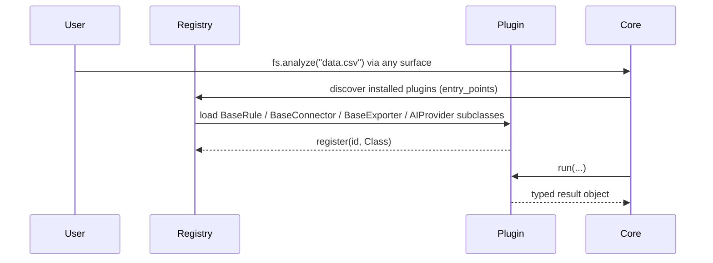
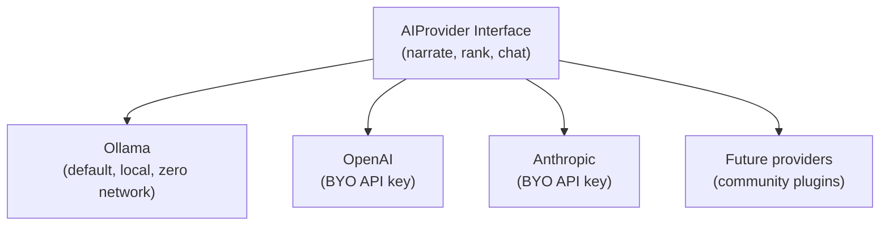
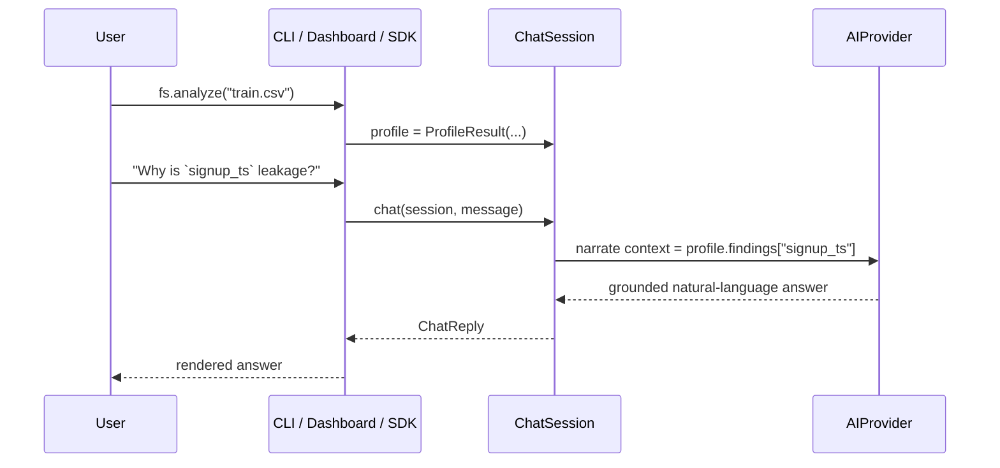
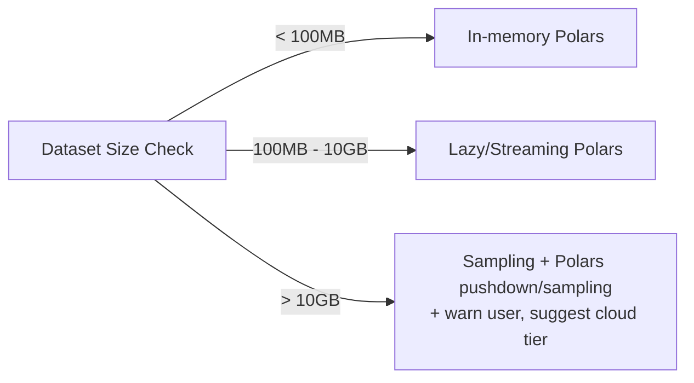
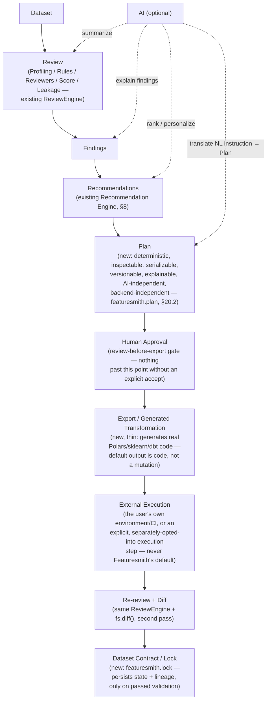

# Architecture — Featuresmith

> System design in service of `VISION.md` — this document is the "how," not the "why." See `VISION.md` if a design choice here seems arbitrary; it almost certainly follows from a boundary or category decision made there.

> **Current vs. future — how to read this document.** §1-19 describe Featuresmith's architecture as a converged whole — the shape every part of the system is designed toward. As of v0.4.0 (shipped, current): the Review Engine, ML Readiness Score, Leakage Detection, Dataset Diff, CSV/Excel/Parquet/DataFrame connectors, Centralized Recommendation Engine, FeatureQualityReviewer, and `Plan` primitive (`fs.plan()`) are real, tested, and in production use — all with static, in-repo registration (`Architecture.md` §25.1). **Not yet built**, referenced below as target design: the AI Layer/`AIProvider`/chat (§7) — Future, applicable when the AI layer is introduced in v1.1.0+ (Phase 7); `.featuresmith.yml` configuration — Future, applicable when the config system is introduced; the Dashboard (§14) — Future; the VS Code extension — Future, v2.0+; entry-point plugin discovery for any category — Future, introduced per category on demonstrated need (§25.1); and the Export/Contract lifecycle (§20) — Future, v0.5.0–v1.0.0 (Phase 5–6), explicitly marked "Design Only — Not Yet Implemented" in its own spec (`features/Dataset-Contracts-And-Planning.md`). `implementation/IMPLEMENTATION_STATUS.md` is the authoritative, current record of what's actually shipped; where this document and that tracker seem to disagree on status, the tracker wins. §21 below is this document's own detailed v0.2.0-vs-design assessment.

## 1. Design Principles Behind the Architecture

1. **One core, many thin surfaces.** All business logic — profiling, rules, feature engineering, AI reasoning, chat, export — lives in a single importable Python library, `featuresmith-core`. The CLI (shipped) is a thin client that calls this library and renders its output today; the Streamlit dashboard and the VS Code extension are the same kind of thin client, planned (**[Future]** — v0.3 and v2.0+ respectively). No surface is permitted to reimplement or fork logic that belongs in core.
2. **Compute and reasoning are separate layers.** Statistics are computed deterministically (Polars); the AI layer only narrates, ranks, and answers questions grounded in that precomputed output — it never computes a number. This makes the system testable and trustworthy. **[Future]** — the AI layer itself doesn't exist in v0.2.0; this principle governs its design once built (§7).
3. **Extension points should be small and deliberate.** Connectors, rules, recommenders, exporters, *and AI providers* are all designed as small, stable interfaces so the core never needs to know about a specific data source, output format, or LLM vendor. As of v0.2.0, connectors and rules are the two categories with real, shipped implementations (registered statically, in-repo); recommenders, exporters, and AI providers are **[Future]** design (§6, §25.1).
4. **Local-first, cloud-optional.** The system must produce full value with zero network calls (local files; a local-LLM option once the AI layer exists). Cloud LLMs and cloud connectors are opt-in, switched entirely through configuration — **[Future]**, since neither the AI layer nor `.featuresmith.yml` exist yet; v0.2.0 already produces full value with zero network calls simply because it has no network-calling capability at all today.
5. **Size-tiered execution.** The same API behaves differently under the hood for a 10K-row CSV vs. a 500M-row Parquet dataset (in-memory vs. lazy/streaming Polars execution) — this is invisible to the plugin author and to every surface.
6. **Featuresmith proves state; it does not execute transformations.** Recommendations compile into a deterministic, inspectable `Plan`; applying a plan always generates real code for an ecosystem the user already runs (Polars, sklearn, dbt) rather than executing inside a Featuresmith-owned runtime. See §20 for the full non-goals and ecosystem-integration model this principle implies. **[Future]** — Plan and the export/apply step don't exist in v0.2.0 (`features/Dataset-Contracts-And-Planning.md`); this principle governs their design.

## 2. Overall System Architecture

The architecture is deliberately drawn "core-out": one reusable Python library at the center, with every user-facing surface as a peer, equally thin, client of it. **[Future for the Dashboard/VS Code boxes below]** — only the SDK and CLI surfaces exist in v0.2.0; the diagram shows the converged target with all surfaces, not v0.2.0's current state.


**Why CLI/Dashboard/Extension route through the SDK rather than calling core packages directly:** it guarantees there is exactly one public entrypoint (`featuresmith.analyze`, `featuresmith.chat`, etc.) that every surface exercises identically, which is what makes "surface parity" (`PRD.md` §12) a testable property rather than an aspiration — a single integration test suite run against the SDK entrypoints covers CLI and dashboard behavior by construction.

## 3. Module Breakdown

| Module | Responsibility | Owned Interfaces | Status |
|---|---|---|---|
| `featuresmith.connectors` | Read data from any source into a normalized `Dataset` object | `BaseConnector` | **Current** — CSV/Excel/Parquet/DataFrame shipped; SQL/cloud connectors **[Future]** |
| `featuresmith.profiling` | Compute univariate/bivariate stats, distributions, correlations | `ProfileResult` schema | **Current** |
| `featuresmith.rules` | Deterministic data-quality & leakage checks | `BaseRule` | **Current** — leakage + quality rules shipped |
| `featuresmith.feature_engine` | Generate candidate feature transformations | `BaseTransformerSuggestion` | **[Future]** — v0.4 |
| `featuresmith.ai` | Provider abstraction, narration, ranking, Interactive AI Chat | `AIProvider`, `PromptTemplate`, `ChatSession` | **[Future]** — v1.x |
| `featuresmith.recommendation` | Merge rule output + AI ranking into a unified, explainable list | — | **[Future]** — v0.4 |
| `featuresmith.exporters` | Turn accepted recommendations into code/notebooks/reports | `BaseExporter` | **[Future]** — v0.4-v0.5 |
| `featuresmith` (top-level SDK) | Public API surface: `analyze()`/`review()`, `diff()` shipped; `chat()`, `export()` **[Future]** | — | **Current, in part** |
| `featuresmith_cli` | Thin CLI wrapper (Typer) over the SDK | — | **Current** |
| `featuresmith_dashboard` | Thin Streamlit wrapper over the SDK | — | **[Future]** — v0.3 |
| `featuresmith_vscode` | Thin VS Code extension (TypeScript) over the SDK/CLI | — | **[Future]** — v2.0+ |
| `featuresmith.config` | Load/validate `.featuresmith.yml` project config | Pydantic models | **[Future]** |

Note the naming convention: everything with business logic lives under the `featuresmith` package itself; every release surface is separately named and separately versioned (`featuresmith-cli` as a public PyPI distribution, shipped in v0.1.0; `featuresmith-dashboard` and `featuresmith-vscode` remaining **[Future]** surfaces until their release phases) — this makes the "no logic outside core" rule structurally enforceable, not just documented (see `Rules.md` §10).

## 4. Folder Structure

The tree below is the converged target layout — modules present in v0.2.0 today are marked; everything else is **[Future]**, shown so a new module's eventual placement is unambiguous, not because it exists yet:

```
featuresmith/
├── packages/
│   ├── featuresmith-core/               # ALL business logic lives here
│   │   └── src/featuresmith/
│   │       ├── core/                    # Current
│   │       │   ├── dataset.py           # normalized Dataset abstraction
│   │       │   ├── profiler.py
│   │       │   └── schema.py            # Pydantic result schemas (shared contract)
│   │       ├── connectors/              # Current (csv/excel/parquet/dataframe); sql_connector.py is [Future], v0.3
│   │       │   ├── base.py
│   │       │   ├── csv_connector.py
│   │       │   ├── excel_connector.py
│   │       │   ├── parquet_connector.py
│   │       │   ├── sql_connector.py         # [Future] — v0.3
│   │       │   ├── dataframe_connector.py   # in-memory Polars/pandas passthrough
│   │       │   └── registry.py              # static registration today; entry-point discovery is [Future], §25.1
│   │       ├── rules/                   # Current (leakage, quality)
│   │       │   ├── base.py
│   │       │   ├── leakage/
│   │       │   ├── quality/
│   │       │   └── registry.py
│   │       ├── review/                  # Current — not shown in the original tree; houses ReviewEngine, ReviewerRegistry, ResultAggregator (implementation/IMPLEMENTATION_STATUS.md)
│   │       ├── scoring/                 # Current — ML Readiness Score
│   │       ├── diff/                    # Current — standalone Dataset Diff engine
│   │       ├── feature_engine/          # [Future] — v0.4
│   │       │   ├── base.py
│   │       │   ├── encoders.py
│   │       │   ├── binning.py
│   │       │   └── interactions.py
│   │       ├── ai/                      # [Future] — v1.x
│   │       │   ├── base.py                  # AIProvider interface
│   │       │   ├── providers/
│   │       │   │   ├── ollama.py
│   │       │   │   ├── openai.py
│   │       │   │   └── anthropic.py
│   │       │   ├── prompts/
│   │       │   ├── narrator.py
│   │       │   ├── chat.py                  # ChatSession — Interactive AI Chat
│   │       │   └── registry.py              # provider plugin discovery
│   │       ├── recommendation/          # [Future] — v0.4
│   │       │   └── engine.py
│   │       ├── plan/                    # [Future] — v0.4, features/Dataset-Contracts-And-Planning.md
│   │       ├── contract/                # [Future] — v0.5, same doc
│   │       ├── exporters/               # [Future] — v0.4-v0.5
│   │       │   ├── base.py
│   │       │   ├── sklearn_pipeline.py
│   │       │   ├── notebook.py
│   │       │   └── html_report.py
│   │       ├── config/                  # [Future]
│   │       │   └── models.py
│   │       └── api.py                       # Current: analyze()/review(), diff(); [Future]: chat(), export()
│   ├── featuresmith-cli/                # Current
│   │   └── src/featuresmith_cli/main.py     # Typer app, imports featuresmith.api only
│   ├── featuresmith-dashboard/          # [Future] — v0.3
│   │   └── src/featuresmith_dashboard/app.py # Streamlit, imports featuresmith.api only
│   └── featuresmith-vscode/             # [Future] — v2.0+
│       └── src/extension.ts
├── plugins/                                  # community plugins ([Future] beyond rules — see §25.1)
├── tests/
├── docs/
├── examples/
├── pyproject.toml                            # workspace root
└── .featuresmith.yml.example                 # [Future]
```

**Why a monorepo of separately-versioned packages rather than one flat package:** it makes the "thin surface" principle physically true — `featuresmith-cli` (and `featuresmith-dashboard`/`featuresmith-vscode` once they exist) literally cannot import anything except `featuresmith`'s public `api.py`, because they're separate installable distributions. A contributor working on "a new rule" only ever needs to open `featuresmith-core/rules/`; a contributor building the future VS Code extension would only ever need the stable `api.py` contract, not core internals.

## 5. Internal APIs & Service Boundaries

Featuresmith ships as a **single reusable Python library plus thin, separately-packaged surfaces** — not microservices. Premature service decomposition would slow down a young open-source project and complicate local-first usage. Boundaries are enforced two ways: (1) Python interfaces (ABCs/Protocols) between internal stages, and (2) a hard package boundary between `featuresmith-core` and every surface package.

Core internal contract — every stage passes a typed Pydantic object to the next. `RawSource/DataFrame → Dataset → ProfileResult → List[RuleFinding]` is shipped, current; everything after `RuleFinding[]` is **[Future]**:

```
RawSource / DataFrame → Dataset → ProfileResult → List[RuleFinding] → Recommendations → ExportArtifact
        (all Current)                                                    ([Future], v0.4)   ([Future], v0.4-v0.5)
                                          │
                                          └──► ChatSession (reads ProfileResult + RuleFinding[], never raw data)
                                               ([Future], v1.x)
```

The **public SDK surface** is intentionally small — designed to converge on:

```python
import featuresmith as fs

profile = fs.analyze("train.csv")  # or fs.analyze(df) on an in-memory dataframe  — [Future] name; v0.2.0 ships fs.review()/fs.diff() today
answer = fs.chat(profile, "Why is this feature leakage?")   # [Future] — v1.x
pipeline = fs.export(profile, target="sklearn")              # [Future] — v0.4-v0.5
delta = fs.diff(profile_a, profile_b)                        # Current, shipped as fs.diff(old, new, target_column=None)
```

**Current, v0.2.0:** `fs.review(source, target_column, ...)` and `fs.diff(old, new, target_column=None)` (`implementation/IMPLEMENTATION_STATUS.md`). `fs.analyze()` as a unifying name, `fs.chat()`, and `fs.export()` are **[Future]** — this is the target function set the CLI and dashboard will call once built; today the CLI calls `fs.review()`/`fs.diff()` directly, nothing more, nothing surface-specific.

## 6. Plugin System

Featuresmith has **four** plugin categories, all discovered the same way: connectors, rules, exporters, and — new in this revision — **AI providers**.



Plugins are discovered via Python `entry_points` (setuptools/PEP 621), the same mechanism `pytest` and `flake8` use — a well-understood pattern for contributors. A plugin is a pip-installable package that registers itself under `featuresmith.rules`, `featuresmith.connectors`, `featuresmith.exporters`, or `featuresmith.ai_providers` entry-point groups. **Why entry_points over a custom plugin loader:** it's a standard, IDE-discoverable, zero-custom-code mechanism, and it lets plugins live in fully separate repos/PyPI packages without forking core.

**Rollout status and philosophy (see `Architecture.md` §25.1 for the full incremental-extension-points principle):** the diagram above is the target design every extension point converges toward, not a claim that all four already work this way. As shipped in v0.2.0, every registry (`RuleRegistry`, the connector registry, `ReviewerRegistry`) is explicit and static — a contributor adds an entry to a list, not a discoverable third-party package (`implementation/IMPLEMENTATION_STATUS.md`). That's the correct v0.2.0 state, not a gap to rush closed: `entry_points` discovery is worth its added machinery (a registry layer, a conformance-test suite, a "how to add a new X" guide) only once a category has real external contributors trying to register a plugin from outside the core repo. Rules — with the most existing built-in examples and the most natural "add one more" shape — are the most likely first category to justify it; each other category (connectors, exporters, reviewers, AI providers, and any future category) earns `entry_points` discovery independently, on its own evidence, not automatically because rules got it first.

## 7. AI Layer — **[Future — applicable when the AI layer is introduced in v1.x]**

Nothing in this section exists in v0.2.0. No `AIProvider`, no `fs.chat()`, no `ChatSession`, no `.featuresmith.yml` — v0.2.0's `fs.review()`/`fs.diff()` are fully deterministic with zero AI involvement, by construction (there's nothing here yet to disable). This section is the target design the AI layer will be built against, per `Phases.md`'s v1.x AI-Assisted Planning phase.

### 7.1 Provider Interface



```python
class AIProvider(Protocol):
    def narrate(
        self, profile: ProfileResult, findings: list[RuleFinding]
    ) -> Narrative: ...
    def rank(
        self, candidates: list[FeatureSuggestion]
    ) -> list[RankedRecommendation]: ...
    def chat(self, session: ChatSession, message: str) -> ChatReply: ...
```

- **Ollama is designed to be the default provider** — zero network calls, works offline, no API key required. This is what a fresh `pip install featuresmith-core` will get out of the box once the AI layer ships; today, a fresh install simply has no AI layer to configure.
- **OpenAI and Anthropic are designed as opt-in**, bring-your-own-API-key providers, selected entirely through `.featuresmith.yml`:
  ```yaml
  ai:
    provider: anthropic
    model: claude-sonnet-4-6
    api_key_env: ANTHROPIC_API_KEY
  ```
  Switching providers is designed to **always** be a config change — never a code change, and never a different call site in the SDK, CLI, or dashboard. This is enforced by construction: every surface calls `fs.analyze()`/`fs.chat()`, which internally resolves the configured provider; no surface ever imports a provider class directly.
- **Future providers are designed to be plugin-friendly**: implementing the three-method `AIProvider` protocol and registering it under the `featuresmith.ai_providers` entry-point group is sufficient — no core changes required, following the exact same registry pattern as rules/connectors/exporters (§6) — subject to §25.1's per-category, demand-triggered rollout for entry-point discovery itself.

### 7.2 Grounding Contract (unchanged principle, now covering chat too)

The AI layer — for both narration and the Interactive AI Chat — will receive only a structured JSON `ProfileResult` + `RuleFinding[]` object, **never the raw dataframe**. Its jobs are strictly: (a) narrate these facts in plain language, (b) rank/prioritize recommendations with a rationale, and (c) answer user questions about them. It is designed to be architecturally prevented from inventing statistics because it will never be given the means to compute one — there is no raw-data tool call available to it by default.

### 7.3 Interactive AI Chat



- A `ChatSession` is designed to wrap one `ProfileResult` and its conversation history; it will be created once per analysis and reused for every follow-up question, so the dataset is **never re-read** mid-conversation.
- Supported question patterns are planned to include (non-exhaustive): "Why is this feature leakage?", "Explain this chart", "What encoding should I use?", "Explain this to a beginner", "Generate sklearn preprocessing for this column", "Compare two columns".
- "Generate sklearn preprocessing" chat answers are designed to call the same `exporters.sklearn_pipeline` code path used by `fs.export()` (§12, itself **[Future]**) — the chat is designed to never have a second, parallel code-generation implementation.
- Chat is designed to be available identically from the SDK (`fs.chat(profile, "...")`), the CLI (`featuresmith chat`, an interactive REPL against the last analysis), and the dashboard (a chat panel next to the findings) — one `ChatSession` implementation, three renderings, once all three surfaces and the AI layer exist.

### 7.4 Fallback Mode

Once built: if no AI provider is configured/reachable, the system will still produce the full rule-based report and a template-based (non-AI) narrative; the Interactive AI Chat will be disabled with a clear message pointing at the config docs — the AI layer is designed as an enhancement, never a hard dependency for the deterministic engine. **Today, v0.2.0 already produces the full rule-based report with no AI layer involved at all** — the "fallback" described here is the future AI layer's designed degraded state, not a mode v0.2.0 needs to fall back from.

## 8. Recommendation Engine — **[Future — v0.4, `Phases.md` Phase 4]**

Merges two inputs: deterministic `RuleFinding[]` (e.g., "column X is 92% correlated with target and only available post-event → likely leakage") and AI-ranked feature suggestions from `feature_engine`. Output is a single ranked list, each item with: `title`, `rationale`, `confidence (0-1)`, `severity`, `affected_columns`, `suggested_action`, `accepted: bool` (user-settable). Only `accepted=True` items flow into the export layer — nothing is ever silently applied. This same list is also the grounding context available to `ChatSession` (§7.3) for questions like "what encoding should I use?".

## 9. Rule Engine

Deterministic, side-effect-free functions: `RuleFinding[] = rule.run(profile_result, config)`. Categories: **leakage** (train/test overlap, target-correlated post-event features, ID-like columns), **quality** (missingness patterns, type mismatches, constant/near-constant columns, duplicate rows), **statistical** (skew, outliers via IQR/Z-score/Isolation Forest, high cardinality). Rules are independently unit-testable against fixture datasets — this is the single most contributor-friendly extension point and should be the primary "good first issue" surface. **Current, in part:** v0.2.0 ships this shape for leakage and quality rules (`implementation/IMPLEMENTATION_STATUS.md`'s Leakage Detection section — 6 pattern detectors, fully implemented); statistical rules (outliers, skew) are **[Future]** — planned as `OutlierReviewer`/`DistributionReviewer` in v0.3 (`Phases.md` Phase 3).

## 10. Feature Engineering Engine — **[Future — v0.4, `Phases.md` Phase 4]**

Given `ProfileResult` + accepted rule findings, proposes concrete transformations: encoding strategy per categorical column (one-hot vs. target vs. ordinal, based on cardinality), binning suggestions for skewed numerics, interaction-term candidates (bounded by a combinatorial cap + correlation-based pre-filter, never brute-force on every pair), and scaling recommendations tied to the eventual model family the user declares (tree-based vs. linear).

## 11. Visualization Layer — **[Future]**

Chart specs are designed to be generated as declarative JSON (Vega-Lite-compatible) rather than framework-specific code, so the **same spec would render in CLI (as a saved PNG/SVG via a lightweight renderer), the Streamlit dashboard, and the HTML report** — one visualization definition, three render targets, consistent with the "one core, many thin surfaces" principle. The AI Chat's "explain this chart" answers, once chat exists, are designed to be grounded in the same declarative spec plus its underlying computed values, not a re-derived summary. None of this — chart specs, CLI rendering, dashboard, HTML report — exists in v0.2.0; `featuresmith review`'s v0.2.0 output is text/JSON via `ConsoleRenderer` only.

## 12. Export Layer — **[Future — v0.4-v0.5, `Phases.md` Phases 4-5]**

`BaseExporter.export(recommendations, dataset_schema) -> ExportArtifact`. Design plan: three exporters in the first release of this layer — `sklearn_pipeline.py` (produces a `ColumnTransformer`/`Pipeline` + a `pytest` test file asserting shape/dtype invariants), `notebook.py` (produces a runnable `.ipynb` walking through findings), `html_report.py` (static shareable report). **Why sklearn as the primary first export target:** it's the lowest-common-denominator production format most teams can consume regardless of their downstream framework, and it composes into MLflow/Airflow/etc. without extra glue. This is designed to be the same code path both `fs.export()` and the chat's "generate sklearn preprocessing" answers would invoke (§7.3) — none of `fs.export()`, the three exporters, or the chat integration exist in v0.2.0.

## 13. CLI

`featuresmith-cli` is a **thin** Typer application: every command body is a one-to-two-line call into `featuresmith.api`. Built on **Typer** (not argparse/click directly) — Typer gives type-hint-driven CLI definitions, which keeps CLI command signatures self-documenting and reduces boilerplate for contributors adding new subcommands. **Current, v0.2.0:** `featuresmith review <source>` and `featuresmith diff <a> <b>` (`implementation/IMPLEMENTATION_STATUS.md`). **[Future]**, not yet built: `featuresmith chat`, `featuresmith export <report> --target sklearn`, `featuresmith dashboard` (launches the Streamlit app), `featuresmith init` (scaffolds `.featuresmith.yml`) — each ships alongside the capability it fronts (chat/AI layer → v1.x, export → v0.4-v0.5, dashboard → v0.3, config → alongside whichever future capability first needs it).

## 14. Dashboard — **[Future — v0.3, `Phases.md` Phase 3]**

`featuresmith-dashboard` is designed as a **thin** Streamlit application — every panel would call `featuresmith.api` and render the returned typed objects; no analysis logic would be reimplemented in the dashboard layer. See `Architecture.md` §22.C3 for the Streamlit-vs-Next.js trade-off (Streamlit is the planned first choice for the fastest path to an interactive, Python-native UI that plugin authors can extend without learning a JS framework). Designed to launch via `featuresmith dashboard`, and to include the Interactive AI Chat as a persistent side panel next to the findings list, once both the dashboard and the AI layer exist. Per §25's Core vs. Extensions table and the principle stated there: **the dashboard is a surface over Featuresmith's core, not the product itself** — every capability it will expose must already exist as an `fs.*` SDK call and a CLI command; the dashboard is not permitted to be the first or only place a capability is available, and no core or CI/CD workflow may depend on it existing or running (§25.2).

## 15. Configuration System — **[Future]**

Design plan: a single `.featuresmith.yml` per project (Pydantic-validated), analogous to `.pre-commit-config.yaml`. Would control: which connectors/rules/exporters are enabled, **AI provider + model + API key source**, thresholds (missingness %, correlation cutoffs), and output targets. Config would be layered: package defaults → project `.featuresmith.yml` → CLI flag overrides — a standard, predictable precedence order. This is designed to be the *only* mechanism for switching AI providers, per §7.1. **v0.2.0 has no configuration system** (`implementation/IMPLEMENTATION_STATUS.md`'s "No `.featuresmith.yml` config system" gap) — reviewer/rule selection today is via CLI flags (`--only`, `--target`) and SDK keyword arguments only.

## 16. Extension System — **[Future, per-category — see §25.1]**

Four extension points, each following the same `base.py` + entry-point pattern: **Connectors** (new data sources), **Rules** (new quality/leakage checks), **Exporters** (new output targets, e.g., a future PySpark exporter), and **AI Providers** (new LLM backends). Documented via a `docs/extending/` guide per extension point with a minimal working example plugin in `examples/`. As with §6, this is the converged target shape for each extension point — the `docs/extending/` guide and `entry_points` registration for a given category ship when that category has real external demand, not all four at once by default (`Architecture.md` §25.1).

## 17. Scalability



The same `ProfileResult` schema is produced regardless of tier — size-tiering is an internal execution detail, never a public API difference. This keeps the plugin/rule interface, and every surface built on `fs.analyze()`, stable no matter how large the underlying data gets.

## 18. Future Cloud Architecture

A later, fully optional SaaS/hosted tier would decompose into: an API service (FastAPI) wrapping the exact same `featuresmith-core` package (as just another thin surface, consistent with §2), a job queue (e.g., Celery/Arq) for long-running large-dataset analyses, object storage for reports/artifacts and chat transcripts, and a hosted dashboard — but this is explicitly **out of scope until the OSS core and contributor base are established** (see `Phases.md`), to avoid distracting early effort from the thing that actually drives adoption: the open-source library itself.

## 19. Architectural Improvements Introduced in This Revision

- **Hard package boundary** between `featuresmith-core` and every surface (§3-4), turning "no duplicated logic" from a guideline into something CI can actually enforce (separate distributions can't accidentally import each other's internals).
- **AI providers promoted to a first-class plugin category** (§6, §16), symmetric with connectors/rules/exporters, rather than a special-cased internal abstraction — this is what makes "add a new provider" a community-contributable task instead of a core-team-only change.
- **`ChatSession` as a distinct, explicitly-scoped object** (§7.3) rather than folding chat into the narrator — keeps the "never re-reads raw data" guarantee simple to reason about and test in isolation.
- **A single public `api.py`** (§5) as the one contract every surface depends on, which is also the natural seam for the future hosted API tier (§18) to reuse without a rewrite.

## 20. Dataset Contract Architecture, Ecosystem Integration & Non-Goals — **[Future — v0.4-v0.6, `Phases.md` Phases 4-6; "Design Only — Not Yet Implemented" per `features/Dataset-Contracts-And-Planning.md`]**

This section formalizes the architectural consequence of `VISION.md` §2-3: Featuresmith's core differentiation is *proof of dataset state*, not *execution of dataset transformations*. Full product-level design for this layer lives in `features/Dataset-Contracts-And-Planning.md`; this section covers only how it fits the architecture already described in §1-19.

### 20.1 The lifecycle as a state machine, not five subsystems

The Contract/Plan/Apply capability is not a new engine parallel to Review — it is the existing Review + Diff pipeline (§8-9, `features/Review-Engine-Architecture.md`) invoked twice, with a Plan/Export step in between, and a persistence step at the end. The full conceptual model, including where AI sits (strictly as an optional assistance layer around Recommendations/Plan, never a parallel engine — `Design-Principles.md` "AI assists, never replaces"):



Every arrow from `D` (Recommendations) through `J` (Contract/Lock) is identical whether a Plan originated from a rule/reviewer finding or a natural-language instruction translated by AI — Plan is the one point every authoring path converges on (`features/Dataset-Contracts-And-Planning.md` §3.1). AI never has its own arrow into Export, External Execution, or the Contract directly; it only ever feeds the same deterministic Plan representation everything else already consumes.

No new "Transformation Engine" module is introduced. `plan/` and `contract/` are the only new top-level modules in `featuresmith-core`; `export/` (the module previously described as `apply/` — naming not yet finalized, see `features/Dataset-Contracts-And-Planning.md` §10) is deliberately thin — a dispatcher to exporters, not a runtime, and its default behavior is to emit code, not run it (`features/Dataset-Contracts-And-Planning.md` §7.2).

### 20.2 New modules

| Module | Responsibility | Owned Interfaces |
|---|---|---|
| `featuresmith.plan` | Turn accepted recommendations (rule-based or AI-translated) into a deterministic, serializable `Plan` object — the single domain primitive every authoring path resolves into (`features/Dataset-Contracts-And-Planning.md` §3.1) | `Plan`, `PlanStep`, `BasePlanTranslator` |
| `featuresmith.contract` | Persist, load, and diff `featuresmith.lock` — the versioned Dataset Contract | `DatasetContract`, `ContractStore` |

`featuresmith.exporters` (§12, unchanged) is what the export/apply dispatcher calls into — sklearn/Polars/dbt code generation is exporter work, not new architecture. `featuresmith.ai` (§7) is what NL plan authoring calls into — a `Plan` produced from natural language and a `Plan` produced from a rule-based recommendation are the same object, reviewed and exported identically (§20.4).

### 20.3 What Featuresmith intentionally does not own

The philosophy behind this boundary is in `VISION.md` §3; this table is its architectural enforcement mechanism.

| Category | Why it's out of scope | What Featuresmith does instead |
|---|---|---|
| Orchestration / scheduling (Airflow, Dagster, Prefect) | No structural advantage; would compete with entrenched infra teams already run | Exports plans as code these tools can invoke as a step; Phase 5's scheduler (§18-era design) is for *re-checking*, never for running transformations |
| Distributed execution (Spark, Ray, a Featuresmith-branded runtime) | Same reasoning; Featuresmith pushes down, never reimplements | Pushdown/sampling execution model (§17); optional Spark/Ray *backends* for profiling, never for applying transformations |
| Proprietary transformation DSL/runtime | Would fork the "read the exact code that will run" promise that makes Apply/Export trustworthy | Apply/Export always generates real Polars expressions or a real `sklearn.Pipeline` — inspectable, runnable, and owned by the user outside Featuresmith entirely |
| Feature stores (Feast, Tecton) | Serving-time feature management is a different, mature category | Exports feature definitions/schemas *to* a feature store; never serves features itself |
| Model training / AutoML | Different job to be done; the instant a recommendation is about hyperparameters, it's out of scope | Stops at the data/model boundary — every recommendation is about the dataset, never the model |
| No-code/low-code UI as primary interface | Contradicts developer-first DNA (`Design-Principles.md`) and the "read the generated code" trust model | Every surface (SDK, CLI, dashboard) calls the same typed core; the dashboard visualizes, it never becomes a drag-and-drop builder |

### 20.4 Ecosystem integration model

Featuresmith integrates with, rather than replaces, the tools in the table below. Integration is always one of two shapes: **(a) connector** — Featuresmith reads from the tool — or **(b) exporter** — Featuresmith generates code/artifacts the tool consumes. No integration in either direction ever requires the target tool to depend on a Featuresmith runtime.

| Tool | Integration shape | What crosses the boundary |
|---|---|---|
| Polars / pandas | Connector + Apply/Export target | Native dataframe ingestion (§4); generated transformation code targets Polars expressions or a pandas-compatible `sklearn.Pipeline` |
| scikit-learn | Apply/export target | Generated `ColumnTransformer`/`Pipeline` (§12), the lowest-common-denominator production format |
| dbt | Apply/export target (planned) | A dbt model stub generated from an accepted Plan, so a team already standardized on dbt applies the transformation inside their existing dbt project |
| Airflow / Dagster / Prefect | Downstream consumer, not an integration Featuresmith initiates | Exported pipeline code (sklearn/notebook/dbt) is a step these orchestrators call; Featuresmith never registers a DAG itself |
| Feast | Export target (planned) | Feature definitions/schemas generated from a certified Dataset Contract, so a feature store's inputs are provably reviewed before serving |
| MLflow / Weights & Biases | Metadata attachment (planned) | A Dataset Contract's fingerprint and readiness score attached as run metadata/tags — provenance a training run can point back to, without Featuresmith hosting any run data itself |

### 20.5 Tech Stack

Consolidated here (previously split across a separate planning document) since these are architectural commitments, not planning notes.

| Area | Recommendation | Reasoning |
|---|---|---|
| Core language | Python 3.11+ | Ecosystem fit for ML audience; non-negotiable for adoption |
| DataFrame engine | **Polars (primary), Pandas (compat shim only)** | Polars' lazy execution and multi-threaded performance matter directly for size-tiered scalability (§17); pandas is kept only as an interop layer since much of the ecosystem (sklearn, some connectors) still expects it |
| Large-data query engine | **DuckDB** (Planned, Phase 8) | Zero-infra SQL/analytical engine, exceptional for out-of-core aggregation and a natural pushdown layer for SQL/warehouse connectors |
| Columnar interchange | **Apache Arrow** | Zero-copy interop between Polars, DuckDB (planned), and Parquet |
| Monorepo/workspace tooling | **uv workspaces** | Manages `featuresmith-core`, `featuresmith-cli`, `featuresmith-dashboard` as independently versioned packages sharing one lockfile-driven dev environment — directly supports the hard package boundary (§4) |
| API layer (future hosted tier) | **FastAPI** | Type-hint-driven, async-native, pairs naturally with the Pydantic schemas already used internally; becomes just another thin surface over `featuresmith.api` |
| Dashboard (v1) | **Streamlit**, not Next.js | Fastest path to a Python-native, plugin-author-friendly interactive UI during early, fast-iterating phases (§14); a Next.js rewrite is explicitly deferred, not rejected |
| Charting | **Plotly/Altair (Vega-Lite specs)** | Declarative chart specs render consistently across CLI, dashboard, and static HTML report (§11) |
| Validation/schema | **Pydantic v2** | Already the contract layer for every internal stage boundary, including `Plan` and `DatasetContract` (§20.2); validates config too |
| Modeling utilities | **scikit-learn** | Lowest-common-denominator Apply/export target; nearly every downstream framework can consume a sklearn-compatible pipeline |
| Data validation (export target) | **Great Expectations** — as an *export format* only, never a dependency | Valuable for teams already standardized on it; Featuresmith does not depend on it to validate its own findings |
| Experiment/artifact tracking | **MLflow, Weights & Biases — metadata attachment only** | Not core — Featuresmith produces the contract, it doesn't own experiment tracking (§20.4) |
| **AI provider abstraction** | **Custom lightweight `AIProvider` protocol** (narrate, rank, chat/plan-translate) | A full agent framework (LangChain, LlamaIndex) would pull in far more surface area than a few narrowly-scoped methods need, and would make the "AI never touches raw data, never executes" grounding guarantee harder to audit |
| Local LLM runner | **Ollama** (default) | Simplest, most widely adopted way to run local models with a stable HTTP API |
| Cloud LLM providers | **OpenAI, Anthropic** (opt-in, BYO key) | Added as optional `pyproject.toml` extras so the core install stays dependency-light |
| Containerization | **Docker**, multi-stage build | Standard for reproducible dev environments and eventual hosted-tier deployment |
| CI/CD | **GitHub Actions** | Free for OSS, tight PyPI trusted-publishing integration |
| Package distribution | **PyPI, trusted publishing (OIDC)**, independently per package | No long-lived API tokens to leak |
| Docs site | **Next.js documentation website (`frontend/`)** | Docs are rendered by the existing Next.js app in `frontend/` (the `featuresmith-website` package), consistent with the rest of the marketing/docs site — no separate MkDocs toolchain |

**What to avoid early:** don't build a custom plugin-discovery mechanism (`entry_points` already solves this, §6, though see §25.1 for why most extension categories should stay on static registration until they individually earn it); don't adopt a heavyweight agent framework for the AI layer; don't adopt Featuretools or Great Expectations as hard dependencies; don't start a Next.js dashboard in parallel with Streamlit; don't let the CLI or dashboard implement any logic beyond argument parsing and rendering — and, new in this revision, **don't let the export/apply dispatcher grow into an execution engine, and don't let its default behavior become silent execution** — the moment it needs its own scheduler, retry logic, or state beyond "which exporter to call," or the moment a bare `export`/`apply` call runs code against a user's dataset without an explicit opt-in, that's a sign the design has drifted from §20.1's intent.
## 21. v0.2.0 Architecture Assessment

This section, and §22-25, are the output of a v0.3.0-onward architecture strategy review. They assess the actual, shipped v0.2.0 architecture (`implementation/IMPLEMENTATION_STATUS.md` is the source of truth for what's real) against the simplicity principle in `Design-Principles.md` ("Simple by default, complex only when earned"). **Nothing in §21-25 authorizes changing v0.2.0 code.** v0.2.0 is a stable baseline; every action item here is scoped to v0.3.0 or later unless explicitly marked a v0.2.0 Critical Issue (§21.4).

### 21.1 Overall complexity assessment

v0.2.0's architecture is healthy: the plugin pattern (connectors/rules/exporters/AI providers/reviewers, all discovered the same way), the strict `ReviewResult`/`ProfileResult`/`RuleFinding` typed pipeline, and the hard package boundary between `featuresmith-core` and every surface are all real, load-bearing decisions that are already paying for themselves — not speculative scaffolding. The codebase is complex in the places the product is actually complex (six independent leakage pattern detectors, an eight-dimension score, a six-stage review pipeline) and simple in the places it should be (the CLI is a two-line Typer wrapper per command; renderers are pure functions over a frozen object). That's the right shape for a system whose core differentiation is trustworthy, inspectable detection logic.

### 21.2 What's working well

- **One core, many thin surfaces** (`Architecture.md` §2-4) is enforced structurally, not just by convention — separate PyPI distributions plus an `import-linter` CI contract mean the boundary can't quietly erode.
- **The plugin pattern is genuinely uniform.** Rules, connectors, exporters, AI providers, and reviewers (added in this revision) all follow the identical `Base*` interface + `entry_points` shape. A contributor who's written one plugin already knows how to write the next kind.
- **Recommendation centralization** (`Review-Engine-Architecture.md` §8.4) is the single best simplicity decision in the v0.2.0-era design work: reviewers detect, one engine recommends, so eleven reviewers don't grow eleven divergent recommendation dialects.
- **The scoring/review/diff layering is real, not aspirational**: the Score Adapter reads only `ReviewSection`s, never raw findings independently (`ML-Readiness-Score.md` §11) — this is a designed constraint that's actually implemented, not a diagram that code has drifted from.

### 21.3 Where complexity exists, and whether it's justified

| Area | Complexity present | Justified? |
|---|---|---|
| Six leakage pattern detectors + a dedup/merge step | Yes — six small classes, one aggregator | Yes. Leakage is a named flagship capability (`Flagship-Capabilities.md` §4) and false-positive reduction is an explicit, tested goal (`Dataset-Diff-And-Leakage-Detection.md` §7.4) — six narrow detectors are more auditable than one large heuristic, not less. |
| Eight scoring dimensions, two of them split into sub-dimensions (Data Quality → 3 dimensions; Consistency → 2 dimensions) | Yes — 10 concrete dimension classes for an 8-dimension design | Partially. The split happened because the design's `FeatureQualityDimension`/`DistributionHealthDimension` aren't buildable yet (their source reviewers don't exist until Phase 4), so the remaining dimensions were built at finer grain than designed to fill the gap. This is a reasonable implementation-order artifact, not a designed abstraction — see §22 (SIMPLIFY). |
| Review Categories as an open, namespaced-string system with a `CategoryRegistry` (`Review-Engine-Architecture.md` §9) | Yes — a registry, a metadata model, entry-point discovery design | Yes, conditionally. The category *field* is cheap and already load-bearing (every section and recommendation carries one). The `CategoryRegistry`'s entry-point discovery is speculative relative to today (`--only` is shipped, `--skip` isn't, and no plugin has registered a category), but it's explicitly documented as such (`Review-Engine-Architecture.md` §9.1, §14.1: "Intentionally Deferred") rather than half-built — see §23's guardrail on speculative-but-labeled work. |
| Recommendation Adapter's dual code path (minimal severity-ranked fallback vs. the real Phase 4 Recommendation Engine) | Yes — two formatters behind one interface | Yes. This is the correct way to let the Review Engine ship before Phase 4 without either blocking on it or duplicating recommendation logic later (`Review-Engine-Architecture.md` §15). It has a defined expiration: once Phase 4 ships, the fallback is deleted, not maintained indefinitely. |
| Dataset Diff as a fully standalone engine, parallel to the Review Engine's reviewer pattern | Yes — a second top-level pipeline (`featuresmith.diff`) that duplicates some of what a `DiffReviewer` would have done | **No — this is a genuine divergence from the documented design, not a justified complexity trade-off.** See §21.4. |

### 21.4 v0.2.0 Critical Issue: Dataset Diff shipped outside the Review Engine

**This is a documented divergence between design and implementation, not a proposal to change v0.2.0 code.** `Review-Engine-Architecture.md` and `Dataset-Diff-And-Leakage-Detection.md` both design Dataset Diff as `DiffReviewer` — an ordinary reviewer, dispatched by the same `ReviewEngine.run()` pipeline as every other category, explicitly "a deliberate architectural test of the Review Engine's extensibility claim" (`Dataset-Diff-And-Leakage-Detection.md` §8.3). What actually shipped in Sprint 5 is a second, standalone `featuresmith.diff` package with its own engine, its own CLI command, and its own exit-code scheme — `fs.review(previous=...)` raises `NotImplementedError` rather than activating a `DiffReviewer` (`implementation/IMPLEMENTATION_STATUS.md`, "Dataset Diff" section).

**Why this matters beyond a documentation nit:** it's the one place in v0.2.0 where the "every category is just a reviewer" claim — the architectural property `Flagship-Capabilities.md` and the Review Engine design both lean on to argue the system is extensible — is not actually true for one of the four flagship capabilities. A user running `featuresmith review data.csv --previous old.csv` today gets an error, not a diff section, despite two design documents describing that exact call.

**Why this is not being fixed in v0.2.0:** v0.2.0 is a stable, shipped baseline, and closing this gap is additive, non-breaking work — adding `DiffReviewer` support does not require touching `featuresmith.diff`, which stays as the underlying engine `DiffReviewer` would call (see §22's SIMPLIFY entry on this exact point). There is no data-safety or correctness defect here, only an unfulfilled extensibility claim — it does not meet the bar for an unscheduled hotfix.

**Disposition:** treated as the first item of v0.3.0-onward SIMPLIFY work (§22), not urgent enough to interrupt v0.2.0, but flagged here explicitly so it isn't silently absorbed into "Phase 3 misc" and lost. `Flagship-Capabilities.md` §3 and `Dataset-Diff-And-Leakage-Detection.md`'s own status banner already describe Dataset Diff as "Shipped" — that remains true and does not need correction; what needs correction is the Review Engine integration claim specifically.

**Resolution (v0.3.0):** the gap is closed. `DiffReviewer` (`review.diff`) ships in v0.3.0 as a thin reviewer that calls the standalone diff engine and wraps the result into a `ReviewSection` tagged `diff`; `fs.review(source, previous=...)` and `featuresmith review <source> --previous <snapshot>` now produce a diff section and attach the `DatasetDiffResult` to `ReviewResult.diff`. See §22.A1 for the completed action item.

---

## 22. Simplify / Keep / Refactor Later

Scope: everything below applies from **v0.3.0 onward**. No entry in this section authorizes touching v0.2.0 code before then.

### 22.A SIMPLIFY

#### A1. Reconcile Dataset Diff with the Review Engine (`DiffReviewer`) — ✅ COMPLETED in v0.3.0

- **Component:** `featuresmith.diff` (standalone) vs. the designed `DiffReviewer` (`Review-Engine-Architecture.md` §9.2, `Dataset-Diff-And-Leakage-Detection.md` §8.1).
- **Current approach (v0.2.0):** two parallel entrypoints — `fs.diff()`/`featuresmith diff` (real, shipped) and `fs.review(previous=...)` (raises `NotImplementedError`). Two exit-code schemes, two CLI commands with overlapping purposes.
- **Why unnecessarily complex:** a user has to know, out of band, that "diff-aware review" doesn't exist and that they need a second, differently-shaped command instead. It's not that `featuresmith.diff` is over-engineered — it's that the system now has two ways to get at overlapping information with no shared code path between "review" and "diff-aware review," which is exactly the duplication the Review Engine's category system was designed to prevent.
- **Proposed simpler direction:** build `DiffReviewer` as designed — a thin reviewer whose `review()` calls the existing `fs.diff()` internally (§8.1's design is already correct) and wraps the result into a `ReviewSection` tagged `diff`. `featuresmith.diff`/`fs.diff()` stay exactly as they are as the standalone, lower-level primitive (a user who only wants a diff, with no full review, keeps that path) — this is additive, not a rewrite of the diff engine itself.
- **Risk:** low. `DiffReviewer.applicable()` only activates when `previous` is passed, so it cannot change behavior for any existing single-dataset review call. The main risk is scope creep into re-deriving `distribution_shifts`/`quality_regressions` fields that were speculatively designed (§7.1 of the diff doc) but never built for the standalone engine either — ship `DiffReviewer` against what `fs.diff()` already returns first; add the richer fields only if real usage asks for them.
- **When to address:** early v0.3.0 — it's Developer Experience phase work by nature (dashboard/CI/plugins all want one review entrypoint, not two), and it directly un-blocks `--previous` gating in the GitHub Action Phase 3 already plans.
- **Affects public API:** yes, additively — `fs.review(previous=...)` starts succeeding instead of raising. This is a Rules.md §9 minor-version-compatible change (new capability, not a breaking one) as long as the `NotImplementedError` path is documented as deprecated-in-favor-of rather than silently removed before v0.3.0 ships.
- **Status (v0.3.0):** ✅ **Completed.** `DiffReviewer` (`review.diff`) is implemented in `featuresmith/review/reviewers/diff.py` and registered in `default_registry()` (9 reviewers). It reuses the standalone engine via `compute_diff()` + `findings_from_diff()` — it does not re-profile the previous snapshot when a previous profile is available. `fs.review(source, previous=...)` profiles the previous snapshot once at the SDK boundary and passes `previous_profile` to the engine; `featuresmith review <source> --previous <snapshot>` wires the same path. The diff section is appended only when a previous snapshot is provided, so single-dataset review is unchanged (8 sections, `result.diff is None`). The speculatively-designed `distribution_shifts`/`quality_regressions` fields remain deferred, per the risk note above.

#### A2. Collapse the ML Readiness Score's split dimensions back to the designed 8, or formally re-scope the design to 10

- **Component:** `featuresmith.scoring.dimensions` — `DataQualityDimension` (designed) is implemented as three (`DuplicateRecordsDimension`, `ConstantColumnsDimension`, `HighCardinalityDimension`); `ConsistencyDimension` (designed) is implemented as two (`DataTypesDimension`, `HighCardinalityDimension` — note `HighCardinalityDimension` is currently double-counted across both designed dimensions, per `ML-Readiness-Score.md`'s implementation table).
- **Why unnecessarily complex:** this isn't over-engineering in the usual sense — it's an artifact of building at finer grain than the design specifies, likely because it was easier to ship one dimension per reviewer section than to write the aggregation logic for a multi-section dimension. The complexity cost is real, though: weight configuration, documentation, and any future "why did my score drop" explanation now have to account for 10 named things instead of 8, and `HighCardinalityDimension` appears to feed two designed dimensions at once, which risks double-weighting a single signal in the overall score.
- **Proposed simpler direction:** this is a genuine two-way fork, not a default-to-simpler call — resolve it explicitly in early v0.3.0 rather than let default weights get tuned (per `ML-Readiness-Score.md` §15's open question) against an accidental 10-dimension shape:
  - *Option 1 (recommended):* keep the finer-grained dimensions (they're already built and tested) and update the design doc's dimension table to match reality — 10 named dimensions is not inherently worse, as long as it's the intentional shape rather than a drift nobody decided on. Fix the `HighCardinalityDimension` double-count by making it feed exactly one designed dimension (Consistency, per its "unexplained high-cardinality" framing) and moving cardinality-as-a-quality-signal out of Data Quality's aggregate if it's currently counted there too.
  - *Option 2:* merge the split dimensions back to match the original 8-dimension design once `FeatureQualityDimension` and `DistributionHealthDimension` land in Phase 4, on the theory that the split was only ever a Phase-4-shaped hole being filled early.
- **Risk:** medium — this is a scoring-formula change, which `ML-Readiness-Score.md` §13 already requires golden-file regression tests and an explicit `scoring_version` bump for. Any resolution here is a formula-version event, not a silent internal refactor.
- **When to address:** before default weights are empirically tuned (an open item in `ML-Readiness-Score.md` §15) — doing the tuning against an unresolved double-count would bake the ambiguity into shipped defaults.
- **Affects public API:** yes — dimension IDs are part of the score breakdown a caller can inspect and part of `.featuresmith.yml`'s future weight-configuration keys (`ML-Readiness-Score.md` §11), so this should land before that config surface ships, not after.

#### A3. Give the Recommendation Adapter's fallback formatter an explicit removal trigger

- **Component:** `RecommendationAdapter`'s minimal severity-ranked fallback (`Review-Engine-Architecture.md` §8.4, §15), active because Phase 4's real Recommendation Engine hasn't shipped.
- **Why flagged (not "unnecessarily complex," but a latent complexity risk):** the design already documents this as a temporary fallback with a clear trigger for removal ("once Phase 4 ships, the fallback formatter is swapped... transparently"). The risk isn't the fallback itself — it's well-designed — it's that nothing currently enforces its removal, so it could quietly survive past Phase 4 as permanent dead code with a permanent `if recommendation_engine_available` branch.
- **Proposed simpler direction:** when Phase 4 ships, delete the fallback in the same PR that ships the real Recommendation Engine, not a follow-up — add this as an explicit acceptance-criterion line item to Phase 4 in `Phases.md` rather than leaving it to the fallback's original design doc to be remembered.
- **Risk:** low — this is a scheduling/discipline item, not a design change.
- **When to address:** at Phase 4 ship time, by construction.
- **Affects public API:** no — the fallback and the real engine already produce the same `Recommendation` schema by design.

### 22.B KEEP

#### B1. The uniform plugin pattern (connectors, rules, exporters, AI providers, reviewers — all via `entry_points` + `Base*`)

- **Why it should remain:** it is the single biggest lever on `PRD.md` §15's open-source contributor goal — a contributor who has written one plugin already knows the shape of every other extension point. `Rules.md` §18 leans on exactly this ("start with a good-first-issue... the relevant extension-point README").
- **What problem it solves:** without it, five extension categories would plausibly grow five different registration mechanisms over time, each needing its own documentation and its own conformance-test pattern.
- **Why simplifying it could be harmful:** collapsing to a single `Plugin` supertype with a `kind` field (the "simpler-looking" alternative) would remove the compile-time/type-hint benefit of five distinct `Base*` Protocols and make a contributor's IDE autocomplete less useful — that's added friction disguised as fewer classes, not genuine simplification.

#### B2. `featuresmith-core` / surface package hard boundary, enforced by `import-linter`

- **Why it should remain:** it's what makes "surface parity" (`PRD.md` §12) a CI-checkable property instead of a discipline someone has to remember. It has already caught the exact failure mode it exists to prevent once (see A1 above is a *design* gap, not a boundary violation — the standalone diff engine still lives entirely in core).
- **What problem it solves:** prevents `featuresmith-cli` or a future `featuresmith-dashboard` from silently reimplementing logic (`Rules.md` §21's explicit anti-pattern) as the surface count grows toward the VS Code extension and a hosted API tier.
- **Why simplifying it could be harmful:** merging core and CLI into one package (removing the "unnecessary" separate-distribution overhead) would remove the only mechanism that makes the boundary structurally true rather than documented-and-hoped-for.

#### B3. Centralized Recommendation Engine (one engine, many reviewer callers)

- **Why it should remain:** it's the single design decision most responsible for the Review Engine staying simple as reviewer count grows — see `Review-Engine-Architecture.md` §8.4's own "why centralize" reasoning, which this document endorses rather than re-derives.
- **What problem it solves:** without it, adding an eleventh, twelfth reviewer would mean an eleventh, twelfth recommendation-phrasing implementation, and any future AI-assisted ranking (Phase 7) would need to be wired into every one of them individually instead of once.
- **Why simplifying it could be harmful:** there is no simpler version of this that doesn't reintroduce per-reviewer recommendation logic — it is already the simple option relative to the alternative.

#### B4. Deterministic core with AI strictly as a downstream, optional narration/ranking/translation layer

- **Why it should remain:** every flagship capability (`Flagship-Capabilities.md` §1-4) already works, is tested, and ships with the AI layer fully disabled (`Architecture.md` §7.4). This is the architectural fact that makes Featuresmith's core trust claim ("every flagged column traces back to a concrete, inspectable reason," `Flagship-Capabilities.md` §4) auditable rather than asserted.
- **What problem it solves:** keeps the product's differentiation (proof, not vibes) intact even as an AI layer is added — a competitor's "AI-powered EDA" pitch has no equivalent guarantee.
- **Why simplifying it could be harmful:** the "simpler" alternative — letting the AI layer compute or adjust numbers directly, removing a layer of indirection — is explicitly the failure mode `Rules.md` §10, §21 exist to prevent, and it's the one architectural line every phase from here to v2.0 depends on staying intact (§24).

#### B5. Category as an open, namespaced string with a registry, even though no filtering UI consumes it yet

- **Why it should remain:** unlike a typical "unused abstraction," this one is already load-bearing — every `ReviewSection` and `Recommendation` in shipped v0.2.0 code carries a category today. Removing it would mean re-adding it later when `--skip` (already scoped for Phase 3/`Dataset-Review-PRD.md`) or dashboard filtering need it — `--only` already ships.
- **What problem it solves:** lets filtering, category-specific reports, and dashboard organization be additive features later (§23's "does this reduce future complexity" question, answered "yes" here specifically because the field already exists and costs nothing further to carry).
- **Why simplifying it could be harmful:** the `CategoryRegistry`'s entry-point *discovery* mechanism (as opposed to the category field itself) is the part that's genuinely ahead of need — see REFACTOR LATER C3 for that distinction.

### 22.C REFACTOR LATER

#### C1. `CategoryRegistry` entry-point plugin discovery

- **Component:** `CategoryRegistry.register()`/`.resolve()`/`.all()` (`Review-Engine-Architecture.md` §9.5), designed for `entry_points`-based discovery of plugin-contributed categories.
- **Why it may need evolution:** today, zero plugins exist that register a category, and the registry itself is intentionally deferred (`Review-Engine-Architecture.md` §14.1: "Intentionally Deferred"). Building the full entry-point discovery machinery now would be exactly the "abstraction for a future feature might need it" pattern `Design-Principles.md`'s simplicity principle warns against.
- **Trigger that should cause refactoring:** the plugin ecosystem actually produces a community reviewer that wants a category outside the 6 built-in ones (`Review-Engine-Architecture.md` §9.2's table) — until then, the built-in `ReviewCategory` set is sufficient and a static registry (no entry-point discovery) is simpler and equally correct.
- **Earliest reasonable version:** v0.3.0's plugin work (Phase 3) is a natural moment to check whether this is needed yet, but only build it if the first few community reviewers actually want a new category — otherwise defer again.
- **What evidence should be collected first:** count of community-contributed reviewers in the Phase 3 window, and whether any of them declare `category="custom"` because no existing category fits — that's the concrete signal this was needed, versus community reviewers happily using existing categories, which is evidence it wasn't.

#### C2. Distribution-shift and quality-regression fields on `ProfileDiff`/`DatasetDiffResult`

- **Component:** the `distribution_shifts`/`quality_regressions` additive fields designed in `Dataset-Diff-And-Leakage-Detection.md` §7.1, §9 but not present on the shipped standalone `DatasetDiffResult` (which has its own, differently-named "distribution shifts (mean shift detection)" per `implementation/IMPLEMENTATION_STATUS.md`).
- **Why it may need evolution:** once A1 (DiffReviewer) ships, there will be two slightly different distribution-shift representations to reconcile — the standalone engine's shipped version and the designed `ProfileDiff` extension.
- **Trigger that should cause refactoring:** A1 shipping — at that point the reconciliation becomes unavoidable rather than optional, since `DiffReviewer` needs one canonical shape to wrap.
- **Earliest reasonable version:** immediately after A1, same v0.3.0 window, as a direct follow-on task rather than a separate phase.
- **What evidence should be collected first:** none needed beyond A1's own design work — this is a mechanical consequence of A1, not a speculative call.

#### C3. Streamlit dashboard vs. a future Next.js frontend

- **Component:** the entire `featuresmith-dashboard` package (`Architecture.md` §14, §20.5's tech-stack table already flags this as "explicitly deferred, not rejected").
- **Why it may need evolution:** Streamlit is the right choice for a fast-iterating, Python-native, plugin-author-extensible v1 dashboard (§20.5's own reasoning stands), but it has known ceilings for a team-collaboration, multi-user hosted tier (Phase 8) that a Next.js/FastAPI stack wouldn't share.
- **Trigger that should cause refactoring:** the hosted tier (Phase 8, §18) becomes a real, funded initiative — not before. Rewriting the dashboard ahead of that would be paying a migration cost with no user-facing capability unlocked yet.
- **Earliest reasonable version:** Phase 8 (v2.0+), exactly as already documented — this entry exists to confirm the existing plan is correct, not to change it.
- **What evidence should be collected first:** concrete hosted-tier requirements (multi-user auth, real-time collaboration, session state beyond a single Streamlit process) that Streamlit genuinely cannot satisfy — evaluate against Streamlit's actual multi-user story at that time rather than assuming today's limitations still hold in two years.

#### C4. Size-tiered execution's three-tier boundary (in-memory / lazy-streaming / sampling)

- **Component:** `Architecture.md` §17's fixed three-tier size model.
- **Why it may need evolution:** Phase 8 introduces DuckDB pushdown and optional Spark/Ray backends (§20.5, `Phases.md` Phase 8) — a fourth tier, or a pluggable backend abstraction instead of three fixed tiers, may become the right shape once there's more than one non-Polars execution path.
- **Trigger that should cause refactoring:** an actual second compute backend (DuckDB) landing in Phase 8 — not before, since a backend abstraction designed against a single real backend (Polars) plus speculation about a second one is exactly the premature-abstraction pattern this whole review exists to avoid.
- **Earliest reasonable version:** Phase 8, when DuckDB pushdown is actually being implemented.
- **What evidence should be collected first:** the actual shape DuckDB pushdown needs from the tiering logic — designed in the same PR that implements it, not ahead of time.

---

## 23. Architectural Guardrails

These are the standing questions a contributor (or an AI coding assistant, per `Rules.md`'s opening line) answers before adding a new abstraction or subsystem, from v0.3.0 onward. They operationalize `Design-Principles.md`'s simplicity principle into a checklist.

### 23.1 Before adding a new abstraction

1. Can an existing `Base*` interface, the existing typed pipeline (`RawSource → Dataset → ProfileResult → RuleFinding[] → Recommendation → ExportArtifact`, `Architecture.md` §5), or an existing plugin category support this cleanly?
2. Can composition — wrapping or calling an existing component, the way `DiffReviewer` is designed to wrap `fs.diff()` — solve it instead of a new interface?
3. Is the abstraction used by more than one real, concrete component today, not a hypothetical future second user?
4. Is it solving a problem a currently-open issue, a currently-planned phase, or currently-shipped behavior actually has — or a problem someone imagines a future phase might have?
5. Does it make the *public* API (`fs.*`, the CLI command set, `.featuresmith.yml`'s schema) harder to explain in one sentence? If yes, that cost needs to be justified explicitly, not absorbed silently.
6. Does it introduce coupling between modules that are supposed to stay independent (e.g., a reviewer reaching into another reviewer's internals, `Review-Engine-Architecture.md` §8.2's "no reviewer sees another's output" rule)?
7. If deferred (like `CategoryRegistry`'s entry-point discovery, §22.C1), is the deferral labeled explicitly in the docs as "intentionally deferred, here's the trigger" — the pattern `Review-Engine-Architecture.md` §14.1 already models — rather than silently half-built?

### 23.2 Before adding a new subsystem (a new top-level module under `featuresmith-core`, or a new package under `packages/`)

1. Is there a real user requirement behind it — a user story already in a PRD, not one invented to justify the subsystem?
2. Is there evidence from real usage, an issue, or a shipped phase's acceptance criteria not being met — or is this anticipating a need?
3. Can the feature fit inside an existing subsystem's extension points (a new rule, a new reviewer, a new exporter, a new AI provider) instead of a new top-level module? `Architecture.md` §20.1's own framing — "not a new engine parallel to Review, it's the existing pipeline invoked twice with a code-generation step in between" — is the standard every future subsystem proposal should be held to.
4. What new third-party dependencies does it introduce, and does that require an ADR (`Rules.md` §11)?
5. What new maintenance burden does it create — a new README, a new conformance-test suite, a new CI job, a new `docs/extending/` guide (`Rules.md` §4, §18)?
6. Does it belong in `featuresmith-core`, or is it better scoped to a surface, a plugin, or a future hosted-tier-only capability (§25)? A new top-level package under `packages/` specifically requires an ADR per `Rules.md` §3 — this isn't a new rule, it's a reminder that the existing rule applies here too.
7. Never add a new top-level package under `packages/` without an ADR — new interfaces should happen inside `featuresmith-core`'s existing extension points first (`Rules.md` §3, restated here because it is the single most direct guardrail against subsystem sprawl already on the books).

### 23.3 Roadmap governance: before a major subsystem joins the roadmap

§23.1-23.2 govern implementation-time decisions. This governs the earlier moment — before something becomes a roadmap item at all, i.e. before it moves from "candidate" to a committed phase (`Phases.md`'s Phase 3 A/B/C tiering is the concrete application of this). The standing principle underneath every question below: **Featuresmith must remain a coherent developer-first structured-data lifecycle toolkit, not become a collection of unrelated data/ML utilities.** Every future capability must strengthen the core Review → Findings → Recommendations → Plan → Export → External Execution → Re-review/Diff → Contract lifecycle rather than introduce an independent subsystem alongside it. Before adding a major subsystem to the roadmap, ask:

1. Is there real user demand — from actual v0.2.0+ usage, GitHub issues/discussions, or contributor requests — or is this anticipating a need nobody has expressed yet?
2. Can the existing architecture solve it — an existing engine, an existing typed pipeline stage, an existing extension point?
3. Can composition solve it instead of a new public abstraction?
4. Does it require a new public abstraction? If yes, does it meet the bar in §23.1 (used by more than one real caller, not solving a hypothetical)?
5. Does it increase the public API (`fs.*`, the CLI command set, `.featuresmith.yml`'s schema) significantly? A capability that needs a large new API surface to express is a signal to reconsider its shape, not just to document the surface.
6. What complexity does it remove — for a user, for a contributor, for the core team's maintenance load?
7. What complexity does it introduce — new modules, new dependencies, new testing/documentation surface (`Architecture.md` §24's Complexity Budget)?
8. Can it remain optional — an extra, a plugin, a hosted-tier-only capability (§25) — rather than a mandatory addition to the core install?
9. **Does it strengthen the core lifecycle**, or does it stand beside it as an independent thing a user could adopt without ever touching Review/Plan/Contract? A capability that answers "yes, it strengthens the core lifecycle" belongs in `featuresmith-core` or as a natural extension of it (§25); a capability that answers "no, it's useful but separate" is a signal it may not belong in Featuresmith at all, or belongs as a clearly-optional plugin/extra rather than something the roadmap treats as central.

**If the answer to any of these is unclear, defer the abstraction or the subsystem.** A "maybe, we're not sure yet" is not sufficient justification to add something to a committed phase — it's justification to leave it as a candidate (`Phases.md`'s (B)/(C) tiers) until the evidence resolves the ambiguity. This is the same discipline `Architecture.md` §22.C's REFACTOR LATER category already applies to existing designed-but-deferred mechanisms (`CategoryRegistry` discovery, the backend abstraction) — applied here one step earlier, before something is designed at all.

This question set is also the concrete test for feature engineering's place in the roadmap specifically (`PRD.md` §5, §11): Feature Engineering exists as one stage inside the lifecycle — detect issue → recommend transformation → generate/represent it via Plan/Export → external execution → re-review → verify improvement — never as a standalone, Featuretools-style collection of transformation utilities pursued for its own sake. A feature-engineering capability is evaluated the same way any other candidate is: does it strengthen this lifecycle (yes → in scope, likely as reviewer/recommendation/exporter work), or does it stand beside the lifecycle as a separate value proposition (no → out of scope, regardless of how useful it might be in isolation).

---

## 24. Complexity Budget

Every significant new feature carries two costs, and both should be weighed before implementation begins, not discovered after:

1. **Feature complexity** — new modules, new abstractions, new configuration surface, new public API.
2. **Maintenance complexity** — new dependencies (and their ADR, `Rules.md` §11), new testing surface (unit + conformance + golden-file + surface-parity, per whichever of `Rules.md` §5's patterns apply), new documentation burden (`Rules.md` §4), backwards-compatibility obligations once the API is public (`Rules.md` §9, §21's "breaking a `Base*`/`AIProvider` interface without a deprecation cycle" anti-pattern), and runtime complexity (does this interact with the size-tiering model in `Architecture.md` §17, the performance rules in `Rules.md` §12).

The question before implementation is never "is this technically possible" — it's **"does the user value justify the complexity we are adding?"** A feature that's easy to build but expensive to maintain (an unbounded plugin surface, a config option nobody asked for, a second code path for a rare case) still fails this test even when the initial PR is small. Conversely, real complexity — six leakage detectors, an eight-stage-turned-ten-dimension score, a Plan/Apply/Contract lifecycle spanning three new modules — is fully acceptable once it's tied to a concrete capability a user story in a PRD actually needs (§21.3's table is the worked example of this test applied to what's already shipped).

Every roadmap item in `Phases.md`'s v0.3.0-v2.0.0 table has been run through this budget explicitly in its own "Complexity Risk" column, not just asserted as worth building.

---

## 25. Core vs. Extensions

As the roadmap in `Phases.md` grows, every future capability needs a home. The default is `featuresmith-core`; moving something out requires a specific reason, not just "it feels optional."

| Layer | What belongs here | Why |
|---|---|---|
| **Featuresmith Core** (`featuresmith-core`) | All business logic: profiling, rules, review, scoring, diffing, planning, applying (as a dispatcher), contracts, the AI provider abstraction itself. Anything that must produce identical results regardless of which surface calls it. | `Rules.md` §3's "no business logic outside core" rule is absolute — this is the one boundary every other decision in this document assumes holds. |
| **CLI** (`featuresmith-cli`) | Argument parsing, Rich rendering, exit codes. Zero logic beyond a one-to-two-line call into `featuresmith.api` per command (`Architecture.md` §13). | Keeps CLI additions cheap and keeps surface-parity (`PRD.md` §12) trivially true by construction. |
| **Dashboard** (`featuresmith-dashboard`) | Rendering of typed core objects into interactive views; no analysis logic (`Architecture.md` §14). | Same reasoning as CLI — a second, equally thin surface. |
| **Optional packages / `pyproject.toml` extras** | Heavy or narrow dependencies that most installs don't need: individual cloud AI provider SDKs, individual cloud connector SDKs (Snowflake, BigQuery, S3, GCS — Phase 8), DuckDB/Spark/Ray backends (Phase 8), Featuretools integration (`PRD.md` §11). | `Rules.md` §11's existing extras discipline — `featuresmith-core` with zero extras must stay installable and fully functional. Every Phase 8 ecosystem/scale item defaults to an extra unless it's core detection/planning logic. |
| **Plugins/extensions** (community, separate repos/PyPI packages) | New connectors, rules, reviewers, exporters, AI providers, and (once `CategoryRegistry` discovery is actually built, §22.C1) new review categories — each category's move from static, in-repo registration to externally-discoverable `entry_points` happens on its own timeline, per §25.1, not as one blanket rollout. | This is the intended growth path for the *product surface* — new capability without new core-team maintenance burden, per `PRD.md` §15, §17. |
| **Dashboard/UI-only capability** | Visualization, filtering, trend charts (Phase 6's `QualityHistory` dashboard view) — never a capability that only exists in the dashboard and nowhere in the SDK (`Design-Principles.md`'s "developer-first" — a feature behind only a dashboard click isn't finished). | Keeps the UI from becoming a second product with its own logic. |
| **Future hosted services** (Phase 8+, `Architecture.md` §18) | Team collaboration, managed scheduling for re-review, shared Contract history, multi-user auth. **Never** analysis, planning, scoring, or certification logic itself — those stay free/OSS/local-capable permanently (`Phases.md` Phase 8's explicit free/OSS commitment). | This is the one place "hosted" appears anywhere in the architecture, and it's scoped to infrastructure, not capability, deliberately. |

**Placement rule for every future roadmap item in `Phases.md`:** ask "does this need to produce identical output regardless of surface?" — if yes, it's core. Ask "is this a dependency most installs won't need?" — if yes, it's an extra. Ask "is this infrastructure (scheduling, auth, storage-for-many-users) rather than analysis?" — if yes, it's hosted-tier-only, and it must be named as such publicly before the phase that introduces it ships (`Phases.md` Phase 8's open-core commitment).

### 25.1 Incremental extension points, not a universal plugin framework

`Architecture.md` §6's four-category, all-`entry_points` diagram is a **converged target design**, not a mandate to build discoverable third-party plugin loading for every category at once. v0.2.0 shipped every registry as explicit and static (`implementation/IMPLEMENTATION_STATUS.md`) — a contributor adds an entry to a list inside `featuresmith-core`, not a discoverable external package — and that remains the correct shape until a specific category has real, demonstrated external demand for it. This is the same simplicity principle (`Design-Principles.md`) applied specifically to the plugin system, spelled out because "plugin architecture" is exactly the kind of framework-shaped work that's tempting to over-build ahead of need:

- **Rules** are the most likely first category to earn `entry_points` discovery — the largest existing built-in set, the most natural "contributor writes one more of these," and already unit-testable in isolation per `Rules.md` §5's existing conformance pattern. If any category moves first, evidence points here.
- **Connectors** earn external discoverability when real, community-requested connectors (beyond the roadmap's own Snowflake/BigQuery/S3/GCS, which are core-team-built regardless) start showing up as PRs wanting to live outside the core repo — not preemptively.
- **Reviewers** earn external extensibility only once real contributor or user demand demonstrates the need — today's 8 built-in reviewers plus the deferred 3-4 (`Review-Engine-Architecture.md` §14.1) are core-team work either way, and `ReviewerRegistry` staying static costs nothing until an external reviewer author actually shows up wanting one.
- **Exporters** and **AI providers** follow the same rule — each is presently a small, core-team-maintained set (three exporters, three providers), and neither needs `entry_points` machinery to add a fourth of either from inside the repo.
- **`CategoryRegistry`, entry-point-discovered custom review categories, and any other registry-shaped mechanism this document proposes for a *future* capability** are held to the same bar by default — see `Architecture.md` §22.C1 for the worked example already applied to `CategoryRegistry` specifically.

**The trigger, stated once so every category above can point back to it:** a manually maintained, static, in-repo registration mechanism becomes an actual bottleneck — meaning a real external contributor is blocked from registering a plugin without forking `featuresmith-core`, not merely "it would be nice to support that in theory." Until that trigger fires for a given category, static registration is simpler, equally correct, and the right choice under `Design-Principles.md`'s "prefer a simple, concrete solution over a speculative abstraction."

### 25.2 The dashboard is a surface over Featuresmith's core, not the product itself

This principle governs every dashboard-touching decision in this document and in `PRD.md`/`Phases.md`, stated once here as the canonical version:

**The architectural hierarchy is:**

```
Core:
Dataset → Review → Findings → Recommendations → Plan → Export → Re-review → Diff → Contract/Lock

Surfaces:
SDK
CLI
CI/CD
Dashboard
Future integrations (VS Code, Jupyter, hosted tier)
```

The dashboard is one interface to the system, not the system itself — a peer of the SDK, CLI, and CI/CD, not their superior. Concretely, this means:

- **The deterministic Featuresmith core must remain fully useful without the dashboard.** Every capability in the Core row above ships as an `fs.*` SDK call and a CLI command before, or at worst alongside, any dashboard treatment — never dashboard-first (`Rules.md` §21's "implementing a feature in a surface first and promoting it to core later" anti-pattern, extended explicitly to the dashboard).
- **SDK and CLI workflows remain first-class**, not legacy fallbacks the dashboard is expected to eventually replace. A user who never opens the dashboard gets the complete product.
- **CI/CD and programmatic workflows must not depend on the dashboard existing or running.** `featuresmith review --fail-on`, `lock --check`, and every other CI-gating mechanism in `Phases.md` operate entirely through the CLI and exit codes — the dashboard is never in the critical path of an automated pipeline.
- **The dashboard may provide visualization, exploration, history, trends, and other interfaces the CLI/SDK aren't well-suited to render** (Phase 6's trend view, §25's "Dashboard/UI-only capability" row above) — this is real, valuable, non-optional-in-spirit work, just never work that becomes the *only* place a capability lives.
- **Future hosted/team functionality must not force the core library into a hosted/backend architecture.** The hosted tier (§18, `Phases.md` Phase 8) is designed as an additional thin surface wrapping the same `featuresmith-core` package (§18's own framing already states this) — `featuresmith-core` itself never grows a server, a database dependency, or a multi-tenancy concept to support it.
- **The dashboard consumes and exposes core capabilities; it is never the source of truth for them.** A `ReviewResult`, a `Plan`, or a `DatasetContract` is authoritative wherever `featuresmith-core` produced it — the dashboard renders a read of that object, it never becomes a second place that object's state is decided or stored differently than the SDK/CLI would see it.

This is not a change to the existing dashboard roadmap (§14, `Phases.md` Phase 3, Phase 6's trend view) — the dashboard's planned capabilities are unchanged. What's now explicit is that the dashboard's role is subordinate to, not a replacement for, the core developer workflow: useful, real, worth building, and never load-bearing for anything the SDK/CLI/CI can't already do on their own.
