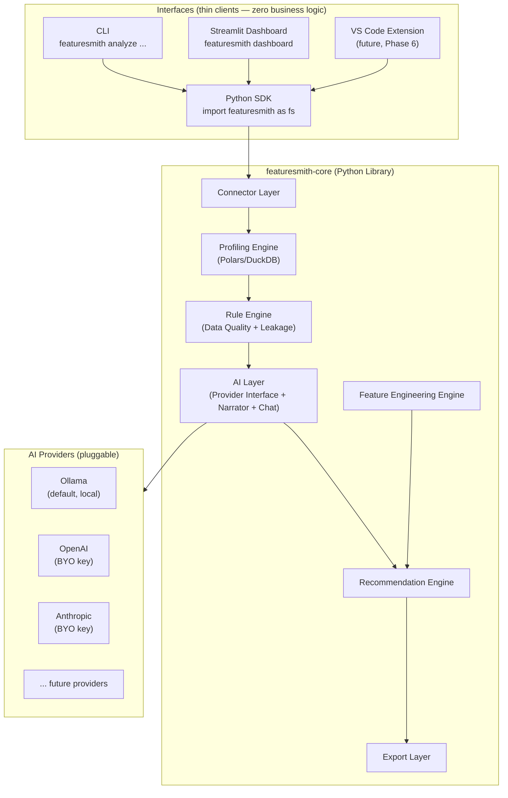
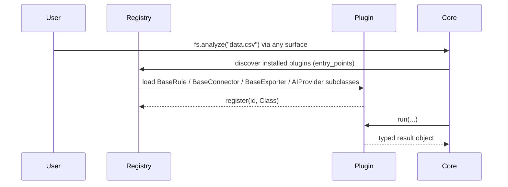
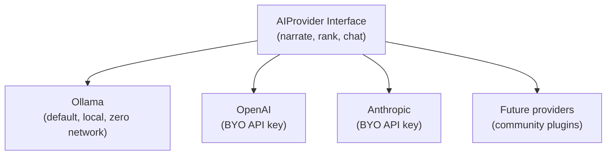
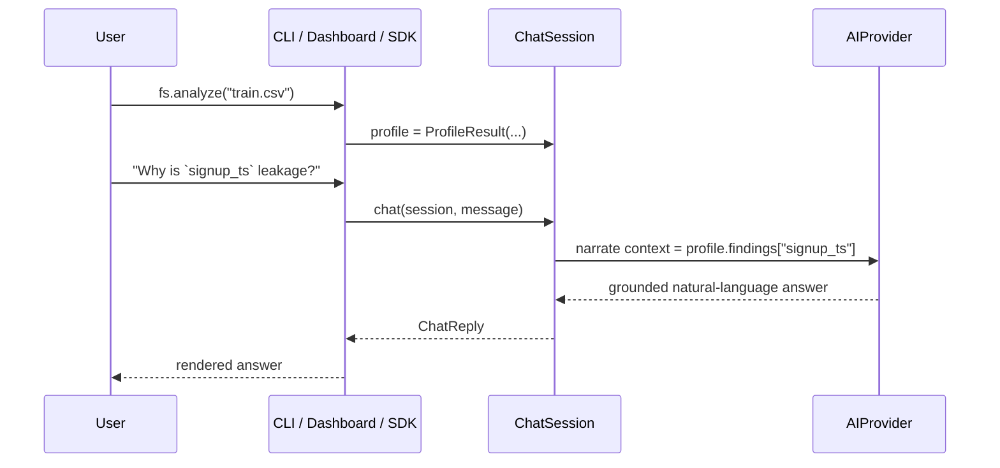
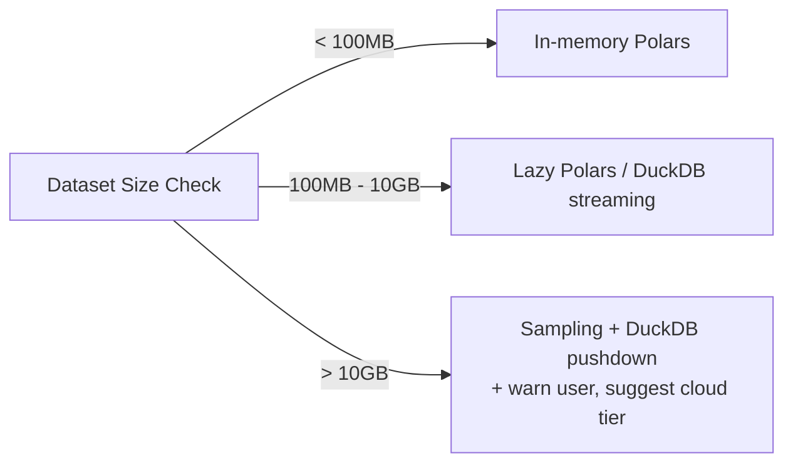

# Architecture — Featuresmith

## 1. Design Principles Behind the Architecture

1. **One core, many thin surfaces.** All business logic — profiling, rules, feature engineering, AI reasoning, chat, export — lives in a single importable Python library, `featuresmith-core`. The CLI, the Streamlit dashboard, and the future VS Code extension are thin clients that call this library and render its output. No surface is permitted to reimplement or fork logic that belongs in core.
2. **Compute and reasoning are separate layers.** Statistics are computed deterministically (Polars/DuckDB); the AI layer only narrates, ranks, and answers questions grounded in that precomputed output — it never computes a number. This makes the system testable and trustworthy.
3. **Everything is a plugin.** Connectors, rules, recommenders, exporters, *and AI providers* implement small stable interfaces so the core never needs to know about a specific data source, output format, or LLM vendor.
4. **Local-first, cloud-optional.** The system must produce full value with zero network calls (Ollama/local LLM, local files). Cloud LLMs and cloud connectors are opt-in, switched entirely through configuration.
5. **Size-tiered execution.** The same API behaves differently under the hood for a 10K-row CSV vs. a 500M-row Parquet dataset (in-memory vs. lazy/streaming DuckDB execution) — this is invisible to the plugin author and to every surface.

## 2. Overall System Architecture

The architecture is deliberately drawn "core-out": one reusable Python library at the center, with every user-facing surface as a peer, equally thin, client of it.



**Why CLI/Dashboard/Extension route through the SDK rather than calling core packages directly:** it guarantees there is exactly one public entrypoint (`featuresmith.analyze`, `featuresmith.chat`, etc.) that every surface exercises identically, which is what makes "surface parity" (`PRD.md` §12) a testable property rather than an aspiration — a single integration test suite run against the SDK entrypoints covers CLI and dashboard behavior by construction.

## 3. Module Breakdown

| Module | Responsibility | Owned Interfaces |
|---|---|---|
| `featuresmith.connectors` | Read data from any source into a normalized `Dataset` object | `BaseConnector` |
| `featuresmith.profiling` | Compute univariate/bivariate stats, distributions, correlations | `ProfileResult` schema |
| `featuresmith.rules` | Deterministic data-quality & leakage checks | `BaseRule` |
| `featuresmith.feature_engine` | Generate candidate feature transformations | `BaseTransformerSuggestion` |
| `featuresmith.ai` | Provider abstraction, narration, ranking, Interactive AI Chat | `AIProvider`, `PromptTemplate`, `ChatSession` |
| `featuresmith.recommendation` | Merge rule output + AI ranking into a unified, explainable list | — |
| `featuresmith.exporters` | Turn accepted recommendations into code/notebooks/reports | `BaseExporter` |
| `featuresmith` (top-level SDK) | Public API surface: `analyze()`, `chat()`, `export()`, `diff()` | — |
| `featuresmith_cli` | Thin CLI wrapper (Typer) over the SDK | — |
| `featuresmith_dashboard` | Thin Streamlit wrapper over the SDK | — |
| `featuresmith_vscode` | Thin VS Code extension (TypeScript) over the SDK/CLI (Phase 6) | — |
| `featuresmith.config` | Load/validate `.featuresmith.yml` project config | Pydantic models |

Note the naming convention: everything with business logic lives under the `featuresmith` package itself; every surface package is separately named and separately versioned (`featuresmith-cli`, `featuresmith-dashboard`, `featuresmith-vscode` as distinct, thin PyPI distributions depending on `featuresmith-core`) — this makes the "no logic outside core" rule structurally enforceable, not just documented (see `Rules.md` §10).

## 4. Folder Structure

```
featuresmith/
├── packages/
│   ├── featuresmith-core/               # ALL business logic lives here
│   │   └── src/featuresmith/
│   │       ├── core/
│   │       │   ├── dataset.py           # normalized Dataset abstraction
│   │       │   ├── profiler.py
│   │       │   └── schema.py            # Pydantic result schemas (shared contract)
│   │       ├── connectors/
│   │       │   ├── base.py
│   │       │   ├── csv_connector.py
│   │       │   ├── excel_connector.py
│   │       │   ├── parquet_connector.py
│   │       │   ├── sql_connector.py
│   │       │   ├── dataframe_connector.py   # in-memory Polars/pandas passthrough
│   │       │   └── registry.py              # plugin discovery
│   │       ├── rules/
│   │       │   ├── base.py
│   │       │   ├── leakage/
│   │       │   ├── quality/
│   │       │   └── registry.py
│   │       ├── feature_engine/
│   │       │   ├── base.py
│   │       │   ├── encoders.py
│   │       │   ├── binning.py
│   │       │   └── interactions.py
│   │       ├── ai/
│   │       │   ├── base.py                  # AIProvider interface
│   │       │   ├── providers/
│   │       │   │   ├── ollama.py
│   │       │   │   ├── openai.py
│   │       │   │   └── anthropic.py
│   │       │   ├── prompts/
│   │       │   ├── narrator.py
│   │       │   ├── chat.py                  # ChatSession — Interactive AI Chat
│   │       │   └── registry.py              # provider plugin discovery
│   │       ├── recommendation/
│   │       │   └── engine.py
│   │       ├── exporters/
│   │       │   ├── base.py
│   │       │   ├── sklearn_pipeline.py
│   │       │   ├── notebook.py
│   │       │   └── html_report.py
│   │       ├── config/
│   │       │   └── models.py
│   │       └── api.py                       # analyze(), chat(), export(), diff()
│   ├── featuresmith-cli/
│   │   └── src/featuresmith_cli/main.py     # Typer app, imports featuresmith.api only
│   ├── featuresmith-dashboard/
│   │   └── src/featuresmith_dashboard/app.py # Streamlit, imports featuresmith.api only
│   └── featuresmith-vscode/                  # Phase 6
│       └── src/extension.ts
├── plugins/                                  # community plugins (rules/connectors/exporters/providers)
├── tests/
├── docs/
├── examples/
├── pyproject.toml                            # workspace root
└── .featuresmith.yml.example
```

**Why a monorepo of separately-versioned packages rather than one flat package:** it makes the "thin surface" principle physically true — `featuresmith-cli` and `featuresmith-dashboard` literally cannot import anything except `featuresmith`'s public `api.py`, because they're separate installable distributions. A contributor working on "a new rule" only ever needs to open `featuresmith-core/rules/`; a contributor building the VS Code extension only ever needs the stable `api.py` contract, not core internals.

## 5. Internal APIs & Service Boundaries

Featuresmith ships as a **single reusable Python library plus thin, separately-packaged surfaces** — not microservices. Premature service decomposition would slow down a young open-source project and complicate local-first usage. Boundaries are enforced two ways: (1) Python interfaces (ABCs/Protocols) between internal stages, and (2) a hard package boundary between `featuresmith-core` and every surface package.

Core internal contract — every stage passes a typed Pydantic object to the next:

```
RawSource / DataFrame → Dataset → ProfileResult → List[RuleFinding] → Recommendations → ExportArtifact
                                          │
                                          └──► ChatSession (reads ProfileResult + RuleFinding[], never raw data)
```

The **public SDK surface** that every interface (including itself, from Python code) calls is intentionally small:

```python
import featuresmith as fs

profile = fs.analyze("train.csv")            # or fs.analyze(df) on an in-memory dataframe
answer  = fs.chat(profile, "Why is this feature leakage?")
pipeline = fs.export(profile, target="sklearn")
delta   = fs.diff(profile_a, profile_b)
```

This is the exact function set the CLI (`featuresmith analyze`, `featuresmith chat`, `featuresmith export`, `featuresmith diff`) and the dashboard buttons call — nothing more, nothing surface-specific.

## 6. Plugin System

Featuresmith has **four** plugin categories, all discovered the same way: connectors, rules, exporters, and — new in this revision — **AI providers**.



Plugins are discovered via Python `entry_points` (setuptools/PEP 621), the same mechanism `pytest` and `flake8` use — a well-understood pattern for contributors. A plugin is a pip-installable package that registers itself under `featuresmith.rules`, `featuresmith.connectors`, `featuresmith.exporters`, or `featuresmith.ai_providers` entry-point groups. **Why entry_points over a custom plugin loader:** it's a standard, IDE-discoverable, zero-custom-code mechanism, and it lets plugins live in fully separate repos/PyPI packages without forking core.

## 7. AI Layer

### 7.1 Provider Interface



```python
class AIProvider(Protocol):
    def narrate(self, profile: ProfileResult, findings: list[RuleFinding]) -> Narrative: ...
    def rank(self, candidates: list[FeatureSuggestion]) -> list[RankedRecommendation]: ...
    def chat(self, session: ChatSession, message: str) -> ChatReply: ...
```

- **Ollama is the default provider** — zero network calls, works offline, no API key required. This is what a fresh `pip install featuresmith` gets out of the box.
- **OpenAI and Anthropic are opt-in**, bring-your-own-API-key providers, selected entirely through `.featuresmith.yml`:
  ```yaml
  ai:
    provider: anthropic
    model: claude-sonnet-4-6
    api_key_env: ANTHROPIC_API_KEY
  ```
  Switching providers is **always** a config change — never a code change, and never a different call site in the SDK, CLI, or dashboard. This is enforced by construction: every surface calls `fs.analyze()`/`fs.chat()`, which internally resolves the configured provider; no surface ever imports a provider class directly.
- **Future providers are plugin-friendly**: implementing the three-method `AIProvider` protocol and registering it under the `featuresmith.ai_providers` entry-point group is sufficient — no core changes required, following the exact same registry pattern as rules/connectors/exporters (§6).

### 7.2 Grounding Contract (unchanged principle, now covering chat too)

The AI layer — for both narration and the Interactive AI Chat — receives only a structured JSON `ProfileResult` + `RuleFinding[]` object, **never the raw dataframe**. Its jobs are strictly: (a) narrate these facts in plain language, (b) rank/prioritize recommendations with a rationale, and (c) answer user questions about them. It is architecturally prevented from inventing statistics because it is never given the means to compute one — there is no raw-data tool call available to it by default.

### 7.3 Interactive AI Chat



- A `ChatSession` wraps one `ProfileResult` and its conversation history; it is created once per analysis and reused for every follow-up question, so the dataset is **never re-read** mid-conversation.
- Supported question patterns include (non-exhaustive): "Why is this feature leakage?", "Explain this chart", "What encoding should I use?", "Explain this to a beginner", "Generate sklearn preprocessing for this column", "Compare two columns".
- "Generate sklearn preprocessing" chat answers call the same `exporters.sklearn_pipeline` code path used by `fs.export()` (§12) — the chat never has a second, parallel code-generation implementation.
- Chat is available identically from the SDK (`fs.chat(profile, "...")`), the CLI (`featuresmith chat`, an interactive REPL against the last analysis), and the dashboard (a chat panel next to the findings) — one `ChatSession` implementation, three renderings.

### 7.4 Fallback Mode

If no AI provider is configured/reachable, the system still produces the full rule-based report and a template-based (non-AI) narrative; the Interactive AI Chat is disabled with a clear message pointing at the config docs — the AI layer is an enhancement, never a hard dependency for the deterministic engine.

## 8. Recommendation Engine

Merges two inputs: deterministic `RuleFinding[]` (e.g., "column X is 92% correlated with target and only available post-event → likely leakage") and AI-ranked feature suggestions from `feature_engine`. Output is a single ranked list, each item with: `title`, `rationale`, `confidence (0-1)`, `severity`, `affected_columns`, `suggested_action`, `accepted: bool` (user-settable). Only `accepted=True` items flow into the export layer — nothing is ever silently applied. This same list is also the grounding context available to `ChatSession` (§7.3) for questions like "what encoding should I use?".

## 9. Rule Engine

Deterministic, side-effect-free functions: `RuleFinding[] = rule.run(profile_result, config)`. Categories: **leakage** (train/test overlap, target-correlated post-event features, ID-like columns), **quality** (missingness patterns, type mismatches, constant/near-constant columns, duplicate rows), **statistical** (skew, outliers via IQR/Z-score/Isolation Forest, high cardinality). Rules are independently unit-testable against fixture datasets — this is the single most contributor-friendly extension point and should be the primary "good first issue" surface.

## 10. Feature Engineering Engine

Given `ProfileResult` + accepted rule findings, proposes concrete transformations: encoding strategy per categorical column (one-hot vs. target vs. ordinal, based on cardinality), binning suggestions for skewed numerics, interaction-term candidates (bounded by a combinatorial cap + correlation-based pre-filter, never brute-force on every pair), and scaling recommendations tied to the eventual model family the user declares (tree-based vs. linear).

## 11. Visualization Layer

Chart specs are generated as declarative JSON (Vega-Lite-compatible) rather than framework-specific code, so the **same spec renders in CLI (as a saved PNG/SVG via a lightweight renderer), the Streamlit dashboard, and the HTML report** — one visualization definition, three render targets, consistent with the "one core, many thin surfaces" principle. The AI Chat's "explain this chart" answers are grounded in the same declarative spec plus its underlying computed values, not a re-derived summary.

## 12. Export Layer

`BaseExporter.export(recommendations, dataset_schema) -> ExportArtifact`. Ships three exporters in v1: `sklearn_pipeline.py` (produces a `ColumnTransformer`/`Pipeline` + a `pytest` test file asserting shape/dtype invariants), `notebook.py` (produces a runnable `.ipynb` walking through findings), `html_report.py` (static shareable report). **Why sklearn as the primary v1 export target:** it's the lowest-common-denominator production format most teams can consume regardless of their downstream framework, and it composes into MLflow/Airflow/etc. without extra glue. This is the same code path both `fs.export()` and the chat's "generate sklearn preprocessing" answers invoke (§7.3).

## 13. CLI

`featuresmith-cli` is a **thin** Typer application: every command body is a one-to-two-line call into `featuresmith.api`. Built on **Typer** (not argparse/click directly) — Typer gives type-hint-driven CLI definitions, which keeps CLI command signatures self-documenting and reduces boilerplate for contributors adding new subcommands. Primary v1 commands: `featuresmith analyze <source>`, `featuresmith chat`, `featuresmith diff <a> <b>`, `featuresmith export <report> --target sklearn`, `featuresmith dashboard` (launches the Streamlit app), `featuresmith init` (scaffolds `.featuresmith.yml`).

## 14. Dashboard

`featuresmith-dashboard` is a **thin** Streamlit application — every panel calls `featuresmith.api` and renders the returned typed objects; no analysis logic is reimplemented in the dashboard layer. See `Architecture.md` §Design for the Streamlit-vs-Next.js trade-off (unchanged from prior revision — Streamlit remains the v1 choice for the same reasons: fastest path to an interactive, Python-native UI that plugin authors can extend without learning a JS framework). Launched via `featuresmith dashboard`, and includes the Interactive AI Chat as a persistent side panel next to the findings list.

## 15. Configuration System

A single `.featuresmith.yml` per project (Pydantic-validated), analogous to `.pre-commit-config.yaml`. Controls: which connectors/rules/exporters are enabled, **AI provider + model + API key source**, thresholds (missingness %, correlation cutoffs), and output targets. Config is layered: package defaults → project `.featuresmith.yml` → CLI flag overrides — a standard, predictable precedence order. This is the *only* mechanism for switching AI providers, per §7.1.

## 16. Extension System

Four extension points, each following the same `base.py` + entry-point pattern: **Connectors** (new data sources), **Rules** (new quality/leakage checks), **Exporters** (new output targets, e.g., a future PySpark exporter), and **AI Providers** (new LLM backends). Documented via a `docs/extending/` guide per extension point with a minimal working example plugin in `examples/`.

## 17. Scalability



The same `ProfileResult` schema is produced regardless of tier — size-tiering is an internal execution detail, never a public API difference. This keeps the plugin/rule interface, and every surface built on `fs.analyze()`, stable no matter how large the underlying data gets.

## 18. Future Cloud Architecture

A later, fully optional SaaS/hosted tier would decompose into: an API service (FastAPI) wrapping the exact same `featuresmith-core` package (as just another thin surface, consistent with §2), a job queue (e.g., Celery/Arq) for long-running large-dataset analyses, object storage for reports/artifacts and chat transcripts, and a hosted dashboard — but this is explicitly **out of scope until the OSS core and contributor base are established** (see `Phases.md`), to avoid distracting early effort from the thing that actually drives adoption: the open-source library itself.

## 19. Architectural Improvements Introduced in This Revision

- **Hard package boundary** between `featuresmith-core` and every surface (§3-4), turning "no duplicated logic" from a guideline into something CI can actually enforce (separate distributions can't accidentally import each other's internals).
- **AI providers promoted to a first-class plugin category** (§6, §16), symmetric with connectors/rules/exporters, rather than a special-cased internal abstraction — this is what makes "add a new provider" a community-contributable task instead of a core-team-only change.
- **`ChatSession` as a distinct, explicitly-scoped object** (§7.3) rather than folding chat into the narrator — keeps the "never re-reads raw data" guarantee simple to reason about and test in isolation.
- **A single public `api.py`** (§5) as the one contract every surface depends on, which is also the natural seam for the future hosted API tier (§18) to reuse without a rewrite.
