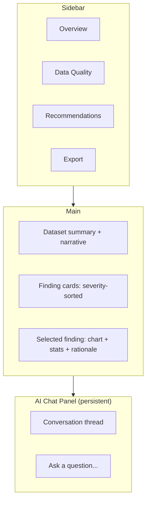

# Design.md — Product & Design System (Featuresmith)

## 1. Design Philosophy

Featuresmith's interfaces (SDK output, CLI, dashboard, reports, chat) should read like **engineering documentation, not a marketing dashboard**. The product's credibility depends on looking rigorous and legible, not flashy. Every screen — and every chat answer — answers three questions at a glance: *what did we find, how confident are we, and what should I do about it.* Because the same core produces every surface's content (`Architecture.md` §2), the design system's real job is ensuring that content looks and reads consistently no matter which of the four surfaces renders it.

## 2. UI Principles

- **Evidence before opinion.** Every recommendation card, and every chat answer, shows or references the underlying stat before the AI narrative — never narrative-only.
- **Progressive disclosure.** Summary first, drill-down on demand (collapsible sections, not walls of charts); chat is the ultimate drill-down mechanism — "ask instead of hunting."
- **Reversible by default.** Nothing auto-applies; accept/reject is always one click, always visible, in both the dashboard and the CLI's interactive mode.
- **Consistent across surfaces.** SDK output objects, CLI tables, dashboard cards, and exported HTML reports use the same information hierarchy (severity → finding → evidence → action) — just rendered differently per surface's native idiom.

## 3. Dashboard Layout



Left sidebar for navigation between report sections (mirrors the CLI/report structure exactly — no surface-specific information architecture). Main pane: dataset-level narrative at top, then a severity-sorted list of findings/recommendations as cards, with a detail panel for the selected item. A **persistent chat panel** sits alongside the main pane at all times post-analysis — not a modal, not a separate page — since asking a follow-up question about the currently-viewed finding is the single most common next action.

## 4. CLI UX

- Human-readable table/tree output by default (via `rich`); `--format json` for machine consumption/piping.
- `featuresmith chat` opens an interactive REPL scoped to the most recent `featuresmith analyze` run in the current directory (or `--profile <path>` for a saved one) — same `ChatSession` object the dashboard panel and SDK use.
- Progress indicators for long-running profiling steps (spinner + row-count-processed, not a silent hang).
- Exit codes are meaningful: `0` clean, `1` findings above configured severity threshold (useful for CI gating), `2` execution error.
- Every warning/error message suggests a next action, per `Rules.md` §16 — including AI-provider errors ("switch `ai.provider` to `ollama` in .featuresmith.yml").

## 5. Developer Experience

- `featuresmith init` scaffolds a working `.featuresmith.yml` with inline comments explaining each option, including the `ai:` block — config-as-documentation.
- SDK mirrors CLI naming 1:1 (`fs.analyze(...)` matches `featuresmith analyze`, `fs.chat(...)` matches `featuresmith chat`) so switching between notebook, CLI, and dashboard usage requires no relearning.
- Error messages include the exact config key or CLI flag to fix an issue, not just "invalid configuration."

## 6. Accessibility

- Dashboard meets WCAG 2.1 AA: minimum 4.5:1 text contrast, full keyboard navigation (including the chat input and thread), ARIA labels on all interactive chart elements.
- Charts never rely on color alone — severity also encoded via icon/shape (e.g., a filled triangle for high severity vs. a circle for informational).
- CLI output, including the chat REPL, must remain legible with `NO_COLOR` set and in screen-reader-piped terminals (no meaning encoded in color-only ANSI output).

## 7. Typography

- **UI/body:** Inter (or system-ui fallback stack) — highly legible at small sizes, standard in modern engineering tools. Chat message text uses the same body style as report prose — no separate "chat bubble" typographic treatment that would make it feel like a different product.
- **Code/data/monospace:** JetBrains Mono — used for column names, code snippets (including chat-generated sklearn code), and any raw value display, to visually distinguish "data" from "prose" at a glance.
- Scale: 12/14/16/20/24/32px steps; body copy defaults to 14px in dense report views, 16px in the marketing/docs site.

## 8. Spacing

8px base unit grid (4px for micro-adjustments only). Card padding 16-24px. Section vertical rhythm 32-48px between major report sections. Chat thread messages use 12px vertical spacing between turns — tighter than report sections, since a conversation reads differently from a report.

## 9. Color Palette

| Token | Light | Dark | Usage |
|---|---|---|---|
| `bg-primary` | `#FFFFFF` | `#0F1115` | page background |
| `bg-surface` | `#F6F7F9` | `#171A21` | cards/panels |
| `text-primary` | `#1A1D23` | `#E7E9EE` | body text |
| `text-muted` | `#5B6270` | `#9AA1AE` | secondary text |
| `accent` | `#2F6FED` | `#5B8DEF` | primary actions, links, chat "ask" button |
| `severity-critical` | `#D64545` | `#E5686B` | leakage/high-severity findings |
| `severity-warning` | `#D98A2B` | `#E3A857` | moderate findings |
| `severity-info` | `#2F8F5B` | `#54B384` | passed checks / low severity |
| `chat-assistant-bg` | `#EEF3FE` | `#1B2333` | assistant message background (tinted accent, low-emphasis) |
| `border` | `#E4E6EB` | `#262A33` | dividers, card borders |

Rationale: a restrained, desaturated neutral base with a single accent blue (associated with "trustworthy/technical" in developer tools broadly) and a conventional red/amber/green severity system that maps intuitively without needing a legend. The chat assistant background is a low-emphasis tint of the accent color rather than a distinct hue, so the chat panel reads as part of the same product, not a bolted-on chatbot widget.

## 10. Component Library Suggestions

- **Dashboard:** build on **shadcn/ui**-equivalent primitives if/when the Next.js migration happens (Phase 8+, unchanged from prior revision — still deliberately deferred); for the v1 Streamlit dashboard, use a small custom component set (finding-card, severity-badge, collapsible-section, **chat-message, chat-input**) kept in `featuresmith_dashboard/components.py` rather than raw Streamlit widgets scattered inline.
- **Charts:** Vega-Lite specs (see `Architecture.md` §11) rendered via `altair` in Python surfaces.
- **Icons:** Lucide icon set — permissively licensed, consistent stroke-based style, wide coverage. Add a `message-circle` icon for the chat entry point across CLI help text and dashboard nav.

## 11. Interaction Patterns

- Accept/reject on recommendation cards is a single toggle with immediate visual state change (no confirmation modal — reversibility makes confirmation friction unnecessary). This is the same pattern a future Plan-review panel reuses per step, before Apply — see `features/Dataset-Contracts-And-Planning.md` §14.
- Drill-down (card → detail panel) is expand-in-place on desktop, navigates to a detail view on narrow/mobile layouts.
- Filtering (by severity, by column, by rule category) persists in the URL/CLI-flag state so a filtered view is shareable/scriptable.
- Every finding card and chart has a small "ask about this" affordance that pre-fills the chat input with a scoped question (e.g., "Why is `signup_ts` flagged?") — the primary bridge between passive report-reading and the Interactive AI Chat.

## 12. Loading States

- Long operations (profiling large datasets, AI narrative generation) show a determinate progress bar where row-count is known, indeterminate spinner only for the AI provider call itself (with a "generating narrative..." label, not a bare spinner).
- Chat replies show a lightweight "thinking..." indicator scoped to the chat panel only — it must never block or dim the rest of the dashboard, since chat is explicitly a side-conversation about already-available results, not a blocking operation.
- Dashboard shows partial results progressively — stats appear as soon as the profiler finishes, AI narrative streams in after, rather than blocking the whole page on the slowest step.

## 13. Empty States

- No dataset connected: illustration-free, text-first CTA ("Connect a data source to get started") plus the three fastest paths (upload CSV, paste SQL connection string, or the exact SDK snippet `import featuresmith as fs; fs.analyze("data.csv")`) — never a bare blank page.
- Zero findings (clean dataset): an explicit positive state ("No quality issues detected across 42 columns") — absence of problems should be visibly reported, not indistinguishable from "nothing ran."
- Empty chat thread: a short set of suggested starter questions ("Why is X leakage?", "What encoding should I use for Y?") rather than a blank input box, so first-time users see the feature's shape immediately.

## 14. Error States

- Connector failures show the specific failure (auth, malformed file, unreachable host) with a suggested fix, never a generic "something went wrong."
- AI provider failures (narration, ranking, or chat) degrade gracefully: the deterministic report remains fully usable, and the chat panel shows a clear "AI provider unreachable — check `.featuresmith.yml`" state rather than disappearing or erroring the whole page.
- Partial-failure state (one rule crashed, rest succeeded) is shown as a dismissible banner, with the full report still usable — consistent with the "isolated failure" rule in `Rules.md` §16.

## 15. Charts

- Distribution charts (histograms/KDE) for numeric columns; bar charts for categorical frequency; a correlation heatmap capped at a configurable column count (avoids unreadable NxN grids on wide datasets — falls back to a ranked top-correlations table beyond the cap).
- Every chart has a plain-language one-line caption generated alongside it (from the same grounded data, not a separate hallucination-prone call) — charts are never presented without an interpretive anchor, and the same caption is what "explain this chart" in chat expands upon.

## 16. Tables

- Sortable, filterable column-summary table as the default "Overview" landing view — dtype, missing %, unique count, and a mini sparkline per row, so a user can triage 50+ columns without opening each one.
- Sticky header on scroll; monospace for numeric columns for scan-ability.

## 17. Icons

Lucide, 20px default size in dashboard, 16px in dense table rows. Severity icons: triangle-alert (critical), circle-alert (warning), circle-check (passed/info) — shape-coded per the accessibility rule in §6. Chat entry points use `message-circle`; a generated-code chat answer uses `terminal` or `code` inline to visually flag it as a code block before the user reads it.

## 18. Responsive Design

Dashboard breakpoints: `<640px` (mobile, single-column, chat panel becomes a full-screen overlay rather than a side panel), `640-1024px` (tablet, collapsible sidebar, chat panel collapsible), `>1024px` (desktop, full three-pane layout: sidebar, main, chat). v1 targets desktop/tablet primarily — mobile is a "doesn't break" bar, not a primary design target, since the core workflow (reviewing a large dataset's findings) is inherently desktop-first.

## 19. Future Mobile Support

Explicitly deferred: a true mobile experience (e.g., "review and approve recommendations, or ask chat a question, from your phone") is a Phase 8+ idea, contingent on the hosted dashboard tier existing at all — not a v1-v2 priority.

## 20. Dark Mode

Dark mode is a **first-class default**, not an afterthought toggle — most of the target audience (engineers) works in dark-themed editors/terminals most of the day. Token-based theming (§9 table) ensures dark mode is a value-swap, not a separate design pass. Respect `prefers-color-scheme` on first load; explicit toggle persisted after that.

## 21. Animation Guidelines

Minimal, functional only: 150-200ms ease-out for expand/collapse and state toggles, no decorative motion. Chat messages fade/slide in over 120ms — fast enough to feel responsive, subtle enough not to distract from reading. Respect `prefers-reduced-motion` — disable non-essential transitions entirely when set. Loading spinners and the chat "thinking" indicator are the only continuous animations permitted.

## 22. Design Tokens

```json
{
  "color": { "bg.primary": {"light": "#FFFFFF", "dark": "#0F1115"},
             "accent": {"light": "#2F6FED", "dark": "#5B8DEF"},
             "severity.critical": {"light": "#D64545", "dark": "#E5686B"},
             "chat.assistant_bg": {"light": "#EEF3FE", "dark": "#1B2333"} },
  "spacing": { "unit": 8, "scale": [4, 8, 16, 24, 32, 48] },
  "radius": { "sm": 4, "md": 8, "lg": 12 },
  "font": { "body": "Inter", "mono": "JetBrains Mono",
            "scale": [12, 14, 16, 20, 24, 32] }
}
```

Tokens are consumed identically by the Streamlit dashboard (via a small theming shim) and, later, a Next.js frontend (via Tailwind config) — defined once in `design/tokens.json`, never duplicated per surface.

## 23. Design System

A living `design/` directory holds tokens, the component inventory (§10), and a `docs/design-principles.md` restating §§1-2 for contributors building new UI — the goal is that a community contributor adding a new dashboard panel, or a chat message renderer in the future VS Code extension, can match the existing look without design review being a bottleneck.
