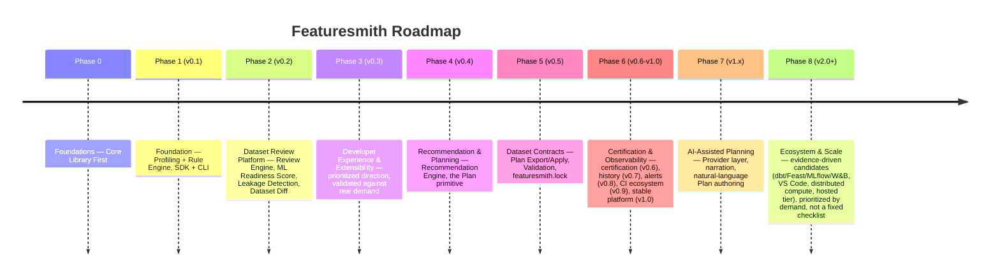

# Phases.md — Roadmap (Featuresmith)

Each phase compounds toward Featuresmith's North Star (`VISION.md` §4). "Every dataset deserves a code review" is still how Featuresmith introduces itself — that's Phases 0-2, already shipped. Phases 3 and 4 are also shipped (DiffReviewer, Governance, Recommendation Engine, Plan primitive). Everything from Phase 5 onward is the natural continuation of the category `VISION.md` §2 describes: once a dataset has been reviewed, findings surfaced, and a Plan created, the next question is "did applying the Plan actually work" — and the roadmap below is the answer, staged as one continuous lifecycle rather than a list of unrelated features. See `Flagship-Capabilities.md` for the five defining, long-term experiences this roadmap builds toward, and `features/Dataset-Contracts-And-Planning.md` for the full design of Phases 5-6's central capability. See the "Roadmap Evaluation" section at the end of this document for the version-by-version v0.3.0 → v2.0.0 table and the explicit case for why this phase shape (rather than some other sequencing) is the right one, and `Architecture.md` §21-25 for the architecture-strategy review this roadmap was checked against.

Phases 0-4 are shipped (v0.4.0) and **frozen** — the v0.4.0 foundation is not unnecessarily refactored to serve later phases (`Architecture.md` §21). Everything from Phase 5 onward is the current plan, not a commitment — real usage and contributor capacity will reshape later phases before they're built. **Phase 3 specifically was a prioritized direction, not a fixed checklist** — see the note at the start of that phase's entry for what that means concretely.

**Sequencing principles carried through every phase:**
- The SDK (core library) is always the deliverable; the CLI, dashboard, and VS Code extension are never allowed to ship a capability the SDK doesn't already expose (`Architecture.md` §2). **The dashboard is a surface over the core, not the product itself** — no CI/CD gate or programmatic workflow anywhere in this roadmap depends on the dashboard existing or running, and every dashboard-facing capability (Phase 3's browse/drill, Phase 6's trend view) is a read over objects (`ReviewResult`, `Plan`, `DatasetContract`) the SDK/CLI already produce, never a second source of truth for them (`Design-Principles.md`, `Architecture.md` §25.2).
- **Prove the deterministic engine before adding a new capability layer on top of it.** Review → Score → Leakage → Diff (Phases 1-2) had to work with zero AI involvement before Recommendation/Planning (Phase 4) began, and Plan/Export/Contract (Phases 4-5) has to work with zero AI involvement before AI-Assisted Planning (Phase 7) begins. AI is never a prerequisite for a core capability — only an enhancement layered on top of one that already works (`Design-Principles.md` "AI assists, never replaces"), and every AI-assisted path still resolves into the same Plan object a deterministic path would produce (`features/Dataset-Contracts-And-Planning.md` §3.1).
- **The export/apply step never grows into an execution engine, and never defaults to silent execution.** Every phase that touches transformations (4-5, 8) generates real code for an external ecosystem; none of them introduce a Featuresmith-owned runtime, and none of them make a bare export/apply call mutate a user's dataset without an explicit opt-in (`Architecture.md` §20, `features/Dataset-Contracts-And-Planning.md` §7.2).
- **Every future subsystem is checked against the roadmap governance questions in `Architecture.md` §23** before it's added to this document as more than a candidate — real demand, composability, public-API cost, and reversibility all get asked before a checklist item becomes a commitment.

---

## Phase 0 — Foundations: Core Library First (pre-release) — Shipped

**Objectives:** establish the `featuresmith-core` package, its public contracts, and the workspace/CI setup before any surface work begins.
**Delivered:** monorepo workspace (`packages/featuresmith-core`, `featuresmith-cli`, `featuresmith-dashboard` stub); `ruff`/`mypy --strict`/`pytest`/`import-linter` CI; core `Dataset`/`ProfileResult` Pydantic schemas; `Base*` interface stubs; `CONTRIBUTING.md`, `Rules.md`, `Architecture.md` published.
**Dependencies:** none.

---

## Phase 1 — Foundation: SDK + CLI MVP, Profiling + Rule Engine (v0.1) — Shipped

**Objectives:** prove the core value loop end-to-end via the SDK first, with the CLI as its first thin client.
**Delivered:** `fs.load()`/`fs.profile()`/`fs.analyze()`; `CsvConnector`, `ExcelConnector`, `ParquetConnector`, `DataFrameConnector` (pandas + Polars); Polars-based profiler; 8 seed rules (quality + statistical + naive leakage-by-correlation); `featuresmith analyze` CLI with Rich table and JSON output; exit-code CI gating.
**Dependencies:** Phase 0.

---

## Phase 2 — Dataset Review Platform: Review Engine, ML Readiness Score, Leakage Detection, Dataset Diff (v0.2) — Shipped, current

**Objectives:** compose the individually-useful primitives from Phase 1 into the product Featuresmith wants to be remembered by — a single command that performs a comprehensive engineering review of a dataset, backed by an explainable score, real leakage-pattern detection, and the ability to compare two snapshots the way `git diff` compares two commits. This phase is what "every dataset deserves a code review" means concretely, and it is the deterministic foundation every later phase builds on without modification.
**Delivered** (full detail per feature in `features/Review-Engine-Architecture.md`, `features/Dataset-Review-PRD.md`, `features/ML-Readiness-Score.md`, `features/Dataset-Diff-And-Leakage-Detection.md`; exact implementation status in `implementation/IMPLEMENTATION_STATUS.md`):
- **Review Engine**: `ReviewEngine.run()` / `fs.review()` / `featuresmith review`, 8 of 12 planned reviewers (schema, quality, statistics, leakage), Review Categories, fault-isolated execution.
- **ML Readiness Score**: 0-100 composite score, 8 dimensions (2 split into sub-dimensions), always rendered with its underlying findings, versioned `scoring_version`.
- **Intelligent Leakage Detection**: 6 named pattern detectors (target correlation, identifier shape, timestamp anomalies, duplicate targets) merged per column, replacing the Phase 1 naive correlation-only check.
- **Dataset Diff**: standalone `fs.diff()` / `featuresmith diff` engine comparing schema, structure, quality, distribution, and leakage between two snapshots.
**Deferred within this phase** (tracked in `implementation/IMPLEMENTATION_STATUS.md`): `DuplicateColumnReviewer`, `OutlierReviewer`, `DistributionReviewer`, `FeatureQualityReviewer`; centralized Recommendation Engine (arrives in Phase 4); Dashboard/HTML/JSON renderers beyond the console. Diff-aware review (`--previous`) was deferred within Phase 2 but shipped in v0.3.0 via `DiffReviewer` (see Phase 3 below).
**Dependencies:** Phase 1.
**Acceptance criteria (met):** the four capabilities above are exposed identically from SDK and CLI on the acceptance dataset suite (`Phases.md` Phase 1 datasets, extended with known-leaky and drifted-snapshot fixtures).

---

## Phase 3 — Developer Experience & Extensibility (v0.3)

**This phase is a prioritized direction, not a fixed feature checklist.** Nothing below is committed simply by virtue of appearing on this list — actual v0.3 scope and sequencing will be validated against real v0.2.0 user feedback, GitHub issues/discussions, contributor demand, real integration requirements from actual usage, and demonstrated technical need as they come in, per the roadmap governance questions in `Architecture.md` §23. What follows is split into three tiers so it's clear which parts of that validation have already happened and which haven't:

**(A) Committed architectural direction** — the shape of this phase, not contingent on further evidence: close the one known v0.2.0/design gap (`DiffReviewer`, `Architecture.md` §21.4) before Phase 4 adds something new to extend the Review Engine with, and publish the project governance baseline (`GOVERNANCE.md`, per `PRD.md` §15). These two are the committed v0.3.0 scope; everything below in (B)/(C) is candidate until its own demand-validation happens.

**(B) Candidate features — NOT part of the committed v0.3.0 release scope.** Likely v0.3 work, informed by what's already scoped in the product/architecture docs, but each still validated against real demand before being built rather than built because it's listed here. None of the following is committed to ship in v0.3.0 simply by appearing on this list:
- `featuresmith dashboard` (Streamlit) — browse `ReviewResult` sections, drill into findings.
- SQL connector completion (SQLAlchemy) — Excel/Parquet are already shipped.
- `featuresmith-action` GitHub Action wrapping `featuresmith review --fail-on` (would live in its own repository when built, not in the Featuresmith monorepo).
- The remaining reviewers deferred from Phase 2 (`DuplicateColumnReviewer`, `OutlierReviewer`, `DistributionReviewer` — `FeatureQualityReviewer` waits for Phase 4's Feature Engineering signal specifically, not general v0.3 timing).

**(C) Demand-gated — only implemented when real evidence exists:** externally-discoverable `entry_points` plugin loading for any category (connectors, rules, reviewers, exporters, AI providers). `Architecture.md` §25.1 covers this in full: v0.2.0's static, in-repo registries stay static until a specific category has a real external contributor blocked by that staying static — not on a v0.3.0 deadline. If that evidence appears during this phase, the relevant category's plugin template and authoring guide are (B)-tier work at that point; until then, extensibility within this phase means "a contributor can add a rule/reviewer/connector by touching one file inside `featuresmith-core`," which is already true today and needs no new mechanism.

**Objectives:** meet developers where they already work, and close the Review Engine's one known extensibility gap, while treating dashboard/CI/connector/reviewer scope as informed-but-revisable rather than fixed. The committed v0.3.0 scope is `DiffReviewer` reconciliation plus the `GOVERNANCE.md` baseline; the dashboard, SQL connector, `featuresmith-action`, and deferred reviewers remain (B)-tier candidates validated against real demand before any is finalized.
**Dependencies:** Phase 2.
**Risks:** dashboard scope creep — timebox to browse/drill/export only, defer team features to Phase 6; interface churn breaking early plugins — mitigate with `Rules.md` §9's versioning discipline; `DiffReviewer` scope creep into re-deriving `distribution_shifts`/`quality_regressions` fields speculatively designed but never built (`Architecture.md` §22.C2) — ship against what `fs.diff()` already returns first, extend only if real usage asks for more; treating any (B)-tier item as committed before its own demand-validation happens — the tiering above exists specifically to prevent that.
**Success signals (not hard release requirements):** community-published plugins, external connector/rule/reviewer contributions, and GitHub issue activity are all read as *evidence for future prioritization*, not gates this phase must clear to ship. A quiet plugin ecosystem in this window is information (extensibility isn't the bottleneck yet), not a failure.
**Acceptance criteria (for the committed v0.3.0 work only):** `featuresmith review new.csv --previous old.csv` produces a `diff`-category `ReviewSection` instead of raising `NotImplementedError`; `GOVERNANCE.md` is published per `PRD.md` §15. Dashboard, SQL connector, `featuresmith-action`, and the deferred reviewers are **not** v0.3.0 acceptance items — they ship only if individually validated and committed, and are deliberately excluded from this phase's committed scope.

---

## Phase 4 — Recommendation & Planning: the Recommendation Engine and the Plan primitive (v0.4) — ✅ **Shipped**

**Objectives:** close the gap between "here's a finding" and "here's what to do about it" — deterministically, no AI required — and introduce the **Plan**, the inspectable, serializable object every later Apply/Contract stage builds on. This is the first phase of the Dataset Contract lifecycle described in `features/Dataset-Contracts-And-Planning.md`, and it changes nothing about how Review/Score/Leakage/Diff already work — it consumes their output.
**Features (Shipped):** centralized Recommendation Engine (`Architecture.md` §8) merging findings from every reviewer into one ranked, explainable list, replacing the minimal severity-ranked fallback the Review Engine previously used (`features/Review-Engine-Architecture.md` §15) — **the fallback formatter is deleted in this same PR, not left as a permanent branch** (`Architecture.md` §22.A3); `FeatureQualityReviewer` (low-signal/redundant/near-constant detection), completing Phase 2's coverage table; `featuresmith.plan` module — `fs.plan(result, accept=[...])` and `featuresmith plan` producing a deterministic `Plan` from accepted recommendations (`features/Dataset-Contracts-And-Planning.md` §7.1, §10); Plan rendering (steps, rationale, confidence) reusing the existing severity-first, evidence-before-recommendation UI conventions (`Design.md` §2); **ML Readiness Score dimension reconciliation** — resolved the Data Quality/Consistency dimension split and the `HighCardinalityDimension` double-count (`Architecture.md` §22.A2) before default weights are empirically tuned, since `FeatureQualityDimension`/`DistributionHealthDimension` landing this phase is the natural moment the dimension set is next touched anyway.
**Technical Milestones (Met):** `Recommendation`, `Plan`, `PlanItem` schemas; `BaseTransformerSuggestion`-driven candidate generation (encoding strategy, binning, scaling) as recommendation input; Plan determinism tests (`features/Dataset-Contracts-And-Planning.md` §13); scoring-formula version bump (`scoring_version` = `0.3.0`) and golden-file update accompanying the dimension reconciliation, per `ML-Readiness-Score.md` §13's regression-test requirement.
**Deliverables (Met):** a user can go from a raw finding to an inspected, not-yet-executed Plan in one call, with every step traceable back to the finding that produced it.
**Dependencies:** Phase 2 (findings/score as input), Phase 3 (plugin interface — reviewers/recommenders share the registration pattern).
**Risks (Addressed):** over-ranking recommendations without enough signal — kept the deterministic formula conservative until Phase 7 adds AI-assisted ranking; scope creep toward Apply happening in this phase too — Plan production is explicitly the entire scope, Apply is Phase 5; dimension reconciliation silently changing scores teams already rely on — mitigated by the required `scoring_version` bump making the change explicit and changelogged, never silent.
**Acceptance criteria (Met):** every accepted recommendation produces a Plan step traceable to its originating finding; the same `ReviewResult` + accepted finding IDs always produce a byte-identical Plan (excluding timestamps); the fallback recommendation formatter no longer exists in the codebase after this phase ships; the score breakdown's dimension set and weights match the (possibly revised) documented design with no unresolved double-counted signal.

---

## Phase 5 — Dataset Contracts: Apply/Export, Validation, `featuresmith.lock` (v0.5)

**Objectives:** close the loop opened in Phase 4 — turn an accepted Plan into real, generated code for an ecosystem the user already runs, automatically confirm the fix worked, and persist the result into a versioned, git-native **Dataset Contract**. This is the single highest-leverage phase on the roadmap: it's what turns Featuresmith from a tool a team runs to a state a team's git history remembers.
**Features:** the export/apply dispatcher (`featuresmith.apply` — module and public naming both implementation-time decisions, see `features/Dataset-Contracts-And-Planning.md` §10) — thin, generating `sklearn.Pipeline`/`ColumnTransformer` and Polars expression code from an accepted Plan via the existing Export Layer (`Architecture.md` §12), **defaulting to emitting readable code, never silently mutating a dataset in place** (`features/Dataset-Contracts-And-Planning.md` §7.2), never a new execution engine (`Architecture.md` §20.3); automatic post-export re-review + `fs.diff()` validation (`features/Dataset-Contracts-And-Planning.md` §7.3); `featuresmith.contract` module — `DatasetContract` schema, `fs.lock()` / `featuresmith lock` writing `featuresmith.lock`, `featuresmith lock --check` for CI drift-gating, `featuresmith contract diff` reusing the Phase 2 diff primitive.
**Technical Milestones:** `DatasetContract` schema with independently-versioned `contract_schema_version`, deliberately scoped to schema fingerprint + readiness/quality state + leakage state + transformation lineage + provenance — not an open-ended configuration system (`features/Dataset-Contracts-And-Planning.md` §7.4); validation-gating logic (score-regression / new-critical-finding blocks a lock update); golden-file round-trip tests for generated code (`Rules.md` §5); no-silent-execution structural test confirming a bare export/apply call never runs code against the user's dataset without an explicit opt-in (`features/Dataset-Contracts-And-Planning.md` §13).
**Deliverables:** a user can review, plan, export (and, if they choose, run) generated code, and lock a dataset in one session, commit `featuresmith.lock` to git, and have a subsequent CI run fail if the dataset drifts from what's locked — the concrete realization of `PRD.md` §14's future vision.
**Dependencies:** Phase 4 (Plan as the export/apply step's only input); Phase 2 (Review + Diff as the validation mechanism, unmodified).
**Risks:** scope creep into orchestration/scheduling — explicitly out of scope (`Architecture.md` §20.3), a failed export/apply is reported and left to the user/CI to retry, never auto-retried by Featuresmith; scope creep into silent execution — the default remains code generation, execution is opt-in only; generated-code quality/readability — same design-reviewed-artifact bar as existing exporters.
**Acceptance criteria:** an exported Plan that regresses the readiness score does not update `featuresmith.lock`; `featuresmith lock --check` correctly detects a manually-drifted dataset; exported code round-trips correctly against held-out fixture data; a bare export/apply call with no execution flag never touches the user's actual dataset file.

---

## Phase 6 — Certification & Observability: badge, scheduled re-review, Quality History (v0.6-v1.0)

**Objectives:** extend a single Contract from "true right now" to "true continuously, and legible to people outside the team." Two threads, both building directly on Phase 5's Contract without changing its schema: certification (a Contract becomes verifiable outside the team) and observability (a Contract's state is tracked, not just snapshotted).

**Directional sub-milestones within this phase** — these give the v0.6-v1.0 range internal shape without turning each into a separate hard-boundaried phase; exact version boundaries will move based on user feedback and implementation readiness, the same way every other "current plan, not a commitment" phase on this roadmap does:

- **v0.6 — Dataset certification / verification.** The portable "Featuresmith-verified" badge/artifact (`features/Dataset-Contracts-And-Planning.md` §7.5) — dataset name/version, score, lock hash, `featuresmith verify <hash>` — shareable in a README, dataset card, or model-registry metadata. Chosen first within this range because it's a pure, read-only projection of a Contract that already exists after Phase 5 — no new storage, no new scheduling, the smallest possible slice of "Certification & Observability" that ships something real.
- **v0.7 — Quality history and state tracking.** The `QualityHistory` storage abstraction (local-file default) — persisting score and Contract state over time, not just the latest snapshot — and the dashboard trend view that reads it. This is the foundation the next two milestones (alerts, CI ecosystem integrations) both need, so it comes before them.
- **v0.8 — Scheduled re-review / alerts.** A cron-based scheduler (no dependency on Phase 8's hosted tier) running re-profiling against a configured source, plus threshold-based alerts (Slack/email/webhook) on a regression or unexpected schema drift, reading from v0.7's `QualityHistory` rather than a separate tracking mechanism.
- **v0.9 — CI/CD and ecosystem integrations around Contracts.** `featuresmith-action` support for contract-drift gating specifically (complementing the review-based gating Phase 3 already shipped), and any other CI-surfaced consumption of the certification/history work above — the point at which this phase's output becomes something a team's existing pipelines actively depend on, not just something a person looks at.
- **v1.0 — Stable Dataset Contract / lifecycle platform.** No new capability of its own; this is the point at which Review → Plan → Export → Re-review/Diff → Contract → Certification → History → Alerts has been exercised enough in the wild that the Contract schema, the Plan schema, and the public API surface around them are declared stable per `Rules.md` §9's versioning discipline — the milestone is confidence and API stability, not a new feature.

**Features — Certification:** as v0.6 above. **Features — Observability:** as v0.7-v0.8 above.
**Technical Milestones:** `QualityHistory` storage abstraction (local-file default); cron-based scheduler (no dependency on Phase 8's hosted tier); `BaseNotifier` interface.
**Dependencies:** Phase 5 (Contract as the thing being certified/tracked); Phase 3 (dashboard, connectors as the surface for trend visualization).
**Risks:** alert fatigue from an over-sensitive default — conservative defaults, easy per-project tuning; certification badge becoming a trust signal without teeth — the badge always links back to a re-verifiable `featuresmith verify <hash>`, never a static, unfalsifiable claim; the lock/Contract schema growing into an open-ended configuration system as history/alerting fields accumulate — scope stays fixed to schema fingerprint, quality/readiness state, leakage state, transformation lineage, and provenance/version information (`features/Dataset-Contracts-And-Planning.md` §7.4); anything beyond that is a `QualityHistory` concern, not a Contract-schema concern.
**Acceptance criteria:** a scheduled re-profile with an injected regression fires exactly one alert and does not silently update a Contract's certification status; `featuresmith verify <hash>` correctly re-derives the certified score from the referenced Contract.

---

## Phase 7 — AI-Assisted Planning: Provider Layer, Narration, Natural-Language Plan Authoring (v1.x)

**Objectives:** now that Review, Score, Leakage, Diff, Recommendation, Plan, Apply, and Contract all work fully without it, add AI as an assistant layered on top — narrating findings, enhancing ranking, and offering a second, natural-language way to author a Plan. This phase is an enhancement to Phases 1-6, never a prerequisite for any of them (`Design-Principles.md` "AI assists, never replaces").
**Features:** `AIProvider` interface (Ollama default/local, OpenAI/Anthropic opt-in, config-only switching — `Architecture.md` §7); AI-generated plain-language dataset and Contract-diff summaries; Phase 4's Recommendation Engine ranking *enhanced*, never replaced, with AI-ranked rationale; **natural-language Plan authoring** — `fs.plan(result, instruct="...")` translating an instruction into the identical `Plan` schema a rule-based recommendation would produce (`features/Dataset-Contracts-And-Planning.md` §7.1, §11), always subject to the same human-review-before-apply gate; Interactive AI Chat for questions about findings, scores, and Contract diffs.
**Technical Milestones:** `AIProvider` protocol (`narrate`, `rank`, `chat`, `translate_plan`); grounding tests proving no numeric-hallucination or silent-apply path exists architecturally (`Rules.md` §5); NL-translation equivalence tests against a curated instruction set (`features/Dataset-Contracts-And-Planning.md` §13).
**Dependencies:** Phases 2-6 (narrates/ranks/plans on top of facts and objects already fully functional without it).
**Risks:** prompt drift across providers — shared eval set of prompts + expected-structure tests, not exact-text tests; NL instructions producing plausible-looking but unjustified Plan steps — every AI-authored step without a corresponding deterministic finding is explicitly flagged as such in the review-before-apply UI, never presented identically to a rule-based step.
**Acceptance criteria:** narrative, ranking, and NL-to-Plan translation work correctly across Ollama/OpenAI/Anthropic via config-only switching; fallback mode (no provider configured) still produces a complete deterministic report and a fully rule-based-only Plan authoring path.

---

## Phase 8 — Ecosystem & Scale (evidence-driven) (v2.0+)

**v2.0 is a potential maturity point, not a promise to build an entire ecosystem.** Everything in this phase is a candidate/example of a future direction, not a committed checklist — unlike Phases 3-7, where the shape and dependencies are fairly well fixed by what precedes them, Phase 8's individual items compete with each other for priority based on evidence that arrives after v1.0, not on their position in the list below. Featuresmith will **not** automatically implement every integration named here.

**Objectives:** two threads that both extend Phase 5's Contract outward rather than changing anything about how it's produced — deeper ecosystem exporters, and the infrastructure to handle datasets and teams beyond a single machine/session. Which specific items within each thread actually get built, and in what order, is decided at the time by:

- actual user demand (issues, discussions, direct requests referencing a specific integration by name),
- adoption signals (how many users are already working around the gap this integration would close),
- GitHub issues/discussions volume and specificity,
- contributor interest (is someone willing to build and maintain this, not just request it),
- ecosystem relevance (is the target tool itself still the thing the ML/data ecosystem is standardizing on),
- technical feasibility (does it fit the existing Contract/Export model cleanly, per `Architecture.md` §23.3's roadmap governance questions),
- maintenance cost (ongoing burden on the core team once shipped, not just the cost to build it once),
- and whether it strengthens the core lifecycle (`Architecture.md` §23.3's coherence test) rather than standing beside it as an independent thing a user could adopt without ever touching Review/Plan/Contract.

**Candidate examples — Ecosystem** (illustrative, not a commitment; any subset may ship, in any order, based on the criteria above): a dbt model-stub exporter (export/apply target, `Architecture.md` §20.4); a Feast feature-definition exporter generated from a certified Contract; MLflow/Weights & Biases run-metadata attachment carrying a Contract's fingerprint and score, so a training run is traceable back to the exact dataset state it used; a VS Code extension surfacing inline Review/Plan/Contract status on file open; Jupyter magics.

**Candidate examples — Scale** (same caveat): Snowflake/BigQuery connectors with pushdown profiling; an optional Spark/Ray backend for the profiler (never for the export/apply step — `Architecture.md` §20.3); a hosted dashboard tier with team collaboration, managed scheduling for Phase 6's re-review, and shared Contract history — explicitly the only place any "hosted" concept appears; committed publicly, early, to what always stays free/OSS (the entire local-first core, SDK, CLI, dashboard, VS Code extension, and every capability in Phases 0-7) vs. what's hosted-tier-only (collaboration/scheduling infrastructure, never analysis, planning, or certification capability itself).

**A worked example of how this plays out:** if users heavily request DuckDB pushdown and a dbt exporter but show little demand for a Spark backend or the VS Code extension, DuckDB and dbt take priority — nothing about this document's ordering (Ecosystem listed before Scale, dbt listed before Feast) requires the reverse, or requires building all of either list before starting the other.

**Dependencies:** Phase 5 (Contract as the stable interface any ecosystem exporter would consume — `Architecture.md` §20.4), Phase 3 connectors, Phase 6's scheduling design — dependencies that apply to whichever specific items end up prioritized, not to the full candidate list at once.
**Risks:** backend fragmentation (DuckDB vs. Spark result parity, if both are ever built) — strict `ProfileResult` conformance suite across backends, applied to whichever backends actually ship; open-core tension — the free/OSS commitment above is the mitigation, stated publicly before any hosted-tier work begins, not after; **treating this list as a checklist** — the single most likely way this phase drifts from its own intent, mitigated by the evidence criteria above governing what actually gets built.
**Success criteria:** not a fixed acceptance list against every candidate — success is evaluated per-item, against the specific integration that gets prioritized (e.g., if MLflow attachment ships: a Contract's fingerprint and score are correctly retrievable from an MLflow run's metadata without re-running Featuresmith; if a second compute backend ships: identical `ProfileResult` shape/semantics across compute backends within documented tolerance).

---

## Roadmap Evaluation: is Phases 3-8 still the right shape for v0.3.0 → v2.0.0?

This roadmap was re-evaluated, not just carried forward, against user value, technical dependencies, architectural complexity, product coherence, open-source adoption, and the actual v0.2.0 foundation (`implementation/IMPLEMENTATION_STATUS.md`), per the standing architecture-review process (`Architecture.md` §21-25). **Conclusion: the existing Phase 3-8 shape holds and is not being restructured.** The reasoning:

- **User value sequencing is already correct.** Every phase answers the question the previous one's output naturally raises — a review (2) raises "what do I do about it" (4), a plan raises "did exporting/running it work" (5), a working Contract raises "is it still true tomorrow" (6), a mature deterministic lifecycle raises "can this be easier to drive" (7, AI), and a proven single-machine product raises "can this work for a team, at scale, everywhere" (8). Reordering any of these would either ask a user to trust a Contract before Plan/Export exists to produce one honestly, or add AI before the thing it's assisting is complete enough to assist with (`Design-Principles.md` "AI assists, never replaces").
- **Technical dependencies are already respected, not just asserted.** Phase 4's Plan needs Recommendation Engine output; Phase 5's export/apply step needs a Plan to consume; Phase 5's Contract needs a validated export/apply result; Phase 6's certification and history need a Contract to certify and track, in that order (v0.6 certification before v0.7 history, since certification is a pure read of what v0.5 already produces while history needs its own new storage). None of these can be reordered without inventing a placeholder for the thing they depend on — which is exactly the kind of speculative early abstraction `Design-Principles.md`'s simplicity principle exists to prevent.
- **Architectural complexity grows in the right increments.** Phases 4-5 add exactly two new top-level modules (`plan/`, `contract/`) plus a thin export/apply dispatcher — not five (`Architecture.md` §20.1-20.2). Phase 7 adds no new engine at all, only a provider layer already scaffolded since Phase 0 (`Architecture.md` §7). Phase 8 is explicitly two threads (ecosystem exporters, scale infrastructure) that both extend the Phase 5 Contract outward rather than changing how it's produced. At no point does a phase require re-opening a prior phase's core design — this roadmap does not ask for speculative architecture ahead of the phase that needs it.
- **The one adjustment made by this review is inside Phase 3-4, not to the phase boundaries themselves** — folding `DiffReviewer` reconciliation into Phase 3 (§22.A1) and dimension reconciliation into Phase 4 (§22.A2), because both are naturally due at those points anyway (Phase 3 is Developer Experience/plugin-surface work; Phase 4 is the next moment the score dimensions are touched). Neither changes what Phase 3 or 4 is *for*. A later revision additionally gave Phase 6's v0.6-v1.0 range internal, directional sub-milestones (certification → history → alerts → CI ecosystem → stable platform) without splitting it into separate hard-boundaried phases — the phase's scope and dependencies are unchanged; only its internal sequencing is now explicit.
- **What was considered and rejected:** collapsing Phases 4 and 5 into one "Plan/Export/Contract" phase, since they're conceptually one lifecycle. Rejected because they have a genuine, valuable pause point — a team can ship and use Plan production (Phase 4) as a real, standalone improvement (inspectable recommendations) without also taking on the export/apply step's code-generation and Contract's persistence-format commitments in the same release, and `features/Dataset-Contracts-And-Planning.md` §11 explicitly designs Plan/Export as a deliberate pause, not an artificial one.

### Version-by-version table (v0.3.0 → v2.0.0)

Versions below map 1:1 onto Phases 3-8 above — this is a compact, at-a-glance restatement of the same roadmap, not a second, divergent plan. See each phase's full entry above for Technical Milestones and the complete feature list.

| Version | Theme | User Value | Major Work | Architectural Work | Complexity Risk | Success Criteria |
|---|---|---|---|---|---|---|
| **v0.3.0** | Developer Experience & Extensibility (prioritized direction — see Phase 3's A/B/C tiering above, not a fixed checklist) | Review from a browser, gate CI on a review, extend Featuresmith by touching one file — external plugin loading only where it's actually earned | `DiffReviewer` reconciliation (committed, §22.A1); dashboard, SQL connector, `featuresmith-action`, deferred reviewers (candidate, validated against real v0.2.0 feedback before being finalized) | No new plugin-discovery machinery by default (`Architecture.md` §25.1) — static, in-repo registration stays until a category has demonstrated external demand; a dashboard surface (thin only) if that candidate work proceeds | Low — the main risk is treating a candidate as committed before its own evidence arrives, mitigated by the explicit A/B/C split | `--previous` no longer raises `NotImplementedError`; beyond that, scope is validated against real usage rather than a fixed acceptance list — see Phase 3's directional framing |
| **v0.4.0** | Recommendation & Planning | A finding becomes an inspectable, not-yet-executed plan instead of a list of problems to translate by hand | Centralized Recommendation Engine (replacing the fallback), `FeatureQualityReviewer`, `featuresmith.plan`, dimension reconciliation (§22.A2) | Exactly one new module (`plan/`) reusing the existing Recommendation Engine; no new engine; Plan formalized as the one representation every future authoring path (rule, NL, future AI) converges on (`features/Dataset-Contracts-And-Planning.md` §3.1) | Medium — over-ranking without enough signal is the named risk, mitigated by keeping the formula conservative until Phase 7 | Byte-identical Plan for identical accepted-finding input; fallback formatter fully removed from the codebase |
| **v0.5.0** | Dataset Contracts | Review → plan → export generated code (optionally run it) → confirm it worked → commit a lockfile a CI run can gate on | Export/apply dispatcher (thin; naming TBD, `features/Dataset-Contracts-And-Planning.md` §10), post-export re-review + diff validation, `featuresmith.contract`, `featuresmith.lock`, `lock --check` | Exactly one new module (`contract/`) plus a dispatcher over the existing Export Layer — the single highest-leverage phase on the roadmap, by design the smallest new-module count relative to its user value; default behavior is code generation, not execution (`features/Dataset-Contracts-And-Planning.md` §7.2); Contract scope stays fixed to schema/quality/leakage/lineage/provenance, not an open-ended config system | Medium-high — scope creep into orchestration is the named risk, explicitly out of scope; scope creep into silent-by-default execution is a second named risk, both enforced by a no-silent-execution structural test | A regressing export does not update the lock; `lock --check` detects manual drift; generated code round-trips against fixture data; a bare export/apply call never touches the user's dataset without an explicit opt-in |
| **v0.6.0** | Dataset certification / verification | A dataset's trust state is legible outside the team via a shareable, re-verifiable badge | Certification badge/artifact, `featuresmith verify <hash>` | Pure read-only projection of the v0.5.0 Contract — no new storage, no new scheduling | Low — smallest slice of Phase 6, chosen first for that reason | `featuresmith verify <hash>` correctly re-derives the certified score from the referenced Contract |
| **v0.7.0** | Quality history and state tracking | "How has this dataset's quality changed over time," not just "what is it right now" | `QualityHistory` storage abstraction (local-file default), dashboard trend view | New storage abstraction, justified by a concrete v0.5.0/v0.6.0 artifact (the Contract) it tracks over time, not speculative | Low-medium — storage-format churn if built ahead of real usage patterns; mitigated by local-file-default simplicity | A dataset's score/Contract history is queryable and renders as a trend in the dashboard |
| **v0.8.0** | Scheduled re-review / alerts | A regression is caught automatically, not only when someone remembers to re-run a review | Cron-based scheduler (no hosted-tier dependency), threshold-based alerts (Slack/email/webhook), `BaseNotifier` interface | Builds directly on v0.7.0's `QualityHistory` rather than a separate tracking mechanism | Medium — alert fatigue from an over-sensitive default, mitigated with conservative defaults and easy per-project tuning | A scheduled re-profile with an injected regression fires exactly one alert and does not silently update certification status |
| **v0.9.0** | CI/CD and ecosystem integrations around Contracts | A team's existing CI pipeline can gate on contract drift specifically, not just on a review threshold | `featuresmith-action` support for contract-drift gating, complementing Phase 3's review-based gating | No new core module — this is CI-surfaced consumption of v0.5.0-v0.8.0's existing artifacts | Low — additive CI wiring over already-shipped capability | A CI config gating on contract drift correctly fails on a synthetic drifted-lock fixture |
| **v1.0.0** | Stable Dataset Contract / lifecycle platform | Confidence that Review → Plan → Export → Re-review/Diff → Contract → Certification → History → Alerts is trustworthy enough to build on long-term | API/schema stabilization for `Plan`, `DatasetContract`, and the public SDK surface around them, per `Rules.md` §9 | No new capability — this milestone is stability and deprecation-cycle discipline, not a feature | Low-medium — the risk is declaring stability prematurely; mitigated by requiring real usage across v0.6.0-v0.9.0 first | `Plan` and `DatasetContract` schemas are declared stable with a documented deprecation policy going forward |
| **v1.x** | AI-Assisted Planning | Findings, scores, and diffs explained in plain language; a plan authorable by describing what you want, not just by accepting a rule finding | `AIProvider` interface (Ollama/OpenAI/Anthropic), AI-enhanced ranking (never replacing rule-based ranking), NL-to-Plan translation, Interactive AI Chat | Zero new engines — this phase is provider-layer wiring on top of a lifecycle that already works with AI fully disabled, per `Design-Principles.md`'s "AI assists, never replaces"; every AI-authored path still resolves into the same `Plan` object (`features/Dataset-Contracts-And-Planning.md` §3.1) | Medium — prompt drift across providers and unjustified-but-plausible NL plan steps are the named risks, both mitigated by structural grounding tests rather than exact-text tests | Narrative/ranking/NL-translation work identically across providers via config-only switching; fallback (no provider) still produces a complete deterministic report and a fully rule-based Plan path |
| **v2.0.0+** | Ecosystem & Scale (evidence-driven) | Whichever of Featuresmith's Contract-adjacent integrations (traceable from MLflow/W&B, applied via dbt/Feast, visible inline in an editor) and scale needs (data too large for one machine, teams beyond one session) real usage actually asks for — without the free/OSS core losing anything | Candidate examples only, not a commitment: dbt/Feast/MLflow/W&B integrations, VS Code extension, Jupyter magics, Snowflake/BigQuery connectors, optional DuckDB/Spark/Ray backends, hosted dashboard tier — prioritized by demand, adoption, contributor interest, ecosystem relevance, feasibility, maintenance cost, and core-lifecycle fit (see Phase 8's full criteria above), not by this list's order | Backend abstraction only introduced once a real second backend is actually being built (e.g. DuckDB), not designed speculatively ahead of it (`Architecture.md` §22.C4); Streamlit → possible Next.js migration only if the hosted tier is real, funded, and actually being built (`Architecture.md` §22.C3) | Highest of any phase — backend fragmentation and open-core tension are both named risks; treating the candidate list as a fixed checklist is a third, roadmap-specific risk, mitigated by the evidence-driven prioritization above | Evaluated per-item against whichever integration is actually prioritized and shipped, not against the full candidate list — see Phase 8's own success-criteria note above |

**What NOT to build yet, as of this revision:**
- No hosted tier, no multi-user auth, no team collaboration infrastructure before v2.0.0 — `Architecture.md` §18 and §25 already scope "hosted" to exactly one place on this roadmap, and this review found no reason to pull it earlier.
- No backend abstraction (DuckDB/Spark pluggability) before v2.0.0 — building it against a single real backend (Polars) plus speculation about a second one is the premature-abstraction pattern `Design-Principles.md` exists to prevent (`Architecture.md` §22.C4).
- No `CategoryRegistry` entry-point plugin discovery before real community reviewers demonstrate they need a category outside the 6 built-in ones (`Architecture.md` §22.C1) — the category *field* ships now (v0.2.0, already), the *discovery mechanism* waits for evidence.
- No externally-discoverable `entry_points` plugin loading for *any* category (connectors, rules, reviewers, exporters, AI providers) before that specific category has a real external contributor blocked by v0.2.0's static, in-repo registration — `Architecture.md` §25.1 covers this per-category, not as one blanket v0.3.0 rollout.
- No default execution behavior on the export/apply step — generating readable code is the default through every phase that touches it (4-5, 8); running that code against a user's dataset is only ever an explicit, separately-opted-into action (`features/Dataset-Contracts-And-Planning.md` §7.2).
- No Next.js dashboard rewrite before the hosted tier is a real, funded initiative (`Architecture.md` §22.C3) — Streamlit remains correct through v1.x.
- No AI involvement in any capability before that capability is complete and correct with AI fully disabled — enforced structurally by sequencing AI last (v1.x), not by a promise (`Phases.md`'s existing sequencing principles, above).
