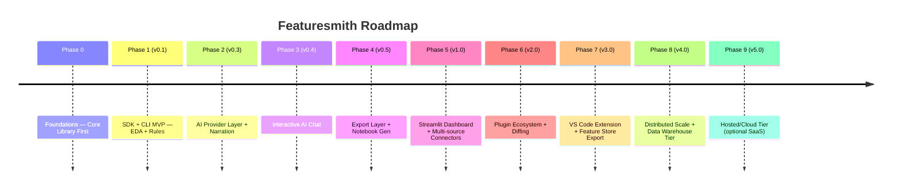

# Phases.md — Roadmap from MVP to v5.0 (Featuresmith)

**Sequencing principle carried through every phase below:** the SDK (core library) is always the deliverable; the CLI, dashboard, and VS Code extension are never allowed to ship a capability the SDK doesn't already expose. This is the roadmap-level enforcement of `Architecture.md` §2.

---

## Phase 0 — Foundations: Core Library First (pre-release)

**Objectives:** establish the `featuresmith-core` package, its public contracts, and the workspace/CI setup before any surface work begins.
**Features:** none user-facing.
**Technical Milestones:** monorepo workspace (`packages/featuresmith-core`, stub `packages/featuresmith-cli`, `packages/featuresmith-dashboard`); `ruff`/`mypy`/`pytest`/`import-linter` CI; core `Dataset`/`ProfileResult` Pydantic schemas; `Base*` interface stubs for connectors/rules/exporters; `AIProvider` protocol stub; docs site skeleton (MkDocs).
**Deliverables:** buildable, installable empty `featuresmith` package; import-linter contract enforcing "surfaces only import `featuresmith.api`" from day one, even with empty surface packages; `CONTRIBUTING.md`, `Rules.md`, `Architecture.md` published.
**Estimated Difficulty:** Low-Medium (mostly plumbing, but must be right — everything else builds on it).
**Dependencies:** none.
**Risks:** over-engineering the schema before real usage patterns emerge — mitigate by keeping schemas minimal and versioned.
**Acceptance Criteria:** `pip install -e packages/featuresmith-core` works; `pytest` runs (even if trivial); CI green on a PR; import-linter contract fails intentionally on a test violation (proving it's wired up).
**Suggested GitHub Issues:** "Set up ruff+mypy+import-linter CI", "Define ProfileResult Pydantic schema v0", "Scaffold BaseConnector/BaseRule/BaseExporter/AIProvider".
**Suggested Milestones:** `v0.0.1-foundations`.
**Suggested Labels:** `infra`, `good-first-issue` (for docs scaffolding only).
**Suggested Project Boards:** "Foundations" board with columns Todo/In Progress/Review/Done.

---

## Phase 1 — SDK + CLI MVP: EDA + Rule Engine (v0.1)

**Objectives:** prove the core value loop end-to-end via the SDK first, with the CLI as its first thin client — no AI yet.
**Features:** `import featuresmith as fs; fs.analyze("data.csv")` and `fs.analyze(df)` on an in-memory dataframe; `featuresmith analyze data.csv` CLI command (a two-line wrapper over `fs.analyze`); Polars-based profiler (univariate stats, missingness, dtypes, correlations); 8-10 seed rules (missingness threshold, constant columns, duplicate rows, high cardinality, basic outlier detection, naive leakage-by-correlation).
**Technical Milestones:** `CsvConnector`, `DataFrameConnector`; `Profiler` producing `ProfileResult`; `RuleEngine` running registered rules; JSON + Markdown report output; `featuresmith.api.analyze()` as the single entrypoint the CLI calls.
**Deliverables:** working SDK + CLI, PyPI-installable (`featuresmith`, `featuresmith-cli`), README with a real example dataset walkthrough using both the SDK and the CLI.
**Estimated Difficulty:** Medium.
**Dependencies:** Phase 0.
**Risks:** rule false-positive rate too high, eroding trust early — mitigate with the positive/negative fixture testing rule from `Rules.md` §5.
**Acceptance Criteria:** running against 5 diverse public datasets (Titanic, Adult Income, a leaky Kaggle dataset, a messy real-world CSV, a clean synthetic set) produces sensible, non-crashing output with correct leakage flag on the known-leaky set, identically whether invoked via SDK or CLI.
**Suggested GitHub Issues:** one issue per rule ("Implement missingness-ratio rule", "Implement duplicate-row rule"...), "Polars profiler: univariate stats", "Markdown report renderer", "CLI: analyze command wrapping fs.analyze".
**Suggested Milestones:** `v0.1.0`.
**Suggested Labels:** `good-first-issue` (individual rules), `core`, `cli`.
**Suggested Project Boards:** "v0.1 MVP".

---

## Phase 2 — AI Provider Layer + Narration (v0.3)

**Objectives:** add the pluggable AI provider abstraction and the narrative/ranking layer, strictly grounded in Phase 1's outputs.
**Features:** `AIProvider` interface with Ollama (default), OpenAI, and Anthropic implementations; AI-generated plain-language dataset summary; ranked, explainable feature-engineering recommendations; provider switching via `.featuresmith.yml` only.
**Technical Milestones:** `AIProvider` protocol finalized (`narrate`, `rank`, plus a `chat` method stubbed for Phase 3); provider entry-point registry (`Architecture.md` §6); versioned Jinja2 prompt templates; grounding tests (mocked provider, asserting no numeric hallucination path exists architecturally); `RecommendationEngine` merging rule findings + AI ranking.
**Deliverables:** `fs.analyze()` output now includes a narrative section and ranked recommendations, from both SDK and CLI; fallback template-narrator when no provider configured; `pip install featuresmith[openai]` / `featuresmith[anthropic]` extras.
**Estimated Difficulty:** Medium-High (prompt design + grounding discipline is the hard part, not the plumbing).
**Dependencies:** Phase 1.
**Risks:** prompt drift causing inconsistent tone/quality across providers — mitigate with a shared eval set of prompts + expected-structure tests (not exact-text tests); provider abstraction leaking provider-specific quirks into core — mitigate with the conformance test suite from `Rules.md` §5.
**Acceptance Criteria:** narrative and recommendations generated correctly for Ollama, OpenAI, and Anthropic via config-only switching, with zero code changes between them; fallback mode works with zero network access.
**Suggested GitHub Issues:** "Ollama provider implementation", "OpenAI provider implementation", "Anthropic provider implementation", "Prompt template: dataset narrative v1", "Recommendation ranking merge logic", "AI provider conformance test harness".
**Suggested Milestones:** `v0.2.0` (provider abstraction), `v0.3.0` (recommendations live).
**Suggested Labels:** `ai-layer`, `core`.
**Suggested Project Boards:** "v0.3 AI Layer".

---

## Phase 3 — Interactive AI Chat (v0.4)

**Objectives:** let users interrogate an already-computed analysis conversationally, without ever re-reading the dataset.
**Features:** `fs.chat(profile, "Why is this feature leakage?")` SDK method; `featuresmith chat` CLI REPL against the last analysis; supported question patterns — explain a finding, explain a chart, encoding advice, "explain to a beginner," "generate sklearn preprocessing" (delegates to the Phase 4 exporter once available, or a scoped preview in the interim), compare two columns.
**Technical Milestones:** `ChatSession` object wrapping one `ProfileResult` + conversation history; structural test proving `ChatSession` has no raw-`Dataset` access (`Rules.md` §5); chat context-window management for long conversations (truncate/summarize history, never re-fetch raw data to "refresh" context).
**Deliverables:** working chat from SDK and CLI; dashboard chat panel deferred to Phase 5 alongside the dashboard itself, but the underlying `ChatSession` API is complete and stable here.
**Estimated Difficulty:** Medium (mostly disciplined scoping — the risk is scope creep toward a general chatbot, not raw engineering difficulty).
**Dependencies:** Phase 2 (needs a working `AIProvider`).
**Risks:** users expecting the chat to answer questions requiring re-analysis (e.g., "what if I drop this column?") — mitigate with a clear, explicit "this would require re-running analysis, want me to?" response pattern that routes back through `fs.analyze()` rather than faking an answer.
**Acceptance Criteria:** a 10+ turn conversation against a fixture profile never triggers a second profiling pass (verified by the performance regression test in `Rules.md` §12); all six example question patterns from `PRD.md` §10 produce grounded, correct answers on a benchmark fixture dataset.
**Suggested GitHub Issues:** "ChatSession core object", "CLI chat REPL", "Chat prompt templates per question pattern", "Chat history truncation strategy".
**Suggested Milestones:** `v0.4.0`.
**Suggested Labels:** `ai-layer`, `chat`, `core`.
**Suggested Project Boards:** "v0.4 AI Chat".

---

## Phase 4 — Export Layer (v0.5)

**Objectives:** close the loop — accepted recommendations (and chat-requested code) become real code.
**Features:** `sklearn` `ColumnTransformer`/`Pipeline` exporter with generated tests; Jupyter notebook exporter; HTML static report exporter; chat's "generate sklearn preprocessing" now calls this exporter directly instead of a preview.
**Technical Milestones:** `BaseExporter` implementations; golden-file export tests (`Rules.md` §5); `fs.export()` SDK method; `featuresmith export` CLI subcommand.
**Deliverables:** a user can go from raw CSV to a runnable, tested `pipeline.py` in one SDK call or one CLI session — or by asking chat to generate it.
**Estimated Difficulty:** Medium.
**Dependencies:** Phase 2 (needs accepted recommendations as input), Phase 3 (chat delegates here).
**Risks:** generated code quality/readability — mitigate by treating generated pipeline code style as a design-reviewed artifact, not an afterthought (black-formatted, commented, minimal).
**Acceptance Criteria:** exported pipeline round-trips correctly (fit/transform on held-out data matches expectations); generated notebook runs top-to-bottom without manual edits; chat-generated code is byte-identical to `fs.export()` output for the same inputs.
**Suggested GitHub Issues:** "sklearn ColumnTransformer exporter", "Notebook exporter via nbformat", "Golden-file export test harness", "Wire chat's sklearn-generation intent to the exporter".
**Suggested Milestones:** `v0.5.0`.
**Suggested Labels:** `exporters`, `good-first-issue` (notebook cell templates).
**Suggested Project Boards:** "v0.5 Export Layer".

---

## Phase 5 — Streamlit Dashboard + Multi-Source Connectors (v1.0)

**Objectives:** first "1.0" release — usable by non-CLI users, connects to real production sources, all still calling the same SDK.
**Features:** `featuresmith dashboard` launching a Streamlit app (upload/connect, browse findings, chat panel, accept/reject recommendations interactively, trigger export); Excel, Parquet, SQL (SQLAlchemy) connectors.
**Technical Milestones:** dashboard reuses `featuresmith.api` exclusively (no logic duplication, enforced by the import-linter contract from Phase 0); connector plugin registry finalized via entry_points.
**Deliverables:** public v1.0 release, docs site complete, demo video/GIFs in README showing the same analysis via SDK, CLI, and dashboard producing identical results.
**Estimated Difficulty:** Medium-High (UI polish + connector edge cases, e.g., SQL dialect quirks).
**Dependencies:** Phases 1-4.
**Risks:** dashboard scope creep delaying 1.0 — timebox to the browse/chat/accept/reject/export loop only, defer team features to Phase 6.
**Acceptance Criteria:** a user can, without touching the CLI, upload a file or connect a Postgres table, review findings, chat about them, and download a pipeline — entirely in-browser; surface-parity integration tests (`Rules.md` §5) pass for SDK vs. CLI vs. dashboard on the same fixture dataset.
**Suggested GitHub Issues:** "Streamlit app shell calling featuresmith.api", "SQL connector: Postgres/MySQL support", "Excel connector: multi-sheet handling", "Dashboard chat panel".
**Suggested Milestones:** `v0.6.0`–`v0.9.0` (incremental), `v1.0.0`.
**Suggested Labels:** `dashboard`, `connectors`, `release`.
**Suggested Project Boards:** "v1.0 Launch".

---

## Phase 6 — Plugin Ecosystem + Dataset Diffing (v2.0)

**Objectives:** shift from "core team builds everything" to "community extends via plugins" — across rules, connectors, exporters, *and AI providers*.
**Features:** dataset diff/drift command (`fs.diff(profile_a, profile_b)`, `featuresmith diff snapshot_a snapshot_b`); published plugin-authoring guides + template repos for all four extension categories; first 2-3 community-contributed rule packs and at least one community AI provider (e.g., Azure OpenAI or a self-hosted vLLM endpoint).
**Technical Milestones:** stabilized `Base*`/`AIProvider` interfaces (semver-locked); `featuresmith-plugin-template` cookiecutter repo, parameterized by plugin category.
**Deliverables:** governance model (`GOVERNANCE.md`) published; plugin directory page on docs site, listing rules, connectors, exporters, and AI providers separately.
**Estimated Difficulty:** Medium (mostly community-enablement work, not new core engineering).
**Dependencies:** Phase 5 stability.
**Risks:** interface churn breaking early plugins — mitigate with the versioning rules in `Rules.md` §9.
**Acceptance Criteria:** at least 3 plugins published by non-core-team contributors within 2 months of the plugin template's release, spanning at least two of the four extension categories.
**Suggested GitHub Issues:** "Dataset diff engine", "Plugin cookiecutter template", "GOVERNANCE.md draft", "Community AI provider example: vLLM".
**Suggested Labels:** `community`, `plugins`.
**Suggested Project Boards:** "v2.0 Ecosystem".

---

## Phase 7 — VS Code Extension + Feature Store Export (v3.0)

**Objectives:** meet engineers where they already work, as the fourth thin surface over the same SDK.
**Features:** VS Code extension (`featuresmith-vscode`) surfacing inline findings on `.csv`/notebook open, plus an inline chat panel; Jupyter extension (magics: `%featuresmith_analyze df`); Feast feature-store schema exporter.
**Estimated Difficulty:** High (new tooling ecosystems — TS/VS Code API, Jupyter server extensions).
**Dependencies:** Phase 6 (stable plugin/export interfaces and a stable `featuresmith.api`).
**Risks:** maintaining a TypeScript codebase alongside Python core — mitigate by keeping the extension a genuinely thin client, invoking the CLI as a subprocess or a small local server wrapping `featuresmith.api`, never a reimplementation of profiling/rules/chat logic in TypeScript.
**Acceptance Criteria:** VS Code extension published to marketplace; Jupyter magic works in a standard JupyterLab install; the extension's findings are verified identical to CLI output on the same file via the surface-parity suite.
**Suggested Labels:** `vscode-extension`, `stretch-goal`.

---

## Phase 8 — Distributed Scale + Data Warehouse Tier (v4.0)

**Objectives:** handle datasets beyond a single machine's memory comfortably.
**Features:** Snowflake/BigQuery connectors with pushdown profiling (compute stats in-warehouse where possible); optional Spark/Ray execution backend for the profiler.
**Estimated Difficulty:** High.
**Dependencies:** Phase 5 connectors, proven size-tiering architecture (`Architecture.md` §17).
**Risks:** backend fragmentation (DuckDB vs. Spark result parity) — mitigate with a strict `ProfileResult` conformance test suite run against every backend.
**Acceptance Criteria:** identical `ProfileResult` shape/semantics produced (within documented tolerance) regardless of backend.

---

## Phase 9 — Hosted/Cloud Tier (v5.0, optional)

**Objectives:** sustainable funding model without compromising the OSS core.
**Features:** hosted dashboard, team collaboration, scheduled re-profiling, managed AI provider usage, shared chat threads per dataset.
**Estimated Difficulty:** High (new business-layer concerns: auth, billing, multi-tenancy) — architecturally, this is simply a fifth thin surface (a FastAPI service) over the unchanged `featuresmith-core`, per `Architecture.md` §18.
**Dependencies:** everything above; a proven, stable core library people already trust.
**Risks:** open-core tension (community distrust if core features get paywalled) — mitigate by committing publicly, early, to what will always remain free/OSS (the entire local-first core, SDK, CLI, dashboard, and VS Code extension) vs. what's hosted-tier-only (collaboration/scheduling infrastructure, not analysis capability).
**Acceptance Criteria:** out of scope for detailed planning until Phase 6-7 community health metrics (from `PRD.md` §12) are met.
