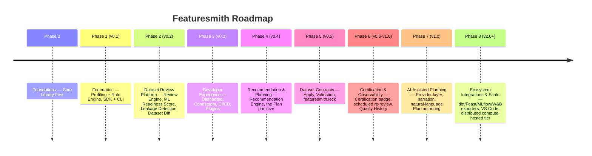

# Phases.md — Roadmap (Featuresmith)

Each phase compounds toward Featuresmith's North Star (`VISION.md` §4). "Every dataset deserves a code review" is still how Featuresmith introduces itself — that's Phases 0-2, already shipped. Everything from Phase 4 onward is the natural continuation of the category `VISION.md` §2 describes: once a dataset has been reviewed, the next question is always "what do I do about it," and the roadmap below is the answer, staged as one continuous lifecycle rather than a list of unrelated features. See `Flagship-Capabilities.md` for the five defining, long-term experiences this roadmap builds toward, and `features/Dataset-Contracts-And-Planning.md` for the full design of Phases 4-6's central capability.

Phases 0-2 are shipped (v0.2.0, current). Everything from Phase 3 onward is the current plan, not a commitment — real usage and contributor capacity will reshape later phases before they're built.

**Sequencing principles carried through every phase:**
- The SDK (core library) is always the deliverable; the CLI, dashboard, and VS Code extension are never allowed to ship a capability the SDK doesn't already expose (`Architecture.md` §2).
- **Prove the deterministic engine before adding a new capability layer on top of it.** Review → Score → Leakage → Diff (Phases 1-2) had to work with zero AI involvement before Recommendation/Planning (Phase 4) began, and Plan/Apply/Contract (Phases 4-5) has to work with zero AI involvement before AI-Assisted Planning (Phase 7) begins. AI is never a prerequisite for a core capability — only an enhancement layered on top of one that already works (`Design-Principles.md` "AI assists, never replaces").
- **Apply never grows into an execution engine.** Every phase that touches transformations (4-5, 8) generates real code for an external ecosystem; none of them introduce a Featuresmith-owned runtime (`Architecture.md` §20).

---

## Phase 0 — Foundations: Core Library First (pre-release) — Shipped

**Objectives:** establish the `featuresmith-core` package, its public contracts, and the workspace/CI setup before any surface work begins.
**Delivered:** monorepo workspace (`packages/featuresmith-core`, `featuresmith-cli`, `featuresmith-dashboard` stub); `ruff`/`mypy --strict`/`pytest`/`import-linter` CI; core `Dataset`/`ProfileResult` Pydantic schemas; `Base*` interface stubs; `CONTRIBUTING.md`, `Rules.md`, `Architecture.md` published.
**Dependencies:** none.

---

## Phase 1 — Foundation: SDK + CLI MVP, Profiling + Rule Engine (v0.1) — Shipped

**Objectives:** prove the core value loop end-to-end via the SDK first, with the CLI as its first thin client.
**Delivered:** `fs.load()`/`fs.profile()`/`fs.analyze()`; `CsvConnector`, `ExcelConnector`, `ParquetConnector`, `DataFrameConnector` (pandas + Polars); Polars-based profiler; 8 seed rules (quality + statistical + naive leakage-by-correlation); `featuresmith analyze` CLI with Rich table and JSON output; exit-code CI gating.
**Dependencies:** Phase 0.

---

## Phase 2 — Dataset Review Platform: Review Engine, ML Readiness Score, Leakage Detection, Dataset Diff (v0.2) — Shipped, current

**Objectives:** compose the individually-useful primitives from Phase 1 into the product Featuresmith wants to be remembered by — a single command that performs a comprehensive engineering review of a dataset, backed by an explainable score, real leakage-pattern detection, and the ability to compare two snapshots the way `git diff` compares two commits. This phase is what "every dataset deserves a code review" means concretely, and it is the deterministic foundation every later phase builds on without modification.
**Delivered** (full detail per feature in `features/Review-Engine-Architecture.md`, `features/Dataset-Review-PRD.md`, `features/ML-Readiness-Score.md`, `features/Dataset-Diff-And-Leakage-Detection.md`; exact implementation status in `implementation/IMPLEMENTATION_STATUS.md`):
- **Review Engine**: `ReviewEngine.run()` / `fs.review()` / `featuresmith review`, 8 of 12 planned reviewers (schema, quality, statistics, leakage), Review Categories, fault-isolated execution.
- **ML Readiness Score**: 0-100 composite score, 8 dimensions (2 split into sub-dimensions), always rendered with its underlying findings, versioned `scoring_version`.
- **Intelligent Leakage Detection**: 6 named pattern detectors (target correlation, identifier shape, timestamp anomalies, duplicate targets) merged per column, replacing the Phase 1 naive correlation-only check.
- **Dataset Diff**: standalone `fs.diff()` / `featuresmith diff` engine comparing schema, structure, quality, distribution, and leakage between two snapshots.
**Deferred within this phase** (tracked in `implementation/IMPLEMENTATION_STATUS.md`): `DuplicateColumnReviewer`, `OutlierReviewer`, `DistributionReviewer`, `FeatureQualityReviewer`; diff-aware review (`--previous`, currently raises `NotImplementedError` — use standalone `fs.diff()`); centralized Recommendation Engine (arrives in Phase 4); Dashboard/HTML/JSON renderers beyond the console.
**Dependencies:** Phase 1.
**Acceptance criteria (met):** the four capabilities above are exposed identically from SDK and CLI on the acceptance dataset suite (`Phases.md` Phase 1 datasets, extended with known-leaky and drifted-snapshot fixtures).

---

## Phase 3 — Developer Experience: Dashboard, Connectors, CI/CD, Plugins (v0.3)

**Objectives:** meet developers where they already work — a browsable UI for those who want it, first-class CI integration for those who don't, and a plugin system so the community can extend Phase 2's engine without core-team involvement, before Phase 4 gives them something new to extend it *with*.
**Features:** `featuresmith dashboard` (Streamlit) — browse `ReviewResult` sections, drill into findings; Excel/Parquet (already shipped as connectors)/SQL (SQLAlchemy) connector completion; `featuresmith-action` GitHub Action wrapping `featuresmith review --fail-on`; a stable plugin interface (`entry_points`) for connectors, rules, and reviewers, with a cookiecutter plugin template and authoring guides; the remaining 4 reviewers deferred from Phase 2 (`DuplicateColumnReviewer`, `OutlierReviewer`, `DistributionReviewer` — `FeatureQualityReviewer` waits for Phase 4's Feature Engineering signal).
**Dependencies:** Phase 2.
**Risks:** dashboard scope creep — timebox to browse/drill/export only, defer team features to Phase 6; interface churn breaking early plugins — mitigate with `Rules.md` §9's versioning discipline.
**Acceptance criteria:** a user reviews a dataset entirely in-browser without touching the CLI; the GitHub Action fails a PR on a synthetic dataset engineered to trip the readiness-score threshold; at least 3 plugins published by non-core-team contributors within 2 months of the plugin template's release.

---

## Phase 4 — Recommendation & Planning: the Recommendation Engine and the Plan primitive (v0.4)

**Objectives:** close the gap between "here's a finding" and "here's what to do about it" — deterministically, no AI required — and introduce the **Plan**, the inspectable, serializable object every later Apply/Contract stage builds on. This is the first phase of the Dataset Contract lifecycle described in `features/Dataset-Contracts-And-Planning.md`, and it changes nothing about how Review/Score/Leakage/Diff already work — it consumes their output.
**Features:** centralized Recommendation Engine (`Architecture.md` §8) merging findings from every reviewer into one ranked, explainable list, replacing the minimal severity-ranked fallback the Review Engine currently uses (`features/Review-Engine-Architecture.md` §15); `FeatureQualityReviewer` (low-signal/redundant/near-constant detection), completing Phase 2's coverage table; `featuresmith.plan` module — `fs.plan(result, accept=[...])` and `featuresmith plan` producing a deterministic `Plan` from accepted recommendations (`features/Dataset-Contracts-And-Planning.md` §7.1, §10); Plan rendering (steps, rationale, confidence) reusing the existing severity-first, evidence-before-recommendation UI conventions (`Design.md` §2).
**Technical Milestones:** `Recommendation`, `Plan`, `PlanStep` schemas; `BaseTransformerSuggestion`-driven candidate generation (encoding strategy, binning, scaling) as recommendation input; Plan determinism tests (`features/Dataset-Contracts-And-Planning.md` §13).
**Deliverables:** a user can go from a raw finding to an inspected, not-yet-executed Plan in one call, with every step traceable back to the finding that produced it.
**Dependencies:** Phase 2 (findings/score as input), Phase 3 (plugin interface — reviewers/recommenders share the registration pattern).
**Risks:** over-ranking recommendations without enough signal — keep the deterministic formula conservative until Phase 7 adds AI-assisted ranking; scope creep toward Apply happening in this phase too — Plan production is explicitly the entire scope, Apply is Phase 5.
**Acceptance criteria:** every accepted recommendation produces a Plan step traceable to its originating finding; the same `ReviewResult` + accepted finding IDs always produce a byte-identical Plan (excluding timestamps).

---

## Phase 5 — Dataset Contracts: Apply, Validation, `featuresmith.lock` (v0.5)

**Objectives:** close the loop opened in Phase 4 — turn an accepted Plan into real, generated code for an ecosystem the user already runs, automatically confirm the fix worked, and persist the result into a versioned, git-native **Dataset Contract**. This is the single highest-leverage phase on the roadmap: it's what turns Featuresmith from a tool a team runs to a state a team's git history remembers.
**Features:** `featuresmith.apply` — thin dispatcher generating `sklearn.Pipeline`/`ColumnTransformer` and Polars expression code from an accepted Plan via the existing Export Layer (`Architecture.md` §12), never a new execution engine (`Architecture.md` §20.3); automatic post-apply re-review + `fs.diff()` validation (`features/Dataset-Contracts-And-Planning.md` §7.3); `featuresmith.contract` module — `DatasetContract` schema, `fs.lock()` / `featuresmith lock` writing `featuresmith.lock`, `featuresmith lock --check` for CI drift-gating, `featuresmith contract diff` reusing the Phase 2 diff primitive.
**Technical Milestones:** `DatasetContract` schema with independently-versioned `contract_schema_version`; validation-gating logic (score-regression / new-critical-finding blocks a lock update); golden-file round-trip tests for generated code (`Rules.md` §5); no-silent-apply structural test (`features/Dataset-Contracts-And-Planning.md` §13).
**Deliverables:** a user can review, plan, apply, and lock a dataset in one session, commit `featuresmith.lock` to git, and have a subsequent CI run fail if the dataset drifts from what's locked — the concrete realization of `PRD.md` §14's future vision.
**Dependencies:** Phase 4 (Plan as Apply's only input); Phase 2 (Review + Diff as the validation mechanism, unmodified).
**Risks:** Apply scope creep into orchestration/scheduling — explicitly out of scope (`Architecture.md` §20.3), a failed Apply is reported and left to the user/CI to retry, never auto-retried by Featuresmith; generated-code quality/readability — same design-reviewed-artifact bar as existing exporters.
**Acceptance criteria:** an applied Plan that regresses the readiness score does not update `featuresmith.lock`; `featuresmith lock --check` correctly detects a manually-drifted dataset; exported code round-trips correctly against held-out fixture data.

---

## Phase 6 — Certification & Observability: badge, scheduled re-review, Quality History (v0.6-v1.0)

**Objectives:** extend a single Contract from "true right now" to "true continuously, and legible to people outside the team." Two threads, both building directly on Phase 5's Contract without changing its schema:
**Features — Certification:** a portable "Featuresmith-verified" badge/artifact derived read-only from a `DatasetContract` (`features/Dataset-Contracts-And-Planning.md` §7.5) — dataset name/version, score, lock hash, `featuresmith verify <hash>` command — shareable in a README, dataset card, or model-registry metadata. **Features — Observability:** scheduled re-profiling against a configured source; a pluggable `QualityHistory` store (score and Contract state over time, not just the latest); threshold-based alerts (Slack/email/webhook) on a regression or unexpected schema drift; a dashboard trend view.
**Technical Milestones:** `QualityHistory` storage abstraction (local-file default); cron-based scheduler (no dependency on Phase 8's hosted tier); `BaseNotifier` interface.
**Dependencies:** Phase 5 (Contract as the thing being certified/tracked); Phase 3 (dashboard, connectors as the surface for trend visualization).
**Risks:** alert fatigue from an over-sensitive default — conservative defaults, easy per-project tuning; certification badge becoming a trust signal without teeth — the badge always links back to a re-verifiable `featuresmith verify <hash>`, never a static, unfalsifiable claim.
**Acceptance criteria:** a scheduled re-profile with an injected regression fires exactly one alert and does not silently update a Contract's certification status; `featuresmith verify <hash>` correctly re-derives the certified score from the referenced Contract.

---

## Phase 7 — AI-Assisted Planning: Provider Layer, Narration, Natural-Language Plan Authoring (v1.x)

**Objectives:** now that Review, Score, Leakage, Diff, Recommendation, Plan, Apply, and Contract all work fully without it, add AI as an assistant layered on top — narrating findings, enhancing ranking, and offering a second, natural-language way to author a Plan. This phase is an enhancement to Phases 1-6, never a prerequisite for any of them (`Design-Principles.md` "AI assists, never replaces").
**Features:** `AIProvider` interface (Ollama default/local, OpenAI/Anthropic opt-in, config-only switching — `Architecture.md` §7); AI-generated plain-language dataset and Contract-diff summaries; Phase 4's Recommendation Engine ranking *enhanced*, never replaced, with AI-ranked rationale; **natural-language Plan authoring** — `fs.plan(result, instruct="...")` translating an instruction into the identical `Plan` schema a rule-based recommendation would produce (`features/Dataset-Contracts-And-Planning.md` §7.1, §11), always subject to the same human-review-before-apply gate; Interactive AI Chat for questions about findings, scores, and Contract diffs.
**Technical Milestones:** `AIProvider` protocol (`narrate`, `rank`, `chat`, `translate_plan`); grounding tests proving no numeric-hallucination or silent-apply path exists architecturally (`Rules.md` §5); NL-translation equivalence tests against a curated instruction set (`features/Dataset-Contracts-And-Planning.md` §13).
**Dependencies:** Phases 2-6 (narrates/ranks/plans on top of facts and objects already fully functional without it).
**Risks:** prompt drift across providers — shared eval set of prompts + expected-structure tests, not exact-text tests; NL instructions producing plausible-looking but unjustified Plan steps — every AI-authored step without a corresponding deterministic finding is explicitly flagged as such in the review-before-apply UI, never presented identically to a rule-based step.
**Acceptance criteria:** narrative, ranking, and NL-to-Plan translation work correctly across Ollama/OpenAI/Anthropic via config-only switching; fallback mode (no provider configured) still produces a complete deterministic report and a fully rule-based-only Plan authoring path.

---

## Phase 8 — Ecosystem Integrations & Scale: dbt/Feast/MLflow/W&B, VS Code, distributed compute, hosted tier (v2.0+)

**Objectives:** two threads that both extend Phase 5's Contract outward rather than changing anything about how it's produced — deeper ecosystem exporters, and the infrastructure to handle datasets and teams beyond a single machine/session.
**Features — Ecosystem:** a dbt model-stub exporter (Apply target, `Architecture.md` §20.4); a Feast feature-definition exporter generated from a certified Contract; MLflow/Weights & Biases run-metadata attachment carrying a Contract's fingerprint and score, so a training run is traceable back to the exact dataset state it used; VS Code extension surfacing inline Review/Plan/Contract status on file open; Jupyter magics. **Features — Scale:** Snowflake/BigQuery connectors with pushdown profiling; optional Spark/Ray backend for the profiler (never for Apply — `Architecture.md` §20.3); a hosted dashboard tier with team collaboration, managed scheduling for Phase 6's re-review, and shared Contract history — explicitly the only place any "hosted" concept appears; committed publicly, early, to what always stays free/OSS (the entire local-first core, SDK, CLI, dashboard, VS Code extension, and every capability in Phases 0-7) vs. what's hosted-tier-only (collaboration/scheduling infrastructure, never analysis, planning, or certification capability itself).
**Dependencies:** Phase 5 (Contract as the stable interface every ecosystem exporter consumes — `Architecture.md` §20.4), Phase 3 connectors, Phase 6's scheduling design.
**Risks:** backend fragmentation (DuckDB vs. Spark result parity) — strict `ProfileResult` conformance suite across backends; open-core tension — the free/OSS commitment above is the mitigation, stated publicly before this phase begins, not after.
**Acceptance criteria:** a Contract's fingerprint and score are correctly retrievable from an MLflow run's metadata without re-running Featuresmith; identical `ProfileResult` shape/semantics across compute backends within documented tolerance.
