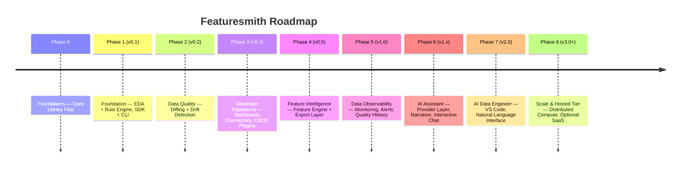

# Phases.md — Roadmap from MVP to v3.0+ (Featuresmith)

Each phase below compounds toward one goal: make data quality as routine as code quality (`Project_Plan.md` §0). See `Flagship-Capabilities.md` for the long-term, defining experiences (Dataset Review, ML Readiness Score, Dataset Diff, Intelligent Leakage Detection) that these phases are ultimately building toward. Phases 0-1 are shipped; everything from Phase 2 onward is the current plan, not a commitment — real usage and contributor capacity will reshape later phases before they're built. The ordering is deliberate: the deterministic engineering discipline (quality, developer experience, feature intelligence, observability) is proven out **before** AI is introduced, so AI arrives as an assistant layered onto a trustworthy foundation — never the thing the foundation depends on. See `Project_Plan.md` §6 for how these phases map onto that broader arc.

**Sequencing principle carried through every phase below:** the SDK (core library) is always the deliverable; the CLI, dashboard, and VS Code extension are never allowed to ship a capability the SDK doesn't already expose. This is the roadmap-level enforcement of `Architecture.md` §2.

---

## Phase 0 — Foundations: Core Library First (pre-release)

**Objectives:** establish the `featuresmith-core` package, its public contracts, and the workspace/CI setup before any surface work begins.
**Features:** none user-facing.
**Technical Milestones:** monorepo workspace (`packages/featuresmith-core`, stub `packages/featuresmith-cli`, `packages/featuresmith-dashboard`); `ruff`/`mypy`/`pytest`/`import-linter` CI; core `Dataset`/`ProfileResult` Pydantic schemas; `Base*` interface stubs for connectors/rules/exporters; `AIProvider` protocol stub; docs site skeleton (MkDocs).
**Deliverables:** buildable, installable empty `featuresmith` package; import-linter contract enforcing "surfaces only import `featuresmith.api`" from day one, even with empty surface packages; `CONTRIBUTING.md`, `Rules.md`, `Architecture.md` published.
**Estimated Difficulty:** Low-Medium (mostly plumbing, but must be right — everything else builds on it).
**Dependencies:** none.
**Risks:** over-engineering the schema before real usage patterns emerge — mitigate by keeping schemas minimal and versioned.
**Acceptance Criteria:** `pip install -e packages/featuresmith-core` works; `pytest` runs (even if trivial); CI green on a PR; import-linter contract fails intentionally on a test violation (proving it's wired up).
**Suggested GitHub Issues:** "Set up ruff+mypy+import-linter CI", "Define ProfileResult Pydantic schema v0", "Scaffold BaseConnector/BaseRule/BaseExporter/AIProvider".
**Suggested Milestones:** `v0.0.1-foundations`.
**Suggested Labels:** `infra`, `good-first-issue` (for docs scaffolding only).
**Suggested Project Boards:** "Foundations" board with columns Todo/In Progress/Review/Done.

---

## Phase 1 — Foundation: SDK + CLI MVP, EDA + Rule Engine (v0.1) — Current

**Objectives:** prove the core value loop end-to-end via the SDK first, with the CLI as its first thin client — no AI yet.
**Features:** `import featuresmith as fs; fs.analyze("data.csv")` and `fs.analyze(df)` on an in-memory dataframe; `featuresmith analyze data.csv` CLI command (a two-line wrapper over `fs.analyze`); Polars-based profiler (univariate stats, missingness, dtypes, correlations); 8-10 seed rules (missingness threshold, constant columns, duplicate rows, high cardinality, basic outlier detection, naive leakage-by-correlation).
**Technical Milestones:** `CsvConnector`, `DataFrameConnector`; `Profiler` producing `ProfileResult`; `RuleEngine` running registered rules; JSON + Markdown report output; `featuresmith.api.analyze()` as the single entrypoint the CLI calls.
**Deliverables:** working SDK + CLI, PyPI-installable (`featuresmith`, `featuresmith-cli`), README with a real example dataset walkthrough using both the SDK and the CLI.
**Estimated Difficulty:** Medium.
**Dependencies:** Phase 0.
**Risks:** rule false-positive rate too high, eroding trust early — mitigate with the positive/negative fixture testing rule from `Rules.md` §5.
**Acceptance Criteria:** running against 5 diverse public datasets (Titanic, Adult Income, a leaky Kaggle dataset, a messy real-world CSV, a clean synthetic set) produces sensible, non-crashing output with correct leakage flag on the known-leaky set, identically whether invoked via SDK or CLI.
**Suggested GitHub Issues:** one issue per rule ("Implement missingness-ratio rule", "Implement duplicate-row rule"...), "Polars profiler: univariate stats", "Markdown report renderer", "CLI: analyze command wrapping fs.analyze".
**Suggested Milestones:** `v0.1.0`.
**Suggested Labels:** `good-first-issue` (individual rules), `core`, `cli`.
**Suggested Project Boards:** "v0.1 MVP".

---

## Phase 2 — Data Quality: Dataset Diffing + Drift Detection (v0.2)

**Objectives:** extend the deterministic engine from a single-snapshot report to quality tracked *across* snapshots — the first step toward treating data quality as continuous, not a one-off check.
**Features:** `fs.diff(profile_a, profile_b)` SDK method and `featuresmith diff snapshot_a snapshot_b` CLI command producing a plain-language summary of what changed (schema, distributions, missingness); early schema-evolution tracking (column added/removed/type-changed between snapshots); a first-pass data-quality score derived entirely from existing rule findings — no AI involved.
**Technical Milestones:** `ProfileDiff` schema (Pydantic) capturing per-column deltas; `SchemaChange` detection built on the existing `ProfileResult`; quality-score formula defined as a documented, deterministic function of rule severities (versioned, so scores are comparable across releases).
**Deliverables:** `fs.diff()` and `featuresmith diff` shipping from both the SDK and CLI, producing identical output; quality score surfaced in the standard `fs.analyze()` report.
**Estimated Difficulty:** Medium.
**Dependencies:** Phase 1 (needs `ProfileResult` as its only input — no dependency on any later phase).
**Risks:** a single scalar quality score oversimplifying nuanced findings — mitigate by always pairing the score with the underlying findings, never showing it standalone.
**Acceptance Criteria:** diffing two snapshots of the same dataset with a known schema change (column renamed, dtype changed, 10% new missingness introduced) correctly surfaces all three changes in plain language, identically via SDK and CLI.
**Suggested GitHub Issues:** "ProfileDiff schema", "Schema-evolution detector", "Deterministic quality-score formula v0", "CLI: diff command".
**Suggested Milestones:** `v0.2.0`.
**Suggested Labels:** `core`, `data-quality`, `good-first-issue` (individual diff checks).
**Suggested Project Boards:** "v0.2 Data Quality".

---

## Phase 3 — Developer Experience: Dashboard, Connectors, CI/CD, Plugins (v0.3-v0.4)

**Objectives:** meet developers where they already work — a browsable UI for those who want it, first-class CI integration for those who don't, and a plugin system so the community can extend all of the above without core-team involvement.
**Features:** `featuresmith dashboard` launching a Streamlit app (upload/connect, browse findings, accept/reject recommendations, trigger export); Excel, Parquet, SQL (SQLAlchemy) connectors; an official `featuresmith-action` GitHub Action wrapping `featuresmith analyze` for CI gating, with quality-score-based pass/fail thresholds; a stable plugin interface (entry_points-based) for connectors, rules, and exporters, with a cookiecutter plugin template and published authoring guides.
**Technical Milestones:** dashboard reuses `featuresmith.api` exclusively (no logic duplication, enforced by the import-linter contract from Phase 0); connector plugin registry finalized via entry_points; `featuresmith-plugin-template` cookiecutter repo; GitHub Action packaged and published to the Marketplace.
**Deliverables:** public v1.0-track release with dashboard, connectors, CI action, and plugin template all live; `GOVERNANCE.md` published; plugin directory page on the docs site.
**Estimated Difficulty:** Medium-High (UI polish, connector edge cases, and community-enablement work in parallel).
**Dependencies:** Phases 1-2.
**Risks:** dashboard scope creep delaying the release — timebox to the browse/accept/reject/export loop only, defer team features to Phase 5; interface churn breaking early plugins — mitigate with the versioning rules in `Rules.md` §9.
**Acceptance Criteria:** a user can, without touching the CLI, upload a file or connect a Postgres table and review findings entirely in-browser; the GitHub Action fails a PR on a synthetic dataset engineered to trip the quality-score threshold; at least 3 plugins published by non-core-team contributors within 2 months of the plugin template's release; surface-parity integration tests (`Rules.md` §5) pass for SDK vs. CLI vs. dashboard on the same fixture dataset.
**Suggested GitHub Issues:** "Streamlit app shell calling featuresmith.api", "SQL connector: Postgres/MySQL support", "Excel connector: multi-sheet handling", "featuresmith-action GitHub Action", "Plugin cookiecutter template", "GOVERNANCE.md draft".
**Suggested Milestones:** `v0.3.0` (CI action + plugins), `v0.4.0`–`v0.9.0` (dashboard, incremental), `v1.0.0`.
**Suggested Labels:** `dashboard`, `connectors`, `ci-cd`, `community`, `plugins`, `release`.
**Suggested Project Boards:** "Developer Experience".

---

## Phase 4 — Feature Intelligence: Feature Engine + Export Layer (v0.5)

**Objectives:** close the loop from "here's a finding" to "here's real code" — using the rule findings and quality signals already computed, no AI required.
**Features:** feature engineering engine proposing concrete transformations (encoding strategy per categorical column, binning for skewed numerics, interaction-term candidates, scaling recommendations); a `RecommendationEngine` merging rule findings into a single ranked list, initially ranked by a deterministic severity/confidence score; `sklearn` `ColumnTransformer`/`Pipeline` exporter with generated tests, a Jupyter notebook exporter, and an HTML static report exporter.
**Technical Milestones:** `BaseTransformerSuggestion` interface; `RecommendationEngine` with a documented, versioned ranking formula (deliberately simple now — see Phase 6 for how AI later enhances this same ranking, never replaces it); `BaseExporter` implementations; golden-file export tests (`Rules.md` §5); `fs.export()` SDK method; `featuresmith export` CLI subcommand.
**Deliverables:** a user can go from raw CSV to a runnable, tested `pipeline.py` in one SDK call or one CLI session, with every accepted recommendation traceable back to the specific rule finding that produced it.
**Estimated Difficulty:** Medium.
**Dependencies:** Phases 1-2 (rule findings and quality scores as recommendation input).
**Risks:** generated code quality/readability — mitigate by treating generated pipeline code style as a design-reviewed artifact (black-formatted, commented, minimal); over-ranking recommendations without enough signal — keep the deterministic formula conservative until Phase 6 adds AI-assisted ranking.
**Acceptance Criteria:** exported pipeline round-trips correctly (fit/transform on held-out data matches expectations); generated notebook runs top-to-bottom without manual edits; every recommendation ships with a rationale and confidence score and requires explicit `accepted=True` before export — nothing auto-applies.
**Suggested GitHub Issues:** "Encoding-strategy suggester", "Interaction-term candidate generator", "Deterministic recommendation ranking v0", "sklearn ColumnTransformer exporter", "Notebook exporter via nbformat", "Golden-file export test harness".
**Suggested Milestones:** `v0.5.0`.
**Suggested Labels:** `feature-engine`, `exporters`, `good-first-issue` (notebook cell templates).
**Suggested Project Boards:** "v0.5 Feature Intelligence".

---

## Phase 5 — Data Observability: Monitoring, Alerts, Quality History (v0.6-v1.0)

**Objectives:** move from "quality checked per run" to "quality tracked continuously" — the natural extension of Phase 2's diffing into an ongoing signal.
**Features:** scheduled re-profiling against a configured data source; a quality-history store (score and findings over time, not just the latest run); threshold-based alerts (Slack/email/webhook) when a quality score regresses or a schema changes unexpectedly; a team-facing dashboard view showing dataset health trends rather than a single report.
**Technical Milestones:** `QualityHistory` storage abstraction (pluggable backend, local-file default); a scheduler component (initially cron-based, not a hard dependency on the hosted tier); alerting `BaseNotifier` interface (Slack, email, generic webhook as first three implementations).
**Deliverables:** a user can configure a dataset to be re-profiled on a schedule and get notified when quality regresses, entirely self-hosted — no dependency on Phase 8's hosted tier.
**Estimated Difficulty:** Medium-High.
**Dependencies:** Phases 2-3 (quality scoring, dashboard, and connectors as the surface for trend visualization).
**Risks:** alert fatigue from an overly sensitive default threshold — mitigate with conservative defaults and easy per-project tuning; scope creep toward a full monitoring platform — timebox to score/schema/missingness trends, defer anomaly-detection-on-trends to a later plugin.
**Acceptance Criteria:** a scheduled re-profile of a dataset with an injected quality regression correctly fires exactly one alert, and the quality-history view shows the regression's trend, not just its latest value.
**Suggested GitHub Issues:** "QualityHistory storage abstraction", "Cron-based re-profiling scheduler", "Slack notifier", "Email notifier", "Dashboard: quality-history trend view".
**Suggested Milestones:** `v0.6.0`–`v0.9.0` (incremental), `v1.0.0`.
**Suggested Labels:** `observability`, `dashboard`, `release`.
**Suggested Project Boards:** "v1.0 Data Observability".

---

## Phase 6 — AI Assistant: Provider Layer, Narration, Interactive Chat (v1.x)

**Objectives:** now that profiling, quality tracking, developer experience, and feature intelligence all work fully without it, add AI as an assistant layered on top — narrating and ranking what the deterministic engine already computed, and answering questions about it. This phase is an enhancement to Phases 1-5, not a prerequisite for any of them.
**Features:** `AIProvider` interface with Ollama (default, local), OpenAI, and Anthropic implementations, provider switching via `.featuresmith.yml` only; AI-generated plain-language dataset summary; the Phase 4 `RecommendationEngine`'s deterministic ranking is now *enhanced* (never replaced) with AI-ranked rationale; Interactive AI Chat (`fs.chat(profile, "Why is this feature leakage?")`, `featuresmith chat` CLI REPL, and a dashboard chat panel) answering questions — explain a finding, explain a chart, encoding advice, "explain to a beginner," "generate sklearn preprocessing" (delegates to the existing Phase 4 exporter), compare two columns.
**Technical Milestones:** `AIProvider` protocol (`narrate`, `rank`, `chat`); provider entry-point registry (`Architecture.md` §6); versioned Jinja2 prompt templates; grounding tests (mocked provider, asserting no numeric hallucination path exists architecturally); `ChatSession` object wrapping one `ProfileResult` + conversation history, with a structural test proving it has no raw-`Dataset` access (`Rules.md` §5).
**Deliverables:** `fs.analyze()` output optionally includes a narrative section and AI-enhanced recommendation rationale, from SDK, CLI, and dashboard; fallback template-narrator and fully-functional deterministic report when no provider is configured — the AI layer is additive, never a hard dependency (`Architecture.md` §7.4); working chat from SDK, CLI, and dashboard.
**Estimated Difficulty:** Medium-High (prompt design + grounding discipline is the hard part, not the plumbing).
**Dependencies:** Phases 1-4 (narrates and ranks facts already computed there; chat's "generate sklearn preprocessing" calls the exporter Phase 4 already shipped).
**Risks:** prompt drift causing inconsistent tone/quality across providers — mitigate with a shared eval set of prompts + expected-structure tests (not exact-text tests); users expecting chat to answer questions requiring re-analysis (e.g., "what if I drop this column?") — mitigate with an explicit "this requires re-running analysis, want me to?" pattern rather than faking an answer.
**Acceptance Criteria:** narrative and recommendations generated correctly for Ollama, OpenAI, and Anthropic via config-only switching, with zero code changes between them; fallback mode works with zero network access; a 10+ turn chat conversation against a fixture profile never triggers a second profiling pass.
**Suggested GitHub Issues:** "Ollama provider implementation", "OpenAI provider implementation", "Anthropic provider implementation", "Prompt template: dataset narrative v1", "ChatSession core object", "CLI chat REPL", "Chat history truncation strategy".
**Suggested Milestones:** `v1.1.0` (provider abstraction + narration), `v1.2.0` (recommendation enhancement), `v1.3.0` (chat).
**Suggested Labels:** `ai-layer`, `chat`, `core`.
**Suggested Project Boards:** "AI Assistant".

---

## Phase 7 — AI Data Engineer: VS Code, Natural-Language Interface (v2.0)

**Objectives:** extend the AI assistant from "explains what you already ran" toward "helps you decide what to run" — a further evolution built entirely on Phase 6, still bound by the same grounding contract.
**Features:** VS Code extension (`featuresmith-vscode`) surfacing inline findings on `.csv`/notebook open, plus an inline chat panel; Jupyter extension (magics: `%featuresmith_analyze df`); a natural-language entry point (`featuresmith explain data.csv`) that runs the full deterministic pipeline and returns an AI-narrated summary in one step, including likely prediction targets and suggested next actions — always presented as a suggestion grounded in computed findings, never an autonomous action; auto-generated dataset documentation from a profile.
**Technical Milestones:** the extension is a genuinely thin client, invoking the CLI as a subprocess or a small local server wrapping `featuresmith.api` — never a reimplementation of profiling/rules/chat logic in TypeScript; `featuresmith explain` implemented as a thin composition of `fs.analyze()` + `fs.chat()`, not a new reasoning path.
**Deliverables:** VS Code extension published to marketplace; Jupyter magic works in a standard JupyterLab install; `featuresmith explain` ships from SDK and CLI.
**Estimated Difficulty:** High (new tooling ecosystems — TS/VS Code API, Jupyter server extensions).
**Dependencies:** Phase 6 (AI assistant), Phase 3 (stable plugin/dashboard interfaces).
**Risks:** overclaiming autonomy — every "AI Data Engineer" output remains a suggestion requiring explicit review and acceptance, identical in spirit to Phase 4's recommendation contract; maintaining a TypeScript codebase alongside Python core.
**Acceptance Criteria:** the extension's findings are verified identical to CLI output on the same file via the surface-parity suite; `featuresmith explain data.csv` output is traceable, finding-by-finding, back to the same `ProfileResult` a plain `fs.analyze()` call would have produced.
**Suggested GitHub Issues:** "VS Code extension shell", "Jupyter magic: %featuresmith_analyze", "featuresmith explain command", "Auto-generated dataset documentation".
**Suggested Labels:** `vscode-extension`, `ai-layer`, `stretch-goal`.

---

## Phase 8 — Scale & Hosted Tier: Distributed Compute, Optional SaaS (v3.0+, optional)

**Objectives:** handle datasets beyond a single machine's memory, and offer a sustainable, optional funding model without compromising the OSS core.
**Features:** Snowflake/BigQuery connectors with pushdown profiling; optional Spark/Ray execution backend for the profiler; DuckDB-backed out-of-core processing; a hosted dashboard tier with team collaboration, managed scheduling for Phase 5's re-profiling, managed AI provider usage, and shared chat threads per dataset.
**Estimated Difficulty:** High (distributed backends; separately, new business-layer concerns — auth, billing, multi-tenancy).
**Dependencies:** Phase 3 connectors, Phase 5's quality-history/scheduling design, proven size-tiering architecture (`Architecture.md` §17); a stable, trusted core across all prior phases.
**Risks:** backend fragmentation (DuckDB vs. Spark result parity) — mitigate with a strict `ProfileResult` conformance test suite run against every backend; open-core tension (community distrust if core features get paywalled) — mitigate by committing publicly, early, to what always stays free/OSS (the entire local-first core, SDK, CLI, dashboard, and VS Code extension) vs. what's hosted-tier-only (collaboration/scheduling infrastructure, never analysis capability).
**Acceptance Criteria:** identical `ProfileResult` shape/semantics produced (within documented tolerance) regardless of backend; out of scope for detailed hosted-tier planning until Phase 4-5 community health metrics (from `PRD.md` §12) are met.
