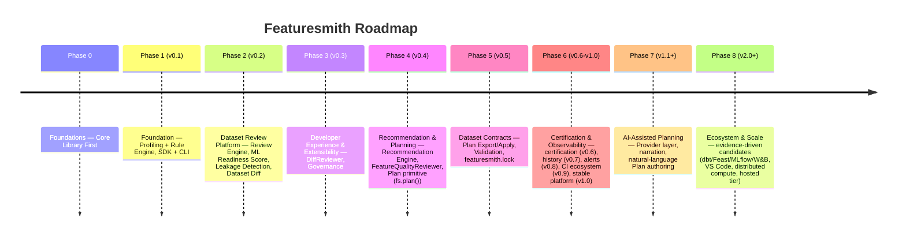

# Phases.md — Roadmap (Featuresmith)

Each phase compounds toward Featuresmith's North Star (`VISION.md` §4). "Every dataset deserves a code review" is still how Featuresmith introduces itself — that's Phases 0-2, already shipped. Phases 3 and 4 are also shipped (DiffReviewer, Governance, Recommendation Engine, Plan primitive). Everything from Phase 5 onward is the natural continuation of the category `VISION.md` §2 describes: once a dataset has been reviewed, findings surfaced, and a Plan created, the next question is "did applying the Plan actually work" — and the roadmap below is the answer, staged as one continuous lifecycle rather than a list of unrelated features. See `Flagship-Capabilities.md` for the five defining, long-term experiences this roadmap builds toward, and `features/Dataset-Contracts-And-Planning.md` for the full design of Phases 5-6's central capability.

Phases 0-4 are shipped (v0.4.0) and **frozen** — the v0.4.0 foundation is not unnecessarily refactored to serve later phases (`Architecture.md` §21). Everything from Phase 5 onward is the current plan, not a commitment — real usage and contributor capacity will reshape later phases before they're built.

**Sequencing principles carried through every phase:**
- The SDK (core library) is always the deliverable; the CLI, dashboard, and VS Code extension are never allowed to ship a capability the SDK doesn't already expose (`Architecture.md` §2). **The dashboard is a surface over the core, not the product itself** — no CI/CD gate or programmatic workflow anywhere in this roadmap depends on the dashboard existing or running.
- **Prove the deterministic engine before adding a new capability layer on top of it.** Review → Score → Leakage → Diff (Phases 1-2) had to work with zero AI involvement before Recommendation/Planning (Phase 4) began, and Plan/Export/Contract (Phases 4-5) has to work with zero AI involvement before AI-Assisted Planning (Phase 7) begins. AI is never a prerequisite for a core capability — only an enhancement layered on top of one that already works (`Design-Principles.md` "AI assists, never replaces").
- **The export/apply step never grows into an execution engine, and never defaults to silent execution.** Every phase that touches transformations (4-5, 8) generates real code for an external ecosystem; none of them introduce a Featuresmith-owned runtime, and none of them make a bare export/apply call mutate a user's dataset without an explicit opt-in (`Architecture.md` §20, `features/Dataset-Contracts-And-Planning.md` §7.2).
- **Every future subsystem is checked against the roadmap governance questions in `Architecture.md` §23** before it's added to this document as more than a candidate.

---

## Website Roadmap Model Mapping

The canonical roadmap is structured so public presentation surfaces (such as the website) map directly to four dynamic presentation buckets without requiring site restructuring as new versions ship:

- **CURRENT (Shipped)**: `v0.4.0` — Core Library, Review Engine (10 reviewers), ML Readiness Score (7 effective dimensions), Leakage Detection (6 pattern detectors), Dataset Diff, Centralized Recommendation Engine, `FeatureQualityReviewer`, and `Plan` primitive (`fs.plan()`).
- **NEXT (Committed Upcoming Release)**: `v0.5.0` — Dataset Contracts: Plan Export/Apply code generation dispatcher (sklearn/Polars/pandas), post-export re-review & diff validation, `featuresmith.contract` module (`DatasetContract` schema, `featuresmith.lock`, `featuresmith lock --check` CI drift-gating).
- **THEN (Grouped Future Evolution Stages)**: `v0.6.0` → `v1.0.0` — Continuous Certification (`featuresmith verify <hash>`), Quality History (`QualityHistory` storage), Scheduled Re-Review & Alerts (cron checks + notifications), CI/CD Contract Drift Gating (`featuresmith-action`), and Platform & API Stability (`v1.0.0` milestone).
- **THEN (Grouped Long-Term Evolution)**: `v1.1.0` → `v2.0.0` — AI-Assisted Planning (`AIProvider` layer, NL Plan authoring, chat), Ecosystem Exporters (dbt, Feast, MLflow/W&B run attachments), Cloud/Warehouse compute backends, and Hosted Collaboration Tier.

When `v0.5.0` ships, this mapping rolls forward cleanly: `v0.5.0` moves to **CURRENT**, `v0.6.0` becomes **NEXT**, `v0.7.0`–`v1.0.0` forms the first **THEN** block, and `v1.1.0`–`v2.0.0` forms the second **THEN** block.

---

## Phase 0 — Foundations: Core Library First (pre-release) — Shipped

**Objectives:** establish the `featuresmith-core` package, its public contracts, and the workspace/CI setup before any surface work begins.
**Delivered:** monorepo workspace (`packages/featuresmith-core`, `featuresmith-cli`, `featuresmith-dashboard` stub); `ruff`/`mypy --strict`/`pytest`/`import-linter` CI; core `Dataset`/`ProfileResult` Pydantic schemas; `Base*` interface stubs; `CONTRIBUTING.md`, `Rules.md`, `Architecture.md` published.
**Dependencies:** none.

---

## Phase 1 — Foundation: SDK + CLI MVP, Profiling + Rule Engine (v0.1) — Shipped

**Objectives:** prove the core value loop end-to-end via the SDK first, with the CLI as its first thin client.
**Delivered:** `fs.load()`/`fs.profile()`/`fs.analyze()`; `CsvConnector`, `ExcelConnector`, `ParquetConnector`, `DataFrameConnector` (pandas + Polars); Polars-based profiler; 8 seed rules (quality + statistical + naive leakage-by-correlation); `featuresmith analyze` CLI with Rich table and JSON output; exit-code CI gating.
**Dependencies:** Phase 0.

---

## Phase 2 — Dataset Review Platform: Review Engine, ML Readiness Score, Leakage Detection, Dataset Diff (v0.2) — Shipped

**Objectives:** compose the individually-useful primitives from Phase 1 into the product Featuresmith wants to be remembered by — a single command that performs a comprehensive engineering review of a dataset, backed by an explainable score, real leakage-pattern detection, and the ability to compare two snapshots the way `git diff` compares two commits.
**Delivered:**
- **Review Engine**: `ReviewEngine.run()` / `fs.review()` / `featuresmith review`, 8 of 12 planned reviewers (schema, quality, statistics, leakage), Review Categories, fault-isolated execution.
- **ML Readiness Score**: 0-100 composite score, 8 dimensions (2 split into sub-dimensions), always rendered with its underlying findings, versioned `scoring_version`.
- **Intelligent Leakage Detection**: 6 named pattern detectors (target correlation, identifier shape, timestamp anomalies, duplicate targets) merged per column.
- **Dataset Diff**: standalone `fs.diff()` / `featuresmith diff` engine comparing schema, structure, quality, distribution, and leakage between two snapshots.
**Dependencies:** Phase 1.

---

## Phase 3 — Developer Experience & Extensibility (v0.3) — Shipped

**Objectives:** meet developers where they already work, close the Review Engine's known gap (`DiffReviewer`), and publish project governance (`GOVERNANCE.md`).
**Delivered:** `DiffReviewer` integration (`fs.review(source, previous=...)` / `featuresmith review <source> --previous <snapshot>`); `GOVERNANCE.md` baseline published.
**Dependencies:** Phase 2.

---

## Phase 4 — Recommendation & Planning: the Recommendation Engine and the Plan primitive (v0.4) — ✅ **Shipped (Current)**

**Objectives:** close the gap between "here's a finding" and "here's what to do about it" — deterministically, no AI required — and introduce the **Plan**, the inspectable, serializable object every later Apply/Contract stage builds on.
**Delivered:**
- **Centralized Recommendation Engine**: `RecommendationEngine` merging findings from all review sections into a single ranked, explainable list of `Recommendation` objects with stable IDs (`rec.{prefix}.{col}`) and consistent confidence semantics.
- **FeatureQualityReviewer**: near-constant columns, redundant column pairs, and low-signal high-cardinality detection.
- **Plan Primitive**: `featuresmith.plan` module — `fs.plan(result, accept=[...])` and `featuresmith plan` compiling deterministic `Plan` objects from accepted recommendations.
- **Plan Rendering**: `PlanRenderer` and console/JSON outputs.
- **ML Readiness Score Dimension Reconciliation**: eliminated cardinality double-counting between `DataQualityDimension` and `ConsistencyDimension`; omitted `ClassBalanceDimension` pending minority-class detector implementation; bumped `SCORING_VERSION` to `0.3.0`.
**Dependencies:** Phase 2, Phase 3.

---

## Phase 5 — Dataset Contracts: Apply/Export, Validation, `featuresmith.lock` (v0.5.0) — **NEXT (Committed Upcoming Release)**

**Purpose:** Turn an accepted Plan into real, generated transformation code for an ecosystem the user already runs (scikit-learn, Polars, pandas), validate that the transformation actually resolved the issues without regression, and persist the dataset's validated state into a versioned, git-native **Dataset Contract** (`featuresmith.lock`).

**Major Capabilities:**
- **Export/Apply Dispatcher (`featuresmith.apply`)**: Generates clean, readable `sklearn.Pipeline`/`ColumnTransformer` code or Polars expression chains from an accepted Plan. **Default behavior is code generation; it never silently mutates a dataset in place without explicit opt-in.**
- **Post-Export Validation**: Automatically re-runs `fs.review()` and `fs.diff()` against the transformed dataset to verify that the readiness score improved and no critical regressions were introduced.
- **Dataset Contract Schema (`featuresmith.contract`)**: Schema storing dataset fingerprint, readiness score, leakage state, transformation lineage, and provenance (`contract_schema_version = "0.1.0"`).
- **CLI & SDK Contract Interface**: `fs.lock()` / `featuresmith lock` writing `featuresmith.lock`, `featuresmith lock --check` for CI drift-gating, and `featuresmith contract diff` for comparing two lockfiles.

**Why This Release Exists:** It closes the loop opened by Phase 4's `Plan` primitive. Without v0.5.0, a Plan is an inspectable draft; with v0.5.0, a Plan becomes testable code and a git-committable contract that CI can enforce.

**Out of Scope:**
- Proprietary transformation execution runtime (Featuresmith generates code for existing libraries).
- Automated scheduling or background orchestration (left to Airflow/Dagster/CI).
- AI narration of contract diffs (deferred to v1.1.0+).

**Dependencies:** Phase 4 (`Plan` primitive), Phase 2 (Review & Diff engines).

---

## Phase 6 — Continuous Certification, Observability & Platform Stability (v0.6.0 → v1.0.0) — **THEN (Grouped Future Evolution Stages)**

Phase 6 matures a Dataset Contract from a single-point snapshot into a continuous, observable, and certified trust asset across five versioned releases:

### v0.6.0 — Dataset Certification & Verification
- **Purpose**: Make a Dataset Contract's trust state legible outside the local development environment.
- **Major Capabilities**: Portable "Featuresmith-verified" trust badge and verification artifact; `featuresmith verify <hash>` CLI command that re-verifies a dataset against its lockfile hash for READMEs, dataset cards, or model registry metadata.
- **Why It Exists**: Allows data teams to share data quality guarantees with downstream consumers without exposing raw dataset content.
- **Out of Scope**: Hosted badge server or cloud verification service.

### v0.7.0 — Quality History & State Tracking
- **Purpose**: Track dataset quality and contract evolution over time across multiple runs.
- **Major Capabilities**: `QualityHistory` storage abstraction (local-file default); time-series dataset quality tracking; CLI/SDK history query interface; trend view renderer for the dashboard.
- **Why It Exists**: Enables teams to identify gradual data drift and quality degradation across dataset releases.
- **Out of Scope**: Multi-tenant cloud database storage.

### v0.8.0 — Scheduled Re-Review & Alerts
- **Purpose**: Automate recurring dataset reviews and notify teams of unexpected regressions.
- **Major Capabilities**: Cron-based local scheduler; `BaseNotifier` interface; threshold-based notifications via Slack, email, and webhooks on score regressions or schema drift.
- **Why It Exists**: Replaces manual review invocation with proactive automated monitoring.
- **Out of Scope**: Featuresmith-hosted SaaS cron service.

### v0.9.0 — CI/CD & Ecosystem Integrations around Contracts
- **Purpose**: Embed Dataset Contract drift checks natively into automated CI/CD pipelines.
- **Major Capabilities**: `featuresmith-action` GitHub Action support for contract drift gating (`featuresmith lock --check`); PR comment integration showing contract diff summaries.
- **Why It Exists**: Prevents unreviewed or degraded dataset schemas from being merged into main data branches.
- **Out of Scope**: Direct git provider webhook management.

### v1.0.0 — Stable Dataset Contract & Lifecycle Platform (Maturity Milestone)
- **Purpose**: Declare public API and schema stability for the core Featuresmith ecosystem.
- **Major Capabilities**: Freeze and declare 1.0 stability for `Plan`, `DatasetContract`, `ReviewResult`, and public SDK/CLI surface; formal deprecation policy enforcement (`Rules.md` §9); zero breaking changes without major version bumps.
- **Why It Exists**: Reaching `v1.0.0` represents engineering and product maturity: the complete deterministic lifecycle (Review → Score → Leakage → Diff → Plan → Apply → Contract → Certify → History → Gate) has been thoroughly battle-tested in production.
- **Out of Scope**: New major feature additions (v1.0.0 is dedicated strictly to stability, performance, and API freeze).

---

## Phase 7 & 8 — AI Assistance, Ecosystem Exporters & Scale (v1.1.0 → v2.0.0) — **THEN (Grouped Long-Term Evolution)**

Beyond `v1.0.0`, Featuresmith expands in two major evolution directions while preserving its deterministic local-first foundation:

### v1.1.0 → v1.x — AI-Assisted Planning & Narration
- **Purpose**: Enhance the deterministic core with optional AI-assisted narration, ranking, and natural-language plan authoring.
- **Major Capabilities**:
  - `AIProvider` pluggable interface (Ollama local default, OpenAI / Anthropic BYO-key opt-in).
  - Plain-language narrative summaries of findings and contract diffs (`AIReviewNarrator`).
  - **Natural-Language Plan Authoring**: `fs.plan(result, instruct="...")` translating plain-language instructions into identical `Plan` objects.
  - Interactive AI Chat grounded strictly in precomputed `ProfileResult` and `ReviewResult` metadata (never raw rows).
- **Guarantees**: AI is strictly optional and layered on top (`Design-Principles.md` "AI assists, never replaces"). The core engine remains 100% functional with AI disabled.

### v2.0.0+ — Ecosystem Exporters, Cloud Scale & Hosted Tier (Evidence-Driven)
- **Purpose**: Adapt Featuresmith Contracts to distributed enterprise data stacks and team collaboration.
- **Major Capabilities (Candidate Pool, Prioritized by Real Demand)**:
  - **Ecosystem Exporters**: dbt model-stub exporter, Feast feature-definition generator, MLflow / Weights & Biases run-metadata contract attachment.
  - **Warehouse & Cloud Pushdown**: Pushdown profiling connectors for DuckDB, Snowflake, BigQuery, and S3/GCS.
  - **Optional Compute Backends**: Spark/Ray profiling backends for multi-terabyte datasets (profiling only, never execution engine).
  - **Hosted Collaboration Tier**: Cloud dashboard, multi-user role-based access control, shared contract registry, and team alert management.

---

## Version-by-Version Summary Table (v0.1.0 → v2.0.0+)

| Version | Lifecycle Bucket | Focus / Theme | Major Work & Deliverables | Status |
|:---:|:---:|---|---|:---:|
| **v0.1.0** | Historical | Foundation: SDK + CLI MVP | Profiling Engine, 8 Seed Rules, `featuresmith analyze` CLI | ✅ Shipped |
| **v0.2.0** | Historical | Dataset Review Platform | Review Engine, ML Readiness Score, Leakage Detection, Dataset Diff | ✅ Shipped |
| **v0.3.0** | Historical | DX & Extensibility | `DiffReviewer` reconciliation, `GOVERNANCE.md` baseline | ✅ Shipped |
| **v0.4.0** | **CURRENT** | Recommendation & Planning | Centralized Recommendation Engine, `FeatureQualityReviewer`, `Plan` primitive (`fs.plan()`) | ✅ **Shipped** |
| **v0.5.0** | **NEXT** | Dataset Contracts | Export/Apply dispatcher (`featuresmith.apply`), post-export validation, `DatasetContract` schema, `featuresmith.lock` | 🔜 **Committed** |
| **v0.6.0** | **THEN** | Dataset Certification | Portable trust badge, `featuresmith verify <hash>` CLI | 💡 Candidate |
| **v0.7.0** | **THEN** | Quality History | `QualityHistory` local storage abstraction, dashboard trend view | 💡 Candidate |
| **v0.8.0** | **THEN** | Scheduled Re-Review | Cron scheduler, `BaseNotifier`, Slack/email/webhook alerts | 💡 Candidate |
| **v0.9.0** | **THEN** | CI/CD Contract Gating | `featuresmith-action` support for `featuresmith lock --check` | 💡 Candidate |
| **v1.0.0** | **THEN** | Platform & API Stability | API & Schema Freeze for `Plan`, `DatasetContract`, and public SDK surface | 🎯 **Maturity Milestone** |
| **v1.1.0+** | **THEN** | AI-Assisted Planning | `AIProvider` interface (Ollama/OpenAI/Anthropic), NL Plan authoring, AI chat | 💡 Exploratory |
| **v2.0.0+** | **THEN** | Ecosystem Exporters & Scale | dbt/Feast/MLflow exporters, DuckDB/Snowflake pushdown, Hosted tier | 💡 Exploratory |

---

## What NOT to Build (Architectural Boundaries)

To protect Featuresmith's developer-first identity and maintainability, the following are explicitly non-goals across all roadmap versions:

1. **No proprietary transformation execution runtime**: Featuresmith generates readable code for established ecosystems (Polars, pandas, scikit-learn, dbt); it will never execute dataset transformations inside a custom engine.
2. **No silent data mutation by default**: `featuresmith apply` generates code for review; running generated code against data is always an explicit opt-in.
3. **No premature backend abstractions**: Polars remains the core local profiling engine; DuckDB or Spark pushdown backends are introduced only when demonstrated multi-terabyte dataset demand exists.
4. **No mandatory AI dependencies**: AI assistance (v1.1.0+) is strictly layered on top; all core analysis, recommendation, planning, and contract features function 100% deterministically with zero network/AI calls.
5. **No hosted SaaS infrastructure before v2.0.0**: Local-first CLI, SDK, and contract files remain 100% free and open source. Hosted team infrastructure is reserved strictly for v2.0.0+ candidate evaluation.
