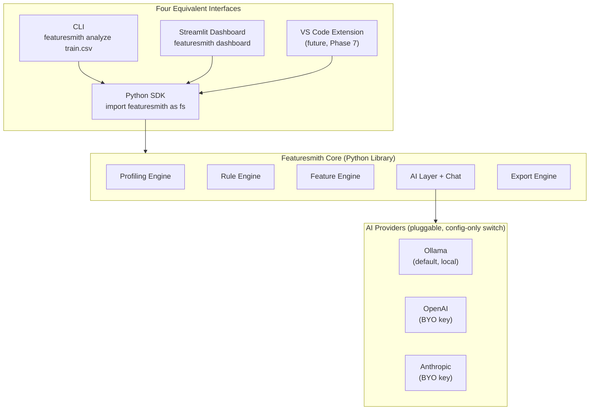
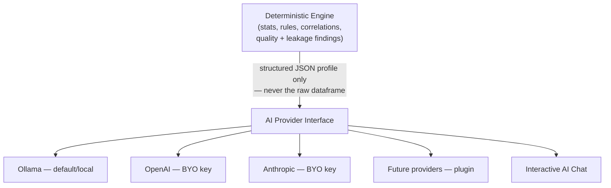
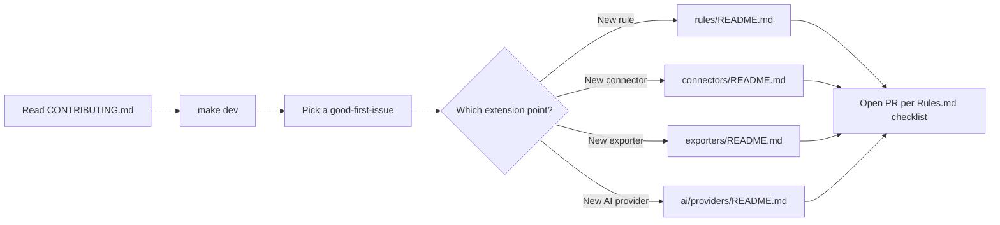

# Project Plan — Featuresmith
### The Developer Toolkit for Trustworthy Structured Data

**Featuresmith is to datasets what Ruff is to Python code** — a fast, no-nonsense check you run before you trust what you're about to build on. It helps developers understand, validate, and improve structured data before it reaches production, the same way a linter catches problems before they reach a merge.

This is the master reference document. It summarizes the full plan and links out to the detailed docs:

- [`Why-Featuresmith-Exists.md`](./Why-Featuresmith-Exists.md) — the problem, in one page: why fragmented tooling isn't enough
- [`Flagship-Capabilities.md`](./Flagship-Capabilities.md) — the North Star experiences the roadmap is building toward (future vision, not shipped)
- [`Design-Principles.md`](./Design-Principles.md) — the principles that guide every design decision, for contributors and maintainers
- [`PRD.md`](./PRD.md) — vision, problem, personas, goals/non-goals, success metrics
- [`Architecture.md`](./Architecture.md) — system design, modules, folder structure, plugin system
- [`Rules.md`](./Rules.md) — the development bible: standards, testing, PR/release process
- [`Phases.md`](./Phases.md) — roadmap from MVP to v3.0+ with issues/milestones/labels
- [`Design.md`](./Design.md) — product design system, UI principles, tokens

---

## 0. Philosophy — Why Featuresmith Exists

Software engineering runs on a shared discipline: tests, linters, formatters, static analysis, CI gates that catch problems before they reach production. Datasets get none of this. A CSV can carry silent leakage, a drifted distribution, or a broken assumption straight into a model, and nothing stops it the way a failing test stops a bad commit.

Our mission, in one sentence: **make data quality as routine as code quality.** Everything in this repo — today's profiler and rule engine, tomorrow's drift detection and plugin ecosystem, the AI layer at any point in between — exists in service of that one sentence, not the other way around.

Put another way: **every dataset deserves a code review.** Code review didn't emerge because writing code was inherently untrustworthy — it emerged because catching problems before they ship is cheaper than catching them after. Datasets deserve the same review discipline, run automatically, every time, before they touch a model. That's the gap Featuresmith fills, and it's why the product isn't shaped like a report generator: reports get opened once and forgotten, the way an ESLint HTML report would if nobody ran it in CI. Featuresmith is shaped like `ruff`, `pytest`, or `pre-commit` — a check you run, not a dashboard you remember to visit — with `featuresmith analyze data.csv` designed from day one to sit in CI next to your other gates (`Architecture.md` §2, §13).

This is not a rebrand of Featuresmith as a generic profiling or validation tool — its specific position is that the missing piece in existing tools (`PRD.md` §3-4) is the *reasoning* step: turning a finding into an explanation, a follow-up answer, and a reviewable code artifact, not just another chart. AI is one layer in that reasoning step — an assistant that narrates, ranks, and answers questions about facts a deterministic engine already computed — not the product itself; the profiling and rule engine work identically with AI turned off entirely (`Architecture.md` §7.4).

If you need a one-line description: **Featuresmith is a developer-first toolkit for understanding, validating, monitoring, and improving structured data** — built, like the rest of your engineering tooling, to run locally by default, extend through plugins, and never require handing your data to a cloud service you didn't choose (`Architecture.md` §1, §7). See `Why-Featuresmith-Exists.md` for the full case.

## 1. Naming

The project is named **Featuresmith** — a craftsmanship metaphor (forging raw data into usable features) that's pronounceable, memorable, and scales cleanly into a company/brand name later. Package name: `featuresmith` (core), with thin surface packages `featuresmith-cli`, `featuresmith-dashboard`, and — from Phase 7 — `featuresmith-vscode`. Config file: `.featuresmith.yml`. Import: `import featuresmith as fs`. CLI binary: `featuresmith`.

## 2. One-Paragraph Summary

Featuresmith is not another EDA report generator. It's a closed loop, delivered from a single reusable Python core: it computes rigorous statistics deterministically, detects data-quality and leakage issues with a rule engine, uses a pluggable AI provider strictly as a *narrator, ranker, and conversational assistant* (never a calculator, and never required — see `Architecture.md` §7.4) to explain findings in plain language, answer follow-up questions, and prioritize recommendations, and — critically — exports accepted recommendations as real, tested, production-grade code (sklearn pipelines, notebooks). Every one of these capabilities is exposed identically whether accessed as a Python import, a CLI command, a Streamlit dashboard, or (from Phase 7) a VS Code extension — because all four are thin clients over exactly one core library. See `PRD.md` §4 and §17 for the full competitive analysis.

## 3. System at a Glance

Full detail in `Architecture.md` §2. The core architectural commitment: **all business logic lives only inside `featuresmith-core`; every interface is a thin wrapper calling the same SDK — no duplicated logic, no duplicated APIs.**

## 4. Four Ways to Use Featuresmith

| Interface | Example | When to reach for it |
|---|---|---|
| **1. Python Library** | `import featuresmith as fs` `profile = fs.analyze(df)` | Notebooks, scripts, programmatic pipelines — the foundation every other surface builds on |
| **2. CLI** | `featuresmith analyze train.csv` | CI gating, quick terminal checks, scripting outside Python |
| **3. Streamlit Dashboard** | `featuresmith dashboard` | Interactive review, stakeholder walkthroughs, the AI chat panel |
| **4. VS Code Extension** *(future, Phase 7)* | Inline findings + chat on file open | In-editor review without context-switching |

All four call `featuresmith.api` and return the same typed results for the same input — this "surface parity" is a tested, CI-enforced property, not a design aspiration (`Rules.md` §5, `PRD.md` §12).

## 5. AI Architecture at a Glance

The deterministic engine computes everything numeric; the AI layer only ever receives that precomputed, structured profile and is responsible solely for explanations, ranking, and conversational answers — never computation. Provider selection is entirely config-driven (`ai.provider: ollama|openai|anthropic` in `.featuresmith.yml`); no code changes are ever required to switch. Full detail, including the `AIProvider` protocol and grounding contract, in `Architecture.md` §7.

**Interactive AI Chat** (Phase 6 roadmap capability, not yet shipped): once live, users will be able to ask questions like "Why is this feature leakage?", "Explain this chart", "What encoding should I use?", "Explain this to a beginner", "Generate sklearn preprocessing", or "Compare two columns" — all answered from the already-computed profile, never by re-reading the dataset. Designed to be available identically from the SDK, CLI, and dashboard (`Architecture.md` §7.3).

## 6. Roadmap Overview

The phases below are sequenced for a reason: **prove data quality and understanding first, make it a habit developers reach for, then let AI assist rather than lead.** AI is deliberately the second-to-last and last phase, not the first — every phase before it (quality, developer experience, feature intelligence, observability) works completely on its own, with no AI dependency at all.

| Theme | Phases | What it's building toward |
|---|---|---|
| Foundation | 0-1 | A trustworthy, deterministic core: profiling, quality/leakage rules, CLI + SDK |
| Data Quality | 2 | Dataset diffing, drift detection, schema evolution, a deterministic quality score |
| Developer Experience | 3 | Dashboard, connectors, GitHub Actions/CI integration, plugin ecosystem |
| Feature Intelligence | 4 | Feature engineering engine, ranked recommendations, code/notebook export |
| Data Observability | 5 | Scheduled re-profiling, alerts, quality history, team dashboards |
| AI Assistant | 6 | Narration and AI-enhanced ranking, layered onto Phase 4's recommendations; Interactive Chat |
| AI Data Engineer | 7 | Editor integration, natural-language interface — AI's most advanced expression, still grounded and reviewable |

| Phase | Version | Focus |
|---|---|---|
| 0 | pre-release | Foundations — core library first |
| 1 | v0.1 | Foundation — SDK + CLI MVP: EDA + rule engine |
| 2 | v0.2 | Data Quality — dataset diffing + drift detection |
| 3 | v0.3-v0.4 | Developer Experience — dashboard, connectors, CI/CD, plugins |
| 4 | v0.5 | Feature Intelligence — feature engine + export layer |
| 5 | v0.6-v1.0 | Data Observability — monitoring, alerts, quality history |
| 6 | v1.x | AI Assistant — provider layer, narration, Interactive Chat |
| 7 | v2.0 | AI Data Engineer — VS Code, natural-language interface |
| 8 | v3.0+ | Scale & Hosted Tier — distributed compute, optional SaaS |

Full detail, acceptance criteria, and suggested GitHub issues per phase in `Phases.md`.

## 7. Tech Stack — Recommendations & Reasoning

| Area | Recommendation | Reasoning |
|---|---|---|
| Core language | Python 3.11+ | Ecosystem fit for ML audience; non-negotiable for adoption |
| DataFrame engine | **Polars (primary), Pandas (compat shim only)** | Polars' lazy execution and multi-threaded performance matter directly for the "size-tiered scalability" requirement in `Architecture.md` §17; pandas is kept only as an interop layer since much of the ecosystem (sklearn, some connectors) still expects it |
| Large-data query engine | **DuckDB** (Planned for Phase 8) | Zero-infra SQL/analytical engine, exceptional for out-of-core aggregation and works beautifully as a pushdown layer for the SQL/warehouse connectors |
| Columnar interchange | **Apache Arrow** | Zero-copy interop between Polars, DuckDB (planned), and Parquet — avoids redundant serialization at every layer boundary |
| Monorepo/workspace tooling | **uv workspaces** | Manages `featuresmith-core`, `featuresmith-cli`, `featuresmith-dashboard` as independently versioned packages sharing one lockfile-driven dev environment — directly supports the hard package-boundary requirement in `Architecture.md` §4 |
| API layer (future hosted tier) | **FastAPI** | Type-hint-driven, async-native, pairs naturally with Pydantic schemas already used internally; becomes just another thin surface over `featuresmith.api` |
| Dashboard (v1) | **Streamlit**, not Next.js | Fastest path to a Python-native, plugin-author-friendly interactive UI during early, fast-iterating phases (`Architecture.md` §14); a Next.js rewrite is explicitly deferred, not rejected — revisit once the product surface stabilizes (Phase 8+) |
| Charting | **Plotly/Altair (Vega-Lite specs)** | Declarative chart specs render consistently across CLI, dashboard, and static HTML report (`Architecture.md` §11) |
| Validation/schema | **Pydantic v2** | Already the contract layer for every internal stage boundary; validates config (`.featuresmith.yml`) too |
| Modeling utilities | **Scikit-learn** | Lowest-common-denominator export target; nearly every downstream framework can consume a sklearn-compatible pipeline |
| Feature engineering libs | **Feature-engine used selectively; Featuretools deferred** | Feature-engine's sklearn-compatible transformers integrate cleanly with the export layer today; Featuretools' automated deep feature synthesis is heavier and better suited as an optional plugin once the core recommendation loop is proven |
| Data validation | **Pandera now; Great Expectations later as an export target** | Pandera is lightweight and Pydantic-adjacent, a natural fit for validating generated pipeline outputs in tests; Great Expectations is heavier but valuable as a future *export format* for teams already standardized on it |
| Experiment/artifact tracking | **MLflow, optional integration only** | Not core — Featuresmith produces artifacts, it doesn't need to own experiment tracking |
| **AI provider abstraction** | **Custom lightweight `AIProvider` protocol (3 methods: narrate, rank, chat)** | A full agent framework (LangChain, LlamaIndex) would pull in far more surface area than three narrowly-scoped methods need, and would make the "AI never touches raw data" grounding guarantee harder to audit; a small, hand-rolled protocol keeps the contract auditable and keeps provider plugins trivially simple to write |
| Local LLM runner | **Ollama** (default) | Simplest, most widely adopted way to run local models with a stable HTTP API — no GPU-management complexity pushed onto the user; ships as the zero-config default experience |
| Cloud LLM providers | **OpenAI, Anthropic** (opt-in, BYO key) | The two most widely adopted hosted APIs; both added as optional `pyproject.toml` extras (`featuresmith[openai]`, `featuresmith[anthropic]`) so the core install stays dependency-light |
| Containerization | **Docker**, multi-stage build | Standard for reproducible dev environments and eventual hosted-tier deployment |
| CI/CD | **GitHub Actions** | Free for OSS, tight PyPI trusted-publishing integration; workflow matrix runs per-package (core/cli/dashboard) given the monorepo structure |
| Package distribution | **PyPI, trusted publishing (OIDC)**, independently per package | No long-lived API tokens to leak; independent versioning supports the "thin surface, stable core" principle (`Rules.md` §9) |
| Docs site | **MkDocs (Material theme), not Docusaurus** | Python-native tooling keeps the docs build in the same language as the project, lowering the barrier for contributors to fix docs |
| IDE integration | **VS Code extension (TypeScript, thin client) + Jupyter extension** | Deferred to Phase 7 — a thin client over the existing CLI/SDK rather than a reimplementation, per `Phases.md` Phase 7 |

### What to avoid early

- **Don't** build a custom plugin-discovery mechanism — Python entry_points already solve this for rules, connectors, exporters, *and* AI providers (`Architecture.md` §6).
- **Don't** adopt a heavyweight agent framework for the AI layer — the grounding guarantee (AI never computes, never sees raw data) is easiest to audit with a minimal, hand-rolled `AIProvider` protocol.
- **Don't** adopt Featuretools or Great Expectations as hard dependencies before v0.5 — both are excellent but heavy; make them optional extras.
- **Don't** start the Next.js dashboard in parallel with Streamlit — maintaining two UIs during early rapid iteration splits focus for no early benefit.
- **Don't** let the CLI or dashboard implement *any* logic beyond argument parsing and rendering — every capability, including the AI chat, is written once in `featuresmith-core` and only ever called, never duplicated (`Rules.md` §10, §21).

## 8. Product Thinking — Challenging the Plan Further

**What changed and why it's an improvement, not just a rename:**

- **Collapsing "CLI-first" into "core-first" is the single biggest architectural upgrade in this revision.** The previous plan treated the CLI as the primary interface with a dashboard bolted on later; that ordering quietly encourages logic to accrete in the CLI layer. Making the SDK the actual product — with CLI, dashboard, and (later) VS Code extension as equally thin, equally disposable clients — is what makes "no duplicated logic" enforceable rather than aspirational, and it's what makes a future hosted API tier (Phase 8) nearly free to add later.
- **Promoting AI providers to a first-class, symmetric plugin category** (alongside connectors/rules/exporters) rather than a single hardcoded LLM integration removes a real adoption blocker: teams with existing OpenAI or Anthropic contracts, or strict data-residency requirements favoring local Ollama, can now adopt Featuresmith without a fork.
- **Sequencing the deterministic loop — quality, developer experience, feature intelligence, observability — entirely before the AI Assistant phase (Phase 6)** reflects that trust has to be earned by the deterministic engine first: a user should be able to fully adopt Featuresmith, export a working pipeline, and wire it into CI without ever touching an AI provider. When AI does arrive, it enhances the same `RecommendationEngine` and answers questions about the same findings — it never becomes a second, parallel path competing with the deterministic one. "Generate sklearn preprocessing" as a chat capability calls the exact exporter Phase 4 already shipped, rather than chat getting its own divergent implementation.
- **A monorepo of independently-versioned packages**, rather than one flat package, was not explicitly asked for but follows directly from "no duplicated logic, no duplicated APIs" taken seriously — it's the difference between a principle stated in prose and a boundary a linter enforces on every PR (`Rules.md` §10).

### Guardrails carried forward unchanged

The core trust boundary from the original plan — the AI layer never computes a statistic, only narrates and ranks precomputed, structured data — is not just preserved but *extended* to the new chat feature explicitly, since a conversational interface is the most tempting place for that boundary to quietly erode ("just let it peek at the dataframe to answer this one question better"). `Architecture.md` §7.2 and `Rules.md` §5/§21 make this an explicitly tested, reviewed boundary, not just a stated intention.

## 9. Contributor Onboarding Path (Summary)

Full contributor rules, PR checklist, and review process in `Rules.md` §17-20.

## 10. How to Use This Documentation Set

For a team (human or AI coding assistant) implementing this project: start with `Why-Featuresmith-Exists.md` for the problem, read `PRD.md` for *why* the product is shaped the way it is, `Design-Principles.md` for the standing decisions every future feature should be checked against, `Architecture.md` for *how it's structured* (especially §2 on the core-first architecture and §7 on the AI provider/chat design), `Rules.md` before writing any code for *how it must be written* (especially §3 and §10 on the core/surface package boundary), `Phases.md` for *what to build first*, and `Design.md` when touching any user-facing surface. This `Project_Plan.md` is the map — the other files are the territory.
