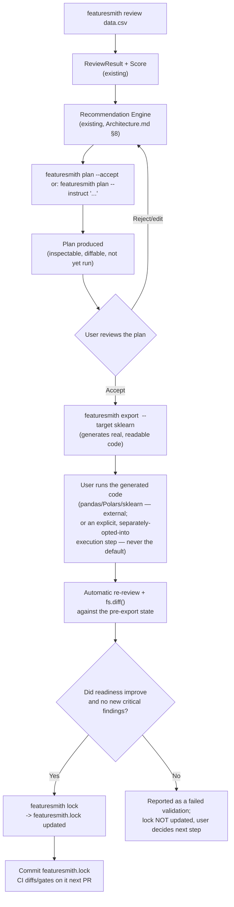
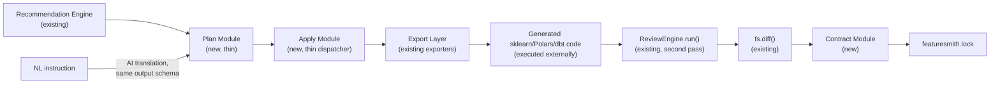

# Dataset Contracts & the Plan/Export Lifecycle

> **Status: Design Only — Not Yet Implemented.** Per `Rules.md` §4 (Documentation-First Development), this document exists so implementation can begin against an agreed design; no code referenced here exists yet. It formalizes the direction set in `VISION.md` §2: Featuresmith is the Dataset Contract / Dataset State Management layer for structured data, and this document is the concrete mechanism — Plan, Export/Apply, Contract — that makes a dataset's state provable rather than assumed. Placement on the roadmap is in `Phases.md` Phases 4-6. **Naming note:** "Apply" and "Export" are used interchangeably throughout this document for the code-generation step; the final public name is an implementation-time decision (§10), not fixed here — what is fixed is the default behavior: generate readable code, don't silently execute it.

## 1. Overview

Everything Featuresmith ships today (`features/Review-Engine-Architecture.md`, `features/ML-Readiness-Score.md`, `features/Dataset-Diff-And-Leakage-Detection.md`) answers one question: **what is true about this dataset right now?** This document answers the next one: **given what's true, what should change, how do we prove the change worked, and how do we make the result of all of it something a team can trust later without re-deriving it?**

Three new, small capabilities answer that, in order:

1. **Plan** — an accepted recommendation becomes a deterministic, inspectable, serializable object describing exactly what would change, before anything runs. Plan is the central domain primitive this whole lifecycle is built around — see §3.1.
2. **Apply/Export** — a thin dispatcher that turns an accepted Plan into real, generated code for an ecosystem the user already runs (Polars, pandas, scikit-learn, dbt) — never a Featuresmith-owned execution engine. **By default, this step generates and hands back readable code; it does not silently mutate the user's dataset in place.** See §7.2 for exactly what "Apply" means and does not mean.
3. **Contract** — the versioned, diffable artifact (`featuresmith.lock`) that persists a dataset's state (schema fingerprint, readiness score, leakage findings, transformation lineage) so it can be committed to git, diffed in a pull request, gated in CI, and referenced by anything downstream that needs to trust the data.

None of the three are new engines. Plan reuses the existing Recommendation Engine (`Architecture.md` §8). Apply/Export reuses the existing Export Layer (`Architecture.md` §12). Contract reuses the existing Diff primitive (`Architecture.md` §5, `features/Dataset-Diff-And-Leakage-Detection.md`) as its comparison mechanism. What's new is the loop that connects them and the artifact that persists what the loop produced — see §8 for the full state-machine view.

### 3.1 Plan as the central domain primitive

Plan is not merely the output of a "Recommendation Engine" — it is the one representation every future path through the lifecycle converges on, and every future source of a proposed change must resolve into it. A `Plan` is:

- **Deterministic** — the same accepted findings (or the same natural-language instruction, translated once) always produce the same Plan, byte-for-byte excluding timestamps (`§13`'s determinism tests).
- **Inspectable** — every step is readable before anything runs, with a rationale traceable back to a specific finding.
- **Serializable** — a Pydantic object with a versioned schema (`plan_schema_version`), diffable against another Plan or against a dataset's current state (§7.1).
- **Versionable** — evolves independently of `engine_version`/`scoring_version`, following the precedent `features/ML-Readiness-Score.md` §11 already set.
- **Explainable** — every step carries a rationale and a confidence score inherited from the Recommendation Engine, never a bare instruction with no justification attached.
- **Independent of AI** — a Plan produced from a rule-based recommendation and a Plan produced from a natural-language instruction are the identical object, reviewed and applied identically (§20.4). AI involvement is invisible downstream of Plan.
- **Independent of the eventual execution backend** — a Plan describes *what* should change, never *how* a specific target (sklearn, Polars, dbt) expresses it; that translation is Apply/Export's job, entirely downstream and swappable without touching the Plan.

This is a deliberate design constraint, not just a description of what Plan happens to be: **exactly one Plan representation exists, and every future authoring path — a rule/reviewer finding, a user instruction, a future AI translation — must resolve into it.** This is what prevents a second, competing recommendation or transformation-description system from emerging as the product grows (`Architecture.md` §23.1's guardrail question 3 — "is the abstraction used by more than one real component" — is answered here by design, not by accretion).

## 2. Vision

**A dataset review that nobody acts on is a report. A dataset review that produces a fix, proves the fix worked, and remembers that it happened is a contract.** Featuresmith's acquisition message — "every dataset deserves a code review" — gets a team to run `featuresmith review` once. What keeps them running it is the same thing that keeps a team running `git diff` and a CI type-check: the tool sits in the critical path and has already saved them from a mistake they didn't see coming.

The reference model is not another EDA tool — it's **Terraform's plan → apply → state loop**, applied to dataset transformations instead of infrastructure, and **a package manager's lockfile**, applied to dataset state instead of a dependency tree. Terraform doesn't reimplement the AWS API; it wraps it in a reviewable plan and a persisted state file. A lockfile doesn't reimplement `pip`/`npm`; it pins what actually got resolved so a build is reproducible later. Featuresmith's Plan/Export/Contract lifecycle does the same for data: it never reimplements Polars or scikit-learn, it wraps a proposed change in something reviewable — generating real code by default rather than running it — and persists what actually happened once a human-approved change has been externally executed and validated.

## 3. Goals

- Turn an accepted recommendation into a **Plan**: a typed, serializable, human-readable description of a proposed transformation, inspectable before anything runs — the data equivalent of `terraform plan`.
- Let a Plan be authored two ways — from a rule-based recommendation, or from a natural-language instruction translated by the AI layer — and produce **the exact same Plan object** either way, so downstream review, Apply, and the Contract never need to know which authoring path was used.
- **Apply** an accepted Plan by generating real, readable code for scikit-learn, Polars, or (later) dbt — code the user can read, run outside Featuresmith, and own — never by executing a proprietary transformation runtime.
- Automatically re-run the Review Engine and `fs.diff()` after an Apply, so "did this fix work" is answered by the same deterministic engine that found the problem in the first place, not by trust in the plan.
- Persist dataset state into a versioned **Dataset Contract** (`featuresmith.lock`): schema fingerprint, readiness score, leakage findings, and the lineage of Plans applied to reach this state.
- Make the Contract a **git-native, CI-first artifact**: committed alongside code, diffable in a pull request, and gate-able with the same deterministic exit-code convention `featuresmith review` already uses (`features/Dataset-Review-PRD.md` §7.4).
- Make **dataset provenance** answerable in one command: given a Contract, show exactly what state a dataset was in and what sequence of Plans produced it.
- Enable **dataset certification**: a portable, verifiable artifact ("this dataset passed Featuresmith review at contract `<hash>`") that can be referenced from a README, a dataset card, or model-registry metadata without exposing the underlying data.

## 4. Non-Goals

- **Not a transformation execution engine.** Apply never runs a proprietary DSL or holds execution state of its own — it generates code for pandas/Polars/scikit-learn/dbt and stops. See `Architecture.md` §20.3 for the full list of things this capability deliberately does not become (orchestration, distributed execution, feature stores, AutoML, no-code).
- **Not an orchestrator.** Featuresmith does not schedule when a Plan runs or retry a failed Apply — that's Airflow/Dagster/Prefect's job, and an exported pipeline is simply a step those tools can call.
- **Not a general-purpose data versioning/lineage system (e.g., DVC).** The Contract records *Featuresmith's* view of dataset state and the Plans it applied — it does not manage raw file storage, branching, or arbitrary lineage graphs outside its own lifecycle.
- **Not a guarantee that an applied Plan is correct in a domain sense.** Featuresmith proves the transformation ran as planned and that the resulting dataset passes review again — it cannot know whether the underlying business logic was the right thing to do. A human still accepts every Plan before Apply, consistent with `PRD.md` §6.
- **Not required for Featuresmith to be useful.** `featuresmith review`, the ML Readiness Score, leakage detection, and `fs.diff()` are all complete, valuable products with this capability entirely absent — this is an additive lifecycle extension, not a rework of what's shipped.
- **A Plan authored from natural language is not auto-applied.** NL input populates the same Plan object a rule-based recommendation would, subject to the identical review-before-apply gate (§7.4) — natural language is an authoring convenience, never an authorization shortcut.

## 5. User Stories

- As an ML engineer, I want `featuresmith review` to end in a concrete, inspectable plan for fixing what it found, not just a list of problems I have to translate into code myself.
- As a data scientist, I want to see exactly what a proposed transformation will do — which columns, what operation, what the generated code looks like — before I run it, the same way I'd review a `terraform plan` before `apply`.
- As an MLOps engineer, I want the transformation code Featuresmith generates to be real scikit-learn/Polars code I can commit, test, and run in our existing CI — not a black box only Featuresmith can execute.
- As a data engineer, I want to know, after applying a fix, whether it actually improved the dataset's readiness score and didn't introduce a new problem — automatically, not by re-running a manual review myself.
- As a team lead, I want a `featuresmith.lock` file committed next to our training data so a PR that changes the dataset shows a diff of what changed in its *quality state*, not just its byte contents.
- As an MLOps engineer, I want CI to fail if a merged PR's dataset contract doesn't match what's committed, the same way a lockfile mismatch fails a dependency-install step today.
- As a data scientist, I want to ask "drop columns with more than 50% missing values and one-hot encode the categoricals" in plain language and get back an inspectable plan I can review before accepting it — not code that just runs.
- As a researcher publishing a dataset, I want a way to show downstream users "this dataset passed a Featuresmith review at this specific state" without having to re-share my own analysis notes.

## 6. User Workflow



A typical session: review a dataset, accept one or more findings' recommendations (or describe the fix in natural language), inspect the resulting Plan, export it as real code (and run that code, in the user's own environment or via an explicit opt-in execution step), and let Featuresmith's own Review Engine confirm the fix worked before it's allowed to update the committed Contract. Nothing after "accept" happens without the human step at `F`; nothing after "export" updates the Contract without the validation step at `J`.

## 7. Product Requirements

### 7.1 Plan requirements

- A Plan is a Pydantic-modeled, fully serializable object: an ordered list of `PlanStep`s, each with the target column(s), the operation, the rationale (traced back to the originating finding), and a confidence score inherited from the Recommendation Engine.
- A Plan must be producible from two authoring paths — a set of accepted recommendation IDs, or a natural-language instruction — and both paths must terminate in the identical `Plan` schema. The AI layer's role in the NL path is translation only; it never adds a step the deterministic recommendation set wouldn't also justify without an explicit, separately-flagged "AI-authored, unverified" step type for instructions with no corresponding rule finding.
- A Plan is diffable against another Plan and against a dataset's current schema, so "what would this plan actually change" is answerable without applying it.
- A Plan never mutates data. Producing a Plan has the same read-only guarantee as `fs.review()`.

### 7.2 Apply/Export requirements

- **Naming and default semantics:** this capability's job, by default, is to turn an accepted Plan into real, readable code — it is closer to `fs.export(plan, target=...)` than to an in-place data mutation, and the documentation and eventual API naming should make that unambiguous. "Prove state, don't own execution" (`Design-Principles.md`) means Featuresmith does not, by default, silently mutate a user's dataset in place or become the thing standing between a user and their production execution environment. Whatever the final command/function is called (`apply`, `export`, or something else — an implementation-time naming decision, not fixed by this document), its default behavior is: consume one accepted Plan, produce one `ExportArtifact` via the existing Export Layer (`Architecture.md` §12) — a `sklearn.Pipeline`/`ColumnTransformer`, a Polars expression chain, or (later) a dbt model stub — and hand it back to the user to run.
- Generated code must be readable, commentable, and traceable line-by-line back to the Plan step that produced it — the same "generated code as a design-reviewed artifact" bar the existing exporters already meet (`Architecture.md` §12).
- **Controlled execution is a distinct, explicitly-opted-into capability, never the default.** A future, separately-flagged execution path (e.g., an explicit `--execute` flag or config setting) may run the generated code against the dataset the user is already working with, for interactive/CLI convenience — but only when the user has explicitly asked for that, never as what a bare `apply`/`export` call does on its own. Both the export-only path and the explicit-execution path must produce identical generated code; Featuresmith never holds transformation state that only its own runtime can interpret, and execution (when opted into) still runs the same real Polars/sklearn/dbt code a user could have run themselves.
- A failed Apply/Export (e.g., a column referenced in the Plan no longer exists) must fail loudly with an actionable error, never partially apply.

### 7.3 Validation requirements

- After Apply, Featuresmith automatically re-runs `fs.review()` on the resulting dataset and `fs.diff()` between the pre- and post-apply states — this is not an optional step a user must remember to trigger.
- A Plan is only considered "validated" if the post-apply readiness score is greater than or equal to the pre-apply score AND no new critical-severity finding was introduced. Anything else is surfaced as a failed validation, with the diff shown, and the Contract is not updated — the user decides whether to revert, adjust the plan, or accept the regression explicitly with a documented override.

### 7.4 Contract requirements

- `featuresmith.lock` is a single, git-diffable, human-readable-enough (YAML or JSON, matching `.featuresmith.yml`'s format per `Architecture.md` §15) file per dataset or per project, versioned with its own schema version independent of `engine_version` and `scoring_version` (`features/Review-Engine-Architecture.md` §8.5, `features/ML-Readiness-Score.md` §11).
- A Contract records: a content-addressed schema fingerprint, the readiness score and per-dimension breakdown at lock time, all active leakage/critical findings at lock time, and an ordered lineage of applied Plans (each referencing its originating recommendation/instruction) since the previous lock.
- `featuresmith lock` (CLI) / `fs.lock(...)` (SDK) writes or updates the file; `featuresmith lock --check` (CI mode) verifies the current dataset state matches the committed contract and exits non-zero on mismatch — mirroring `featuresmith review --fail-on`'s exit-code convention (`features/Dataset-Review-PRD.md` §7.4) exactly, so existing CI configs generalize without new mental models.
- Two Contracts are diffable (`featuresmith contract diff old.lock new.lock`), surfacing score deltas, newly introduced or resolved findings, and the Plans applied in between — reusing `fs.diff()`'s comparison primitive (`features/Dataset-Diff-And-Leakage-Detection.md`), not a new diff implementation.
- The Contract never embeds raw data or PII — only schema-level fingerprints, aggregate scores, and finding metadata, consistent with the existing grounding/privacy contract (`Architecture.md` §7.2, `Rules.md` §13-14).

### 7.5 Certification requirements

- A certification artifact is a small, portable, shareable object derived from a Contract: dataset name/version, overall score, lock hash, and a verification command (`featuresmith verify <hash>`) — small enough to paste into a README or dataset card.
- Certification is a read-only projection of an existing Contract; it introduces no new scoring or review logic.

## 8. Technical Architecture



Per `Architecture.md` §20.1-20.2: `plan/` and `contract/` are the only genuinely new modules; `apply/` is a dispatcher over the existing Export Layer, not a new execution surface. This keeps the addition a loop around existing engines rather than a parallel product.

## 9. Component Breakdown

| Component | Owner document | Notes |
|---|---|---|
| `Plan`, `PlanStep`, `BasePlanTranslator` | This document, `Architecture.md` §20.2 | New schema + NL-translation interface |
| Recommendation → Plan compilation | This document | Reuses `Architecture.md` §8's Recommendation Engine output as input |
| `apply/` dispatcher | This document, `Architecture.md` §12 | Thin; delegates all code generation to existing `BaseExporter` implementations |
| Post-apply validation (re-review + diff) | This document | Reuses `features/Review-Engine-Architecture.md` and `features/Dataset-Diff-And-Leakage-Detection.md` entirely |
| `DatasetContract`, `ContractStore` | This document, `Architecture.md` §20.2 | New schema + versioned file format |
| Certification artifact | This document | Read-only projection of `DatasetContract` |

## 10. CLI / SDK Design

**Naming note:** the examples below use `fs.export()`/`featuresmith export` as the illustrative name for this step, reflecting the resolved default semantics in §7.2 — generate real, readable code; don't silently mutate a dataset in place. This is a documentation-level naming decision for future implementation to confirm, not an API that exists yet (per this document's own status banner) and not a code change made by this revision.

### SDK

```python
import featuresmith as fs

result = fs.review("train.csv", target_column="churn")

# Author a plan from accepted findings, or from natural language
plan = fs.plan(result, accept=["leakage.identifier_shape.customer_id"])
plan = fs.plan(result, instruct="drop columns over 50% missing, one-hot encode categoricals")

print(plan.steps)          # inspect before anything is generated — nothing has run yet

artifact = fs.export(plan, target="sklearn")  # generates real, readable code; does not run it
validation = fs.validate(artifact)            # re-review + diff, automatic, after the user runs the generated code

if validation.passed:
    contract = fs.lock("train.csv")           # writes/updates featuresmith.lock
```

### CLI

```
featuresmith review train.csv
featuresmith plan train.csv --accept leakage.identifier_shape.customer_id
featuresmith plan train.csv --instruct "drop columns over 50% missing"
featuresmith export plan.json --target sklearn      # generates code; does not execute it
featuresmith lock train.csv                # write/update featuresmith.lock
featuresmith lock train.csv --check        # CI mode: exit non-zero on drift
featuresmith contract diff old.lock new.lock
featuresmith verify <lock-hash>            # certification lookup
```

Default rendering mirrors the existing severity-sorted, evidence-first conventions (`Design.md` §2, §4) — a Plan is rendered the same way a `ReviewResult` is: summary first, drill-down per step, nothing hidden behind a second command.

## 11. Design Decisions

- **Plan and Apply/Export are separate steps, never fused into one command**, mirroring Terraform's plan/apply split deliberately — the pause between them is the entire point, since it's what makes generating (and, if opted into, running) code reviewable rather than a silent side effect.
- **The AI layer authors Plans, never executes them.** This extends the existing grounding contract (`Architecture.md` §7.2) to a new surface: an LLM producing a `Plan` object is exactly as safe as an LLM producing a narrative, because a `Plan` is inert data until a human accepts it and the export/apply step is called — and even then, the default output is code, not a mutation.
- **Apply/Export always targets a real, external ecosystem, and defaults to generating code rather than running it.** This is the single most load-bearing decision in this document (`Architecture.md` §20.3) — every alternative (a custom transformation DSL, an in-process execution engine, or a default that silently mutates the user's dataset) was rejected specifically because it would make Featuresmith responsible for correctness and performance of code execution, or for owning the user's data in place — a category it has no advantage in and every reason to avoid. Controlled execution remains available as an explicit, separately-opted-into convenience (§7.2), never the default behavior of a bare `export`/`apply` call.
- **Validation is automatic and blocking for the Contract, not for the export/apply step itself.** A user can always generate (or, if opted in, run) a plan that doesn't improve the score, useful for exploration; only the *Contract* — the artifact other tools and teammates will trust — requires a passed validation to update.
- **The Contract's schema version is independent of `engine_version`/`scoring_version`**, following the same precedent `features/ML-Readiness-Score.md` §11 already set for `scoring_version` vs. `engine_version` — each artifact evolves on its own cadence.

## 12. Integration Points

- **Review Engine, ML Readiness Score, Leakage Detection, Dataset Diff** (all existing `features/*.md` docs): every stage of this lifecycle is a caller of these, never a fork of them.
- **Recommendation Engine** (`Architecture.md` §8): the sole source of what a Plan is allowed to contain when authored from findings.
- **AI Layer** (`Architecture.md` §7): the sole translator from natural language to a Plan; subject to the same grounding contract as narration and chat.
- **Export Layer** (`Architecture.md` §12): the sole code-generation mechanism Apply calls into.
- **CI / GitHub Action** (`Phases.md` Phase 3): `featuresmith lock --check` extends the existing exit-code gating pattern to contract drift, so a CI config that already gates on `review` needs only an additional step, not a new mental model.
- **Ecosystem integrations** (`Architecture.md` §20.4): dbt exporter, Feast feature-definition export, and MLflow/W&B metadata attachment all consume a `DatasetContract`, not raw findings — the Contract is the stable interface the rest of the ecosystem is meant to integrate against.

## 13. Testing Strategy

- **Plan determinism tests**: the same `ReviewResult` + accepted finding IDs always produce a byte-identical `Plan` (excluding timestamps), across releases at a fixed `plan_schema_version`.
- **NL-translation equivalence tests**: for a curated set of natural-language instructions with an obvious rule-based equivalent, assert the translated `Plan` matches the rule-based `Plan` for the same intent (structure, not necessarily wording of rationale).
- **Apply round-trip tests**: generated sklearn/Polars code, run against held-out fixture data, produces the exact transformation described in the Plan (golden-file pattern, `Rules.md` §5).
- **Validation-gating tests**: an Apply that regresses the readiness score or introduces a critical finding must not update `featuresmith.lock`; an Apply that passes must update it with the correct new fingerprint and lineage entry.
- **Contract round-trip tests**: a written `featuresmith.lock` is loadable, diffable against a prior version, and `--check` correctly detects injected drift (a manually edited dataset that no longer matches the locked fingerprint).
- **No-execution-boundary tests**: a structural test (mirroring `Rules.md` §5's `ChatSession` test) asserting no code path in `featuresmith.apply` executes a transformation without first having gone through `featuresmith.plan` — i.e., there is no "silent apply" code path anywhere in the core.

## 14. Future Extensions

- **`featuresmith-action` support for contract gating** — a GitHub Action mode that fails a PR specifically on contract drift, complementing the existing `review`-based gating (Phase 3).
- **Dashboard Plan/Export panel**: visualize a Plan's steps and let a user accept/reject per-step before export, reusing the existing accept/reject interaction pattern (`Design.md` §11).
- **Contract history view**, once Phase 5's `QualityHistory` exists — a timeline of every lock update for a dataset, not just the latest.
- **Multi-file/team Contracts**: a project-level `featuresmith.lock` aggregating multiple datasets' contracts, for teams managing several training sets under one repo.
- **Signed contracts**: cryptographic signing of a `featuresmith.lock` entry for regulated environments needing tamper-evidence beyond git history alone.

## 15. Open Questions

- Should a `Plan`'s NL-authored steps that have no corresponding deterministic rule finding be allowed into the same Plan as rule-based steps, or should they always be segregated into a separately-labeled, extra-scrutiny section of the review-before-apply UI?
- ~~Where should the line sit between "Apply executes the code for the user" (convenience) and "Apply only ever emits code" (maximum safety/auditability)~~ **Resolved by this revision:** emitting code is the default; execution is a distinct, explicitly-opted-into capability (§7.2). What remains open at implementation time is only the mechanism — a global config default, a per-project `.featuresmith.yml` setting, or a per-call flag — and the final public naming (`apply` vs. `export` vs. something else, §10's naming note).
- Should `featuresmith.lock` be one file per dataset or one file for a whole project's datasets — and does the answer change once the multi-file/team Contract extension (§14) is considered?
- How should a Contract behave when the underlying data source is inherently non-deterministic between reads (e.g., a live SQL view) — is a schema-level fingerprint sufficient, or does this require an explicit "snapshot required" warning before locking?
- Should certification (§7.5) be extensible to third-party verifiers (e.g., a CI system independently re-running the review and confirming the score before trusting a badge), and if so, what's the minimal protocol for that without Featuresmith needing to host any verification service itself?
