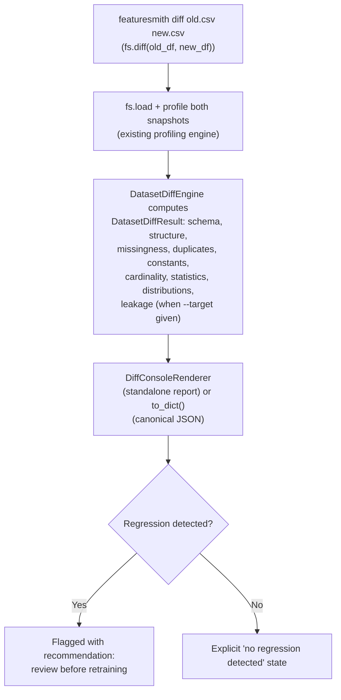
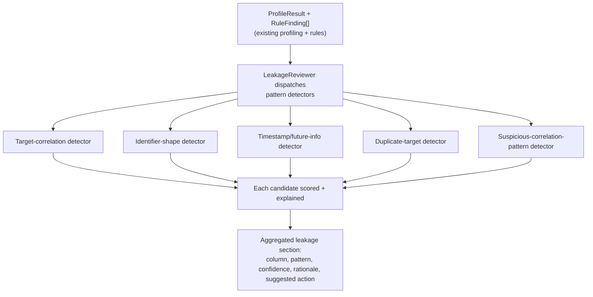
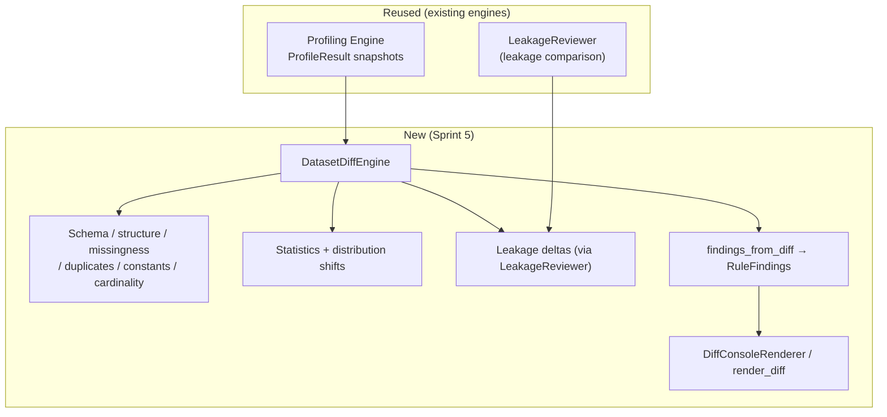
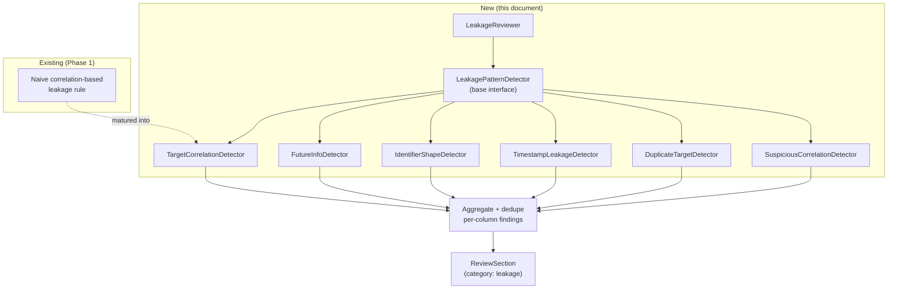

# Dataset Diff & Intelligent Leakage Detection

> **Status: Intelligent Leakage Detection implemented (Sprint 4); Dataset Diff implemented as a standalone Diff Engine (Sprint 5); the `review.diff` reviewer remains design only.** This document designs two flagship capabilities together (`Flagship-Capabilities.md` §3-4) because both are, structurally, comparison problems: Dataset Diff compares a dataset against its own past; Leakage Detection compares a feature against the information it shouldn't have access to. As of Sprint 4 the leakage-detection half is implemented — the `LeakageReviewer` (`featuresmith.review.reviewers.leakage`), the six built-in pattern detectors (`featuresmith.rules.leakage.*`, §7.2), and the per-column finding merge (§8.2) — and ships in `default_registry()`; the Leakage Risk scoring dimension (`ML-Readiness-Score.md` §16.1) consumes its findings as of Sprint 4.1. As of Sprint 5, Dataset Diff ships as a **standalone engine** — the `featuresmith.diff` package (`DatasetDiffEngine`, `fs.diff()`, `featuresmith diff old.csv new.csv`) that reuses the existing profiling engine and the `LeakageReviewer` internally for its leakage comparison. What remains design only is the diff-as-reviewer bridge: `DiffReviewer`, `fs.review(..., previous=...)`, and `featuresmith review --previous` (§5, §8.3, §10) are explicitly future work and do not ship in this sprint.

## 1. Overview

**Dataset Diff** lets a developer compare two versions of a dataset the way they'd diff two versions of code — added/removed columns, schema changes, distribution shifts, missing-value changes, quality regressions, feature changes — so a team can see, before retraining, exactly what changed and whether the change is safe.

**Intelligent Leakage Detection** goes beyond a single correlation threshold to recognize the *shapes* target leakage tends to take: label-derived columns, features that encode post-prediction-point information, identifier leakage, timestamp leakage, duplicate target information, and suspicious correlation patterns a naive threshold would miss or over-flag.

Leakage Detection is implemented as a reviewer category inside the Review Engine — the `LeakageReviewer` family plugs into the same pipeline as every schema, quality, and feature-quality reviewer (`Review-Engine-Architecture.md` §9). Dataset Diff is implemented as a **standalone Diff Engine** (`featuresmith.diff`) that produces a typed `DatasetDiffResult`; the two workflows are deliberately separate engines. The eventual `DiffReviewer` bridge (§8.3) — making a diff-aware review `featuresmith review new.csv --previous old.csv` — remains future work.

## 2. Vision

**Retraining without a diff is like deploying without a code review.** A team should be able to see, at a glance, exactly what changed between two dataset snapshots and whether that change is safe to build on — the same discipline `git diff` brought to code review, applied to data (`Flagship-Capabilities.md` §3).

**Target leakage is one of the most common and most expensive mistakes in applied ML, precisely because it's invisible until a model looks too good to be true.** Featuresmith already treats leakage as a first-class rule category, not an afterthought (`Phases.md` Phase 1, `Architecture.md` §9). This design is that category's long-term ceiling: pattern recognition that goes beyond a correlation threshold, informed later by the AI assistant layer, but never replacing the deterministic rule engine underneath it — every flagged column must still trace back to a concrete, inspectable reason (`Flagship-Capabilities.md` §4, `Architecture.md` §7.2).

## 3. Goals

### Dataset Diff
- Compare two dataset snapshots and surface: added/removed columns, schema changes, distribution shifts, missing-value changes, data-quality regressions, feature changes, and recommendations before retraining.
- Ship as a standalone Diff Engine (`featuresmith diff old.csv new.csv`, `fs.diff(old_df, new_df)`) that produces one canonical, serializable `DatasetDiffResult`, reusing the existing profiling engine and `LeakageReviewer` rather than duplicating any analysis.
- Provide a deterministic, evidence-backed verdict ("regressed / improved / unchanged") with a plain-language recommendation, plus `RuleFinding`-based exit-code gating for CI.
- Keep the future `DiffReviewer` bridge optional: a diff-aware review (`featuresmith review new.csv --previous old.csv`) is a later, additive integration, not a dependency of the diff engine itself.

### Intelligent Leakage Detection
- Detect, with named, inspectable patterns: target leakage, future-information leakage, identifier leakage, timestamp leakage, duplicate target information, and suspicious correlations.
- Reduce false positives relative to the existing naive correlation-based check (`Phases.md` Phase 1) by recognizing *why* a correlation is suspicious (timing, identifier shape, duplication) rather than only *how strong* it is.
- Keep every detector deterministic and rule-based; leave AI-assisted pattern recognition as an explicitly later, additive enhancement (§13), never a prerequisite.

## 4. Non-Goals

- Dataset Diff is not a general-purpose data versioning or lineage system (e.g., DVC) — it compares two already-loaded snapshots' computed profiles; it does not manage storage, branching, or version history itself.
- Dataset Diff does not automatically decide whether a change is "safe" — it surfaces the change with a recommendation; a human still accepts or rejects retraining, consistent with `PRD.md` §6's "recommendations are advisory, never silently auto-applied."
- Leakage Detection is not a guarantee of zero false positives or false negatives — it is explicitly a heuristic, pattern-based system; every finding ships with a confidence level and rationale so a human can make the final call (`Design-Principles.md`'s "evidence before recommendations").
- Neither capability requires or depends on the AI layer (Phase 6) to function. Both must produce complete, correct output with AI fully disabled (`Architecture.md` §7.4); AI is a future enhancement to *explaining* findings, not to *detecting* them.

## 5. User Stories

### Dataset Diff
- As a data engineer, I want to diff two snapshots of the same dataset and get a plain-language summary of what changed, so I can decide whether to retrain (`PRD.md` §9).
- As an MLOps engineer, I want a diff to flag a quality regression (e.g., new missingness introduced) as clearly as it flags a schema change, so subtle regressions don't slip through because they're not a structural change.
- As an ML engineer, I want `featuresmith diff old.csv new.csv` to give me one canonical comparison — schema, quality, distribution, and (with `--target`) leakage deltas — so I don't have to reconcile multiple ad-hoc checks myself. *(The `featuresmith review new.csv --previous old.csv` form remains future work.)*

### Leakage Detection
- As a data scientist, I want the tool to tell me not just that a column is suspiciously correlated with the target, but *why* — is it an identifier, a post-event timestamp, a duplicate of the target — so I know how to fix it.
- As an ML engineer, I want fewer false-positive leakage flags on legitimately predictive features, so I don't learn to ignore the leakage section over time.
- As a contributor, I want to add a new leakage pattern detector by implementing one small interface, without touching the existing detectors.

## 6. User Workflow

### Dataset Diff



### Leakage Detection



## 7. Product Requirements

### 7.1 Dataset Diff coverage

| Category | Requirement |
|---|---|
| Added/removed columns | Every column present in one snapshot and not the other is listed explicitly, never silently dropped from the diff |
| Schema changes | Dtype changes per column, reusing Phase 2's `SchemaChange` detection (`Phases.md` Phase 2) |
| Distribution shifts | Per-column distribution comparison (mean/variance/shape shift for numeric, category-frequency shift for categorical), matured beyond Phase 2's initial missingness/schema-only scope |
| Missing value changes | Delta in missingness ratio per column between snapshots |
| Data quality regressions | Any quality-relevant reviewer section (duplicates, constant columns, outliers) that got measurably worse between snapshots |
| Feature changes | New/removed/renamed candidate features relevant to the Feature Engineering Engine (Phase 4), when available |
| Recommendations before retraining | A synthesized, plain-language recommendation (e.g., "3 columns show meaningful distribution shift; consider re-validating before retraining") — never just a list of deltas with no verdict |

### 7.2 Leakage Detection coverage

| Pattern | Detector | What it looks for |
|---|---|---|
| Target leakage | `TargetCorrelationDetector` | Extreme correlation with the declared or inferred target, matured from Phase 1's naive threshold check |
| Future information leakage | `FutureInfoDetector` | Columns whose values are only knowable after the prediction point (e.g., a timestamp later than a declared event time, an outcome-adjacent field) |
| Identifier leakage | `IdentifierShapeDetector` | Columns with ID-like shape (near-unique, sequential, or hash-like) that also correlate with the target — a shape check first, correlation second, reducing false positives on legitimately unique-but-predictive columns |
| Timestamp leakage | `TimestampLeakageDetector` | Datetime columns positioned after a configured or inferred prediction cutoff |
| Duplicate target information | `DuplicateTargetDetector` | Columns that are a deterministic transform of the target itself (e.g., a rounded or re-binned copy) |
| Suspicious correlations | `SuspiciousCorrelationDetector` | High correlation combined with a secondary signal (near-identical distribution to target, implausible domain relationship) rather than correlation magnitude alone |
| Potential false positives | Confidence downgrade path | Any detector may downgrade its own finding to "possible, low-confidence" when a legitimate explanation is plausible (e.g., a known, declared derived feature) rather than suppressing it entirely |

### 7.3 Explainability requirement

Every leakage finding must state which pattern detector fired, why (in terms of the underlying statistic — correlation value, uniqueness ratio, timestamp comparison), and a confidence level. "Flagged as leakage" with no pattern attribution is explicitly disallowed — this is the concrete difference between this design and Phase 1's naive check.

### 7.4 Non-suppression requirement

Reducing false positives must never mean silently dropping a borderline finding. Borderline cases are downgraded to a lower confidence/severity and clearly labeled as such, never omitted — consistent with the "evidence before recommendations" principle and the goal of a leakage section a user learns to trust rather than ignore.

## 8. Technical Architecture

### 8.1 Dataset Diff



`DatasetDiffEngine.diff(previous, current, *, target_column=None, config=None)` consumes two `ProfileResult` snapshots produced by the existing profiling engine and emits one frozen, serializable `DatasetDiffResult` (`featuresmith.diff.schema`). The engine reuses existing analysis rather than reimplementing any statistic: missingness, duplicates, constants, and cardinality come straight from `ProfileResult`/`MissingValueSummary`/`DuplicateSummary`; leakage deltas are computed by running the existing `LeakageReviewer` against each snapshot (`featuresmith.review.reviewers.leakage`) and comparing per-column severities. A deterministic rename detector matches removed↔added columns by value-shape signature (dtype + missing count + top values/mean/datetime bounds/text length). Thresholds live in `DiffConfig` (`distribution_shift_threshold`, `missing_change_threshold`, `duplicate_change_threshold`, `numeric_tolerance`). The `featuresmith.diff` package intentionally does **not** register a Review Engine reviewer; the `DiffReviewer` bridge is future work (§8.3).

### 8.2 Leakage Detection



`LeakagePatternDetector` is a small interface (`detect(context) -> list[LeakageFinding]`) that each pattern implements independently; `LeakageReviewer` runs all registered detectors and deduplicates/merges findings that point at the same column (e.g., a column flagged by both the identifier-shape and target-correlation detectors is presented as one finding citing both patterns, not two redundant findings).

### 8.3 Future combined integration into the Review Engine

`LeakageReviewer` is an ordinary reviewer from the Review Engine's perspective — no special-cased control flow exists for it inside `ReviewEngine.run()` (`Review-Engine-Architecture.md` §8.2). The eventual `DiffReviewer` will follow the same pattern: a reviewer with `requires_previous_snapshot` that delegates to the standalone `featuresmith.diff` engine and attaches the full `DatasetDiffResult` to its section. The plumbing already exists for that future bridge (`ReviewContext.previous_profile`, `ReviewSection`), but the reviewer itself is **not** registered in Sprint 5 — `default_registry()` ships the same eight reviewers as Sprint 4, keeping the single-dataset Review Engine and two-dataset Diff Engine as separate workflows.

## 9. Component Breakdown

| Component | Responsibility | Lives in |
|---|---|---|
| `DatasetDiffEngine` | Computes the typed `DatasetDiffResult` from two `ProfileResult` snapshots | `featuresmith.diff.engine` |
| `DatasetDiffResult` + diff schemas | Frozen, serializable comparison models and `DiffConfig` thresholds | `featuresmith.diff.schema` |
| `findings_from_diff` | Maps a `DatasetDiffResult` onto shared `RuleFinding` objects (drives CLI exit codes) | `featuresmith.diff.findings` |
| `DiffConsoleRenderer` / `render_diff` | Renders the diff as a deterministic plain-text report | `featuresmith.diff.render` |
| `LeakageReviewer` | Reused by the diff engine for per-snapshot leakage severities | `featuresmith.review.reviewers.leakage` |
| `DiffReviewer` (future) | Wraps `DatasetDiffResult` into a `ReviewSection` (category: diff) | `featuresmith.review.reviewers.diff` (not shipped) |
| `LeakageReviewer` | Dispatches all `LeakagePatternDetector`s, dedupes findings | `featuresmith.review.reviewers.leakage` |
| `LeakagePatternDetector` | Base interface for one leakage pattern | `featuresmith.rules.leakage.base` |
| Six built-in detectors (§7.2) | Individual pattern implementations | `featuresmith.rules.leakage.*` |
| `LeakageFinding` | Typed result: column, pattern, confidence, rationale, suggested action | `featuresmith.rules.leakage.schema` |

Leakage detectors live under `featuresmith.rules.leakage` (extending the existing `rules/leakage/` folder from `Architecture.md` §4) rather than a new top-level module, since they are, structurally, an evolution of the existing Rule Engine's leakage category — the `LeakageReviewer` is the new orchestration wrapper; the detectors are matured rules.

## 10. CLI / SDK Design

### Dataset Diff

```python
import featuresmith as fs

diff = fs.diff("train_v2.parquet", "train_v1.parquet")   # profiles both, returns DatasetDiffResult
diff.summary.overall_health                              # "regressed" | "improved" | "unchanged"
diff.schema.added_columns                                # columns present only in v2
diff.distributions                                       # significant mean shifts
diff.leakage                                             # leakage deltas when target_column was given

from featuresmith.api import diff_findings
findings = diff_findings(diff)                           # RuleFindings for exit-code gating

leak_aware = fs.diff("train_v2.parquet", "train_v1.parquet", target_column="target")
```

```
featuresmith diff train_v1.parquet train_v2.parquet
featuresmith diff train_v1.parquet train_v2.parquet --format json
featuresmith diff train_v1.parquet train_v2.parquet --target target
featuresmith diff train_v1.parquet train_v2.parquet --fail-on warning
featuresmith review train_v2.parquet --previous train_v1.parquet   # future work (DiffReviewer bridge)
```

### Leakage Detection

Leakage detection has no separate top-level command — it is always part of `fs.analyze()`'s rule findings (as today) and, going forward, always part of `fs.review()`'s leakage section:

```python
result = fs.review("train.csv")
for finding in result.sections_by_id["review.leakage"].findings:
    print(finding.column, finding.pattern, finding.confidence, finding.rationale)
```

```
featuresmith review train.csv --only leakage
featuresmith review train.csv --target target        # declare the target column for target-aware leakage detection
featuresmith review train.csv --fail-below-dimension leakage_risk:90   # via ML Readiness Score, see ML-Readiness-Score.md
```

## 11. Design Decisions

- **Dataset Diff ships as a standalone engine, not a reviewer.** `featuresmith.diff` is a self-contained package (engine, schema, findings, render) that produces one canonical `DatasetDiffResult`. This keeps the single-dataset Review Engine and the two-dataset Diff Engine as separate, independently-testable workflows; the `DiffReviewer` bridge (§8.3) can later adapt the same engine into the Review Engine without moving its logic.
- **The Diff Engine reuses existing analysis rather than reimplementing statistics.** It consumes two `ProfileResult` snapshots from the existing profiling engine and the existing `LeakageReviewer` for leakage severities — consistent with the "no duplicated logic" principle. The engine never reads raw data itself.
- **Leakage detectors are pattern-named, not just threshold-named.** `TargetCorrelationDetector` is one detector among six, not the whole leakage system, so a single false positive on correlation doesn't take down trust in the entire leakage section — a deliberate correction to Phase 1's naive, single-signal approach.
- **Detectors downgrade confidence rather than suppress.** This is the direct design answer to "potential false positives" in the original ask: the system remains honest about uncertainty instead of quietly hiding borderline cases, which would erode the "every dataset deserves a code review" trust model if a real leak were ever silently dropped.
- **Leakage detectors remain under `rules/leakage/`, not a new module**, because they are unit-testable, side-effect-free functions exactly like every other rule (`Architecture.md` §9) — `LeakageReviewer` is the new orchestration layer; the detection logic itself doesn't need a new architectural home.

## 12. Integration Points

- **Review Engine (`Review-Engine-Architecture.md`):** the diff engine reuses the existing `LeakageReviewer` internally; the `review.diff` reviewer bridge that would make diff-aware review possible remains future work.
- **Dataset Review (`Dataset-Review-PRD.md`):** leakage findings are always part of the default review; diff findings activate via the standalone `featuresmith diff` command (and, in future, via `review --previous`).
- **ML Readiness Score (`ML-Readiness-Score.md`):** the Leakage Risk dimension consumes `LeakageReviewer`'s output directly; a future diff-derived scoring signal (e.g., "quality regression detected since last score") is a natural but not yet specified extension (§13).
- **Phase 2 (`fs.diff()`, `ProfileDiff`):** the foundation this document extends, not forks.
- **Phase 5 (Data Observability):** scheduled re-profiling naturally produces consecutive snapshots that `DiffReviewer` can compare automatically, turning "manual diff before retraining" into "automatic regression detection on a schedule" — the exact maturation path already anticipated in `Flagship-Capabilities.md` §3.
- **Phase 6 (AI Layer):** may narrate *why* a leakage pattern matters in plain language or *what* a distribution shift implies for retraining, strictly narrating findings these deterministic detectors already produced — never inventing a leakage flag or a shift the rule-based detectors didn't find (`Flagship-Capabilities.md` §4, `Architecture.md` §7.2).

## 13. Testing Strategy

- **Detector unit tests**, one positive and one negative fixture per leakage pattern detector (six detectors × 2 fixtures minimum), following the standard rule-testing pattern (`Rules.md` §5).
- **Known-leaky benchmark tests**: run against the curated benchmark suite of known-leaky public datasets already referenced in `PRD.md` §12's success metrics, asserting precision/recall improves over the Phase 1 naive-threshold baseline, not just "still detects leakage."
- **False-positive regression tests**: a fixture suite of legitimately predictive-but-not-leaky columns (e.g., a genuinely predictive numeric feature with high but legitimate correlation) that must NOT be flagged at high confidence, guarding the "fewer false positives" goal (§3) as a testable property, not just a narrative claim.
- **Diff engine tests**: unit tests over synthetic snapshot pairs covering added/removed/renamed columns, dtype changes, missingness regression/improvement, duplicate deltas, constant-column changes, cardinality, statistics, distribution shifts, leakage new/removed/unchanged, empty snapshots, and deterministic output (`tests/diff/`).
- **Diff SDK/CLI tests**: `fs.diff()` on pandas/Polars/Dataset sources with JSON serialization, and `featuresmith diff` covering help, JSON format, `--target`, `--fail-on` exit-code gating, `--output`, `--quiet`, and error paths (`tests/cli/test_cli_diff.py`).
- **Backward-compatibility tests**: the Review Engine's `default_registry()` still ships exactly the eight Sprint 4 reviewers; no diff reviewer is registered, so existing review section/score counts are unchanged.
- **Dedup tests**: a column flagged by multiple leakage detectors produces exactly one merged `LeakageFinding` citing all contributing patterns, not duplicate findings.

## 14. Future Extensions

- **AI-assisted pattern recognition** (Phase 6 and beyond) sitting on top of the deterministic detector set, surfacing patterns a fixed detector list might miss — always required to cite a concrete, inspectable reason per the grounding contract, never replacing the deterministic detectors (`Flagship-Capabilities.md` §4).
- **Distribution-shift-triggered scoring signal**: once both this document and `ML-Readiness-Score.md` exist, a "stability" or "drift-adjusted" scoring input that factors in recent diff history, contingent on Phase 5's `QualityHistory`.
- **Configurable leakage sensitivity profiles** (e.g., "strict" vs. "permissive") via `.featuresmith.yml`, letting teams tune the confidence threshold at which a finding surfaces as critical vs. informational.
- **Cross-dataset leakage detection** (e.g., train/test overlap detection, already scoped conceptually in `Architecture.md` §9's rule categories) as a natural extension of the identifier-shape detector to a two-dataset comparison, bridging Diff and Leakage Detection further.

## 15. Open Questions

- Should `DiffReviewer`'s regression detection reuse the ML Readiness Score's dimension scores directly (i.e., "quality regression" == "a dimension score dropped"), or should it operate on raw section-level deltas independently of scoring? This affects whether Diff has a hard dependency on Scoring or remains fully independent.
- How should the prediction-point cutoff required by `FutureInfoDetector` and `TimestampLeakageDetector` be declared — inferred automatically from a designated timestamp column, or required as explicit user configuration? Automatic inference risks false confidence; explicit configuration adds setup friction.
- Should confidence downgrading (§7.4) be a numeric scale (e.g., 0-1) or a small enum (`high`/`medium`/`low`), and how does that scale map onto the ML Readiness Score's Leakage Risk dimension calculation?
- For very wide datasets, is pairwise leakage-pattern detection subject to the same combinatorial cap already required for correlation matrices (`Rules.md` §12), and if so, should that cap be shared configuration with the existing Profiling Engine's cap or a separate, leakage-specific one?
