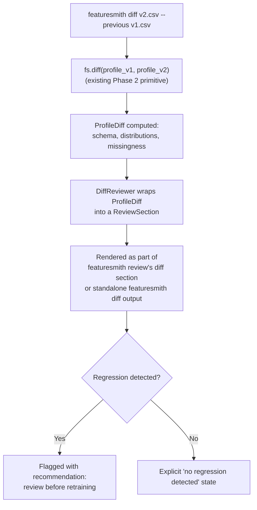
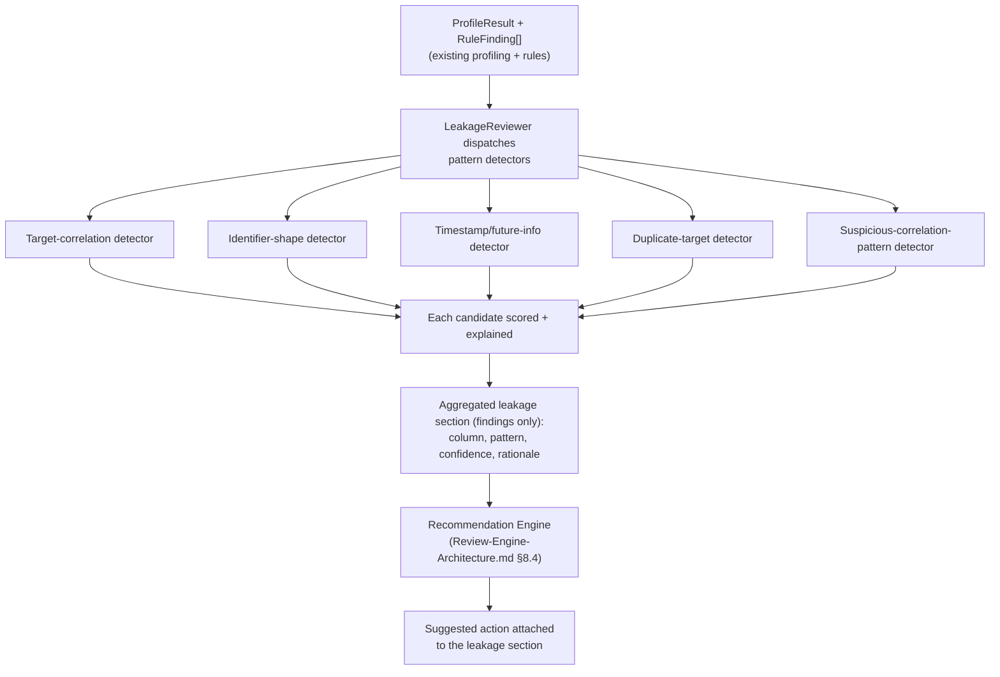
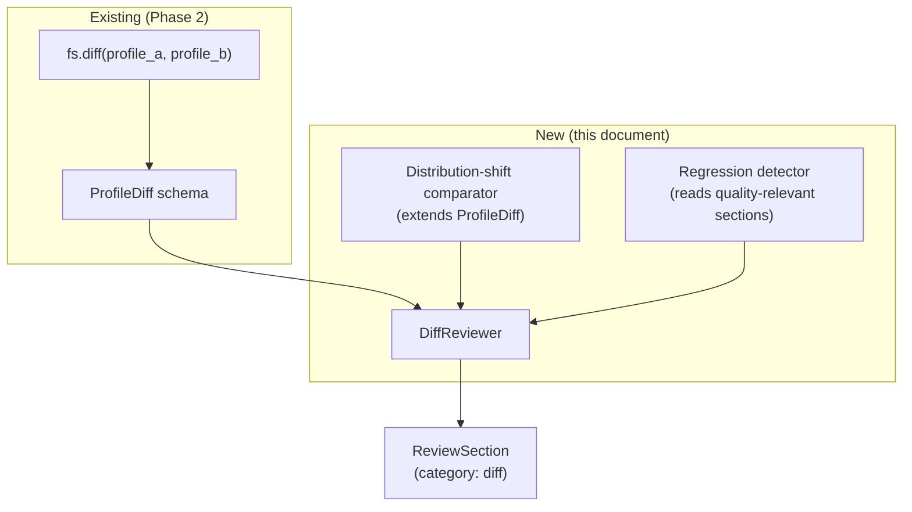
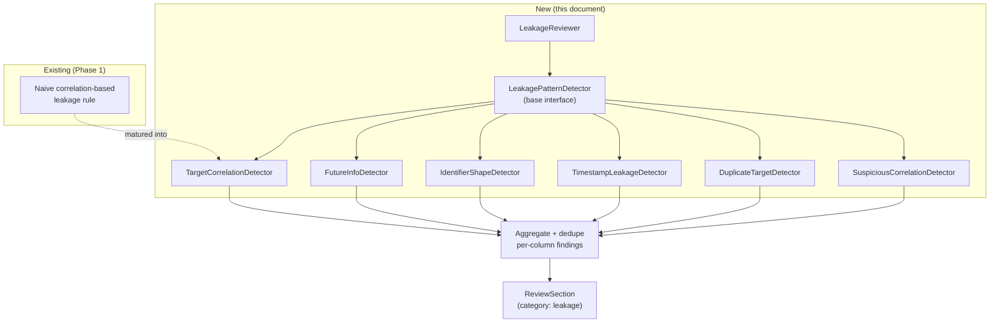

# Dataset Diff & Intelligent Leakage Detection

> **Status: Leakage Detection Fully Implemented (Sprint 4); Dataset Diff Fully Implemented as Standalone Engine (Sprint 5) and as `DiffReviewer` (v0.3.0).** All 6 leakage pattern detectors, `LeakageReviewer`, and integration with ML Readiness Score are implemented. Dataset Diff ships as a standalone engine (`featuresmith.diff` package, `fs.diff()`, `featuresmith diff` CLI) with schema, structure, quality, distribution, and leakage comparisons, AND as a `DiffReviewer` (`review.diff`) integrated into the Review Engine since v0.3.0 — `fs.review(source, previous=...)` and `featuresmith review <source> --previous <snapshot>` produce a diff section and attach the `DatasetDiffResult` to `ReviewResult.diff`. The speculatively-designed `distribution_shifts`/`quality_regressions` fields remain future work.

## 1. Overview

**Dataset Diff** lets a developer compare two versions of a dataset the way they'd diff two versions of code — added/removed columns, schema changes, distribution shifts, missing-value changes, quality regressions, feature changes — so a team can see, before retraining, exactly what changed and whether the change is safe.

**Intelligent Leakage Detection** goes beyond a single correlation threshold to recognize the *shapes* target leakage tends to take: label-derived columns, features that encode post-prediction-point information, identifier leakage, timestamp leakage, duplicate target information, and suspicious correlation patterns a naive threshold would miss or over-flag.

Both are designed as reviewer categories inside the Review Engine, not separate engines — `DiffReviewer` and the `LeakageReviewer` family plug into the same pipeline as every schema, quality, and feature-quality reviewer (`Review-Engine-Architecture.md` §9).

## 2. Vision

**Retraining without a diff is like deploying without a code review.** A team should be able to see, at a glance, exactly what changed between two dataset snapshots and whether that change is safe to build on — the same discipline `git diff` brought to code review, applied to data (`Flagship-Capabilities.md` §3).

**Target leakage is one of the most common and most expensive mistakes in applied ML, precisely because it's invisible until a model looks too good to be true.** Featuresmith already treats leakage as a first-class rule category, not an afterthought (`Phases.md` Phase 1, `Architecture.md` §9). This design is that category's long-term ceiling: pattern recognition that goes beyond a correlation threshold, informed later by the AI assistant layer, but never replacing the deterministic rule engine underneath it — every flagged column must still trace back to a concrete, inspectable reason (`Flagship-Capabilities.md` §4, `Architecture.md` §7.2).

## 3. Goals

### Dataset Diff
- Compare two dataset snapshots and surface: added/removed columns, schema changes, distribution shifts, missing-value changes, data-quality regressions, feature changes, and recommendations before retraining.
- Integrate as a reviewer (`DiffReviewer`) so a diff-aware review is just `featuresmith review new.csv --previous old.csv`, not a separate mental model from a normal review.
- Build directly on the existing `fs.diff()` / `ProfileDiff` schema from Phase 2 (`Phases.md` Phase 2) — extend it, never fork it.

### Intelligent Leakage Detection
- Detect, with named, inspectable patterns: target leakage, future-information leakage, identifier leakage, timestamp leakage, duplicate target information, and suspicious correlations.
- Reduce false positives relative to the existing naive correlation-based check (`Phases.md` Phase 1) by recognizing *why* a correlation is suspicious (timing, identifier shape, duplication) rather than only *how strong* it is.
- Keep every detector deterministic and rule-based; leave AI-assisted pattern recognition as an explicitly later, additive enhancement (§13), never a prerequisite.

## 4. Non-Goals

- Dataset Diff is not a general-purpose data versioning or lineage system (e.g., DVC) — it compares two already-loaded snapshots' computed profiles; it does not manage storage, branching, or version history itself.
- Dataset Diff does not automatically decide whether a change is "safe" — it surfaces the change with a recommendation; a human still accepts or rejects retraining, consistent with `PRD.md` §6's "recommendations are advisory, never silently auto-applied."
- Leakage Detection is not a guarantee of zero false positives or false negatives — it is explicitly a heuristic, pattern-based system; every finding ships with a confidence level and rationale so a human can make the final call (`Design-Principles.md`'s "evidence before recommendations").
- Neither capability requires or depends on the AI layer (Phase 6) to function. Both must produce complete, correct output with AI fully disabled (`Architecture.md` §7.4); AI is a future enhancement to *explaining* findings, not to *detecting* them.

## 5. User Stories

### Dataset Diff
- As a data engineer, I want to diff two snapshots of the same dataset and get a plain-language summary of what changed, so I can decide whether to retrain (`PRD.md` §9).
- As an MLOps engineer, I want a diff to flag a quality regression (e.g., new missingness introduced) as clearly as it flags a schema change, so subtle regressions don't slip through because they're not a structural change.
- As an ML engineer, I want `featuresmith review new.csv --previous old.csv` to give me both the normal review *and* the diff in one call, so I don't have to run two separate commands and reconcile their output myself.

### Leakage Detection
- As a data scientist, I want the tool to tell me not just that a column is suspiciously correlated with the target, but *why* — is it an identifier, a post-event timestamp, a duplicate of the target — so I know how to fix it.
- As an ML engineer, I want fewer false-positive leakage flags on legitimately predictive features, so I don't learn to ignore the leakage section over time.
- As a contributor, I want to add a new leakage pattern detector by implementing one small interface, without touching the existing detectors.

## 6. User Workflow

### Dataset Diff



### Leakage Detection



Leakage detectors are detection-only, matching the Review Engine's reviewer contract (`Review-Engine-Architecture.md` §8.3): a `LeakageFinding` states a column, pattern, confidence, and rationale, never a suggested action. Turning "this column is likely leakage" into "here's what to do about it" is the centralized Recommendation Engine's job, not any individual detector's — the same rule that applies to every other reviewer category.

## 7. Product Requirements

### 7.1 Dataset Diff coverage

| Category | Requirement |
|---|---|
| Added/removed columns | Every column present in one snapshot and not the other is listed explicitly, never silently dropped from the diff |
| Schema changes | Dtype changes per column, reusing Phase 2's `SchemaChange` detection (`Phases.md` Phase 2) |
| Distribution shifts | Per-column distribution comparison (mean/variance/shape shift for numeric, category-frequency shift for categorical), matured beyond Phase 2's initial missingness/schema-only scope |
| Missing value changes | Delta in missingness ratio per column between snapshots |
| Data quality regressions | Any quality-relevant reviewer section (duplicates, constant columns, outliers) that got measurably worse between snapshots |
| Feature changes | New/removed/renamed candidate features relevant to the Feature Engineering Engine (Phase 4), when available |
| Recommendations before retraining | A plain-language recommendation (e.g., "3 columns show meaningful distribution shift; consider re-validating before retraining") — never just a list of deltas with no verdict. Produced by the centralized Recommendation Engine (`Review-Engine-Architecture.md` §8.4) reading `DiffReviewer`'s findings, not synthesized by `DiffReviewer` itself |

### 7.2 Leakage Detection coverage

| Pattern | Detector | What it looks for |
|---|---|---|
| Target leakage | `TargetCorrelationDetector` | Extreme correlation with the declared or inferred target, matured from Phase 1's naive threshold check |
| Future information leakage | `FutureInfoDetector` | Columns whose values are only knowable after the prediction point (e.g., a timestamp later than a declared event time, an outcome-adjacent field) |
| Identifier leakage | `IdentifierShapeDetector` | Columns with ID-like shape (near-unique, sequential, or hash-like) that also correlate with the target — a shape check first, correlation second, reducing false positives on legitimately unique-but-predictive columns |
| Timestamp leakage | `TimestampLeakageDetector` | Datetime columns positioned after a configured or inferred prediction cutoff |
| Duplicate target information | `DuplicateTargetDetector` | Columns that are a deterministic transform of the target itself (e.g., a rounded or re-binned copy) |
| Suspicious correlations | `SuspiciousCorrelationDetector` | High correlation combined with a secondary signal (near-identical distribution to target, implausible domain relationship) rather than correlation magnitude alone |
| Potential false positives | Confidence downgrade path | Any detector may downgrade its own finding to "possible, low-confidence" when a legitimate explanation is plausible (e.g., a known, declared derived feature) rather than suppressing it entirely |

### 7.3 Explainability requirement

Every leakage finding must state which pattern detector fired, why (in terms of the underlying statistic — correlation value, uniqueness ratio, timestamp comparison), and a confidence level. "Flagged as leakage" with no pattern attribution is explicitly disallowed — this is the concrete difference between this design and Phase 1's naive check.

### 7.4 Non-suppression requirement

Reducing false positives must never mean silently dropping a borderline finding. Borderline cases are downgraded to a lower confidence/severity and clearly labeled as such, never omitted — consistent with the "evidence before recommendations" principle and the goal of a leakage section a user learns to trust rather than ignore.

## 8. Technical Architecture

### 8.1 Dataset Diff



`DiffReviewer.applicable(context)` returns `True` only when `context.previous_profile` is set (`Review-Engine-Architecture.md` §8.3). It calls the existing `fs.diff()` internally rather than reimplementing comparison logic, then layers the new distribution-shift and regression-detection capabilities documented here on top of the existing `ProfileDiff` schema, extending it with additive, backward-compatible fields (`distribution_shifts: list[DistributionShift]`, `quality_regressions: list[QualityRegression]`). Like every reviewer, `DiffReviewer` produces findings only; the "recommendations before retraining" requirement (§7.1) is satisfied downstream by the centralized Recommendation Engine (`Review-Engine-Architecture.md` §8.4) reading this section's findings, not by any diff-specific recommendation logic.

### 8.2 Leakage Detection



`LeakagePatternDetector` is a small interface (`detect(context) -> list[LeakageFinding]`) that each pattern implements independently; `LeakageReviewer` runs all registered detectors and deduplicates/merges findings that point at the same column (e.g., a column flagged by both the identifier-shape and target-correlation detectors is presented as one finding citing both patterns, not two redundant findings).

### 8.3 Combined integration into the Review Engine

Both `DiffReviewer` and the `LeakageReviewer` family are ordinary reviewers from the Review Engine's perspective — no special-cased control flow exists for either inside `ReviewEngine.run()` (`Review-Engine-Architecture.md` §8.2). This is a deliberate architectural test of the Review Engine's extensibility claim: two of the four flagship capabilities are implemented as "just another reviewer," proving the pattern generalizes.

## 9. Component Breakdown

| Component | Responsibility | Lives in |
|---|---|---|
| `DiffReviewer` | Wraps `fs.diff()` output into a `ReviewSection`; adds distribution-shift and regression detection | `featuresmith.review.reviewers.diff` |
| `DistributionShift`, `QualityRegression` | New, additive fields on the existing `ProfileDiff` schema | `featuresmith.core.schema` (extends Phase 2's schema) |
| `LeakageReviewer` | Dispatches all `LeakagePatternDetector`s, dedupes findings | `featuresmith.review.reviewers.leakage` |
| `LeakagePatternDetector` | Base interface for one leakage pattern | `featuresmith.rules.leakage.base` |
| Six built-in detectors (§7.2) | Individual pattern implementations | `featuresmith.rules.leakage.*` |
| `LeakageFinding` | Typed, detection-only result: column, pattern, confidence, rationale — no suggested action (produced downstream by the Recommendation Engine, `Review-Engine-Architecture.md` §8.4) | `featuresmith.rules.leakage.schema` |

Leakage detectors live under `featuresmith.rules.leakage` (extending the existing `rules/leakage/` folder from `Architecture.md` §4) rather than a new top-level module, since they are, structurally, an evolution of the existing Rule Engine's leakage category — the `LeakageReviewer` is the new orchestration wrapper; the detectors are matured rules.

## 10. CLI / SDK Design

### Dataset Diff

```python
import featuresmith as fs

diff = fs.diff("train_v2.parquet", "train_v1.parquet")   # existing Phase 2 primitive, extended output
result = fs.review("train_v2.parquet", previous="train_v1.parquet")  # diff as part of a full review
print(result.diff.distribution_shifts)
print(result.diff.quality_regressions)
```

```
featuresmith diff train_v1.parquet train_v2.parquet
featuresmith diff train_v1.parquet train_v2.parquet --format json
featuresmith review train_v2.parquet --previous train_v1.parquet
```

### Leakage Detection

Leakage detection has no separate top-level command — it is always part of `fs.analyze()`'s rule findings (as today) and, going forward, always part of `fs.review()`'s leakage section:

```python
result = fs.review("train.csv")
for finding in result.sections_by_id["review.leakage"].findings:
    print(finding.column, finding.pattern, finding.confidence, finding.rationale)
```

```
featuresmith review train.csv --only leakage
featuresmith review train.csv --fail-below-dimension leakage_risk:90   # via ML Readiness Score, see ML-Readiness-Score.md
```

## 11. Design Decisions

- **Dataset Diff extends `ProfileDiff` additively rather than replacing it.** Phase 2's schema and `fs.diff()` signature stay stable; new capability is new, optional fields, so existing Phase 2 integrations (dashboard diff view, any early CI usage) do not break (`Rules.md` §9).
- **`DiffReviewer` calls `fs.diff()` rather than reimplementing comparison logic**, keeping exactly one diffing code path in the codebase — consistent with the "no duplicated logic" principle applied to a second capability building on the same primitive.
- **Leakage detectors are pattern-named, not just threshold-named.** `TargetCorrelationDetector` is one detector among six, not the whole leakage system, so a single false positive on correlation doesn't take down trust in the entire leakage section — a deliberate correction to Phase 1's naive, single-signal approach.
- **Detectors downgrade confidence rather than suppress.** This is the direct design answer to "potential false positives" in the original ask: the system remains honest about uncertainty instead of quietly hiding borderline cases, which would erode the "every dataset deserves a code review" trust model if a real leak were ever silently dropped.
- **Leakage detectors remain under `rules/leakage/`, not a new module**, because they are unit-testable, side-effect-free functions exactly like every other rule (`Architecture.md` §9) — `LeakageReviewer` is the new orchestration layer; the detection logic itself doesn't need a new architectural home.
- **Neither `DiffReviewer` nor any leakage pattern detector phrases its own recommendation.** Both feed findings into the same centralized Recommendation Engine (`Review-Engine-Architecture.md` §8.4) as every other reviewer category. This is a deliberate consistency choice: a user reading "consider re-validating before retraining" and a user reading a leakage remediation suggestion get recommendations with the same shape, confidence semantics, and ranking logic, even though they came from entirely different detection code.

## 12. Integration Points

- **Review Engine (`Review-Engine-Architecture.md`):** both capabilities are ordinary reviewers; no engine-level special-casing.
- **Recommendation Engine (`Review-Engine-Architecture.md` §8.4):** the sole source of both the diff section's "before retraining" recommendation and the leakage section's remediation suggestions; neither reviewer generates these itself.
- **Dataset Review (`Dataset-Review-PRD.md`):** leakage findings are always part of the default review; diff findings activate via `--previous`.
- **ML Readiness Score (`ML-Readiness-Score.md`):** the Leakage Risk dimension consumes `LeakageReviewer`'s output directly; a future diff-derived scoring signal (e.g., "quality regression detected since last score") is a natural but not yet specified extension (§13).
- **Phase 2 (`fs.diff()`, `ProfileDiff`):** the foundation this document extends, not forks.
- **Phase 5 (Data Observability):** scheduled re-profiling naturally produces consecutive snapshots that `DiffReviewer` can compare automatically, turning "manual diff before retraining" into "automatic regression detection on a schedule" — the exact maturation path already anticipated in `Flagship-Capabilities.md` §3.
- **Phase 6 (AI Layer):** may narrate *why* a leakage pattern matters in plain language or *what* a distribution shift implies for retraining, strictly narrating findings these deterministic detectors already produced — never inventing a leakage flag or a shift the rule-based detectors didn't find (`Flagship-Capabilities.md` §4, `Architecture.md` §7.2).

## 13. Testing Strategy

- **Detector unit tests**, one positive and one negative fixture per leakage pattern detector (six detectors × 2 fixtures minimum), following the standard rule-testing pattern (`Rules.md` §5).
- **Known-leaky benchmark tests**: run against the curated benchmark suite of known-leaky public datasets already referenced in `PRD.md` §12's success metrics, asserting precision/recall improves over the Phase 1 naive-threshold baseline, not just "still detects leakage."
- **False-positive regression tests**: a fixture suite of legitimately predictive-but-not-leaky columns (e.g., a genuinely predictive numeric feature with high but legitimate correlation) that must NOT be flagged at high confidence, guarding the "fewer false positives" goal (§3) as a testable property, not just a narrative claim.
- **Diff extension tests**: `ProfileDiff`'s new fields (`distribution_shifts`, `quality_regressions`) are covered by golden-file tests against fixture snapshot pairs with known, injected shifts and regressions.
- **Backward-compatibility tests**: existing Phase 2 `fs.diff()` callers see byte-identical output for the fields that already existed prior to this design's additions.
- **Dedup tests**: a column flagged by multiple leakage detectors produces exactly one merged `LeakageFinding` citing all contributing patterns, not duplicate findings.
- **Detection-only structural tests**: `DiffReviewer` and every `LeakagePatternDetector` must produce findings with no populated recommendation/suggested-action field prior to the Recommendation Engine stage, per the same structural test required of every reviewer (`Review-Engine-Architecture.md` §14).

## 13.1 Implementation Status (as of v0.2.0)

### Leakage Detection — ✅ Fully Implemented

| Component | Status | Location |
|-----------|--------|----------|
| `LeakagePatternDetector` base interface | ✅ | `featuresmith/rules/leakage/base.py` |
| `TargetCorrelationDetector` | ✅ | `featuresmith/rules/leakage/target_correlation.py` |
| `IdentifierShapeDetector` | ✅ | `featuresmith/rules/leakage/identifier.py` |
| `TimestampLeakageDetector` | ✅ | `featuresmith/rules/leakage/timestamp.py` |
| `FutureInfoDetector` | ✅ | `featuresmith/rules/leakage/timestamp.py` |
| `DuplicateTargetDetector` | ✅ | `featuresmith/rules/leakage/duplicate_target.py` |
| `SuspiciousCorrelationDetector` | ✅ | `featuresmith/rules/leakage/suspicious.py` |
| `LeakageReviewer` | ✅ | `featuresmith/review/reviewers/leakage.py` |
| `LeakageFinding` schema | ✅ | `featuresmith/rules/leakage/schema.py` |
| ML Readiness Score `LeakageRiskDimension` | ✅ | `featuresmith/scoring/dimensions/builtin.py` |

All 6 detectors run and merge findings per column. The legacy `LeakageRuleTargetCorrelation` is preserved as a re-export for backward compatibility.

### Dataset Diff — ✅ Fully Implemented as Standalone Engine

| Component | Status | Location |
|-----------|--------|----------|
| `DatasetDiffEngine` / `compute_diff()` | ✅ | `featuresmith/diff/engine.py` |
| `DatasetDiffResult` schema | ✅ | `featuresmith/diff/schema.py` |
| `fs.diff(old, new)` SDK | ✅ | `featuresmith/api.py` |
| `featuresmith diff` CLI | ✅ | `featuresmith_cli/commands/diff.py` |
| Schema diff (added/removed/renamed/type changes) | ✅ | |
| Structure diff (row/column counts) | ✅ | |
| Missing value changes | ✅ | |
| Duplicate row changes | ✅ | |
| Constant column changes | ✅ | |
| Cardinality changes | ✅ | |
| Basic statistics changes | ✅ | |
| Distribution shifts (mean shift detection) | ✅ | |
| Leakage deltas (new/removed/escalated/de-escalated) | ✅ | Requires `--target` |
| Overall health verdict (regressed/improved/unchanged) | ✅ | |
| Plain-language recommendation | ✅ | Engineering-focused summary |

**Architectural Note:** Dataset Diff ships as a **standalone engine** (`featuresmith.diff` package) AND as a **`DiffReviewer`** integrated into the Review Engine (added v0.3.0). The standalone engine was the Sprint 5 scope decision; v0.3.0 closed the design gap (`Architecture.md` §21.4) by adding `DiffReviewer` (`review.diff`) to `default_registry()` (now 9 reviewers). `DiffReviewer` reuses the standalone engine via `compute_diff()` + `findings_from_diff()` — it does not re-profile the previous snapshot when a previous profile is available. `fs.review(source, previous=...)` profiles the previous snapshot once at the SDK boundary and passes `previous_profile` to the engine; the diff section is appended only when a previous snapshot is provided, so single-dataset review is unchanged (8 sections, `result.diff is None`).

### Not Implemented / Deferred

| Component | Status | Notes |
|-----------|--------|-------|
| `DiffReviewer` (Review Engine integration) | ✅ Implemented (v0.3.0) | `featuresmith/review/reviewers/diff.py`; reuses standalone engine |
| `ReviewResult.diff` field | ✅ Implemented (v0.3.0) | Attaches `DatasetDiffResult` when a previous snapshot is provided; `None` otherwise |
| `ProfileDiff` extension fields (`distribution_shifts`, `quality_regressions`) | ❌ Not Implemented | Standalone `DatasetDiffResult` used instead |
| Configurable leakage sensitivity profiles | 🚧 Deferred | `.featuresmith.yml` config not yet built |
| Cross-dataset leakage detection | 🚧 Deferred | Future extension |

## 14. Future Extensions

- **AI-assisted pattern recognition** (Phase 6 and beyond) sitting on top of the deterministic detector set, surfacing patterns a fixed detector list might miss — always required to cite a concrete, inspectable reason per the grounding contract, never replacing the deterministic detectors (`Flagship-Capabilities.md` §4).
- **Distribution-shift-triggered scoring signal**: once both this document and `ML-Readiness-Score.md` exist, a "stability" or "drift-adjusted" scoring input that factors in recent diff history, contingent on Phase 5's `QualityHistory`.
- **Configurable leakage sensitivity profiles** (e.g., "strict" vs. "permissive") via `.featuresmith.yml`, letting teams tune the confidence threshold at which a finding surfaces as critical vs. informational.
- **Cross-dataset leakage detection** (e.g., train/test overlap detection, already scoped conceptually in `Architecture.md` §9's rule categories) as a natural extension of the identifier-shape detector to a two-dataset comparison, bridging Diff and Leakage Detection further.
- **`fs.diff()` as the Dataset Contract's comparison primitive**: `features/Dataset-Contracts-And-Planning.md` reuses this exact engine for two purposes — validating that an applied transformation improved a dataset (pre/post-apply diff) and diffing two `featuresmith.lock` files (`featuresmith contract diff`). Neither introduces a second diff implementation; both call this document's `fs.diff()` unmodified.

## 15. Open Questions

- Should `DiffReviewer`'s regression detection reuse the ML Readiness Score's dimension scores directly (i.e., "quality regression" == "a dimension score dropped"), or should it operate on raw section-level deltas independently of scoring? This affects whether Diff has a hard dependency on Scoring or remains fully independent.
- How should the prediction-point cutoff required by `FutureInfoDetector` and `TimestampLeakageDetector` be declared — inferred automatically from a designated timestamp column, or required as explicit user configuration? Automatic inference risks false confidence; explicit configuration adds setup friction.
- Should confidence downgrading (§7.4) be a numeric scale (e.g., 0-1) or a small enum (`high`/`medium`/`low`), and how does that scale map onto the ML Readiness Score's Leakage Risk dimension calculation?
- For very wide datasets, is pairwise leakage-pattern detection subject to the same combinatorial cap already required for correlation matrices (`Rules.md` §12), and if so, should that cap be shared configuration with the existing Profiling Engine's cap or a separate, leakage-specific one?
