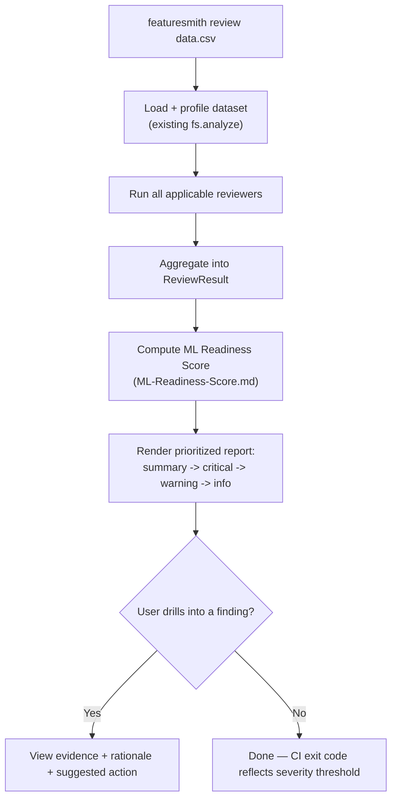
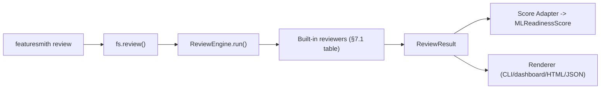

# Dataset Review — Product Requirements Document

> **Status: Design only — nothing described here is implemented.** This is the flagship experience described in `Flagship-Capabilities.md` §1, made concrete. It is built entirely on top of the orchestration layer defined in `Review-Engine-Architecture.md`; that document is the "how," this one is the "what and why for the user."

## 1. Overview

`featuresmith review <dataset>` is the single command Featuresmith wants to be remembered by. Where `featuresmith analyze` produces a structured report of statistics and rule findings, `featuresmith review` produces something closer to what a senior engineer would leave on a pull request: an organized, prioritized pass over the dataset that tells the user not just what's true about their data, but whether that's a problem, how bad it is, and what to do next.

This document defines the complete user-facing workflow, CLI experience, SDK experience, and product requirements for that command. It assumes the Review Engine (`Review-Engine-Architecture.md`) as its execution substrate throughout.

## 2. Vision

**Every dataset deserves a code review.** Code review didn't happen because code was assumed untrustworthy — it happened because catching problems before they ship is cheaper than catching them after (`Why-Featuresmith-Exists.md`, `Project_Plan.md` §0). Dataset Review is what that discipline looks like applied to data: run automatically, every time, before a dataset touches a model, producing the same kind of actionable, prioritized feedback a thoughtful reviewer would leave — never just a wall of numbers.

Long-term, running `featuresmith review` should feel as natural, and as unremarkable, as running a test suite before a merge.

## 3. Goals

- Ship one command, `featuresmith review <dataset>` (and its SDK equivalent `fs.review(...)`), that performs a comprehensive engineering review of a dataset in a single call.
- Cover, at minimum: schema health, missing values, duplicate rows, duplicate columns, data types, constant columns, high-cardinality columns, outliers, distribution issues, feature quality, target leakage warnings, and an overall dataset summary — each ending in a concrete recommendation, not just an observation.
- Make the output legible to two audiences at once: an engineer who wants to drill into evidence, and a stakeholder who wants the one-paragraph summary.
- Make the review identical in substance across every surface it's accessed from (CLI, SDK, dashboard, CI), per the existing surface-parity guarantee (`PRD.md` §12).
- Make `featuresmith review` CI-gateable from day one, the same way `featuresmith analyze` already is (`Why-Featuresmith-Exists.md`).

## 4. Non-Goals

- Not a new statistics engine. Every number in a review traces back to the existing Profiling Engine and Rule Engine (`Architecture.md` §3); Dataset Review is a presentation and prioritization layer, not a computation layer.
- Not a replacement for `featuresmith analyze`. `analyze` remains the lower-level, single-purpose primitive; `review` is the composed, opinionated experience built on top of it (`Review-Engine-Architecture.md` §11).
- Not an AutoML recommendation system — recommendations are about data quality and structure (encoding, missingness handling, leakage removal), never model selection or hyperparameters (`PRD.md` §6).
- Not, at this stage, a scheduled/continuous check — a single review is triggered by a single command invocation. Continuous review is Phase 5's Data Observability concern, which this design is built to support later without rework (`Review-Engine-Architecture.md` §14).
- Does not silently apply any recommendation. Every suggested action requires explicit review and acceptance, consistent with `Design-Principles.md`'s "evidence before recommendations."

## 5. User Stories

- As an ML engineer handed a new dataset, I want to run one command and get a prioritized list of what's wrong with it, so I know in minutes whether it's safe to build on.
- As a data scientist, I want `fs.review(df)` to work on an in-memory dataframe exactly like it works on a CSV path, with no different code path.
- As an MLOps engineer, I want `featuresmith review` to exit non-zero in CI when a dataset regresses below an acceptable quality bar, so a bad dataset never silently reaches a training job.
- As a product stakeholder, I want a plain-language summary at the top of the review I can read without knowing pandas, and drill into specific findings only if I want to.
- As a contributor, I want to add a new check to the review (e.g., a new quality heuristic) by writing one reviewer, without touching CLI or dashboard code.
- As a data scientist, I want the review's leakage warnings and the ML Readiness Score to be consistent with each other, since both come from the same underlying findings.

## 6. User Workflow



A typical session: a user points the command at a file, gets a top-of-report summary and score within seconds for reasonably-sized data, sees findings sorted by severity, and — for any finding — can see the exact statistic behind it, not just a label. Nothing requires a second command unless they want to export a fix (`fs.export()`, unchanged) or compare against a prior snapshot (`fs.diff()` / `--previous`, see `Dataset-Diff-And-Leakage-Detection.md`).

## 7. Product Requirements

### 7.1 Coverage requirements

The review must include a dedicated section for each of the following, sourced from a specific reviewer (`Review-Engine-Architecture.md` §9):

| Section | Reviewer | Source signal |
|---|---|---|
| Schema health | `SchemaHealthReviewer` | dtype consistency, unexpected nulls in typed columns, schema vs. declared config |
| Missing values | `MissingValueReviewer` | missingness ratio and pattern per column (existing quality rules) |
| Duplicate rows | `DuplicateRowReviewer` | exact and near-duplicate row detection |
| Duplicate columns | `DuplicateColumnReviewer` | fully or near-fully correlated/identical columns |
| Data types | `TypeReviewer` | inferred vs. expected dtype mismatches |
| Constant columns | `ConstantColumnReviewer` | zero/near-zero variance columns |
| High-cardinality columns | `CardinalityReviewer` | categorical columns above a configurable unique-value threshold |
| Outliers | `OutlierReviewer` | IQR/Z-score/Isolation Forest flags (existing statistical rules) |
| Distribution issues | `DistributionReviewer` | skew, unexpected multimodality, distribution shape flags |
| Feature quality | `FeatureQualityReviewer` | low-signal / near-constant / redundant feature flags, feeding Phase 4's recommendation engine when available |
| Target leakage warnings | `LeakageReviewer` | pattern-based leakage detection, detailed in `Dataset-Diff-And-Leakage-Detection.md` |
| Overall summary | Aggregator | dataset-level roll-up, always present even if every section is clean |

Every section must be present in the output even when it finds nothing — an explicit "no issues found" state, not an absent section, per `Design.md` §13's empty-state principle.

### 7.2 Actionability requirement

No finding may be presented without at least one of: a suggested action, a link to the specific rule/reviewer that produced it, or an explicit statement that no action is needed. A pile of numbers with no verdict is exactly the failure mode Dataset Review exists to fix (`PRD.md` §4).

### 7.3 Performance requirement

A review of a dataset under 1M rows should complete in the same time budget already committed to `fs.analyze()` (`PRD.md` §12, "time-to-insight" < 2 minutes) plus a small, documented overhead for reviewer dispatch and aggregation — reviewers must not re-read or re-profile the dataset (`Review-Engine-Architecture.md` §8.2, `Rules.md` §12).

### 7.4 CI requirement

`featuresmith review` must support a severity threshold flag that determines process exit code, so it can gate a CI pipeline exactly as `featuresmith analyze` already can, with the `featuresmith-action` GitHub Action pointed at either command interchangeably (`Phases.md` Phase 3).

## 8. Technical Architecture

Dataset Review has no execution logic of its own beyond what `Review-Engine-Architecture.md` already defines. Concretely:



Dataset Review's "product" is: (a) the specific, fixed set of built-in reviewers listed in §7.1 shipping together as the default reviewer set, and (b) the rendering/UX decisions in §9-11 below. It introduces no new schema beyond `ReviewResult` and no new plugin category beyond `BaseReviewer`.

## 9. Component Breakdown

| Component | Owner document | Notes |
|---|---|---|
| `ReviewEngine`, `BaseReviewer`, `ReviewResult` | `Review-Engine-Architecture.md` | Shared substrate |
| Built-in reviewer set (§7.1) | This document | The specific reviewers that ship as Dataset Review's default coverage |
| CLI rendering (table/tree, severity coloring, exit codes) | This document, `Design.md` | User-facing presentation |
| Dashboard "Review" tab | This document, `Design.md` §3, §10 | Reuses existing finding-card component |
| HTML static report | This document, existing `html_report.py` exporter (`Architecture.md` §12) | Shareable artifact |
| ML Readiness Score attachment | `ML-Readiness-Score.md` | Computed from, never independent of, the sections above |
| Diff-aware review (`--previous`) | `Dataset-Diff-And-Leakage-Detection.md` | Optional `DiffReviewer` activation |

## 10. CLI / SDK Design

### SDK

```python
import featuresmith as fs

result = fs.review("train.csv")
result = fs.review(df)                                   # in-memory dataframe, identical call shape to fs.analyze
result = fs.review("train_v2.csv", previous="train_v1.csv")  # review + diff together

print(result.overall_summary)
print(result.score.overall)          # ML Readiness Score, see ML-Readiness-Score.md
for section in result.sections:
    print(section.title, section.severity, len(section.findings))
```

### CLI

```
featuresmith review train.csv
featuresmith review train.csv --format json
featuresmith review train.csv --previous train_v1.csv
featuresmith review train.csv --only leakage,quality
featuresmith review train.csv --fail-on critical
featuresmith review train.csv --no-score               # opt out of the ML Readiness Score section
```

Default output is a `rich`-rendered, severity-sorted tree (critical → warning → info → passed), with the overall summary and score printed first — mirroring the existing CLI UX conventions in `Design.md` §4 exactly (human-readable by default, `--format json` for machine consumption, meaningful exit codes).

### Dashboard

A new "Review" tab, alongside the existing Overview/Data Quality/Recommendations/Export sections in `Design.md` §3, renders the same `ReviewResult` object using the existing finding-card, severity-badge, and collapsible-section components — no new component vocabulary is introduced.

## 11. Design Decisions

- **`review` is additive to `analyze`, not a replacement.** Users who only want raw statistics keep `fs.analyze()`; users who want the opinionated, prioritized experience use `fs.review()`. This avoids forcing a migration and keeps `analyze`'s existing contract stable (`Rules.md` §9).
- **Every section always renders, even when empty.** A dataset with zero missing values still shows a "Missing Values: passed, 0 issues across 42 columns" section — absence of problems is a reported fact, not a missing feature of the output (`Design.md` §13).
- **The overall summary is templated by default, AI-enhanced when available.** Dataset Review must be a complete, useful product with the AI layer fully disabled (`Architecture.md` §7.4); AI narration (Phase 6) only makes an already-complete summary read more naturally, it is never required to produce one.
- **Severity ordering is fixed and shared** across CLI, dashboard, and HTML report: critical → warning → info → passed. This is the same information hierarchy already defined in `Design.md` §2 ("severity → finding → evidence → action"), reused rather than reinvented for this command.
- **`--fail-on` mirrors `analyze`'s existing exit-code convention** (`Design.md` §4) rather than introducing a new one, so CI configs that already gate on `analyze` need only swap the command name.

## 12. Integration Points

- **Review Engine (`Review-Engine-Architecture.md`):** the entire execution substrate; this PRD adds no engine-level behavior.
- **ML Readiness Score (`ML-Readiness-Score.md`):** every review includes a score by default (`--no-score` to opt out); the score is computed from this command's own `ReviewResult`.
- **Dataset Diff & Leakage Detection (`Dataset-Diff-And-Leakage-Detection.md`):** `--previous` activates diff-aware review; leakage findings are always active as part of the default reviewer set.
- **Feature Engineering Engine (Phase 4):** `FeatureQualityReviewer`'s recommendations are the same ranked suggestions the Recommendation Engine already produces (`Architecture.md` §8) — no separate ranking logic for review-mode recommendations.
- **Export Layer (Phase 4):** any accepted recommendation surfaced during a review still flows through the existing `fs.export()` path; Dataset Review does not introduce a second export mechanism.
- **CI / GitHub Action (Phase 3):** `featuresmith-action` can point at `featuresmith review --fail-on <severity>` as an alternative or complement to `analyze`.
- **AI Layer (Phase 6):** optional narration of the overall summary and per-section narratives, per the existing grounding contract (`Architecture.md` §7.2).

## 13. Testing Strategy

- **Coverage tests**: a fixture-dataset suite proving every section in §7.1 is present in `ReviewResult.sections`, including on a "clean" dataset where all sections should report "passed."
- **Golden-dataset acceptance tests**: run against the same diverse public datasets already used for Phase 1 acceptance (Titanic, Adult Income, a known-leaky Kaggle dataset, a messy real-world CSV, a clean synthetic set — `Phases.md` Phase 1), asserting sensible, correctly-prioritized output on each.
- **Actionability tests**: every finding in test fixtures must carry a suggested action or an explicit "no action needed" — enforced as an aggregation-level invariant, not just a convention.
- **Surface-parity tests**: CLI, SDK, and dashboard produce identical `ReviewResult` content for the same fixture dataset (`PRD.md` §12).
- **CI-gating tests**: `--fail-on` produces the documented exit code across a matrix of injected severities.
- **Performance tests**: reviewing a 1M-row fixture completes within the documented time budget (§7.3), benchmarked alongside the existing `profiling/`/`rules/` benchmarks (`Rules.md` §12, `benchmarks.md`).

## 14. Future Extensions

- **Named review profiles** (e.g., `--profile pre-training`, `--profile ci-fast`) selecting a curated subset of reviewers for different moments in a workflow.
- **Review history and trend view**, once Phase 5's `QualityHistory` exists — "this review vs. the last 5 reviews of this dataset."
- **Inline review in the VS Code extension** (Phase 7), rendering the same `ReviewResult` on file open.
- **Team-shareable review links** from the dashboard, once a hosted tier exists (Phase 8) — explicitly out of scope until then.

## 15. Open Questions

- Should `--fail-on` default to a conservative threshold (e.g., `critical` only) out of the box, or should the CLI require the user to opt into any CI-gating behavior explicitly on first use?
- Should the built-in reviewer set in §7.1 be user-disableable individually (beyond the coarse `--only` category flag), and if so, does that config belong in `.featuresmith.yml` or CLI flags only?
- How should Dataset Review behave on extremely wide datasets (thousands of columns) where a full per-column narrative would overwhelm the default CLI output — a summarized/paginated table view, deferred to implementation-time UX testing?
- Should the overall dataset summary eventually support a "read aloud to a non-technical stakeholder" mode distinct from the engineer-facing default, or is that better left entirely to the AI narration layer once it exists?
