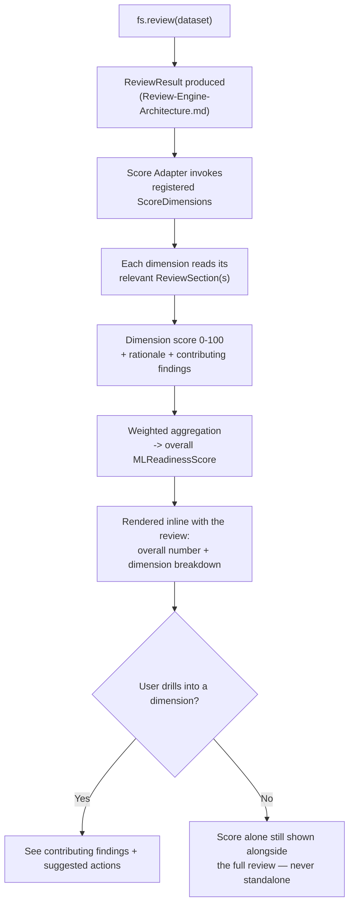
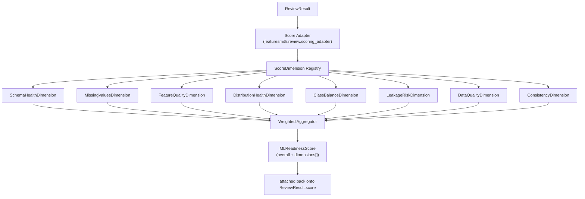

# ML Readiness Score

> **Status: Implemented (v0.4.0).** The scoring framework (dimensions, registry, aggregator, schema), 7 built-in dimensions, Score Adapter integration with Review Engine, `fs.review()` score attachment, CLI `--no-score`, and `fs.score()` accessor are implemented. `FeatureQualityDimension` implemented (v0.4.0). `DistributionHealthDimension` reads `basic_statistics` as a stub (DistributionReviewer/OutlierReviewer not yet implemented). `ClassBalanceDimension` omitted pending minority-class detector implementation. `ConsistencyDimension` and `DataQualityDimension` reconciled per spec §7.1 (cardinality double-count eliminated). CLI `--fail-below`/`--fail-below-dimension`, and `.featuresmith.yml` weight configuration remain future work. The scoring formula version is `0.3.0` (bumped from `0.2.0` after dimension reconciliation in v0.4.0).

## 1. Overview

`ML Readiness Score` is a single, legible number — `ML Readiness: 91/100` — that answers "is this dataset ready for machine learning?" at a glance, always shown with a breakdown across named dimensions a developer can drill into. It is not a new measurement: every input to the score is a finding the Review Engine's reviewers already produced. Scoring is a read-only, explainable transformation over `ReviewResult`, never an independent computation with its own access to raw data.

## 2. Vision

**This should not be a black-box score.** A number that a team could rally around without understanding what's behind it is exactly the failure mode this design exists to avoid (`Flagship-Capabilities.md` §2, `Design-Principles.md`'s "evidence before recommendations"). The ML Readiness Score is designed so that the number is never separable from its explanation: every score ships with a per-dimension breakdown, and every dimension's contribution traces back to specific, inspectable findings from a specific reviewer.

This is Phase 2's deterministic quality score, matured: instead of one scalar derived loosely from rule severities, it's a composite, multi-dimensional view, each dimension independently understandable, weighted transparently, and versioned so scores are comparable release to release (`Phases.md` Phase 2 risk note).

## 3. Goals

- Produce one overall score (0-100) and a named breakdown across scoring dimensions, always rendered together — never the overall number alone.
- Derive the score entirely from `ReviewResult` sections' findings (`Review-Engine-Architecture.md` §8.5) — no dimension computes a new statistic that isn't already backed by an existing reviewer/rule finding, and no dimension reads recommendations (`Review-Engine-Architecture.md` §8.4) as an input, only findings.
- Make the scoring formula a documented, versioned, deterministic function, so a given `ReviewResult` always produces the same score, and score changes across releases are explainable by a changelog entry, not silent drift.
- Make every dimension a stable extension point, so a plugin author or the community can propose a new scoring dimension without touching the aggregation core.
- Always pair the score with concrete, actionable next steps — "what would improve this score" is a first-class output, not an afterthought.

## 4. Non-Goals

- Not an ML model or learned scoring function. The score is a documented arithmetic formula over existing findings, deliberately, so it stays auditable (`Design-Principles.md`'s "trust over hype").
- Not a replacement for reading the underlying findings. The score is an entry point into the review, never a substitute for it — a team should never be able to act on the number without also seeing what it's built from.
- Not a cross-dataset benchmark or leaderboard. The score answers "is this dataset ready," not "how does this dataset rank against others in some global sense" — comparing scores across unrelated datasets is explicitly discouraged in the score's own documentation output.
- Not computed by the AI layer. Scoring is entirely deterministic; AI (Phase 6) may narrate *why* a score is what it is in plain language, but never computes or adjusts the number itself (`Architecture.md` §7.2).

## 5. User Stories

- As an ML engineer, I want a single number that tells me at a glance whether a dataset is ready to model, so I can triage quickly across many candidate datasets.
- As a data scientist, I want to see exactly which dimension is dragging my score down (e.g., Leakage Risk) and what specific columns are responsible, so I know where to spend my cleanup time.
- As an MLOps engineer, I want to gate a CI pipeline on a minimum overall score or a minimum per-dimension score, so a regression in one dimension (e.g., class balance drifting) fails the build even if the overall number still looks acceptable.
- As a contributor, I want to add a new scoring dimension (e.g., a temporal-consistency dimension) by implementing one interface, without changing the aggregation formula for existing dimensions.
- As a product stakeholder, I want the score explained in a sentence I can repeat in a meeting, backed by something more substantial than "the AI said so."

## 6. User Workflow



The score is never fetched independently of a review in the default workflow — it is a section of `featuresmith review`'s output. A convenience accessor (`fs.score(...)`, §10) exists for callers who already have a `ReviewResult` and want just the score object, but it does not perform a separate analysis pass.

## 7. Product Requirements

### 7.1 Scoring dimensions

The initial dimension set, each corresponding to specific reviewer sections:

| Dimension | Reads from (ReviewSection) | What "100" looks like |
|---|---|---|
| Schema Health | `SchemaHealthReviewer` | No dtype mismatches, no unexpected schema drift from declared config |
| Missing Values | `MissingValueReviewer` | No column above the configured missingness threshold |
| Feature Quality | `FeatureQualityReviewer` | No near-constant, redundant, or low-signal columns flagged |
| Distribution Health | `BasicStatisticsReviewer` (stub) | No severe skew or outlier concentration beyond configured bounds; `DistributionReviewer`/`OutlierReviewer` not yet implemented |
| Leakage Risk | `LeakageReviewer` | No target-leakage or identifier-leakage patterns detected (`Dataset-Diff-And-Leakage-Detection.md`) |
| Data Quality | `DuplicateRowReviewer`, `ConstantColumnReviewer` | No duplicate rows, no constant columns |
| Consistency | `TypeReviewer`, `CardinalityReviewer` | Stable types across the dataset, no unexplained high-cardinality columns |

Dimensions that don't apply to a given dataset (e.g., Class Balance on an unsupervised or regression dataset) are omitted from the aggregate rather than scored arbitrarily — an inapplicable dimension must never silently count as a perfect or zero score.

**Note on dimension reconciliation (v0.4.0):** Per spec §7.1, Data Quality reads only `DuplicateRowReviewer` and `ConstantColumnReviewer` (cardinality moved to Consistency). Class Balance dimension is omitted pending minority-class detector implementation; per spec §7.4, an inapplicable dimension must never silently count as a perfect or zero score. Distribution Health reads `BasicStatisticsReviewer` as a stub until `DistributionReviewer`/`OutlierReviewer` are implemented. Effective scored dimensions: 7.

### 7.2 Explainability requirement

Every `DimensionScore` must include: the numeric score, the reviewer section(s) it was derived from, a short rationale in plain language, and a list of concrete actions that would improve it. The overall score must never render without this breakdown accompanying it — enforced at the render layer, not just as a convention (`Design-Principles.md`).

### 7.3 Weighting requirement

Default weights per dimension must be documented and overridable per-project via `.featuresmith.yml`, so a team that cares more about leakage than about class balance for their use case can say so explicitly, with the resulting weighted formula still fully visible in the output (never a hidden reweighting).

### 7.4 Versioning requirement

The scoring formula (dimension list, default weights, and the per-dimension scoring function) is versioned (`scoring_version` field on `MLReadinessScore`), analogous to the versioned quality-score formula from Phase 2 (`Phases.md` Phase 2). A change to the formula bumps this version, so historical scores (once Phase 5's `QualityHistory` exists) remain interpretable in the context of the formula that produced them.

## 8. Technical Architecture



The `featuresmith.scoring` module lives inside `featuresmith-core`, alongside — not inside — the Review Engine module, since scoring is conceptually a consumer of `ReviewResult`, symmetrical to how a renderer consumes it, rather than a stage of the review pipeline itself. The Review Engine's Score Adapter (`Review-Engine-Architecture.md` §10) is the only caller.

### 8.1 ScoreDimension interface

```python
class ScoreDimension(Protocol):
    id: str            # stable, namespaced: "score.leakage_risk", "score.class_balance"
    label: str          # display name: "Leakage Risk"
    default_weight: float

    def applicable(self, result: ReviewResult) -> bool:
        """e.g., ClassBalanceDimension returns False for regression targets."""
        ...

    def compute(self, result: ReviewResult) -> DimensionScore:
        """Deterministic. Reads result.sections only — never raw data."""
        ...

class DimensionScore(BaseModel):
    id: str
    label: str
    score: float                       # 0-100
    weight: float
    rationale: str
    contributing_findings: list[RuleFinding]
    suggested_actions: list[str]

class MLReadinessScore(BaseModel):
    scoring_version: str
    overall: float                     # 0-100, weighted aggregate of applicable dimensions
    dimensions: list[DimensionScore]
```

### 8.2 Aggregation formula

`overall = round(100 * sum(d.score * d.weight for d in applicable_dimensions) / sum(d.weight for d in applicable_dimensions))`. Weights renormalize automatically when a dimension is inapplicable, so omitting Class Balance for a regression dataset doesn't silently punish the score — this renormalization behavior is itself part of the versioned, documented formula (§7.4).

## 9. Component Breakdown

| Component | Responsibility | Lives in |
|---|---|---|
| `ScoreDimension` | Extension-point interface for one scoring dimension | `featuresmith.scoring.base` |
| Built-in dimensions (§7.1) | Default 8-dimension set | `featuresmith.scoring.dimensions.*` |
| `ScoreDimensionRegistry` | Entry-point discovery, mirrors reviewer/rule registries | `featuresmith.scoring.registry` |
| `WeightedAggregator` | Applies weights, renormalizes for inapplicable dimensions, computes `overall` | `featuresmith.scoring.aggregator` |
| `MLReadinessScore`, `DimensionScore` | Pydantic result schema | `featuresmith.scoring.schema` |
| Score Adapter | Bridges `ReviewEngine` to `featuresmith.scoring` | `featuresmith.review.scoring_adapter` |

## 10. CLI / SDK Design

Scoring has no standalone top-level CLI command by design (§6) — it is always part of a review. A lightweight SDK accessor is provided for callers already holding a `ReviewResult`:

```python
import featuresmith as fs

result = fs.review("train.csv")
print(result.score.overall)                     # 91.0
for dim in result.score.dimensions:
    print(dim.label, dim.score, dim.rationale)

# Convenience accessor over an existing ReviewResult — not a second analysis pass
score = fs.score(result)
```

```
featuresmith review train.csv                 # score section included by default
featuresmith review train.csv --no-score      # omit the score section entirely
featuresmith review train.csv --fail-below 70 # CI gate on overall score
featuresmith review train.csv --fail-below-dimension leakage_risk:90
```

## 11. Design Decisions

- **The score is a section of a review, not an independent command**, so it can never be shown detached from its underlying findings — the single most important guardrail in this design, directly enforcing `Flagship-Capabilities.md` §2's "never as a standalone number."
- **Dimensions read `ReviewSection`s, not raw `RuleFinding[]` or `ProfileResult` directly.** This keeps scoring one layer removed from computation, symmetrical with how the AI layer is one layer removed from computation (`Architecture.md` §7.2) — an architectural pattern reused, not invented new.
- **Weights are configurable, but the formula shape (weighted mean of applicable dimensions) is not**, at least initially — this keeps the aggregation simple enough to audit and explain in one sentence, deferring more sophisticated aggregation (e.g., non-linear penalty for any single critical dimension) to a future, explicitly-versioned formula revision (§15).
- **Inapplicable dimensions are omitted and reweighted, never defaulted to a fixed score.** Silently scoring an inapplicable dimension at 100 (rewarding datasets for a category that doesn't apply to them) or 0 (unfairly punishing them) would both misrepresent the dataset; omission plus renormalization is the only option that doesn't quietly bias the aggregate.
- **`scoring_version` is separate from `engine_version`** (`Review-Engine-Architecture.md` §8.5) because the scoring formula can evolve independently of the Review Engine's pipeline mechanics — a formula change shouldn't force an engine version bump and vice versa.
- **A `DimensionScore`'s `suggested_actions` are short, dimension-authored hints, not `Recommendation` objects.** The Review Engine's Recommendation Engine stage (`Review-Engine-Architecture.md` §8.4) is the single source of the fuller, ranked `Recommendation[]` attached to each section; a dimension's `suggested_actions` are a lighter-weight, score-specific gloss ("reduce missingness below 5% in `col_x`") used only in the score breakdown, never a second, competing recommendation system. Where a dimension's action and a section's recommendation describe the same fix, they must not contradict each other — enforced by both reading from the same underlying findings, never from each other.

## 12. Integration Points

- **Review Engine (`Review-Engine-Architecture.md`):** the Score Adapter is the sole integration point; scoring never bypasses the engine to read raw findings directly.
- **Dataset Review (`Dataset-Review-PRD.md`):** the score is rendered inline as part of the default review output, per §7.1 of that document's coverage table.
- **Leakage Detection (`Dataset-Diff-And-Leakage-Detection.md`):** the Leakage Risk dimension is the scoring-side consumer of that document's pattern-based leakage findings.
- **Data Observability (Phase 5):** once `QualityHistory` exists, scores over time become the primary trend signal for scheduled re-review, with `scoring_version` making cross-time comparisons interpretable even across a formula change.
- **CI / GitHub Action (Phase 3):** `--fail-below` and `--fail-below-dimension` extend the existing CI-gating pattern already established for `analyze`/`review` severity thresholds.
- **AI Layer (Phase 6):** may narrate a dimension's rationale in more natural language, but never alters the numeric score or which findings contributed to it.

## 13. Testing Strategy

- **Dimension unit tests**, positive/negative fixture pairs per dimension, mirroring the rule-testing pattern (`Rules.md` §5).
- **Applicability tests**: confirm dimensions correctly opt out (e.g., Class Balance on a regression fixture) and that the aggregate reweights correctly rather than silently scoring the omitted dimension.
- **Formula regression tests**: golden-file expected scores for a fixed set of fixture datasets, per `scoring_version` — any change to a dimension's scoring function or the aggregation formula must update the golden files with an explicit, reviewed justification (`Rules.md` §5's golden-file pattern).
- **Explainability tests**: every `DimensionScore` in test fixtures must carry a non-empty rationale and at least one contributing finding or an explicit "no issues, dimension scored 100" statement.
- **Configuration tests**: custom weights in `.featuresmith.yml` are respected and reflected transparently in the rendered breakdown.
- **CI-gating tests**: `--fail-below` and `--fail-below-dimension` produce documented exit codes across a matrix of injected scores.

## 14.1 Implementation Status (as of v0.4.0)

| Component | Status | Notes |
|---|---|---|
| `ScoreDimension` interface | ✅ Implemented | `featuresmith/scoring/dimensions/base.py` |
| Built-in Dimensions | ✅ 7 Implemented | See table below |
| `ScoreDimensionRegistry` | ✅ Implemented | `featuresmith/scoring/registry.py` |
| `WeightedAggregator` | ✅ Implemented | `featuresmith/scoring/aggregator.py` |
| `MLReadinessScore`, `DimensionScore` schemas | ✅ Implemented | `featuresmith/scoring/schema.py` |
| Score Adapter (Review Engine bridge) | ✅ Implemented | `featuresmith/review/scoring_adapter.py` |
| `fs.review()` attaches score | ✅ Implemented | Automatic via ScoreAdapter |
| CLI `--no-score` | ✅ Implemented | Omits score section from output |
| `fs.score()` convenience accessor | ✅ Implemented | `featuresmith.api.score()` |
| CLI `--fail-below` | ❌ Not Implemented | Deferred |
| CLI `--fail-below-dimension` | ❌ Not Implemented | Deferred |
| `.featuresmith.yml` weight config | 🚧 Intentionally Deferred | Config system not yet built |
| `scoring_version` | ✅ Implemented | Current: `0.3.0` (was `0.2.0` pre-v0.4.0) |

### Built-in Dimension Implementation Detail

| Dimension (per §7.1) | Implemented | Reviewer Section | Notes |
|----------------------|-------------|------------------|-------|
| Schema Health | ✅ | `review.schema.health` | `SchemaHealthDimension` |
| Missing Values | ✅ | `review.quality.missingness` | `MissingValuesDimension` |
| Feature Quality | ✅ | `review.quality.feature_quality` | `FeatureQualityDimension` (added v0.4.0) |
| Distribution Health | ⚠️ Stub | `review.quality.basic_statistics` | Reads `BasicStatisticsReviewer`; `DistributionReviewer`/`OutlierReviewer` not yet implemented |
| Leakage Risk | ✅ | `review.leakage` | `LeakageRiskDimension` (added Sprint 4.1) |
| Data Quality | ✅ | `review.quality.duplicates`, `review.quality.constants` | Cardinality removed (no double-count with Consistency) |
| Consistency | ✅ | `review.schema.types`, `review.quality.cardinality` | Cardinality only here |
| Class Balance | ❌ | (target column stats) | Omitted — minority-class detector not implemented |

**Note:** Effective scored dimensions = 7. Class Balance omitted per spec §7.4; Distribution Health reads `BasicStatisticsReviewer` as stub.

## 15. Future Extensions

- **Community-contributed scoring dimensions** (e.g., a fairness/bias dimension, a temporal-consistency dimension for time-series data) registered the same way as a new reviewer or rule.
- **Non-linear aggregation option** (e.g., a hard floor: any dimension below a critical threshold caps the overall score regardless of weighting) as an opt-in alternate formula, versioned separately from the default weighted-mean formula.
- **Score trend visualization** in the dashboard once Phase 5's history store exists — "this dataset's score over the last 10 runs, by dimension."
- **Per-column score contribution view** — beyond dimension-level rationale, letting a user see which specific columns are most responsible for a low Feature Quality or Consistency score.
- **The score as a Dataset Contract field** — once `features/Dataset-Contracts-And-Planning.md` ships, a `featuresmith.lock` entry's readiness score is exactly this document's `MLReadinessScore`, unmodified; validation-gating an Apply on "did the score improve" (`Dataset-Contracts-And-Planning.md` §7.3) reads this object directly rather than recomputing anything.

## 15. Open Questions

- Should there be an escape hatch for teams that want a genuinely custom aggregation formula (not just custom weights), and if so, how is that kept from becoming an unauditable per-project black box that undermines the "not a black-box score" goal?
- Should Class Balance apply, in some modified form, to multi-label or multi-class-imbalanced-beyond-binary settings, or should it remain binary-classification-focused until real usage demands more?
- How aggressively should default weights be tuned before release — this document proposes the dimension list and formula shape, but initial default weights are left as an implementation-time, empirically-tuned decision against the benchmark dataset suite (`Phases.md` Phase 1's acceptance datasets).
- Should a "no score computed" state (e.g., `--no-score`, or too few applicable dimensions) be visually distinct from a genuinely low score, so a user never confuses "not scored" with "scored poorly"?
