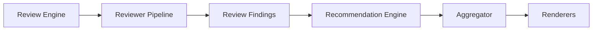
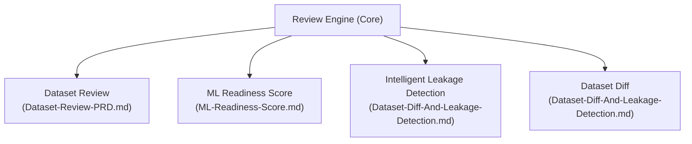
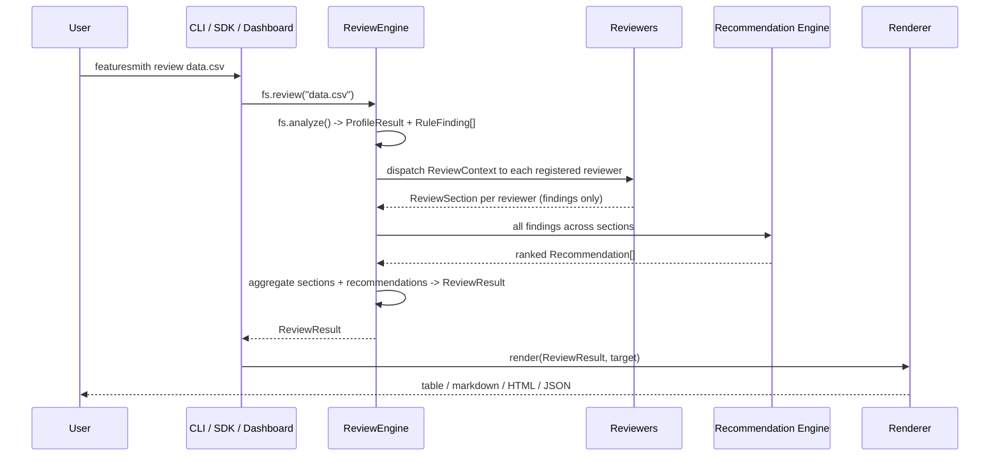
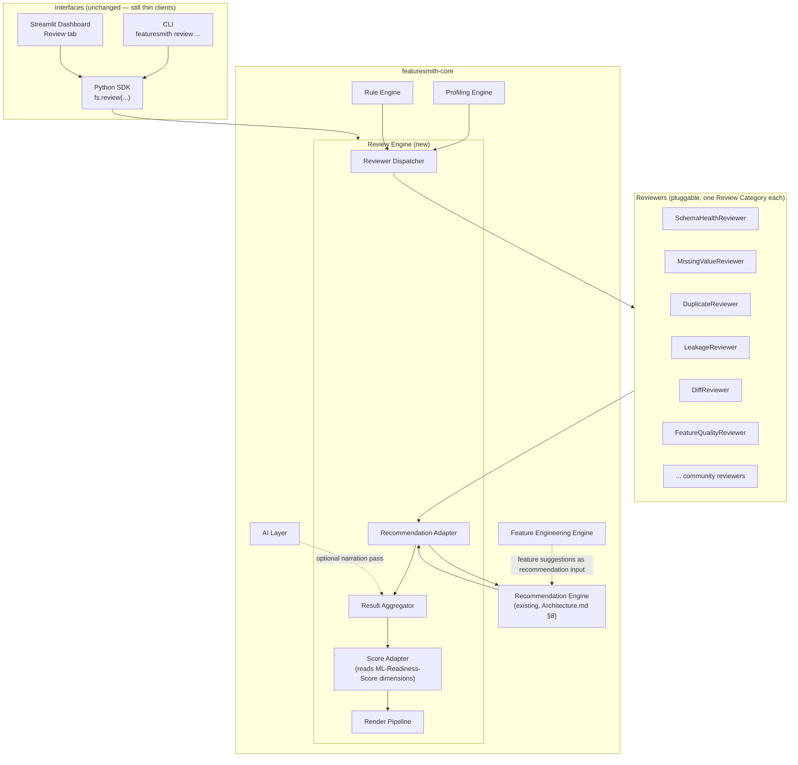
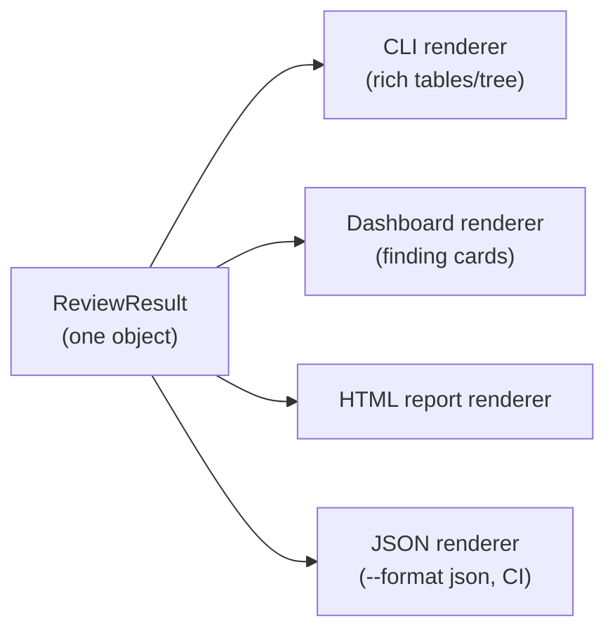

# Review Engine Architecture

> **Status: Implemented (v0.4.0).** The Review Engine core pipeline, registry, aggregator, 10 built-in reviewers (including `DiffReviewer` since v0.3.0 and `FeatureQualityReviewer` since v0.4.0), centralized Recommendation Engine (v0.4.0), ML Readiness Score integration, and console/Plan rendering are implemented. The plugin entry-point discovery, AI integration, and category registry remain future work. The standalone Dataset Diff Engine ships separately via `fs.diff()` and `featuresmith diff`, and `DiffReviewer` (v0.3.0) reuses it as a registered reviewer.
>
> **Revision note:** this revision adds a centralized Recommendation Engine stage (§8.4) and formalizes Review Categories (§9), per design review. The centralized Recommendation Engine replaces the minimal severity-ranked fallback formatter; the fallback formatter is removed. Everything else is unchanged from the prior revision.

## 1. Overview

The Review Engine is a new orchestration layer inside `featuresmith-core` that sits above the existing Profiling Engine, Rule Engine, Feature Engineering Engine, and AI Layer (`Architecture.md` §2). Its job is to turn the outputs those layers already produce — `ProfileResult`, `RuleFinding[]`, feature suggestions — into one coherent, structured **review**: the same kind of thorough, end-to-end pass a senior engineer gives a pull request, rather than a pile of separately-computed facts a user has to assemble themselves.

Today, a user who wants that experience has to call `fs.analyze()`, mentally cross-reference the findings, maybe call `fs.diff()` separately, and read `Flagship-Capabilities.md`'s description of what `featuresmith review` is *supposed* to feel like. The Review Engine is what makes that command real: one entrypoint, one result object, one rendering pipeline, built from pieces that mostly already exist.

At a glance, the engine's flow is:



Reviewers detect; the Recommendation Engine turns findings into action; the Aggregator assembles the final result; renderers present it. Each stage has exactly one job, and each is independently pluggable or replaceable without touching the others (§8, §9).

## 2. Vision

**Every dataset deserves a code review, and a code review needs a reviewer, not just a pile of linter output.** The Review Engine's reason for existing is to be that reviewer: an orchestrator that runs a configurable set of focused "reviewers" over a dataset (and, optionally, a prior snapshot of it), turns what they find into concrete recommendations, aggregates everything into one common model, and hands that model to whichever surface — CLI, dashboard, HTML report, GitHub Action — wants to render it.

This is deliberately the architectural foundation for all four flagship capabilities in `Flagship-Capabilities.md`:



None of the four are separate engines. Dataset Review is what the engine produces by default. ML Readiness Score is a number computed *from* the engine's findings, never computed independently of them. Dataset Diff and Intelligent Leakage Detection are categories of reviewer that plug into the same pipeline as every other reviewer. This is what "modular and extensible" means concretely: adding a fifth flagship capability later should mean writing one new reviewer, not touching the engine.

## 3. Goals

- Provide one orchestration entrypoint (`ReviewEngine.run()`, exposed as `fs.review()`) that produces a single, complete, structured result from a dataset.
- Make every kind of check — schema, quality, feature quality, leakage, diff — a **reviewer**: a small, independently testable, independently pluggable unit, following the exact plugin pattern already established for connectors, rules, exporters, and AI providers (`Architecture.md` §6, §16). Outlier and distribution-shape checks are planned but deferred, and will be tagged under the shipped `quality` category when built (§9.2), not as separate categories.
- Keep reviewers focused purely on **detection**. Turning a finding into a concrete, actionable recommendation is centralized in one Recommendation Engine stage (§8.4), never duplicated per reviewer.
- Organize every reviewer under a stable **Review Category** (§9), so filtering, category-specific reports, and dashboard views are a property of the architecture from day one, even though no surface exposes them yet.
- Keep the engine deterministic-first: it must produce a complete, trustworthy review with the AI layer switched off entirely (`Architecture.md` §7.4).
- Define one common result schema (`ReviewResult`) that every rendering surface (CLI, dashboard, HTML report, JSON, CI action) consumes identically — no surface computes or reshapes review content itself.
- Let future capabilities (AI narration, plugins, observability, CI/CD, dashboards) attach to the engine through existing extension points, never by changing the engine's core control flow.

## 4. Non-Goals

- The Review Engine does not compute new statistics itself. It consumes `ProfileResult` and `RuleFinding[]` from the existing Profiling and Rule Engines (`Architecture.md` §3) and organizes/aggregates them; any new statistic a reviewer needs is a Rule Engine or Profiling Engine concern, not a Review Engine one.
- It is not a replacement for `fs.analyze()`, `fs.diff()`, or `fs.export()`. Those remain the lower-level primitives; `fs.review()` is a higher-level composition built on top of them (§11).
- It does not decide *what* the ML Readiness Score weighting should be — that's `ML-Readiness-Score.md`'s concern; the engine only guarantees that scoring has a consistent, versioned set of findings to read from.
- It does not introduce a second recommendation-ranking implementation. The Recommendation Engine stage (§8.4) reuses the existing core Recommendation Engine (`Architecture.md` §8) rather than defining a new one specific to reviews.
- It is not, at this stage, a scheduler or monitoring system. Continuous/scheduled review is `Phases.md` Phase 5's Data Observability concern; the engine is designed so that phase can call it repeatedly without redesign (§15), but building the scheduler itself is out of scope for this document.
- It does not ship `--skip`, category-specific report formats, or dashboard filtering UI. Review Categories (§9) are an architectural foundation for those; `--only` itself is shipped (`Dataset-Review-PRD.md` §13.1), while the remaining flags and UI are explicitly deferred to implementation time.

## 5. User Stories

- As an ML engineer, I want one command that reviews my dataset the way a colleague would review my PR, so I don't have to remember to run five separate checks.
- As a contributor, I want to add a new category of check (e.g., a new leakage pattern) by writing one `BaseReviewer` subclass that only detects — not one that also has to know how to phrase a recommendation.
- As a maintainer, I want recommendation logic to live in exactly one place, so an improvement to how recommendations are ranked or worded benefits every reviewer category at once, not just the one a contributor happened to touch.
- As a maintainer, I want the engine's output to be identical whether it's rendered by the CLI, the dashboard, or a GitHub Action, so "surface parity" (`PRD.md` §12) extends naturally to the new command.
- As a plugin author, I want to register a community reviewer via the same `entry_points` mechanism I'd use for a rule or connector, declare which category it belongs to, and not have to learn a new extension pattern.
- As a contributor, I want to run `featuresmith review --only leakage` (shipped) or filter the dashboard to just Schema findings (future), and I want the architecture to support that without a redesign.
- As a maintainer six phases from now, I want to add AI narration, scheduled re-review, and a dashboard "Review" tab without rewriting the engine that shipped today.

## 6. User Workflow



A user never talks to a reviewer or the Recommendation Engine directly. They call `fs.review(...)` (or `featuresmith review ...`), and the engine handles discovery, dispatch, recommendation generation, aggregation, and handing the result to whichever renderer the surface needs.

## 7. Product Requirements

- The engine must run with zero configuration beyond what `fs.analyze()` already requires — reviewers ship with sensible defaults, matching the "developer-first, zero to value fast" principle in `Design-Principles.md`.
- Every reviewer must declare, structurally, whether it requires a second snapshot (diff-category reviewers) so the engine can skip them cleanly when only one dataset is provided — no reviewer should ever partially run or throw on missing input.
- Every reviewer must declare exactly one Review Category (§9) — the engine must reject, at registration time, a reviewer that declares zero or more than one category.
- Reviewers must not construct recommendations themselves. A reviewer's `review()` output may only contain findings, severity, and category — recommendation generation is exclusively the Recommendation Engine stage's responsibility (§8.4).
- The aggregated `ReviewResult` must be fully serializable (Pydantic, JSON-stable) so it can be persisted, diffed against a future run, or handed to Phase 5's `QualityHistory` store without modification.
- Reviewer execution must be individually fault-isolated: one failing reviewer must degrade to a partial-result warning on that section only, never crash the whole review (`Rules.md` §16), matching the existing rule-execution isolation guarantee.
- The engine must expose a stable, versioned schema (`engine_version` field on `ReviewResult`) so downstream consumers (dashboards, CI actions, exported reports) can detect breaking changes across releases.

## 8. Technical Architecture

### 8.1 Where the engine sits



The Review Engine is a new module inside `featuresmith-core`, not a new package — it introduces zero new surface packages, keeping the hard package boundary in `Architecture.md` §4 intact. Note that the Recommendation Engine itself is **not** new: it is the same component already defined in `Architecture.md` §8, which today merges `RuleFinding[]` with AI-ranked feature suggestions for the export layer. This revision gives it a second, formal caller — the Review Engine — rather than introducing a parallel implementation.

### 8.2 Review pipeline

The pipeline is a fixed, six-stage sequence; only stage 3 (reviewer dispatch) varies by configuration:

1. **Resolve inputs.** `fs.review(source, previous=None)` calls the existing `fs.analyze(source)` to obtain `ProfileResult` + `RuleFinding[]`. If `previous` is provided (a path, a prior `ProfileResult`, or a saved `ReviewResult`), it is resolved the same way, producing a second `ProfileResult` for diff-category reviewers.
2. **Build `ReviewContext`.** A single typed object carrying the current profile, findings, optional previous profile, resolved config, and a reference to the Feature Engineering Engine's suggestions if Phase 4 is installed and enabled.
3. **Dispatch reviewers.** The engine asks the reviewer registry (§10) which reviewers are applicable (`reviewer.applicable(context)`), runs each in isolation, and collects one `ReviewSection` per reviewer, containing findings only. Reviewers with no dependency on each other's output run independently; a reviewer may declare it *reads* another reviewer's section (e.g., the score adapter reads every section) but never mutates it.
4. **Generate recommendations.** The Recommendation Adapter (§8.4) collects every finding across every `ReviewSection` and routes them through the existing core Recommendation Engine (`Architecture.md` §8), producing a single ranked `Recommendation[]` list. This stage runs after all reviewers have completed and before aggregation — reviewers never see or influence each other's recommendations, only the Recommendation Engine does.
5. **Aggregate.** The `ResultAggregator` attaches each recommendation back onto the `ReviewSection`(s) it relates to (via `affected_columns`/originating finding), keeps a flat, ranked list on `ReviewResult.recommendations` for a cross-section view, computes the dataset-level `overall_summary`, and — if the ML Readiness Score module is enabled — invokes the Score Adapter against the assembled sections to attach a score.
6. **Render.** The `ReviewResult` is hard-frozen at this point; rendering (§8.6) is a pure, read-only transformation into the requested output format. No renderer is permitted to recompute or reinterpret a finding or recommendation.

### 8.3 Reviewer interface

```python
class BaseReviewer(Protocol):
    id: str  # namespaced, stable: "review.quality.missingness", "review.leakage.target_correlation"
    category: ReviewCategory  # exactly one — see §9
    requires_previous_snapshot: bool  # True only for diff-category reviewers

    def applicable(self, context: ReviewContext) -> bool:
        """Cheap, side-effect-free check — e.g., skip diff reviewers with no `previous`."""
        ...

    def review(self, context: ReviewContext) -> ReviewSection:
        """Deterministic, side-effect-free. Reads context; never mutates it.
        Produces findings and severity only — never constructs a Recommendation.
        Turning a finding into an actionable recommendation is the Recommendation
        Engine stage's exclusive responsibility (§8.4)."""
        ...
```

This mirrors `BaseRule`'s `run(profile_result, config) -> RuleFinding[]` shape deliberately (`Architecture.md` §9) — a contributor who has written a rule already knows most of what they need to write a reviewer. The distinction: a rule detects one specific condition; a reviewer assembles a whole *section* of the review (which may itself run, wrap, or group several rules and add narrative structure, ordering, and section-level severity) — but, like a rule, a reviewer only ever detects. Neither is permitted to decide what the user should *do* about a finding.

### 8.4 Recommendation Engine integration

Reviewers are deliberately kept detection-only. Deciding what a finding means for the user — the concrete, prioritized "here's what to do about it" — is centralized in a single stage, reusing the Recommendation Engine that already exists in `Architecture.md` §8 rather than inventing a second one scoped to reviews.

**Why centralize instead of letting each reviewer produce its own recommendations:**

- **Consistency.** A leakage finding and a missing-value finding should be turned into a recommendation with the same shape, the same confidence semantics, and the same ranking logic — not eleven slightly different per-reviewer conventions.
- **Reuse.** The Recommendation Engine already merges `RuleFinding[]` with AI-ranked feature suggestions for `fs.export()` (`Architecture.md` §8). Routing review findings through the same component means a review's recommendations and an exported pipeline's recommendations are never two divergent sources of truth.
- **Future-proofing for AI-assisted ranking.** Phase 6 already plans to *enhance* the Recommendation Engine's ranking with AI, never replace it (`Architecture.md` §7.3, `Phases.md` Phase 6). Because every review's recommendations flow through that one engine, AI-assisted ranking improves recommendations for every reviewer category simultaneously, with zero per-reviewer changes.
- **Simpler reviewers.** A reviewer's entire job is "is this true, and how severe is it" — a much smaller, more testable surface than also having to phrase a good recommendation, which keeps the barrier to contributing a new reviewer low (`Rules.md` §18).

```python
class RecommendationAdapter:
    def generate(self, sections: list[ReviewSection]) -> list[Recommendation]:
        """Collects every RuleFinding across every section and calls the
        existing core RecommendationEngine (Architecture.md §8) exactly the
        way fs.export() already does. Returns one ranked list; does not
        re-rank or filter per reviewer."""
        ...
```

The `Recommendation` object itself is unchanged from `Architecture.md` §8: `title`, `rationale`, `confidence (0-1)`, `severity`, `affected_columns`, `suggested_action`, `accepted: bool`. The Review Engine adds no new fields to it — a review-context recommendation and an export-context recommendation are the same typed object, produced by the same engine.

After generation, the aggregator (§8.5) attaches each `Recommendation` back onto every `ReviewSection` whose findings it was derived from (matched via `affected_columns` and originating finding id), so a user reading the "Leakage" section sees its recommendations inline, while `ReviewResult.recommendations` also exposes the full, ranked, cross-section list for anyone who wants the flat view (e.g., "top 5 things to fix across the whole dataset," independent of which section they came from).

If a review runs before Phase 4's Recommendation Engine has shipped, the Recommendation Adapter falls back to a minimal, deterministic formatter (one recommendation per finding, ranked by existing rule severity only, no AI ranking) — the Review Engine does not hard-depend on Phase 4's timeline (see §15).

### 8.5 Result aggregation

```python
class ReviewSection(BaseModel):
    id: str
    title: str
    category: ReviewCategory
    severity: Severity            # critical | warning | info | passed
    findings: list[RuleFinding]   # the existing, unchanged RuleFinding schema
    narrative: str | None = None  # populated only if AI layer is enabled (Architecture.md §7.4)
    recommendations: list[Recommendation] = []
    # ^ populated exclusively by the aggregator after the Recommendation Engine
    #   stage (§8.4) runs — reviewers themselves must always leave this empty.

class ReviewResult(BaseModel):
    engine_version: str
    dataset_summary: DatasetSummary
    generated_at: datetime
    sections: list[ReviewSection]
    recommendations: list[Recommendation]  # flat, ranked, cross-section view
    overall_summary: str
    score: MLReadinessScore | None = None   # see ML-Readiness-Score.md
    diff: ReviewDiff | None = None          # see Dataset-Diff-And-Leakage-Detection.md
```

Aggregation is a pure merge: sort sections by severity, distribute recommendations from the Recommendation Engine stage back onto their originating sections, compute `overall_summary` as a short, templated (non-AI) roll-up by default, and attach `score`/`diff` only when the corresponding reviewers ran. Nothing in this stage is allowed to alter a section's `findings` or a recommendation's content — traceability from a top-level recommendation back to the exact `RuleFinding` that produced it (`PRD.md` §9, `Rules.md` §21) must hold through the Review Engine exactly as it already holds through the Recommendation Engine.

### 8.6 Rendering pipeline

Following the same declarative-spec pattern already used for charts (`Architecture.md` §11): the `ReviewResult` is the one canonical artifact, and each surface owns only a renderer that turns it into its native idiom — a `rich` table tree in the CLI, cards in the dashboard, a static HTML report, or raw JSON for CI/machine consumption. No renderer computes new content; each is a formatting function over the same frozen object.



Because every section and every recommendation already carries a `category` (§9), a category-scoped renderer (a filtered CLI view, a category-specific HTML report, a dashboard filter chip) is a filter applied *before* rendering, never a different rendering code path — this is what makes category-based presentation a natural extension rather than a rewrite (§9.3).

## 9. Review Categories

### 9.1 Why categories exist

Today, a reviewer's `category` field (§8.3) exists structurally but has no consumer beyond internal bookkeeping. This section formalizes categories as a first-class, documented concept so that filtering, category-specific reporting, and dashboard organization can be built later — by implementers of `Dataset-Review-PRD.md` or the dashboard — **without changing anything in the Review Engine itself.** No CLI flags, report formats, or dashboard filtering UI are introduced by this document; only the architectural support for them.

### 9.2 Category identity

A `ReviewCategory` is a stable, namespaced string — the same design already used for rule IDs and AI provider IDs (`Rules.md` §2) — rather than a closed enum. This keeps the category set open to plugin authors the same way rules and connectors are open, while still shipping a fixed set of well-known core categories out of the box:

| Category id | Label | Example built-in reviewers |
|---|---|---|
| `schema` | Schema | `SchemaHealthReviewer`, `TypeReviewer` |
| `quality` | Quality | `MissingValueReviewer`, `DuplicateRowReviewer`, `DuplicateColumnReviewer`, `ConstantColumnReviewer`, `CardinalityReviewer`, `BasicStatisticsReviewer` |
| `feature_quality` | Feature Quality | `FeatureQualityReviewer` |
| `leakage` | Leakage | `LeakageReviewer` |
| `diff` | Diff | `DiffReviewer` |
| `recommendations` | Recommendations | *(reserved — see §9.4, not declared by any reviewer)* |
| `custom` | Custom | community/plugin reviewers that don't fit an existing category |

Every built-in reviewer declares exactly one category from this table (§7). A plugin author may declare an existing category or register a brand-new one via the `CategoryRegistry` (§10) without a core change — mirroring exactly how a new rule or connector is added today (`Architecture.md` §16).

The shipped `ReviewCategory` enum (`implementation/IMPLEMENTATION_STATUS.md`) contains exactly six categories — `schema`, `quality`, `leakage`, `diff`, `feature_quality`, and `custom`. `statistics` and `distribution` are not shipped categories; the deferred `OutlierReviewer`/`DistributionReviewer` will be tagged with a shipped category (e.g., `quality`) when implemented rather than introducing new enum values.

### 9.3 What categories enable

Categories are attached to every `ReviewSection` and every `Recommendation` (via the section(s) it was distributed to, §8.4) from day one, which is what makes each of the following a pure filter or view, with zero engine changes. The first is shipped; the rest remain future:

- **`featuresmith review --only leakage`** / **`--only schema`** (✅ shipped — `Dataset-Review-PRD.md` §13.1) — restrict reviewer dispatch (§8.2 stage 3) to reviewers whose category is in the requested set.
- **`featuresmith review --skip outliers`** — the same filtering mechanism, generalized to also match against an individual reviewer's `id`, not only its category, so a user can exclude one specific reviewer (e.g., `OutlierReviewer`, id `review.statistics.outliers`) without skipping its whole category.
- **Category-specific reports** — a renderer (§8.6) that only includes `ReviewSection`s (and their attached recommendations) matching a requested category set; no new renderer code path, just a pre-filter.
- **Plugin categories** — a community reviewer package can introduce and register a wholly new category (e.g., `fairness`) via `CategoryRegistry`, and it appears in filtering and dashboard views the same way a core category does.
- **Dashboard filtering** — a category filter-chip row in the Review tab (`Design.md` §3, §10), reusing the same `CategoryRegistry` labels the CLI and reports use, so category names never drift between surfaces.

`--only` is shipped; `--skip`, category-specific reports, plugin categories, and dashboard filtering are not yet implemented. They are listed here specifically to demonstrate that the category design already supports them without a future architectural change — only a future filtering predicate and some UI.

### 9.4 The reserved `recommendations` category

`recommendations` is not a category any reviewer declares — it is reserved for the Recommendation Engine stage's own output (§8.4), so that a future `--only recommendations` view (or a dashboard "Recommendations" tab) can show the flat, ranked, cross-section `ReviewResult.recommendations` list on its own, independent of which detection category produced each item. This keeps "detected by" and "recommended because of" filterable as two distinct axes rather than conflating them.

### 9.5 Category registry

```python
class CategoryRegistry:
    def register(self, category_id: str, label: str, description: str = "") -> None: ...
    def resolve(self, category_id: str) -> CategoryMetadata: ...
    def all(self) -> list[CategoryMetadata]: ...
```

Discovered via the same `entry_points` mechanism as every other extension point (`Architecture.md` §6), under a `featuresmith.review_categories` group — core categories (§9.2 table) are pre-registered by `featuresmith-core` itself; plugin-contributed categories register the same way a plugin rule or connector does.

## 10. Component Breakdown

| Component | Responsibility | Lives in |
|---|---|---|
| `ReviewEngine` | Orchestrates the six-stage pipeline (§8.2) | `featuresmith.review.engine` |
| `ReviewContext` | Typed carrier of current/previous profile, findings, config | `featuresmith.review.context` |
| `BaseReviewer` | Extension-point interface every reviewer implements (detection only) | `featuresmith.review.base` |
| Built-in reviewers | `SchemaHealthReviewer`, `MissingValueReviewer`, `DuplicateRowReviewer`, `DuplicateColumnReviewer`, `TypeReviewer`, `ConstantColumnReviewer`, `CardinalityReviewer`, `OutlierReviewer`, `DistributionReviewer`, `FeatureQualityReviewer`, `LeakageReviewer` (composed of pattern detectors, see `Dataset-Diff-And-Leakage-Detection.md`), `DiffReviewer` — each declaring exactly one category (§9.2) | `featuresmith.review.reviewers.*` |
| `ReviewerRegistry` | Entry-point discovery, mirrors `RuleRegistry`/`ConnectorRegistry` | `featuresmith.review.registry` |
| `RecommendationAdapter` | Collects findings across sections, calls the existing core Recommendation Engine, returns ranked `Recommendation[]` (§8.4) | `featuresmith.review.recommendation_adapter` |
| `ResultAggregator` | Distributes recommendations onto sections, merges everything into `ReviewResult`, computes overall summary | `featuresmith.review.aggregator` |
| Score Adapter | Thin bridge calling into `featuresmith.scoring` (see `ML-Readiness-Score.md`) | `featuresmith.review.scoring_adapter` |
| `CategoryRegistry` | Entry-point discoverable registry of category id → label/description (§9.5) | `featuresmith.review.categories` |
| Render Pipeline | `render(result, target: Literal["cli","dashboard","html","json"], categories: set[str] | None = None)` | `featuresmith.review.render` |
| `fs.review()` | Public SDK entrypoint | `featuresmith.api` |

## 11. CLI / SDK Design

```python
import featuresmith as fs

result = fs.review("train.csv")                       # single-snapshot review
result = fs.review("train_v2.csv", previous="train_v1.csv")  # review + diff in one call

print(result.recommendations)                          # flat, ranked, cross-section view
print(result.sections[0].recommendations)               # same recommendations, scoped to one section
```

```
featuresmith review train.csv
featuresmith review train_v2.csv --previous train_v1.csv
featuresmith review train.csv --format json
featuresmith review train.csv --fail-on critical       # CI-gating exit code, mirrors `analyze`
```

The category-aware flags described conceptually in §9.3 are partially shipped: `--only <category>` is implemented (`Dataset-Review-PRD.md` §13.1); `--skip <category|reviewer_id>` and reviewer-id-level `--only` matching are **not** part of the committed CLI surface — they are deferred to implementation time, and are mentioned here only to confirm the architecture already accommodates them.

`featuresmith review` is a two-line Typer wrapper over `fs.review()`, exactly like every other CLI command (`Architecture.md` §13, `Rules.md` §10) — the SDK is the product; the CLI renders it. `fs.review()` internally reuses `fs.analyze()`, `fs.diff()` (when applicable), and the existing Recommendation Engine; it does not reimplement profiling, diffing, or recommendation logic.

## 12. Design Decisions

- **The engine is additive, not a replacement.** `fs.analyze()`, `fs.diff()`, and `fs.export()` remain the stable, lower-level primitives contributors and existing integrations already depend on. `fs.review()` composes them. This avoids a breaking change to any existing public API (`Rules.md` §9, §21).
- **Reviewers are a fifth plugin category**, discovered via the same `entry_points` mechanism as connectors, rules, exporters, and AI providers (`Architecture.md` §6, §16) — deliberately, so there is exactly one plugin pattern in the whole codebase, not five slightly different ones.
- **A reviewer is not a rule.** Rules stay atomic and reusable outside the review context (e.g., from `fs.analyze()` directly). Reviewers are composition units — they may wrap one rule, several rules, or add structure (like schema health) that isn't a single rule at all. This keeps the Rule Engine's existing contract (`Architecture.md` §9) untouched.
- **Recommendation generation is centralized, not per-reviewer.** Every reviewer detects; exactly one Recommendation Engine — the same one already defined in `Architecture.md` §8 — decides what to do about what's detected. This is the single biggest design change in this revision, and it is what keeps recommendation quality, ranking, and future AI enhancement consistent across every review category at once (§8.4).
- **Diff is a reviewer, not a special case.** Rather than the engine having bespoke "if previous dataset given" branching logic, `DiffReviewer.applicable()` simply returns `True` only when a previous snapshot exists. This is what makes Dataset Diff "just another reviewer" architecturally, even though it's a flagship-level capability.
- **Categories are open, namespaced strings, not a closed enum**, mirroring the existing convention for rule IDs and AI provider IDs (`Rules.md` §2) — a plugin author can introduce a genuinely new category without a core-team-owned enum change.
- **Categories are designed for future filtering, and `--only` is shipped; the rest are not implemented as filtering.** This document deliberately stops at "every section and recommendation carries a category"; `--only <category>` is implemented via `Dataset-Review-PRD.md` (§13.1), while `--skip` and dashboard filter UI belong to `Dataset-Review-PRD.md` and later implementation work.
- **Scoring is computed from sections, never independently.** The Score Adapter reads the already-aggregated `ReviewSection[]`; it has no separate code path back into raw `RuleFinding[]` or the profile. This is the structural guarantee behind ML Readiness Score's "not a black box" requirement (`ML-Readiness-Score.md` §1).
- **Rendering never touches findings or recommendations.** Keeping renderers as pure functions over a frozen `ReviewResult` is what makes "surface parity" (`PRD.md` §12) trivially true for the review command, the same way it's already true for `analyze`.

## 13. Integration Points

- **Profiling & Rule Engine (Phase 1, shipped):** the engine's only two required inputs. No new coupling beyond calling `fs.analyze()`.
- **Recommendation Engine (existing, `Architecture.md` §8):** the Review Engine's single required downstream consumer of findings; every section's recommendations, and the flat `ReviewResult.recommendations` list, are produced by this one existing component, never a review-specific reimplementation.
- **Dataset Diff (Phase 2):** `DiffReviewer` wraps the existing `ProfileDiff` schema and `fs.diff()` call, tagged under the `diff` category; see `Dataset-Diff-And-Leakage-Detection.md` §8.
- **Dashboard (Phase 3):** a new "Review" tab renders `ReviewResult` using the same component set already defined in `Design.md` §10 (finding-card, severity-badge, collapsible-section); a category filter-chip row is a natural, later addition to that tab, reusing `CategoryRegistry` labels (§9.5) — not part of this design's committed scope.
- **Feature Engineering Engine (Phase 4):** `FeatureQualityReviewer`'s findings flow into the same Recommendation Engine as every other reviewer's findings (§8.4); the engine does not duplicate ranking logic, and Feature Quality is no longer a special case among reviewers with respect to recommendations.
- **Data Observability (Phase 5):** because `ReviewResult` is fully serializable and versioned, Phase 5's `QualityHistory` store can persist one per scheduled run with no schema translation step — a scheduled re-review is just "call `fs.review()` again and store the result."
- **AI Layer (Phase 6):** narration is an optional post-aggregation pass: an `AIReviewNarrator` reads the finished `ReviewResult` (never raw data, per the grounding contract in `Architecture.md` §7.2) and fills in each section's `narrative` field and the AI-enhanced `overall_summary`. Separately, Phase 6's AI-enhanced recommendation ranking (`Architecture.md` §7.3, `Phases.md` Phase 6) improves the Recommendation Engine directly, which the Review Engine automatically inherits with no changes of its own. The engine produces a complete, correct review with both passes fully disabled.
- **GitHub Action / CI (Phase 3):** `featuresmith-action` gates on `featuresmith review --fail-on <severity>`'s exit code exactly the way it already gates on `analyze` (`Phases.md` Phase 3), no action-side changes needed beyond pointing at the new command.
- **VS Code Extension (Phase 7):** inline findings on file open are a direct render of `ReviewResult` in the editor's UI, reusing the same object the CLI and dashboard already consume.

## 14. Testing Strategy

- **Reviewer unit tests**, one fixture-based positive/negative case per reviewer, following the exact pattern already required for rules (`Rules.md` §5).
- **Detection-only structural tests**: assert that `BaseReviewer.review()` output never contains a populated `recommendations` field prior to the Recommendation Engine stage — a reviewer that tries to set it must fail this test, the same way `ChatSession`'s raw-data-access test enforces its own boundary (`Rules.md` §5).
- **Registry tests** proving a reviewer registered via `entry_points` is discovered without core changes — the same conformance pattern used for `AIProvider` plugins (`Rules.md` §5).
- **Category conformance tests**: every built-in reviewer declares exactly one valid, registered category; registering a reviewer with zero or multiple categories fails at registration time.
- **Category registry tests**: a plugin-registered custom category is discoverable via `CategoryRegistry.all()` without a core change, mirroring the reviewer/rule registry conformance pattern.
- **Recommendation aggregation tests** asserting `ReviewResult` traceability: every recommendation in the aggregated result must resolve back to a specific `RuleFinding`, reviewer id, and category, whether accessed via a section's `recommendations` or the flat `ReviewResult.recommendations` list.
- **Fault-isolation tests**: a deliberately-broken reviewer must degrade its own section to a partial-result warning without affecting any other section, the Recommendation Engine stage, or crashing the run.
- **Filter-readiness tests**: a mock category/reviewer-id filter predicate against the reviewer registry correctly resolves both category-level and reviewer-id-level requests, confirming the design in §9.3 works mechanically even though no CLI flag exposes it yet.
- **Surface-parity tests**: extend the existing SDK/CLI/dashboard parity suite (`Rules.md` §5) to cover `fs.review()` and `featuresmith review`, asserting identical `ReviewResult` output for the same fixture dataset.
- **Golden-file rendering tests**: CLI table output, HTML report, and JSON output are diffed against checked-in fixtures per renderer, mirroring the exporter golden-file approach (`Rules.md` §5).
- **Backward-compatibility tests**: `fs.analyze()`, `fs.diff()`, and the existing Recommendation Engine's export-context behavior must remain byte-for-byte unchanged after the Review Engine ships — it is purely additive.

## 14.1 Implementation Status (as of v0.4.0)

The following table reflects what has been implemented versus what remains future work:

| Component | Status | Notes |
|-----------|--------|-------|
| Review Pipeline (`ReviewEngine.run`) | ✅ Implemented | 5-stage pipeline in `featuresmith/review/engine.py` |
| Reviewer Registry (`ReviewerRegistry`) | ✅ Implemented | Explicit registration in `featuresmith/review/registry.py` |
| Result Aggregator (`ResultAggregator`) | ✅ Implemented | `featuresmith/review/aggregator.py` |
| `BaseReviewer` interface | ✅ Implemented | `featuresmith/review/base.py` |
| Built-in Reviewers | ✅ 10/12 Implemented | SchemaHealth, Type, MissingValue, Duplicate, ConstantColumn, Cardinality, BasicStatistics, Leakage, Diff, FeatureQuality |
| `DuplicateColumnReviewer` | ❌ Not Implemented | Deferred |
| `OutlierReviewer` | ❌ Not Implemented | Deferred |
| `DistributionReviewer` | ❌ Not Implemented | Deferred |
| `FeatureQualityReviewer` | ✅ Implemented (v0.4.0) | `featuresmith/review/reviewers/feature_quality.py` |
| `DiffReviewer` | ✅ Implemented (v0.3.0) | `featuresmith/review/reviewers/diff.py`; reuses standalone `featuresmith.diff` engine; active only when a previous snapshot is provided |
| Review Categories (`ReviewCategory` enum) | ✅ Implemented | 6 categories: schema, quality, leakage, diff, feature_quality, custom |
| `CategoryRegistry` / entry-point discovery | 🚧 Intentionally Deferred | Explicit registration only for now |
| Centralized Recommendation Engine / Adapter | ✅ Implemented (v0.4.0) | `featuresmith.recommendation.RecommendationEngine` + `RecommendationAdapter`; fallback formatter removed |
| Score Adapter | ✅ Implemented | `featuresmith/review/scoring_adapter.py` bridges to `featuresmith.scoring` |
| Render Pipeline | 🟡 Partially | `ConsoleRenderer` + `PlanRenderer` + `RendererRegistry` implemented; dashboard/HTML/JSON renderers deferred |
| Plugin Architecture (entry_points) | 🚧 Intentionally Deferred | |
| AI Integration | 🚧 Intentionally Deferred | |
| Category-aware CLI flags (`--only`) | ✅ Implemented | `featuresmith review --only <category>` |
| `fs.review(previous=...)` | ✅ Implemented (v0.3.0) | Loads + profiles the previous snapshot once at the SDK boundary; activates the `review.diff` section and attaches `DatasetDiffResult` to `ReviewResult.diff` |
| `fs.plan()` / `featuresmith plan` | ✅ Implemented (v0.4.0) | Plan primitive from accepted recommendations |

## 15. Roadmap Placement

This document intentionally does not renumber `Phases.md`. The Review Engine is designed to be buildable incrementally against whatever phases have already shipped:

- It is fully usable today, against Phase 1 alone (schema/quality/leakage reviewers only — no diff, no feature-quality, no AI).
- `DiffReviewer` shipped in v0.3.0, once Phase 2 (`fs.diff()`) existed as its underlying engine.
- Phase 4 (Recommendation Engine, Plan primitive) is now shipped (v0.4.0). The Recommendation Adapter's fallback formatter has been removed; the centralized `RecommendationEngine` is used directly. `FeatureQualityReviewer` is active.
- AI narration and AI-enhanced recommendation ranking activate once Phase 6 ships.

A future revision of `Phases.md` should formalize this as its own milestone once implementation begins — this document is that implementation's blueprint, written first, per `Rules.md` §4.

## 16. Future Extensions

- **`--skip` and dashboard category filtering**, enabled architecturally by §9 but explicitly not designed in CLI/UI detail here (`--only` itself is shipped — §14.1) — left to `Dataset-Review-PRD.md` and implementation time.
- **Category-specific report formats** (e.g., a leakage-only HTML report for a security/compliance audience), a pure pre-filter over `ReviewResult` per §8.6.
- **Reviewer priority/ordering config** in `.featuresmith.yml`, so a team can promote leakage findings above data-quality findings in their default report view.
- **Custom review "profiles"** (e.g., a `pre-training` review profile vs. a `production-monitoring` review profile) that select a named subset of categories — useful once Phase 5 needs a lighter, faster recurring check than a full review.
- **Cross-reviewer dependencies** (e.g., a `LeakageReviewer` that reads the `FeatureQualityReviewer`'s section to avoid double-flagging) — deferred until real usage shows it's needed, to avoid over-engineering reviewer ordering prematurely.
- **Streaming/partial rendering** of sections as they complete, for large datasets where some reviewers finish long before others (dashboard progressive-loading pattern, `Design.md` §12).
- **`ReviewResult` as the sole input to Plan authoring**: once `features/Dataset-Contracts-And-Planning.md` ships (Phase 4), a `Plan` is built from an accepted set of this engine's findings and nothing else — this engine requires no changes to support that, since `ReviewResult`'s existing serializable, versioned schema (§7) already is the stable interface Plan authoring depends on.

## 17. Open Questions

- Should reviewer execution be parallelized (thread pool) by default, or sequential-by-default with parallelism as an opt-in performance flag? Affects how strictly "no reviewer sees another's output" needs to be enforced.
- Should `ReviewResult` support partial reviews (e.g., "leakage only") as a *first-class saved artifact*, or should partial runs always be presented as "a review with some sections skipped" rather than a different result type? This becomes more concrete once `--skip` and reviewer-id-level `--only` matching are actually designed (`--only <category>` is already shipped).
- How much of the `ReviewResult` schema (including the new `recommendations` field and `ReviewCategory`) should be considered public API (stable, versioned, subject to `Rules.md` §9 deprecation rules) versus internal at this early stage?
- Should the Recommendation Engine's ranking formula ever be allowed to weight recommendations differently by category (e.g., always surface a leakage recommendation above a distribution recommendation regardless of confidence), or should ranking remain strictly category-agnostic and rely purely on severity/confidence, leaving category purely as an organizing/filtering dimension?
- Where should the line sit between "this belongs in a reviewer" and "this belongs in a new rule that a reviewer merely surfaces" — this document proposes a rule of thumb (§12) but expects real reviewer implementations to pressure-test it.
- Should custom, plugin-registered categories require any core-team review before appearing in default dashboard filter lists, to avoid an unbounded, cluttered filter UI over time once plugins proliferate?
