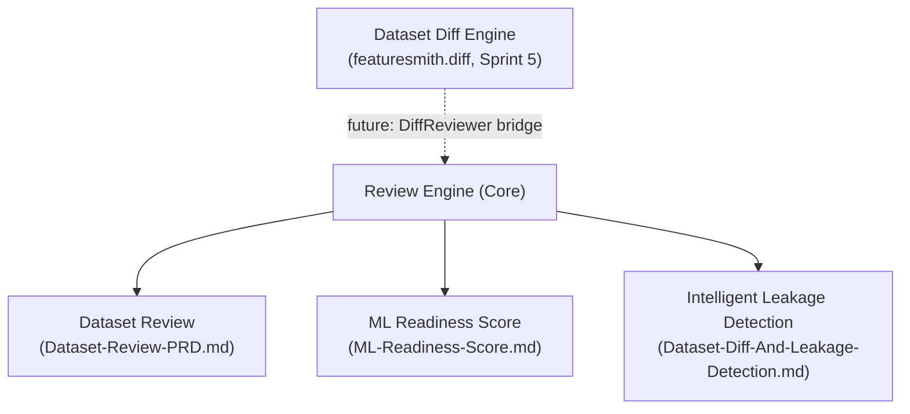
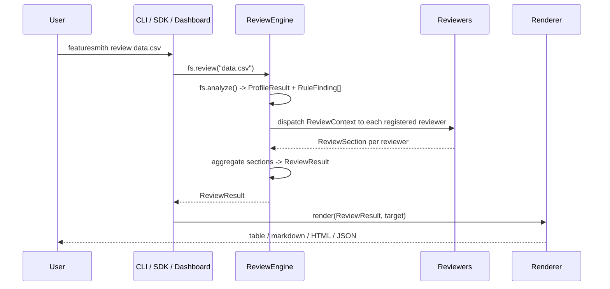
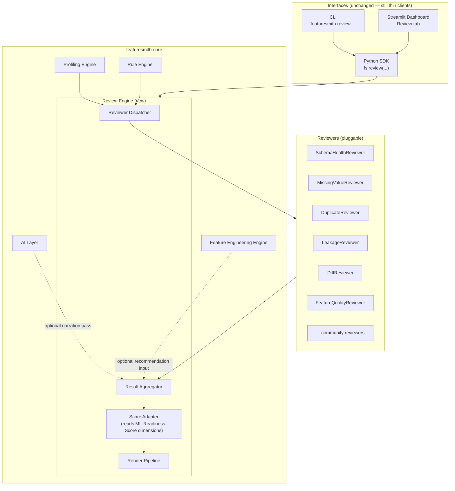
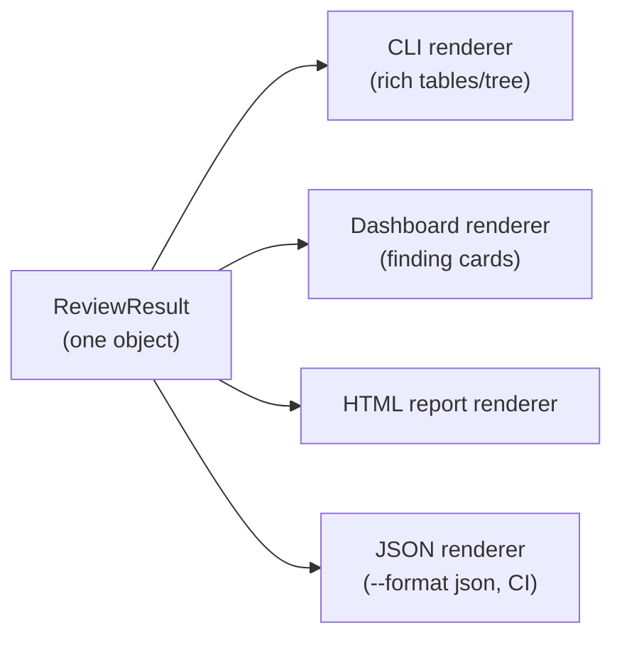

# Review Engine Architecture

> **Status: Foundation implemented (see §14 "Implemented Foundation"); core reviewer set implemented (Sprint 2, see §14); ML Readiness Score implemented (Sprint 3, see §14); intelligent leakage detection implemented (Sprint 4, see §14); leakage scoring integrated (Sprint 4.1, see §14).** This document is the architectural contract for the next major phase of Featuresmith, written and reviewed before any implementation begins, per the Documentation-First workflow in `Rules.md` §4. It does not renumber or replace `Phases.md`; see §14 ("Roadmap Placement") for how this slots into the existing roadmap. The orchestration foundation described in §5-§13 is now implemented in `packages/featuresmith-core/src/featuresmith/review/`. As of Sprint 2, **seven of the built-in reviewers (§8.1) are implemented** (Schema Health, Missing Values, Duplicate Rows, Constant Columns, High Cardinality, Data Types, Basic Statistics) and ship in `default_registry()`; as of Sprint 4, the **`LeakageReviewer` (§8.1) is also implemented** (`Dataset-Diff-And-Leakage-Detection.md`), bringing the shipped set to eight. The remaining reviewers (outliers, distribution, duplicate columns, feature quality, diff) remain future work. As of Sprint 3, the **Score Adapter (§9) is implemented** and attaches the versioned ML Readiness Score (`featuresmith.scoring`, `ML-Readiness-Score.md`) onto `ReviewResult.score` after aggregation; as of Sprint 4.1 it consumes leakage findings through the **Leakage Risk** dimension (`score.leakage_risk`, `scoring_version` 0.2.0). As of Sprint 5, **Dataset Diff ships as a standalone Diff Engine** (`featuresmith.diff`: `DatasetDiffEngine`, `fs.diff()`, `featuresmith diff old.csv new.csv`) that reuses the profiling engine and the `LeakageReviewer` internally — see `Dataset-Diff-And-Leakage-Detection.md`. The `DiffReviewer` (a `review.diff`-category reviewer) is deliberately **not** registered; the diff-aware review bridge (`fs.review(..., previous=...)`, `featuresmith review --previous`) remains future work.

## 1. Overview

The Review Engine is a new orchestration layer inside `featuresmith-core` that sits above the existing Profiling Engine, Rule Engine, Feature Engineering Engine, and AI Layer (`Architecture.md` §2). Its job is to turn the outputs those layers already produce — `ProfileResult`, `RuleFinding[]`, feature suggestions — into one coherent, structured **review**: the same kind of thorough, end-to-end pass a senior engineer gives a pull request, rather than a pile of separately-computed facts a user has to assemble themselves.

Today, a user who wants that experience has to call `fs.analyze()`, mentally cross-reference the findings, maybe call `fs.diff()` separately, and read `Flagship-Capabilities.md`'s description of what `featuresmith review` is *supposed* to feel like. The Review Engine is what makes that command real: one entrypoint, one result object, one rendering pipeline, built from pieces that mostly already exist.

## 2. Vision

**Every dataset deserves a code review, and a code review needs a reviewer, not just a pile of linter output.** The Review Engine's reason for existing is to be that reviewer: an orchestrator that runs a configurable set of focused "reviewers" over a dataset (and, optionally, a prior snapshot of it), aggregates their output into one common model, and hands that model to whichever surface — CLI, dashboard, HTML report, GitHub Action — wants to render it.

This is deliberately the architectural foundation for all four flagship capabilities in `Flagship-Capabilities.md`:



Dataset Review is what the engine produces by default. ML Readiness Score is a number computed *from* the engine's findings, never computed independently of them. Intelligent Leakage Detection is a category of reviewer that plugs into the same pipeline as every other reviewer. As of Sprint 5, Dataset Diff ships as a **standalone Diff Engine** (`featuresmith.diff`) rather than a reviewer: it reuses the profiling engine and the `LeakageReviewer` internally, and the eventual `DiffReviewer` bridge (§8.1) is explicitly future work. This is what "modular and extensible" means concretely: adding a fifth flagship capability later should mean writing one new reviewer, not touching the engine.

## 3. Goals

- Provide one orchestration entrypoint (`ReviewEngine.run()`, exposed as `fs.review()`) that produces a single, complete, structured result from a dataset.
- Make every category of check — schema, quality, leakage, diff, feature quality — a **reviewer**: a small, independently testable, independently pluggable unit, following the exact plugin pattern already established for connectors, rules, exporters, and AI providers (`Architecture.md` §6, §16).
- Keep the engine deterministic-first: it must produce a complete, trustworthy review with the AI layer switched off entirely (`Architecture.md` §7.4).
- Define one common result schema (`ReviewResult`) that every rendering surface (CLI, dashboard, HTML report, JSON, CI action) consumes identically — no surface computes or reshapes review content itself.
- Let future capabilities (AI narration, plugins, observability, CI/CD, dashboards) attach to the engine through existing extension points, never by changing the engine's core control flow.

## 4. Non-Goals

- The Review Engine does not compute new statistics itself. It consumes `ProfileResult` and `RuleFinding[]` from the existing Profiling and Rule Engines (`Architecture.md` §3) and organizes/aggregates them; any new statistic a reviewer needs is a Rule Engine or Profiling Engine concern, not a Review Engine one.
- It is not a replacement for `fs.analyze()`, `fs.diff()`, or `fs.export()`. Those remain the lower-level primitives; `fs.review()` is a higher-level composition built on top of them (§10).
- It does not decide *what* the ML Readiness Score weighting should be — that's `ML-Readiness-Score.md`'s concern; the engine only guarantees that scoring has a consistent, versioned set of findings to read from.
- It is not, at this stage, a scheduler or monitoring system. Continuous/scheduled review is `Phases.md` Phase 5's Data Observability concern; the engine is designed so that phase can call it repeatedly without redesign (§14), but building the scheduler itself is out of scope for this document.

## 5. User Stories

- As an ML engineer, I want one command that reviews my dataset the way a colleague would review my PR, so I don't have to remember to run five separate checks.
- As a contributor, I want to add a new category of check (e.g., a new leakage pattern) by writing one `BaseReviewer` subclass, without touching engine internals or any specific surface.
- As a maintainer, I want the engine's output to be identical whether it's rendered by the CLI, the dashboard, or a GitHub Action, so "surface parity" (`PRD.md` §12) extends naturally to the new command.
- As a plugin author, I want to register a community reviewer via the same `entry_points` mechanism I'd use for a rule or connector, so I don't have to learn a new extension pattern.
- As a maintainer six phases from now, I want to add AI narration, scheduled re-review, and a dashboard "Review" tab without rewriting the engine that shipped today.

## 6. User Workflow



A user never talks to a reviewer directly. They call `fs.review(...)` (or `featuresmith review ...`), and the engine handles discovery, dispatch, aggregation, and handing the result to whichever renderer the surface needs.

## 7. Product Requirements

- The engine must run with zero configuration beyond what `fs.analyze()` already requires — reviewers ship with sensible defaults, matching the "developer-first, zero to value fast" principle in `Design-Principles.md`.
- Every reviewer must declare, structurally, whether it requires a second snapshot (diff-category reviewers) so the engine can skip them cleanly when only one dataset is provided — no reviewer should ever partially run or throw on missing input.
- The aggregated `ReviewResult` must be fully serializable (Pydantic, JSON-stable) so it can be persisted, diffed against a future run, or handed to Phase 5's `QualityHistory` store without modification.
- Reviewer execution must be individually fault-isolated: one failing reviewer must degrade to a partial-result warning on that section only, never crash the whole review (`Rules.md` §16), matching the existing rule-execution isolation guarantee.
- The engine must expose a stable, versioned schema (`engine_version` field on `ReviewResult`) so downstream consumers (dashboards, CI actions, exported reports) can detect breaking changes across releases.

## 8. Technical Architecture

### 8.1 Where the engine sits



The Review Engine is a new module inside `featuresmith-core`, not a new package — it introduces zero new surface packages, keeping the hard package boundary in `Architecture.md` §4 intact.

### 8.2 Review pipeline

The pipeline is a fixed, five-stage sequence; only stage 3 (reviewer dispatch) varies by configuration:

1. **Resolve inputs.** `fs.review(source, previous=None)` calls the existing `fs.analyze(source)` to obtain `ProfileResult` + `RuleFinding[]`. If `previous` is provided (a path, a prior `ProfileResult`, or a saved `ReviewResult`), it is resolved the same way, producing a second `ProfileResult` for diff-category reviewers.
2. **Build `ReviewContext`.** A single typed object carrying the current profile, findings, optional previous profile, resolved config, and a reference to the Feature Engineering Engine's suggestions if Phase 4 is installed and enabled.
3. **Dispatch reviewers.** The engine asks the reviewer registry (§9) which reviewers are applicable (`reviewer.applicable(context)`), runs each in isolation, and collects one `ReviewSection` per reviewer. Reviewers with no dependency on each other's output run independently; a reviewer may declare it *reads* another reviewer's section (e.g., the score adapter reads every section) but never mutates it.
4. **Aggregate.** The `ResultAggregator` merges all sections into one `ReviewResult`, computes the dataset-level `overall_summary`, and — if the ML Readiness Score module is enabled — invokes it against the assembled sections to attach a score.
5. **Render.** The `ReviewResult` is hard-frozen at this point; rendering (§8.5) is a pure, read-only transformation into the requested output format. No renderer is permitted to recompute or reinterpret a finding.

### 8.3 Reviewer interface

```python
class BaseReviewer(Protocol):
    id: str  # namespaced, stable: "review.quality.missingness", "review.leakage.target_correlation"
    category: ReviewCategory  # schema | quality | leakage | diff | feature_quality | custom
    requires_previous_snapshot: bool  # True only for diff-category reviewers

    def applicable(self, context: ReviewContext) -> bool:
        """Cheap, side-effect-free check — e.g., skip diff reviewers with no `previous`."""
        ...

    def review(self, context: ReviewContext) -> ReviewSection:
        """Deterministic, side-effect-free. Reads context; never mutates it."""
        ...
```

This mirrors `BaseRule`'s `run(profile_result, config) -> RuleFinding[]` shape deliberately (`Architecture.md` §9) — a contributor who has written a rule already knows most of what they need to write a reviewer. The distinction: a rule detects one specific condition; a reviewer assembles a whole *section* of the review (which may itself run, wrap, or group several rules and add narrative structure, ordering, and section-level severity).

### 8.4 Result aggregation

```python
class ReviewSection(BaseModel):
    id: str
    title: str
    category: ReviewCategory
    severity: Severity            # critical | warning | info | passed
    findings: list[RuleFinding]   # the existing, unchanged RuleFinding schema
    narrative: str | None = None  # populated only if AI layer is enabled (Architecture.md §7.4)
    recommendations: list[Recommendation] = []

class ReviewResult(BaseModel):
    engine_version: str
    dataset_summary: DatasetSummary
    generated_at: datetime
    sections: list[ReviewSection]
    overall_summary: str
    score: MLReadinessScore | None = None   # see ML-Readiness-Score.md
    diff: ReviewDiff | None = None          # see Dataset-Diff-And-Leakage-Detection.md
```

Aggregation is a pure merge: sort sections by severity, compute `overall_summary` as a short, templated (non-AI) roll-up by default, and attach `score`/`diff` only when the corresponding reviewers ran. Nothing in this stage is allowed to alter a section's `findings` — traceability from a top-level recommendation back to the exact `RuleFinding` that produced it (`PRD.md` §9, `Rules.md` §21) must hold through the Review Engine exactly as it already holds through the Recommendation Engine.

### 8.5 Rendering pipeline

Following the same declarative-spec pattern already used for charts (`Architecture.md` §11): the `ReviewResult` is the one canonical artifact, and each surface owns only a renderer that turns it into its native idiom — a `rich` table tree in the CLI, cards in the dashboard, a static HTML report, or raw JSON for CI/machine consumption. No renderer computes new content; each is a formatting function over the same frozen object.



## 9. Component Breakdown

| Component | Responsibility | Lives in |
|---|---|---|
| `ReviewEngine` | Orchestrates the five-stage pipeline (§8.2) | `featuresmith.review.engine` |
| `ReviewContext` | Typed carrier of current/previous profile, findings, config | `featuresmith.review.context` |
| `BaseReviewer` | Extension-point interface every reviewer implements | `featuresmith.review.base` |
| Built-in reviewers | `SchemaHealthReviewer`, `MissingValueReviewer`, `DuplicateRowReviewer`, `DuplicateColumnReviewer`, `TypeReviewer`, `ConstantColumnReviewer`, `CardinalityReviewer`, `OutlierReviewer`, `DistributionReviewer`, `FeatureQualityReviewer`, `LeakageReviewer` (composed of pattern detectors, see `Dataset-Diff-And-Leakage-Detection.md`), `DiffReviewer` | `featuresmith.review.reviewers.*` |
| `ReviewerRegistry` | Entry-point discovery, mirrors `RuleRegistry`/`ConnectorRegistry` | `featuresmith.review.registry` |
| `ResultAggregator` | Merges sections into `ReviewResult`, computes overall summary | `featuresmith.review.aggregator` |
| Score Adapter | Thin bridge calling into `featuresmith.scoring` (see `ML-Readiness-Score.md`) | `featuresmith.review.scoring_adapter` |
| Render Pipeline | `render(result, target: Literal["cli","dashboard","html","json"])` | `featuresmith.review.render` |
| `fs.review()` | Public SDK entrypoint | `featuresmith.api` |

## 10. CLI / SDK Design

```python
import featuresmith as fs

result = fs.review("train.csv")                       # single-snapshot review
result = fs.review("train_v2.csv", previous="train_v1.csv")  # review + diff in one call
```

```
featuresmith review train.csv
featuresmith review train_v2.csv --previous train_v1.csv
featuresmith review train.csv --format json
featuresmith review train.csv --only leakage,quality   # limit to reviewer categories
featuresmith review train.csv --fail-on critical       # CI-gating exit code, mirrors `analyze`
```

`featuresmith review` is a two-line Typer wrapper over `fs.review()`, exactly like every other CLI command (`Architecture.md` §13, `Rules.md` §10) — the SDK is the product; the CLI renders it. `fs.review()` internally reuses `fs.analyze()` and (when applicable) `fs.diff()`; it does not reimplement profiling or diffing logic.

## 11. Design Decisions

- **The engine is additive, not a replacement.** `fs.analyze()`, `fs.diff()`, and `fs.export()` remain the stable, lower-level primitives contributors and existing integrations already depend on. `fs.review()` composes them. This avoids a breaking change to any existing public API (`Rules.md` §9, §21).
- **Reviewers are a fifth plugin category**, discovered via the same `entry_points` mechanism as connectors, rules, exporters, and AI providers (`Architecture.md` §6, §16) — deliberately, so there is exactly one plugin pattern in the whole codebase, not five slightly different ones.
- **A reviewer is not a rule.** Rules stay atomic and reusable outside the review context (e.g., from `fs.analyze()` directly). Reviewers are composition units — they may wrap one rule, several rules, or add structure (like schema health) that isn't a single rule at all. This keeps the Rule Engine's existing contract (`Architecture.md` §9) untouched.
- **Diff is a reviewer, not a special case.** Rather than the engine having bespoke "if previous dataset given" branching logic, `DiffReviewer.applicable()` simply returns `True` only when a previous snapshot exists. This is what makes Dataset Diff "just another reviewer" architecturally, even though it's a flagship-level capability.
- **Scoring is computed from sections, never independently.** The Score Adapter reads the already-aggregated `ReviewSection[]`; it has no separate code path back into raw `RuleFinding[]` or the profile. This is the structural guarantee behind ML Readiness Score's "not a black box" requirement (`ML-Readiness-Score.md` §1).
- **Rendering never touches findings.** Keeping renderers as pure functions over a frozen `ReviewResult` is what makes "surface parity" (`PRD.md` §12) trivially true for the review command, the same way it's already true for `analyze`.

## 12. Integration Points

- **Profiling & Rule Engine (Phase 1, shipped):** the engine's only two required inputs. No new coupling beyond calling `fs.analyze()`.
- **Dataset Diff (Phase 2):** `DiffReviewer` wraps the existing `ProfileDiff` schema and `fs.diff()` call; see `Dataset-Diff-And-Leakage-Detection.md` §8.
- **Dashboard (Phase 3):** a new "Review" tab renders `ReviewResult` using the same component set already defined in `Design.md` §10 (finding-card, severity-badge, collapsible-section) — no new component vocabulary.
- **Feature Engineering Engine (Phase 4):** `FeatureQualityReviewer` and the recommendation fields on `ReviewSection` read directly from the existing `RecommendationEngine` output (`Architecture.md` §8); the engine does not duplicate ranking logic.
- **Data Observability (Phase 5):** because `ReviewResult` is fully serializable and versioned, Phase 5's `QualityHistory` store can persist one per scheduled run with no schema translation step — a scheduled re-review is just "call `fs.review()` again and store the result."
- **AI Layer (Phase 6):** narration is an optional post-aggregation pass: an `AIReviewNarrator` reads the finished `ReviewResult` (never raw data, per the grounding contract in `Architecture.md` §7.2) and fills in each section's `narrative` field and the AI-enhanced `overall_summary`. The engine produces a complete, correct review with this pass fully disabled.
- **GitHub Action / CI (Phase 3):** `featuresmith-action` gates on `featuresmith review --fail-on <severity>`'s exit code exactly the way it already gates on `analyze` (`Phases.md` Phase 3), no action-side changes needed beyond pointing at the new command.
- **VS Code Extension (Phase 7):** inline findings on file open are a direct render of `ReviewResult` in the editor's UI, reusing the same object the CLI and dashboard already consume.

## 13. Testing Strategy

- **Reviewer unit tests**, one fixture-based positive/negative case per reviewer, following the exact pattern already required for rules (`Rules.md` §5).
- **Registry tests** proving a reviewer registered via `entry_points` is discovered without core changes — the same conformance pattern used for `AIProvider` plugins (`Rules.md` §5).
- **Aggregation tests** asserting `ReviewResult` traceability: every recommendation in the aggregated result must resolve back to a specific `RuleFinding` and reviewer id.
- **Fault-isolation tests**: a deliberately-broken reviewer must degrade its own section to a partial-result warning without affecting any other section or crashing the run.
- **Surface-parity tests**: extend the existing SDK/CLI/dashboard parity suite (`Rules.md` §5) to cover `fs.review()` and `featuresmith review`, asserting identical `ReviewResult` output for the same fixture dataset.
- **Golden-file rendering tests**: CLI table output, HTML report, and JSON output are diffed against checked-in fixtures per renderer, mirroring the exporter golden-file approach (`Rules.md` §5).
- **Backward-compatibility tests**: `fs.analyze()` and `fs.diff()` behavior and output must remain byte-for-byte unchanged after the Review Engine ships — it is purely additive.

## 14. Roadmap Placement

This document intentionally does not renumber `Phases.md`. The Review Engine is designed to be buildable incrementally against whatever phases have already shipped:

- It is fully usable today, against Phase 1 alone (schema/quality/leakage reviewers only — no diff, no feature-quality, no AI).
- `DiffReviewer` activates once Phase 2 (`fs.diff()`) exists.
- `FeatureQualityReviewer` and recommendation enrichment activate once Phase 4 ships.
- AI narration activates once Phase 6 ships.

A future revision of `Phases.md` should formalize this as its own milestone once implementation begins — this document is that implementation's blueprint, written first, per `Rules.md` §4.

### Implemented Foundation

The orchestration foundation (§5-§13) is implemented in `packages/featuresmith-core/src/featuresmith/review/`, wired end-to-end:

- **Schemas (§8):** `Severity`, `ReviewCategory`, `ReviewSection`, `ReviewResult` in `schema.py`; `ReviewResult.score` is a typed `MLReadinessScore | None` populated by the Score Adapter (§9); `ReviewResult.diff` remains a reserved attachment point as `None`.
- **Context (§9):** `ReviewConfig` + frozen `ReviewContext` in `context.py`; no `ExecutionState` class — state lives on the context itself.
- **Reviewers (§8.1):** `BaseReviewer` ABC (`base.py`) + `ReviewerRegistry` (`registry.py`) with `default_registry()` now shipping the eight built-in reviewers implemented in Sprint 2 (seven) and Sprint 4 (leakage).
- **Engine (§6, §10):** `ReviewEngine.run()` pipeline in `engine.py` (`REVIEW_ENGINE_VERSION = "0.1.0"`): config validation → context construction → reviewer dispatch (enabled-reviewer/category filters, previous-snapshot gate, `applicable()` gate) → fault-isolated execution → aggregation via `ResultAggregator` (`aggregator.py`).
- **Rendering (§7):** `ConsoleRenderer` + `RendererRegistry` in `render.py`; a `render()` facade dispatches by target name (console only for now).

### Implemented Built-in Reviewers (Sprint 2)

Seven built-in reviewers now live in `packages/featuresmith-core/src/featuresmith/review/reviewers/`, all subclasses of the shared `SectionReviewer` base (`base.py`) and all registered in `default_registry()`:

| Reviewer | ID | Category | Notes |
|---|---|---|---|
| `SchemaHealthReviewer` | `review.schema.health` | `schema` | Fully empty columns, zero rows/columns |
| `TypeReviewer` | `review.schema.types` | `schema` | Identifier-like numeric columns, free-text columns |
| `MissingValueReviewer` | `review.quality.missingness` | `quality` | Per-column missingness threshold (default 20%), excludes fully empty columns |
| `DuplicateReviewer` | `review.quality.duplicates` | `quality` | Duplicate-row percentage threshold (default 10%) |
| `ConstantColumnReviewer` | `review.quality.constants` | `quality` | Constant non-empty columns |
| `CardinalityReviewer` | `review.quality.cardinality` | `quality` | High unique-ratio categorical columns (threshold 0.50, min cardinality 20) |
| `BasicStatisticsReviewer` | `review.quality.basic_statistics` | `quality` | Skewness/kurtosis flags, numeric constant columns, identifier-like numeric columns, text columns |

Each reviewer reads only from the frozen `ReviewContext`, reuses the existing rule engine for detection where a matching rule exists (missingness, duplicates, constants, cardinality), sets `requires_previous_snapshot = False`, and emits its `ReviewSection` deterministically with traceable `RuleFinding`s. Reviewer-specific thresholds are configurable via `ReviewConfig.reviewer_config` keyed by reviewer ID.

### Implemented Leakage Review (Sprint 4)

The `LeakageReviewer` (`review.reviewers.leakage`, id `review.leakage`, category `leakage`) ships in `default_registry()` and dispatches the six built-in `LeakagePatternDetector`s from `featuresmith.rules.leakage` (future-information, target-correlation, identifier-shape, duplicate-target, timestamp, and suspicious-correlation patterns; `Dataset-Diff-And-Leakage-Detection.md` §7.2). Findings that point at the same column are merged into one `RuleFinding` citing every contributing pattern. The reviewer reads `context.config.target_column`, so `fs.review(..., target_column=...)` (and the CLI's `--target`) activates target-aware detection.

Still future work: `OutlierReviewer`, `DistributionReviewer`, `DuplicateColumnReviewer`, `FeatureQualityReviewer`, `DiffReviewer`, and any `requires_previous_snapshot = True` diff-category reviewers.

### Implemented Dataset Diff (Sprint 5)

Dataset Diff ships as a **standalone engine** in `packages/featuresmith-core/src/featuresmith/diff/`, deliberately outside the Review Engine's `default_registry()`:

- **`featuresmith.diff.engine`** — `DatasetDiffEngine.diff(previous, current, *, target_column=None, config=None)` computes a typed `DatasetDiffResult` from two `ProfileResult` snapshots, plus a `compute_diff()` facade.
- **`featuresmith.diff.schema`** — frozen, fully serializable models (`SchemaDiff`, `StructureDiff`, `MissingValueDiff`, `DuplicateDiff`, `ConstantColumnDiff`, `CardinalityDiff`, `StatisticDiff`, `DistributionDiff`, `LeakageDiff`, `DatasetDiffSummary`, `DatasetDiffResult`, `DiffConfig`), `DIFF_ENGINE_VERSION = "0.1.0"`.
- **`featuresmith.diff.findings`** — `findings_from_diff()` maps the diff onto shared `RuleFinding`s (category `diff`) that drive severity-gated CLI exit codes.
- **`featuresmith.diff.render`** — `DiffConsoleRenderer` + `render_diff()` produce a deterministic plain-text report.
- **Reuse:** the engine consumes the existing profiling engine's `ProfileResult` (missingness, duplicates, constants, cardinality, statistics) and runs the existing `LeakageReviewer` against each snapshot for the leakage comparison (`--target`). No raw-data analysis is duplicated.
- **SDK/CLI:** `fs.diff(old, new, *, target_column=...)` (plus `featuresmith.api.diff_findings`) and `featuresmith diff old.csv new.csv` (`--target`, `--format json`, `--output`, `--fail-on`, `--quiet`).

The `DiffReviewer` bridge that would surface this inside `fs.review(..., previous=...)` is **not** shipped — `ReviewContext.previous_profile` and the `ReviewResult.diff` attachment point remain reserved for that future reviewer. The single-dataset Review Engine and the two-dataset Diff Engine stay separate workflows.

### Implemented ML Readiness Score (Sprint 3)

The Score Adapter (§9) is now implemented and is the **sole** bridge from the Review Engine to `featuresmith.scoring` (`ML-Readiness-Score.md` §16):

- **`ScoreAdapter`** (`featuresmith.review.scoring_adapter`) — `attach(result)` rebuilds the `ReviewResult` with `score` set after aggregation, or returns the original unchanged when no dimension applies. `ReviewEngine.__init__` accepts `registry`/`aggregator`/`score_adapter` overrides; `run()` invokes `score_adapter.attach(result)` as its final step.
- **`featuresmith.scoring`** — eight built-in `ScoreDimension`s, one per shipped reviewer (§16.1 mapping), versioned deterministic formula `scoring_version = "0.2.0"` (per-severity deductions §16.2; the Leakage Risk dimension joined the list in Sprint 4.1), `ScoreDimensionRegistry` + `default_registry()`, `WeightedAggregator`, frozen `DimensionScore`/`MLReadinessScore` dataclasses.
- **Surfaces:** every `ReviewResult` from `fs.review()` now carries `score`; `fs.score(result)` accessor; console renderer prints an "ML Readiness Score" block; `--no-score` CLI flag omits it (`--no-score --format json` yields `"score": null`).
- **Out of scope (deferred):** `--fail-below`/`--fail-below-dimension` CI gating, diff-category reviewers, and the remaining §8.1 reviewers.

## 15. Future Extensions

- **Reviewer priority/ordering config** in `.featuresmith.yml`, so a team can promote leakage findings above quality findings in their default report view.
- **Custom review "profiles"** (e.g., a `pre-training` review profile vs. a `production-monitoring` review profile) that select a named subset of reviewers — useful once Phase 5 needs a lighter, faster recurring check than a full review.
- **Cross-reviewer dependencies** (e.g., a `LeakageReviewer` that reads the `FeatureQualityReviewer`'s section to avoid double-flagging) — deferred until real usage shows it's needed, to avoid over-engineering reviewer ordering prematurely.
- **Streaming/partial rendering** of sections as they complete, for large datasets where some reviewers finish long before others (dashboard progressive-loading pattern, `Design.md` §12).

## 16. Open Questions

- Should reviewer execution be parallelized (thread pool) by default, or sequential-by-default with parallelism as an opt-in performance flag? Affects how strictly "no reviewer sees another's output" needs to be enforced.
- Should `ReviewResult` support partial reviews (e.g., "leakage only") as a *first-class saved artifact*, or should partial runs always be presented as "a review with some sections skipped" rather than a different result type?
- How much of the `ReviewResult` schema should be considered public API (stable, versioned, subject to `Rules.md` §9 deprecation rules) versus internal at this early stage?
- Where should the line sit between "this belongs in a reviewer" and "this belongs in a new rule that a reviewer merely surfaces" — this document proposes a rule of thumb (§11) but expects real reviewer implementations to pressure-test it.
