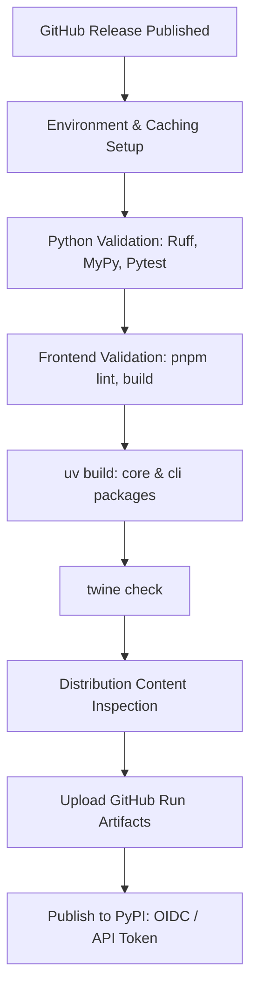

# Production PyPI Publishing Guide

This guide documents the release engineering process and verification checklist for publishing **Featuresmith** production packages to the public PyPI repository.

---

## How Production Publishing Works

The production publishing pipeline is a fully automated release workflow defined in [publish-pypi.yml](file:///.github/workflows/publish-pypi.yml). It ensures that packages are only published after passing a strict multi-stage validation check:



If **any** validation check fails, the workflow immediately aborts. Partial or unverified builds are never published.

---

## Authentication Methods

The workflow supports two authentication mechanisms for uploading distributions:

### 1. Trusted Publishing via OIDC (Preferred)

GitHub Trusted Publishing uses OpenID Connect (OIDC) token exchange, eliminating the need to configure and store long-lived, static API tokens in GitHub.

#### How to Configure Trusted Publishing on PyPI

To set up OIDC Trusted Publishing, an owner or administrator of the PyPI projects must register GitHub Actions as a publisher for both packages:

1. Log in to [pypi.org](https://pypi.org/).
2. Navigate to **Account Settings** -> **Publishing** (or directly configure each project).
3. For **featuresmith-core**:
   - **Publisher**: GitHub
   - **Owner / Organization**: `adityagangwani30`
   - **Repository**: `FeatureSmith`
   - **Workflow name**: `publish-pypi.yml`
   - **Environment name**: `production`
4. For **featuresmith-cli**:
   - Repeat the configuration with the same values.

When Trusted Publishing is configured, the PyPI publishing job exchanges its GitHub JWT for a short-lived PyPI upload token. Since the workflow uses `environment: production`, this exchange is highly secure and cannot be triggered outside of approved environments.

### 2. Static API Token via GitHub Secrets (Fallback)

If Trusted Publishing is not yet configured, the workflow falls back to using the `PYPI_API_TOKEN` secret.

#### How to Configure the Token Secret

1. Generate a new API token on [pypi.org](https://pypi.org/) (recommend scoping the token to the specific project/organization).
2. Go to the repository on GitHub:
   `https://github.com/adityagangwani30/FeatureSmith/settings/secrets/actions`
3. Click **New repository secret**.
4. Set **Name** to `PYPI_API_TOKEN`.
5. Paste the token as the **Value** (ensure it includes the `pypi-` prefix).
6. Click **Add secret**.

The workflow automatically passes this secret to `pypa/gh-action-pypi-publish`. If the secret is not defined in GitHub, the action automatically falls back to attempting OIDC Trusted Publishing.

---

## How to Trigger a Release

Production releases must only be triggered via a GitHub Release. Publishing on push to `main` or pull requests is strictly prohibited.

1. Finalize the codebase and ensure all versions are bumped to the target release version (e.g., `0.1.0`) in:
   - `pyproject.toml` (root workspace and individual packages in `packages/`)
   - `frontend/package.json`
2. Go to the repository's GitHub homepage and click **Releases** -> **Draft a new release**.
3. Choose or create a Git version tag (e.g., `v0.1.0`).
4. Set the **Target** to `main` (or the release branch).
5. Add a release title and describe the changes in the release notes.
6. Click **Publish release**.
7. The **Publish to Production PyPI** workflow will trigger automatically. You can monitor the progress under the **Actions** tab.

---

## How to Rollback a Failed Release

Because PyPI prohibits re-uploading files with the exact same filename or version number (even if they were deleted), mistakes must be handled carefully.

### If the CI Pipeline Fails
If a validation step fails in GitHub Actions before publishing, no files are uploaded. You can safely fix the bug, push to `main`, delete the old release/tag, and create a new release.

### If the Packages Have Already Been Published
If a bug is discovered after the packages have been successfully uploaded to PyPI:

1. **Yank the release on PyPI**:
   - Go to [pypi.org/project/featuresmith-core/](https://pypi.org/project/featuresmith-core/) and [pypi.org/project/featuresmith-cli/](https://pypi.org/project/featuresmith-cli/).
   - Navigate to **Manage** -> **Release history**.
   - Select the options menu next to the affected version and click **Yank**.
   - *Note: Yanking notifies installers that the release has bugs and prevents `pip` from installing it by default unless it is explicitly requested or pinned. It avoids breaking existing deployments that might depend on it.*
2. **Commit a fix** to the repository.
3. **Bump the version**:
   - Update the version in `packages/featuresmith-core/pyproject.toml`, `packages/featuresmith-cli/pyproject.toml`, and the root `pyproject.toml` (e.g., bump to `0.1.1` or `0.1.0-post1` if a post-release is preferred).
4. **Draft and Publish a New Release**:
   - Create a new tag (e.g., `v0.1.1`) and publish a new GitHub Release. This will trigger the publishing workflow again with the new version.

---

## Post-Publish Verification Checklist

Once the publishing workflow completes successfully, perform the following steps to verify the release:

### 1. Verification of Package Indices
- Visit [pypi.org/project/featuresmith-core](https://pypi.org/project/featuresmith-core/) and check that the metadata, description, license (`Apache-2.0`), project URLs, and homepage links are correct.
- Visit [pypi.org/project/featuresmith-cli](https://pypi.org/project/featuresmith-cli/) and verify details.
- Confirm that **featuresmith-dashboard is NOT published** on PyPI.

### 2. Clean Installation Testing
Create a clean python virtual environment and install both packages from scratch:

```bash
# Create and activate environment
python -m venv fs-verify-env
source fs-verify-env/bin/activate  # Windows: fs-verify-env\Scripts\activate

# Install packages
pip install --no-cache-dir featuresmith-core featuresmith-cli
```

### 3. SDK Import Verification
Ensure the SDK imports correctly and reports the correct version:

```bash
python -c "import featuresmith; print('Version:', featuresmith.__version__)"
```

### 4. CLI Verification
Verify that the CLI command is registered and prints help successfully:

```bash
# Check version
featuresmith --version

# Run help command
featuresmith --help
```

### 5. Sample Analysis Run
Run a quick command to ensure the CLI and core packages are communicating properly. Refer to `examples/` or verify a small mock analysis using the CLI.
